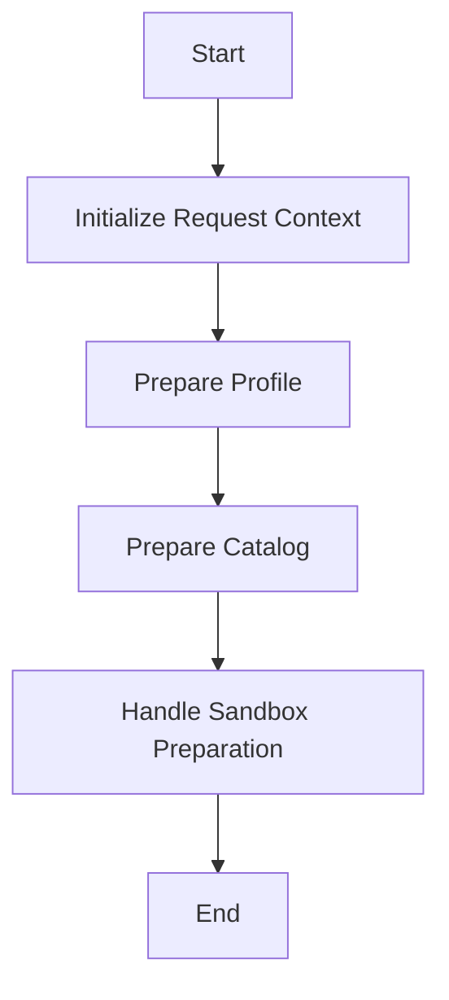

This document will cover the Request Handling Process in Broadleaf Commerce. We'll cover:

1. Initializing the Request Context
2. Preparing the Profile
3. Preparing the Catalog
4. Handling Sandbox Preparation

Technical document: <SwmLink doc-title="Request Handling Process">[Request Handling Process](/.swm/request-handling-process.pms8s41m.sw.md)</SwmLink>

# [Initializing the Request Context](https://app.swimm.io/repos/Z2l0aHViJTNBJTNBQnJvYWRsZWFmQ29tbWVyY2UtZGVtby1uZXclM0ElM0FTd2ltbS1EZW1v/docs/pms8s41m#initializing-request-context)

The request context initialization sets up the environment for processing a request. This involves setting properties such as the site, locale, and timezone. It also resolves the currency and sets the admin user details. This step ensures that the request has all the necessary context information to be processed correctly.

# [Preparing the Profile](https://app.swimm.io/repos/Z2l0aHViJTNBJTNBQnJvYWRsZWFmQ29tbWVyY2UtZGVtby1uZXclM0ElM0FTd2ltbS1EZW1v/docs/pms8s41m#preparing-profile)

Preparing the profile involves checking if an admin user is present. If an admin user is found, the profile is retrieved based on request parameters or session attributes. This step ensures that the correct user profile is associated with the request, which is crucial for personalized experiences and access control.

# [Preparing the Catalog](https://app.swimm.io/repos/Z2l0aHViJTNBJTNBQnJvYWRsZWFmQ29tbWVyY2UtZGVtby1uZXclM0ElM0FTd2ltbS1EZW1v/docs/pms8s41m#preparing-catalog)

Preparing the catalog involves retrieving the catalog based on request parameters or session attributes. If necessary, overrides are handled to ensure the correct catalog is used. This step is important for displaying the right set of products to the user, based on their profile and request context.

# [Handling Sandbox Preparation](https://app.swimm.io/repos/Z2l0aHViJTNBJTNBQnJvYWRsZWFmQ29tbWVyY2UtZGVtby1uZXclM0ElM0FTd2ltbS1EZW1v/docs/pms8s41m#handling-sandbox-preparation)

Handling sandbox preparation involves retrieving the persistent admin user and clearing any existing sandbox session attributes if the admin user is not found. If a sandbox ID is provided in the request, it attempts to retrieve the user sandbox for the admin user. If the sandbox is not found, it checks for an approval or user sandbox and creates a user sandbox if necessary. This step ensures that the correct sandbox environment is set up for the admin user, which is essential for testing and previewing changes before they go live.

&nbsp;

*This is an auto-generated document by Swimm AI 🌊 and has not yet been verified by a human*

<SwmMeta version="3.0.0" repo-id="Z2l0aHViJTNBJTNBQnJvYWRsZWFmQ29tbWVyY2UtZGVtby1uZXclM0ElM0FTd2ltbS1EZW1v" repo-name="BroadleafCommerce-demo-new" doc-type="product-flows">Powered by [Swimm](/)</SwmMeta>
