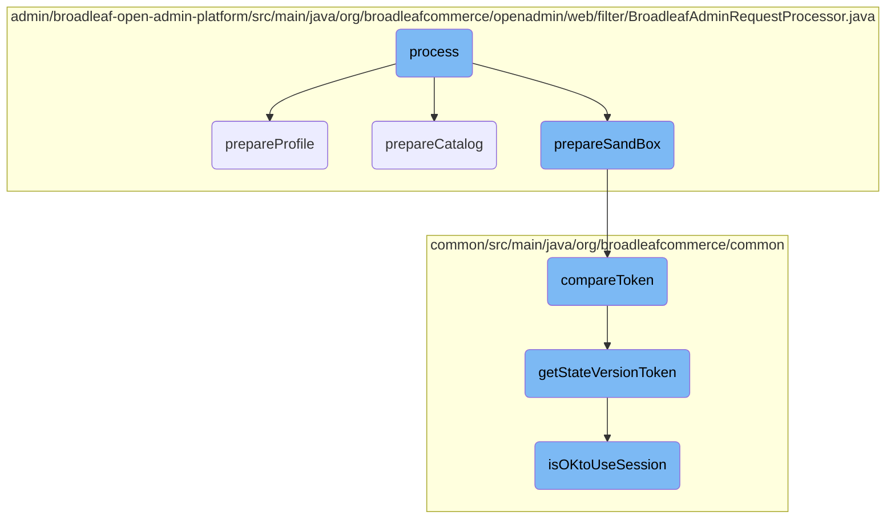
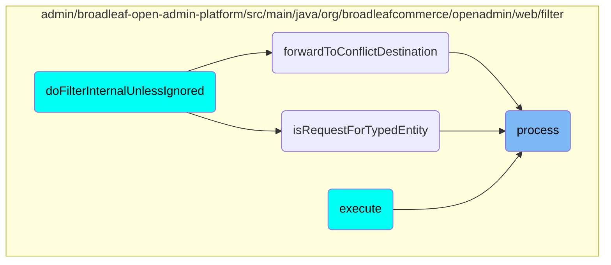

In this document, we will explain the process of handling a request in the Broadleaf Commerce framework. The process involves initializing the request context, preparing the profile, preparing the catalog, and handling the sandbox preparation.

The flow starts with initializing the request context, which sets up various properties like site, locale, and timezone. Next, the profile is prepared by checking if an admin user is present and retrieving the profile based on request parameters or session attributes. Then, the catalog is prepared by retrieving the catalog based on request parameters or session attributes and handling any necessary overrides. Finally, the sandbox is prepared by retrieving the persistent admin user, clearing any existing sandbox session attributes, and handling sandbox ID provided in the request.

Here is a high level diagram of the flow, showing only the most important functions:



# Flow drill down

First, we'll zoom into this section of the flow:

```mermaid
graph TD;
      subgraph admin/broadleaf-open-admin-platform/src/main/java/org/broadleafcommerce/openadmin/web/filter/BroadleafAdminRequestProcessor.java
9495dbd8f5fd850da881869442016f874a7745c32287aff34961d5aa137ff8ae(process):::mainFlowStyle --> 842401bf58915e04e7e24b4aecaa7ac154ce3e0769d7b07e42b17cc565cd1e85(prepareProfile)
end

subgraph admin/broadleaf-open-admin-platform/src/main/java/org/broadleafcommerce/openadmin/web/filter/BroadleafAdminRequestProcessor.java
9495dbd8f5fd850da881869442016f874a7745c32287aff34961d5aa137ff8ae(process):::mainFlowStyle --> 7b43517b83629f1e856b62d24346d660962afdaed57a96836a1eef86aaeb337d(prepareCatalog)
end

subgraph admin/broadleaf-open-admin-platform/src/main/java/org/broadleafcommerce/openadmin/web/filter/BroadleafAdminRequestProcessor.java
9495dbd8f5fd850da881869442016f874a7745c32287aff34961d5aa137ff8ae(process):::mainFlowStyle --> d1cc04e4355c4fd497850b330893671dd1b1c4938cce60150a87ae3b604a2b95(prepareSandBox):::mainFlowStyle
end

subgraph admin/broadleaf-open-admin-platform/src/main/java/org/broadleafcommerce/openadmin/web/filter/BroadleafAdminRequestProcessor.java
d1cc04e4355c4fd497850b330893671dd1b1c4938cce60150a87ae3b604a2b95(prepareSandBox):::mainFlowStyle --> opm94(...)
end


      classDef mainFlowStyle color:#000000,fill:#7CB9F4
classDef rootsStyle color:#000000,fill:#00FFF4
classDef Style1 color:#000000,fill:#00FFAA
classDef Style2 color:#000000,fill:#FFFF00
classDef Style3 color:#000000,fill:#AA7CB9

%% Swimm:
%% graph TD;
%%       subgraph <SwmPath>[admin/broadleaf-open-admin-platform/src/main/java/org/broadleafcommerce/openadmin/web/filter/BroadleafAdminRequestProcessor.java](admin/broadleaf-open-admin-platform/src/main/java/org/broadleafcommerce/openadmin/web/filter/BroadleafAdminRequestProcessor.java)</SwmPath>
%% 9495dbd8f5fd850da881869442016f874a7745c32287aff34961d5aa137ff8ae(process):::mainFlowStyle --> 842401bf58915e04e7e24b4aecaa7ac154ce3e0769d7b07e42b17cc565cd1e85(prepareProfile)
%% end
%% 
%% subgraph <SwmPath>[admin/broadleaf-open-admin-platform/src/main/java/org/broadleafcommerce/openadmin/web/filter/BroadleafAdminRequestProcessor.java](admin/broadleaf-open-admin-platform/src/main/java/org/broadleafcommerce/openadmin/web/filter/BroadleafAdminRequestProcessor.java)</SwmPath>
%% 9495dbd8f5fd850da881869442016f874a7745c32287aff34961d5aa137ff8ae(process):::mainFlowStyle --> 7b43517b83629f1e856b62d24346d660962afdaed57a96836a1eef86aaeb337d(prepareCatalog)
%% end
%% 
%% subgraph <SwmPath>[admin/broadleaf-open-admin-platform/src/main/java/org/broadleafcommerce/openadmin/web/filter/BroadleafAdminRequestProcessor.java](admin/broadleaf-open-admin-platform/src/main/java/org/broadleafcommerce/openadmin/web/filter/BroadleafAdminRequestProcessor.java)</SwmPath>
%% 9495dbd8f5fd850da881869442016f874a7745c32287aff34961d5aa137ff8ae(process):::mainFlowStyle --> d1cc04e4355c4fd497850b330893671dd1b1c4938cce60150a87ae3b604a2b95(prepareSandBox):::mainFlowStyle
%% end
%% 
%% subgraph <SwmPath>[admin/broadleaf-open-admin-platform/src/main/java/org/broadleafcommerce/openadmin/web/filter/BroadleafAdminRequestProcessor.java](admin/broadleaf-open-admin-platform/src/main/java/org/broadleafcommerce/openadmin/web/filter/BroadleafAdminRequestProcessor.java)</SwmPath>
%% d1cc04e4355c4fd497850b330893671dd1b1c4938cce60150a87ae3b604a2b95(prepareSandBox):::mainFlowStyle --> opm94(...)
%% end
%% 
%% 
%%       classDef mainFlowStyle color:#000000,fill:#7CB9F4
%% classDef rootsStyle color:#000000,fill:#00FFF4
%% classDef Style1 color:#000000,fill:#00FFAA
%% classDef Style2 color:#000000,fill:#FFFF00
%% classDef Style3 color:#000000,fill:#AA7CB9
```



<SwmSnippet path="/admin/broadleaf-open-admin-platform/src/main/java/org/broadleafcommerce/openadmin/web/filter/BroadleafAdminRequestProcessor.java" line="131">

---

## Initializing Request Context

The <SwmToken path="admin/broadleaf-open-admin-platform/src/main/java/org/broadleafcommerce/openadmin/web/filter/BroadleafAdminRequestProcessor.java" pos="131:5:5" line-data="    public void process(WebRequest request) throws SiteNotFoundException {">`process`</SwmToken> method initializes the <SwmToken path="admin/broadleaf-open-admin-platform/src/main/java/org/broadleafcommerce/openadmin/web/filter/BroadleafAdminRequestProcessor.java" pos="132:1:1" line-data="        BroadleafRequestContext brc = BroadleafRequestContext.getBroadleafRequestContext();">`BroadleafRequestContext`</SwmToken> and sets various properties such as site, locale, and timezone. It also resolves the currency and sets the admin user details.

```java
    public void process(WebRequest request) throws SiteNotFoundException {
        BroadleafRequestContext brc = BroadleafRequestContext.getBroadleafRequestContext();
        if (brc == null) {
            brc = new BroadleafRequestContext();
            BroadleafRequestContext.setBroadleafRequestContext(brc);
        }

        brc.getAdditionalProperties().putAll(entityExtensionManagers);

        if (brc.getSite() == null) {
            Site site = siteResolver.resolveSite(request);
            brc.setSite(site);
        }
        brc.setWebRequest(request);
        brc.setIgnoreSite(brc.getSite() == null);
        brc.setAdmin(true);

        if (adminStrictValidateProductionChanges) {
            brc.setValidateProductionChangesState(ValidateProductionChangesState.ADMIN);
        } else {
            brc.setValidateProductionChangesState(ValidateProductionChangesState.UNDEFINED);
```

---

</SwmSnippet>

<SwmSnippet path="/admin/broadleaf-open-admin-platform/src/main/java/org/broadleafcommerce/openadmin/web/filter/BroadleafAdminRequestProcessor.java" line="196">

---

## Preparing Profile

The <SwmToken path="admin/broadleaf-open-admin-platform/src/main/java/org/broadleafcommerce/openadmin/web/filter/BroadleafAdminRequestProcessor.java" pos="196:5:5" line-data="    protected void prepareProfile(WebRequest request, BroadleafRequestContext brc) {">`prepareProfile`</SwmToken> method sets the current profile in the <SwmToken path="admin/broadleaf-open-admin-platform/src/main/java/org/broadleafcommerce/openadmin/web/filter/BroadleafAdminRequestProcessor.java" pos="196:12:12" line-data="    protected void prepareProfile(WebRequest request, BroadleafRequestContext brc) {">`BroadleafRequestContext`</SwmToken>. It checks if an admin user is present and retrieves the profile based on the request parameters or session attributes.

```java
    protected void prepareProfile(WebRequest request, BroadleafRequestContext brc) {
        AdminUser adminUser = adminRemoteSecurityService.getPersistentAdminUser();
        if (adminUser == null) {
            //clear any profile
            if (BLCRequestUtils.isOKtoUseSession(request)) {
                request.removeAttribute(PROFILE_REQ_PARAM, WebRequest.SCOPE_SESSION);
            }
        }
        //special case for AdvancedCMS EmailTemplate that will require profile in BRC to read EmailTemplate correctly
        //well in theory we can do that on every request, but just to minimize DB calls
        if (adminUser != null || ((ServletWebRequest) request).getRequest().getRequestURL().toString().contains("sendResetPassword")) {
            Site profile = null;
            if (StringUtils.isNotBlank(request.getParameter(PROFILE_REQ_PARAM))) {
                Long profileId = Long.parseLong(request.getParameter(PROFILE_REQ_PARAM));
                profile = siteService.retrievePersistentSiteById(profileId);
                if (profile == null) {
                    throw new IllegalArgumentException(String.format("Unable to find the requested profile: %s", profileId));
                }
                String token = request.getParameter(staleStateProtectionService.getStateVersionTokenParameter());
                staleStateProtectionService.compareToken(token);
                staleStateProtectionService.invalidateState(true);
```

---

</SwmSnippet>

<SwmSnippet path="/admin/broadleaf-open-admin-platform/src/main/java/org/broadleafcommerce/openadmin/web/filter/BroadleafAdminRequestProcessor.java" line="256">

---

## Preparing Catalog

The <SwmToken path="admin/broadleaf-open-admin-platform/src/main/java/org/broadleafcommerce/openadmin/web/filter/BroadleafAdminRequestProcessor.java" pos="256:5:5" line-data="    protected void prepareCatalog(WebRequest request, BroadleafRequestContext brc) {">`prepareCatalog`</SwmToken> method sets the current catalog in the <SwmToken path="admin/broadleaf-open-admin-platform/src/main/java/org/broadleafcommerce/openadmin/web/filter/BroadleafAdminRequestProcessor.java" pos="256:12:12" line-data="    protected void prepareCatalog(WebRequest request, BroadleafRequestContext brc) {">`BroadleafRequestContext`</SwmToken>. It retrieves the catalog based on the request parameters or session attributes and handles any necessary overrides.

```java
    protected void prepareCatalog(WebRequest request, BroadleafRequestContext brc) {
        AdminUser adminUser = adminRemoteSecurityService.getPersistentAdminUser();
        if (adminUser == null) {
            //clear any catalog
            if (BLCRequestUtils.isOKtoUseSession(request)) {
                request.removeAttribute(CATALOG_REQ_PARAM, WebRequest.SCOPE_SESSION);
            }
        } else {
            Catalog catalog = null;
            if (StringUtils.isNotBlank(request.getParameter(CATALOG_REQ_PARAM))) {
                Long catalogId = Long.parseLong(request.getParameter(CATALOG_REQ_PARAM));
                catalog = siteService.findCatalogById(catalogId);
                if (catalog == null) {
                    throw new IllegalArgumentException(String.format("Unable to find the requested catalog: %s", catalogId));
                }
                String token = request.getParameter(staleStateProtectionService.getStateVersionTokenParameter());
                staleStateProtectionService.compareToken(token);
                staleStateProtectionService.invalidateState(true);
            }else if(StringUtils.isNotBlank(request.getParameter("catalogEntityCatalogDiscriminatorId"))){
                Long catalogId = Long.parseLong(request.getParameter("catalogEntityCatalogDiscriminatorId"));
                catalog = siteService.findCatalogById(catalogId);
```

---

</SwmSnippet>

Now, lets zoom into this section of the flow:

```mermaid
graph TD;
      subgraph common/src/main/java/org/broadleafcommerce/common
d1cc04e4355c4fd497850b330893671dd1b1c4938cce60150a87ae3b604a2b95(prepareSandBox):::mainFlowStyle --> cab70c5b1721ae45ef49b4432b69ca8b50a5d25b97a4de114cccc0ea5320bf8d(compareToken):::mainFlowStyle
end

subgraph common/src/main/java/org/broadleafcommerce/common
cab70c5b1721ae45ef49b4432b69ca8b50a5d25b97a4de114cccc0ea5320bf8d(compareToken):::mainFlowStyle --> 6a18b205108ce4c58925a3ad353dd12744f6109ac16865512d01e0697cdba46e(getStateVersionToken):::mainFlowStyle
end

subgraph common/src/main/java/org/broadleafcommerce/common
6a18b205108ce4c58925a3ad353dd12744f6109ac16865512d01e0697cdba46e(getStateVersionToken):::mainFlowStyle --> 0a2d704df99e8f24121f237be268c9b7f5a9a6bae2e4e9063f01f5bcf80df851(isOKtoUseSession):::mainFlowStyle
end


      classDef mainFlowStyle color:#000000,fill:#7CB9F4
classDef rootsStyle color:#000000,fill:#00FFF4
classDef Style1 color:#000000,fill:#00FFAA
classDef Style2 color:#000000,fill:#FFFF00
classDef Style3 color:#000000,fill:#AA7CB9

%% Swimm:
%% graph TD;
%%       subgraph <SwmPath>[common/src/main/java/org/broadleafcommerce/common/](common/src/main/java/org/broadleafcommerce/common/)</SwmPath>
%% d1cc04e4355c4fd497850b330893671dd1b1c4938cce60150a87ae3b604a2b95(prepareSandBox):::mainFlowStyle --> cab70c5b1721ae45ef49b4432b69ca8b50a5d25b97a4de114cccc0ea5320bf8d(compareToken):::mainFlowStyle
%% end
%% 
%% subgraph <SwmPath>[common/src/main/java/org/broadleafcommerce/common/](common/src/main/java/org/broadleafcommerce/common/)</SwmPath>
%% cab70c5b1721ae45ef49b4432b69ca8b50a5d25b97a4de114cccc0ea5320bf8d(compareToken):::mainFlowStyle --> 6a18b205108ce4c58925a3ad353dd12744f6109ac16865512d01e0697cdba46e(getStateVersionToken):::mainFlowStyle
%% end
%% 
%% subgraph <SwmPath>[common/src/main/java/org/broadleafcommerce/common/](common/src/main/java/org/broadleafcommerce/common/)</SwmPath>
%% 6a18b205108ce4c58925a3ad353dd12744f6109ac16865512d01e0697cdba46e(getStateVersionToken):::mainFlowStyle --> 0a2d704df99e8f24121f237be268c9b7f5a9a6bae2e4e9063f01f5bcf80df851(isOKtoUseSession):::mainFlowStyle
%% end
%% 
%% 
%%       classDef mainFlowStyle color:#000000,fill:#7CB9F4
%% classDef rootsStyle color:#000000,fill:#00FFF4
%% classDef Style1 color:#000000,fill:#00FFAA
%% classDef Style2 color:#000000,fill:#FFFF00
%% classDef Style3 color:#000000,fill:#AA7CB9
```



<SwmSnippet path="/admin/broadleaf-open-admin-platform/src/main/java/org/broadleafcommerce/openadmin/web/filter/BroadleafAdminRequestProcessor.java" line="337">

---

## Handling sandbox preparation

The <SwmToken path="admin/broadleaf-open-admin-platform/src/main/java/org/broadleafcommerce/openadmin/web/filter/BroadleafAdminRequestProcessor.java" pos="189:1:1" line-data="        prepareSandBox(request, brc);">`prepareSandBox`</SwmToken> method starts by retrieving the persistent admin user. If the admin user is null, it clears any existing sandbox session attributes.

```java
        AdminUser adminUser = adminRemoteSecurityService.getPersistentAdminUser();
        if (adminUser == null) {
            //clear any sandbox
            if (BLCRequestUtils.isOKtoUseSession(request)) {
                request.removeAttribute(BroadleafSandBoxResolver.SANDBOX_ID_VAR, WebRequest.SCOPE_SESSION);
            }
```

---

</SwmSnippet>

<SwmSnippet path="/admin/broadleaf-open-admin-platform/src/main/java/org/broadleafcommerce/openadmin/web/filter/BroadleafAdminRequestProcessor.java" line="345">

---

If a sandbox ID is provided in the request, it attempts to retrieve the user sandbox for the admin user. If the sandbox is not found, it checks for an approval or user sandbox and creates a user sandbox if necessary.

```java
            if (StringUtils.isNotBlank(request.getParameter(SANDBOX_REQ_PARAM))) {
                Long sandBoxId = Long.parseLong(request.getParameter(SANDBOX_REQ_PARAM));
                sandBox = sandBoxService.retrieveUserSandBoxForParent(adminUser.getId(), sandBoxId);
                if (sandBox == null) {
                    SandBox approvalOrUserSandBox = sandBoxService.retrieveSandBoxManagementById(sandBoxId);
                    if (approvalOrUserSandBox != null) {
                        if (approvalOrUserSandBox.getSandBoxType().equals(SandBoxType.USER)) {
                            sandBox = approvalOrUserSandBox;
                        } else {
                            sandBox = sandBoxService.createUserSandBox(adminUser.getId(), approvalOrUserSandBox);
                        }
                    }
```

---

</SwmSnippet>

<SwmSnippet path="/admin/broadleaf-open-admin-platform/src/main/java/org/broadleafcommerce/openadmin/web/filter/BroadleafAdminRequestProcessor.java" line="376">

---

If no sandbox is found, it retrieves or creates a default sandbox and then retrieves the user sandbox for the admin user based on the default sandbox.

```java
            if (sandBox == null) {
                List<SandBox> defaultSandBoxes = sandBoxService.retrieveSandBoxesByType(SandBoxType.DEFAULT);
                if (defaultSandBoxes.size() > 1) {
                    throw new IllegalStateException("Only one sandbox should be configured as default");
                }

                SandBox defaultSandBox;
                if (defaultSandBoxes.size() == 1) {
                    defaultSandBox = defaultSandBoxes.get(0);
                } else {
                    defaultSandBox = sandBoxService.createDefaultSandBox();
                }
```

---

</SwmSnippet>

<SwmSnippet path="/admin/broadleaf-open-admin-platform/src/main/java/org/broadleafcommerce/openadmin/web/filter/BroadleafAdminRequestProcessor.java" line="395">

---

If the user changes sandboxes, it updates the database record and sets the sandbox ID in the session attributes.

```java
            // If the user just changed sandboxes, we want to update the database record.
            Long previouslySetSandBoxId = null;
            if (BLCRequestUtils.isOKtoUseSession(request)) {
                previouslySetSandBoxId = (Long) request.getAttribute(BroadleafSandBoxResolver.SANDBOX_ID_VAR, WebRequest.SCOPE_SESSION);
            }
            if (previouslySetSandBoxId != null && !sandBox.getId().equals(previouslySetSandBoxId)) {
                adminUser.setLastUsedSandBoxId(sandBox.getId());
                adminUser = adminSecurityService.saveAdminUser(adminUser);
            }

            if (BLCRequestUtils.isOKtoUseSession(request)) {
                request.setAttribute(BroadleafSandBoxResolver.SANDBOX_ID_VAR, sandBox.getId(), WebRequest.SCOPE_SESSION);
            }
```

---

</SwmSnippet>

<SwmSnippet path="/common/src/main/java/org/broadleafcommerce/common/security/service/StaleStateProtectionServiceImpl.java" line="58">

---

## Validating state version token

The <SwmToken path="common/src/main/java/org/broadleafcommerce/common/security/service/StaleStateProtectionServiceImpl.java" pos="58:5:5" line-data="    public void compareToken(String passedToken) {">`compareToken`</SwmToken> method validates the state version token by comparing the passed token with the stored token. If they do not match, it throws a <SwmToken path="common/src/main/java/org/broadleafcommerce/common/security/service/StaleStateProtectionServiceImpl.java" pos="62:5:5" line-data="                throw new StaleStateServiceException(&quot;Page version token mismatch (&quot; + passedToken + &quot;). The request likely came from a stale page.&quot;);">`StaleStateServiceException`</SwmToken>.

```java
    public void compareToken(String passedToken) {
        if (staleStateProtectionEnabled) {
            HttpServletRequest request = ((ServletRequestAttributes) RequestContextHolder.getRequestAttributes()).getRequest();
            if (!getStateVersionToken().equals(passedToken) && request.getAttribute(getStateVersionTokenParameter()) == null) {
                throw new StaleStateServiceException("Page version token mismatch (" + passedToken + "). The request likely came from a stale page.");
```

---

</SwmSnippet>

<SwmSnippet path="/common/src/main/java/org/broadleafcommerce/common/security/service/StaleStateProtectionServiceImpl.java" line="73">

---

The <SwmToken path="common/src/main/java/org/broadleafcommerce/common/security/service/StaleStateProtectionServiceImpl.java" pos="73:5:5" line-data="    public String getStateVersionToken(){">`getStateVersionToken`</SwmToken> method retrieves the state version token from the session. If the token is not found, it generates a new random token and stores it in the session.

```java
    public String getStateVersionToken(){
        HttpServletRequest request = ((ServletRequestAttributes) RequestContextHolder.getRequestAttributes()).getRequest();
        if (BLCRequestUtils.isOKtoUseSession(new ServletWebRequest(request))) {
            HttpSession session = request.getSession();
            String token = (String) session.getAttribute(STATEVERSIONTOKEN);
            if (StringUtils.isEmpty(token)) {
                try {
                    token = RandomGenerator.generateRandomId("SHA1PRNG", 32);
                } catch (NoSuchAlgorithmException e) {
                    LOG.error("Unable to generate random number", e);
                    throw new RuntimeException("Unable to generate random number", e);
                }
                session.setAttribute(STATEVERSIONTOKEN, token);
            }
```

---

</SwmSnippet>

<SwmSnippet path="/common/src/main/java/org/broadleafcommerce/common/util/BLCRequestUtils.java" line="43">

---

The <SwmToken path="common/src/main/java/org/broadleafcommerce/common/util/BLCRequestUtils.java" pos="43:7:7" line-data="    public static boolean isOKtoUseSession(WebRequest request) {">`isOKtoUseSession`</SwmToken> method checks if it is permissible to use the session for the current request by looking for a specific attribute in the request.

```java
    public static boolean isOKtoUseSession(WebRequest request) {
        Boolean useSessionForRequestProcessing = (Boolean) request.getAttribute(OK_TO_USE_SESSION, WebRequest.SCOPE_REQUEST);
        if (useSessionForRequestProcessing == null) {
            // by default we will use the session
            return true;
        } else {
            return useSessionForRequestProcessing.booleanValue();
        }
```

---

</SwmSnippet>

# Where is this flow used?

This flow is used multiple times in the codebase as represented in the following diagram:



&nbsp;

*This is an auto-generated document by Swimm AI 🌊 and has not yet been verified by a human*

<SwmMeta version="3.0.0" repo-id="Z2l0aHViJTNBJTNBQnJvYWRsZWFmQ29tbWVyY2UtZGVtby1uZXclM0ElM0FTd2ltbS1EZW1v" repo-name="BroadleafCommerce-demo-new" doc-type="flows"><sup>Powered by [Swimm](/)</sup></SwmMeta>
