In this document, we will explain the process of retrieving all records for all sub-collections of a given entity. The process involves iterating through the properties of the provided <SwmToken path="admin/broadleaf-open-admin-platform/src/main/java/org/broadleafcommerce/openadmin/server/service/AdminEntityServiceImpl.java" pos="329:7:7" line-data="    public PersistenceResponse getPagedRecordsForCollection(ClassMetadata containingClassMetadata, Entity containingEntity,">`ClassMetadata`</SwmToken>, checking if each property is available to the entity type, and fetching the paged records for each collection.

The flow starts by iterating through the properties of the given entity's metadata. For each property, it checks if the property is available to the entity type. If the property is a collection, it fetches the records for that collection and adds them to the result map. This process ensures that all records for all sub-collections are retrieved and organized.

# Flow drill down

```mermaid
graph TD;
      subgraph admin/broadleaf-open-admin-platform/src/main/java/org/broadleafcommerce/openadmin/server/service
67d4e02b8db0b16b3cc9d735a3438930fd79026bb6d555dc870bd8dc869cc562(getAllRecordsForAllSubCollections):::mainFlowStyle --> f1ed6af834296aeeceed3711d47b470076d69f038e4c9d0748fe055ae541ed21(getPagedRecordsForCollection):::mainFlowStyle
end

subgraph admin/broadleaf-open-admin-platform/src/main/java/org/broadleafcommerce/openadmin/server/service
f1ed6af834296aeeceed3711d47b470076d69f038e4c9d0748fe055ae541ed21(getPagedRecordsForCollection):::mainFlowStyle --> bab2391c13bb2bbf280b5933cf0bfe9fea873219891a47eb9fb439e44469484b(getContextSpecificRelationshipId)
end

subgraph admin/broadleaf-open-admin-platform/src/main/java/org/broadleafcommerce/openadmin/server/service
f1ed6af834296aeeceed3711d47b470076d69f038e4c9d0748fe055ae541ed21(getPagedRecordsForCollection):::mainFlowStyle --> 97bc44f4f7a24aa37c9f5b6091312a408c4705d94347e49c89d1840a65cffe1a(fetch):::mainFlowStyle
end

subgraph admin/broadleaf-open-admin-platform/src/main/java/org/broadleafcommerce/openadmin/server/factory/PersistencePackageFactoryImpl.java
97bc44f4f7a24aa37c9f5b6091312a408c4705d94347e49c89d1840a65cffe1a(fetch):::mainFlowStyle --> 352c303664da1b650831ca6fa2ec0ba59f0e96827e2adea94dc124424c57ebfd(create):::mainFlowStyle
end

subgraph admin/broadleaf-open-admin-platform/src/main/java/org/broadleafcommerce/openadmin/server/service
bab2391c13bb2bbf280b5933cf0bfe9fea873219891a47eb9fb439e44469484b(getContextSpecificRelationshipId) --> 0386a5886eb7028921340e0df06c06585662f594e1a2c586d0623cecd2c8b4a5(getFieldType)
end

subgraph admin/broadleaf-open-admin-platform/src/main/java/org/broadleafcommerce/openadmin/server/factory/PersistencePackageFactoryImpl.java
352c303664da1b650831ca6fa2ec0ba59f0e96827e2adea94dc124424c57ebfd(create):::mainFlowStyle --> c67e0dc08857a0cd944aaba7f43e41d7db443ba071ab86aa72a44b4c1a31e2ab(getClassNameForSection):::mainFlowStyle
end


      classDef mainFlowStyle color:#000000,fill:#7CB9F4
classDef rootsStyle color:#000000,fill:#00FFF4
classDef Style1 color:#000000,fill:#00FFAA
classDef Style2 color:#000000,fill:#FFFF00
classDef Style3 color:#000000,fill:#AA7CB9

%% Swimm:
%% graph TD;
%%       subgraph <SwmPath>[admin/broadleaf-open-admin-platform/src/main/java/org/broadleafcommerce/openadmin/server/service/](admin/broadleaf-open-admin-platform/src/main/java/org/broadleafcommerce/openadmin/server/service/)</SwmPath>
%% 67d4e02b8db0b16b3cc9d735a3438930fd79026bb6d555dc870bd8dc869cc562(getAllRecordsForAllSubCollections):::mainFlowStyle --> f1ed6af834296aeeceed3711d47b470076d69f038e4c9d0748fe055ae541ed21(getPagedRecordsForCollection):::mainFlowStyle
%% end
%% 
%% subgraph <SwmPath>[admin/broadleaf-open-admin-platform/src/main/java/org/broadleafcommerce/openadmin/server/service/](admin/broadleaf-open-admin-platform/src/main/java/org/broadleafcommerce/openadmin/server/service/)</SwmPath>
%% f1ed6af834296aeeceed3711d47b470076d69f038e4c9d0748fe055ae541ed21(getPagedRecordsForCollection):::mainFlowStyle --> bab2391c13bb2bbf280b5933cf0bfe9fea873219891a47eb9fb439e44469484b(getContextSpecificRelationshipId)
%% end
%% 
%% subgraph <SwmPath>[admin/broadleaf-open-admin-platform/src/main/java/org/broadleafcommerce/openadmin/server/service/](admin/broadleaf-open-admin-platform/src/main/java/org/broadleafcommerce/openadmin/server/service/)</SwmPath>
%% f1ed6af834296aeeceed3711d47b470076d69f038e4c9d0748fe055ae541ed21(getPagedRecordsForCollection):::mainFlowStyle --> 97bc44f4f7a24aa37c9f5b6091312a408c4705d94347e49c89d1840a65cffe1a(fetch):::mainFlowStyle
%% end
%% 
%% subgraph <SwmPath>[admin/broadleaf-open-admin-platform/src/main/java/org/broadleafcommerce/openadmin/server/factory/PersistencePackageFactoryImpl.java](admin/broadleaf-open-admin-platform/src/main/java/org/broadleafcommerce/openadmin/server/factory/PersistencePackageFactoryImpl.java)</SwmPath>
%% 97bc44f4f7a24aa37c9f5b6091312a408c4705d94347e49c89d1840a65cffe1a(fetch):::mainFlowStyle --> 352c303664da1b650831ca6fa2ec0ba59f0e96827e2adea94dc124424c57ebfd(create):::mainFlowStyle
%% end
%% 
%% subgraph <SwmPath>[admin/broadleaf-open-admin-platform/src/main/java/org/broadleafcommerce/openadmin/server/service/](admin/broadleaf-open-admin-platform/src/main/java/org/broadleafcommerce/openadmin/server/service/)</SwmPath>
%% bab2391c13bb2bbf280b5933cf0bfe9fea873219891a47eb9fb439e44469484b(getContextSpecificRelationshipId) --> 0386a5886eb7028921340e0df06c06585662f594e1a2c586d0623cecd2c8b4a5(getFieldType)
%% end
%% 
%% subgraph <SwmPath>[admin/broadleaf-open-admin-platform/src/main/java/org/broadleafcommerce/openadmin/server/factory/PersistencePackageFactoryImpl.java](admin/broadleaf-open-admin-platform/src/main/java/org/broadleafcommerce/openadmin/server/factory/PersistencePackageFactoryImpl.java)</SwmPath>
%% 352c303664da1b650831ca6fa2ec0ba59f0e96827e2adea94dc124424c57ebfd(create):::mainFlowStyle --> c67e0dc08857a0cd944aaba7f43e41d7db443ba071ab86aa72a44b4c1a31e2ab(getClassNameForSection):::mainFlowStyle
%% end
%% 
%% 
%%       classDef mainFlowStyle color:#000000,fill:#7CB9F4
%% classDef rootsStyle color:#000000,fill:#00FFF4
%% classDef Style1 color:#000000,fill:#00FFAA
%% classDef Style2 color:#000000,fill:#FFFF00
%% classDef Style3 color:#000000,fill:#AA7CB9
```



<SwmSnippet path="/admin/broadleaf-open-admin-platform/src/main/java/org/broadleafcommerce/openadmin/server/service/AdminEntityServiceImpl.java" line="405">

---

## <SwmToken path="admin/broadleaf-open-admin-platform/src/main/java/org/broadleafcommerce/openadmin/server/service/AdminEntityServiceImpl.java" pos="406:11:11" line-data="    public Map&lt;String, DynamicResultSet&gt; getAllRecordsForAllSubCollections(ClassMetadata cmd, Entity containingEntity,">`getAllRecordsForAllSubCollections`</SwmToken>

The <SwmToken path="admin/broadleaf-open-admin-platform/src/main/java/org/broadleafcommerce/openadmin/server/service/AdminEntityServiceImpl.java" pos="406:11:11" line-data="    public Map&lt;String, DynamicResultSet&gt; getAllRecordsForAllSubCollections(ClassMetadata cmd, Entity containingEntity,">`getAllRecordsForAllSubCollections`</SwmToken> method is responsible for retrieving all records for all sub-collections of a given entity. It iterates through the properties of the provided <SwmToken path="admin/broadleaf-open-admin-platform/src/main/java/org/broadleafcommerce/openadmin/server/service/AdminEntityServiceImpl.java" pos="406:13:13" line-data="    public Map&lt;String, DynamicResultSet&gt; getAllRecordsForAllSubCollections(ClassMetadata cmd, Entity containingEntity,">`ClassMetadata`</SwmToken> and checks if each property is available to the entity type. If the property is a collection, it fetches the paged records for that collection and adds them to the result map.

```java
    @Override
    public Map<String, DynamicResultSet> getAllRecordsForAllSubCollections(ClassMetadata cmd, Entity containingEntity,
                                                                           List<SectionCrumb> sectionCrumb) throws ServiceException {
        Map<String, DynamicResultSet> map = new HashMap<>();
        for (Property p : cmd.getProperties()) {
            FieldMetadata fieldMetadata = p.getMetadata();
            boolean fieldAvailable = ArrayUtils.contains(fieldMetadata.getAvailableToTypes(), containingEntity.getType()[0]);
            if (fieldAvailable && fieldMetadata instanceof CollectionMetadata) {
                FetchPageRequest pageRequest = new FetchPageRequest()
                        .withPageSize(Integer.MAX_VALUE);
                PersistenceResponse resp = getPagedRecordsForCollection(cmd, containingEntity, p, null, pageRequest, null, sectionCrumb);
                map.put(p.getName(), resp.getDynamicResultSet());
            }
        }
        return map;
    }
```

---

</SwmSnippet>

<SwmSnippet path="/admin/broadleaf-open-admin-platform/src/main/java/org/broadleafcommerce/openadmin/server/service/AdminEntityServiceImpl.java" line="328">

---

### <SwmToken path="admin/broadleaf-open-admin-platform/src/main/java/org/broadleafcommerce/openadmin/server/service/AdminEntityServiceImpl.java" pos="329:5:5" line-data="    public PersistenceResponse getPagedRecordsForCollection(ClassMetadata containingClassMetadata, Entity containingEntity,">`getPagedRecordsForCollection`</SwmToken>

The <SwmToken path="admin/broadleaf-open-admin-platform/src/main/java/org/broadleafcommerce/openadmin/server/service/AdminEntityServiceImpl.java" pos="329:5:5" line-data="    public PersistenceResponse getPagedRecordsForCollection(ClassMetadata containingClassMetadata, Entity containingEntity,">`getPagedRecordsForCollection`</SwmToken> method is called within <SwmToken path="admin/broadleaf-open-admin-platform/src/main/java/org/broadleafcommerce/openadmin/server/service/AdminEntityServiceImpl.java" pos="406:11:11" line-data="    public Map&lt;String, DynamicResultSet&gt; getAllRecordsForAllSubCollections(ClassMetadata cmd, Entity containingEntity,">`getAllRecordsForAllSubCollections`</SwmToken> to fetch paged records for a specific collection property. It constructs a <SwmToken path="admin/broadleaf-open-admin-platform/src/main/java/org/broadleafcommerce/openadmin/server/service/AdminEntityServiceImpl.java" pos="332:1:1" line-data="        PersistencePackageRequest ppr = PersistencePackageRequest.fromMetadata(collectionProperty.getMetadata(), sectionCrumbs)">`PersistencePackageRequest`</SwmToken> and sets various criteria and metadata before calling the <SwmToken path="admin/broadleaf-open-admin-platform/src/main/java/org/broadleafcommerce/openadmin/server/service/AdminEntityServiceImpl.java" pos="959:5:5" line-data="    public PersistenceResponse fetch(PersistencePackageRequest request)">`fetch`</SwmToken> method to retrieve the records.

```java
    @Override
    public PersistenceResponse getPagedRecordsForCollection(ClassMetadata containingClassMetadata, Entity containingEntity,
            Property collectionProperty, FilterAndSortCriteria[] fascs, FetchPageRequest fetchPageRequest,
            String idValueOverride, List<SectionCrumb> sectionCrumbs) throws ServiceException {
        PersistencePackageRequest ppr = PersistencePackageRequest.fromMetadata(collectionProperty.getMetadata(), sectionCrumbs)
            .withFilterAndSortCriteria(fascs)
            .withStartIndex(fetchPageRequest.getStartIndex())
            .withMaxIndex(fetchPageRequest.getMaxIndex())
            .withFirstId(fetchPageRequest.getFirstId())
            .withLastId(fetchPageRequest.getLastId())
            .withLowerCount(fetchPageRequest.getLowerCount())
            .withUpperCount(fetchPageRequest.getUpperCount())
            .withPageSize(fetchPageRequest.getPageSize())
            .withPresentationFetch(true);

        FilterAndSortCriteria fasc;

        FieldMetadata md = collectionProperty.getMetadata();
        String collectionCeilingClass = null;

        if (md instanceof BasicCollectionMetadata) {
```

---

</SwmSnippet>

<SwmSnippet path="/admin/broadleaf-open-admin-platform/src/main/java/org/broadleafcommerce/openadmin/server/service/AdminEntityServiceImpl.java" line="794">

---

### <SwmToken path="admin/broadleaf-open-admin-platform/src/main/java/org/broadleafcommerce/openadmin/server/service/AdminEntityServiceImpl.java" pos="795:5:5" line-data="    public String getContextSpecificRelationshipId(ClassMetadata cmd, Entity entity, String propertyName) {">`getContextSpecificRelationshipId`</SwmToken>

The <SwmToken path="admin/broadleaf-open-admin-platform/src/main/java/org/broadleafcommerce/openadmin/server/service/AdminEntityServiceImpl.java" pos="795:5:5" line-data="    public String getContextSpecificRelationshipId(ClassMetadata cmd, Entity entity, String propertyName) {">`getContextSpecificRelationshipId`</SwmToken> method is used to determine the relationship ID for a given property within the context of the entity. It handles cases where the property might be nested within embedded classes and ensures the correct ID is returned.

```java
    @Override
    public String getContextSpecificRelationshipId(ClassMetadata cmd, Entity entity, String propertyName) {
        String prefix;
        if (propertyName.contains(".")) {
            prefix = propertyName.substring(0, propertyName.lastIndexOf("."));
        } else {
            prefix = "";
        }

        if (prefix.equals("")) {
            return entity.findProperty("id").getValue();
        } else {
            //we need to check all the parts of the prefix. For example, the prefix could include an @Embedded class like
            //defaultSku.dimension. In this case, we want the id from the defaultSku property, since the @Embedded does
            //not have an id property - nor should it.
            String[] prefixParts = prefix.split("\\.");
            for (int j = 0; j < prefixParts.length; j++) {
                StringBuilder sb = new StringBuilder();
                for (int x = 0; x < prefixParts.length - j; x++) {
                    sb.append(prefixParts[x]);
                    if (x < prefixParts.length - j - 1) {
```

---

</SwmSnippet>

<SwmSnippet path="/admin/broadleaf-open-admin-platform/src/main/java/org/broadleafcommerce/openadmin/server/service/AdminEntityServiceImpl.java" line="958">

---

### fetch

The <SwmToken path="admin/broadleaf-open-admin-platform/src/main/java/org/broadleafcommerce/openadmin/server/service/AdminEntityServiceImpl.java" pos="959:5:5" line-data="    public PersistenceResponse fetch(PersistencePackageRequest request)">`fetch`</SwmToken> method is responsible for executing the actual data retrieval based on the constructed <SwmToken path="admin/broadleaf-open-admin-platform/src/main/java/org/broadleafcommerce/openadmin/server/service/AdminEntityServiceImpl.java" pos="959:7:7" line-data="    public PersistenceResponse fetch(PersistencePackageRequest request)">`PersistencePackageRequest`</SwmToken>. It sets up the criteria transfer object (CTO) and delegates the fetch operation to the underlying service.

```java
    @Override
    public PersistenceResponse fetch(PersistencePackageRequest request)
            throws ServiceException {
        PersistencePackage pkg = persistencePackageFactory.create(request);

        CriteriaTransferObject cto = getDefaultCto();
        if (request.getFilterAndSortCriteria() != null) {
            cto.addAll(Arrays.asList(request.getFilterAndSortCriteria()));
        }

        if (request.getMaxResults() != null) {
            cto.setMaxResults(request.getMaxResults());
        }

        if (request.getStartIndex() == null) {
            cto.setFirstResult(0);
        } else {
            cto.setFirstResult(request.getStartIndex());
        }

        if (request.getMaxIndex() != null) {
```

---

</SwmSnippet>

<SwmSnippet path="/admin/broadleaf-open-admin-platform/src/main/java/org/broadleafcommerce/openadmin/server/factory/PersistencePackageFactoryImpl.java" line="54">

---

### create

The <SwmToken path="admin/broadleaf-open-admin-platform/src/main/java/org/broadleafcommerce/openadmin/server/factory/PersistencePackageFactoryImpl.java" pos="55:5:5" line-data="    public PersistencePackage create(PersistencePackageRequest request) {">`create`</SwmToken> method in <SwmToken path="admin/broadleaf-open-admin-platform/src/main/java/org/broadleafcommerce/openadmin/server/factory/PersistencePackageFactoryImpl.java" pos="47:4:4" line-data="public class PersistencePackageFactoryImpl implements PersistencePackageFactory {">`PersistencePackageFactoryImpl`</SwmToken> is used to create a <SwmToken path="admin/broadleaf-open-admin-platform/src/main/java/org/broadleafcommerce/openadmin/server/factory/PersistencePackageFactoryImpl.java" pos="55:3:3" line-data="    public PersistencePackage create(PersistencePackageRequest request) {">`PersistencePackage`</SwmToken> from a <SwmToken path="admin/broadleaf-open-admin-platform/src/main/java/org/broadleafcommerce/openadmin/server/factory/PersistencePackageFactoryImpl.java" pos="55:7:7" line-data="    public PersistencePackage create(PersistencePackageRequest request) {">`PersistencePackageRequest`</SwmToken>. It sets up the persistence perspective and handles various types of requests such as STANDARD, ADORNED, and MAP.

```java
    @Override
    public PersistencePackage create(PersistencePackageRequest request) {
        PersistencePerspective persistencePerspective = new PersistencePerspective();

        persistencePerspective.setAdditionalForeignKeys(request.getAdditionalForeignKeys());
        persistencePerspective.setAdditionalNonPersistentProperties(new String[] {});

        if (request.getForeignKey() != null) {
            persistencePerspective.addPersistencePerspectiveItem(PersistencePerspectiveItemType.FOREIGNKEY,
                    request.getForeignKey());
        }

        switch (request.getType()) {
            case STANDARD:
                persistencePerspective.setOperationTypes(getDefaultOperationTypes());
                break;

            case ADORNED:
                if (request.getAdornedList() == null) {
                    throw new IllegalArgumentException("ADORNED type requires the adornedList to be set");
                }
```

---

</SwmSnippet>

<SwmSnippet path="/admin/broadleaf-open-admin-platform/src/main/java/org/broadleafcommerce/openadmin/server/service/persistence/module/FieldManager.java" line="200">

---

### <SwmToken path="admin/broadleaf-open-admin-platform/src/main/java/org/broadleafcommerce/openadmin/server/service/persistence/module/FieldManager.java" pos="200:6:6" line-data="    public Class&lt;?&gt; getFieldType(Field field) {">`getFieldType`</SwmToken>

The <SwmToken path="admin/broadleaf-open-admin-platform/src/main/java/org/broadleafcommerce/openadmin/server/service/persistence/module/FieldManager.java" pos="200:6:6" line-data="    public Class&lt;?&gt; getFieldType(Field field) {">`getFieldType`</SwmToken> method determines the type of a given field, consulting the entity configuration manager and handling cases where the field type might be extended or not directly found in the configuration.

```java
    public Class<?> getFieldType(Field field) {
        //consult the entity configuration manager to see if there is a user
        //configured entity for this class
        Class<?> response;
        try {
            response = entityConfiguration.lookupEntityClass(field.getType().getName());
        } catch (Exception e) {
            //Use the most extended type based on the field type
            PersistenceManager persistenceManager = getPersistenceManager(field.getType());
            Class<?>[] entities = persistenceManager.getUpDownInheritance(field.getType());
            if (!ArrayUtils.isEmpty(entities)) {
                response = entities[entities.length-1];
                LOG.info("Unable to find a reference to ("+field.getType().getName()+") in the EntityConfigurationManager. " +
                        "Using the most extended form of this class identified as ("+entities[0].getName()+")");
            } else {
                //Just use the field type
                response = field.getType();
                LOG.debug("Unable to find a reference to ("+field.getType().getName()+") in the EntityConfigurationManager. " +
                        "Using the type of this class.");
            }
        }
```

---

</SwmSnippet>

<SwmSnippet path="/admin/broadleaf-open-admin-platform/src/main/java/org/broadleafcommerce/openadmin/server/factory/PersistencePackageFactoryImpl.java" line="167">

---

### <SwmToken path="admin/broadleaf-open-admin-platform/src/main/java/org/broadleafcommerce/openadmin/server/factory/PersistencePackageFactoryImpl.java" pos="167:5:5" line-data="    protected String getClassNameForSection(String sectionKey) {">`getClassNameForSection`</SwmToken>

The <SwmToken path="admin/broadleaf-open-admin-platform/src/main/java/org/broadleafcommerce/openadmin/server/factory/PersistencePackageFactoryImpl.java" pos="167:5:5" line-data="    protected String getClassNameForSection(String sectionKey) {">`getClassNameForSection`</SwmToken> method retrieves the class name associated with a given section key. It looks up the section in the admin navigation service and determines the most specific polymorphic entity class.

```java
    protected String getClassNameForSection(String sectionKey) {
        try {
            AdminSection section = adminNavigationService.findAdminSectionByURI("/" + sectionKey);
            String className = (section == null) ? sectionKey : section.getCeilingEntity();

            if (className == null) {
                throw new RuntimeException("Could not determine the class related to the following Section: " + section.getName());
            }

            Class<?>[] entities = dynamicDaoHelper.getAllPolymorphicEntitiesFromCeiling(Class.forName(className), true, true);

            return entities[entities.length - 1].getName();
        } catch (ClassNotFoundException e) {
            throw ExceptionHelper.refineException(RuntimeException.class, RuntimeException.class, e);
        }
    }
```

---

</SwmSnippet>

&nbsp;

*This is an auto-generated document by Swimm AI 🌊 and has not yet been verified by a human*

<SwmMeta version="3.0.0" repo-id="Z2l0aHViJTNBJTNBQnJvYWRsZWFmQ29tbWVyY2UtZGVtby1uZXclM0ElM0FTd2ltbS1EZW1v" repo-name="BroadleafCommerce-demo-new" doc-type="flows"><sup>Powered by [Swimm](/)</sup></SwmMeta>
