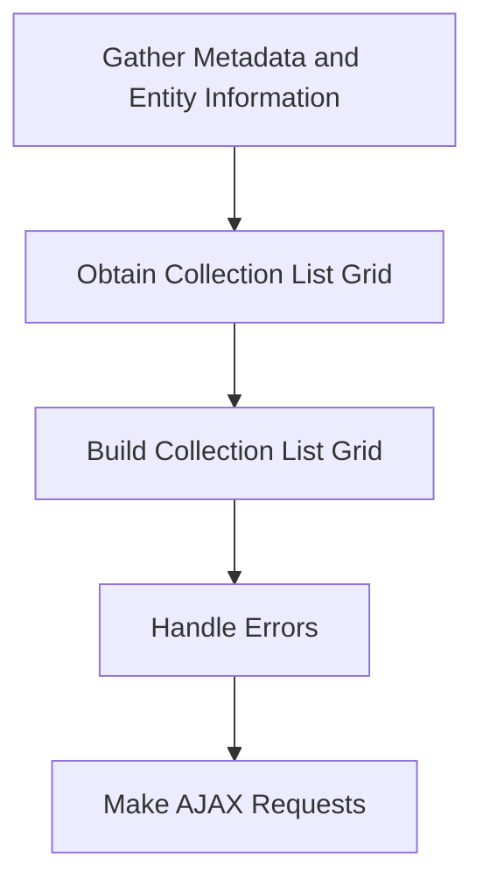

This document will cover the process of retrieving and displaying collection field records. We'll cover:

1. Gathering Metadata and Entity Information
2. Obtaining the Collection List Grid
3. Building the Collection List Grid
4. Handling Errors
5. Making AJAX Requests.

Technical document: <SwmLink doc-title="Retrieving and Displaying Collection Field Records">[Retrieving and Displaying Collection Field Records](/.swm/retrieving-and-displaying-collection-field-records.w57q1pgz.sw.md)</SwmLink>

# [Gathering Metadata and Entity Information](https://app.swimm.io/repos/Z2l0aHViJTNBJTNBQnJvYWRsZWFmQ29tbWVyY2UtZGVtby1uZXclM0ElM0FTd2ltbS1EZW1v/docs/w57q1pgz#retrieving-collection-field-records)

The process begins by gathering the necessary metadata and entity information. This involves identifying the section key, main class name, and section crumbs. These elements help in forming a request to retrieve the metadata for the entity. The metadata provides a detailed description of the entity's structure, which is essential for understanding how to display the collection field records.

# [Obtaining the Collection List Grid](https://app.swimm.io/repos/Z2l0aHViJTNBJTNBQnJvYWRsZWFmQ29tbWVyY2UtZGVtby1uZXclM0ElM0FTd2ltbS1EZW1v/docs/w57q1pgz#obtaining-collection-list-grid)

Once the metadata and entity information are gathered, the next step is to obtain the collection list grid. This grid is a structured representation of the collection field records. It involves fetching paged records for the collection and then constructing the list grid. The list grid includes various properties such as editability and sortability, which determine how the records can be interacted with.

# [Building the Collection List Grid](https://app.swimm.io/repos/Z2l0aHViJTNBJTNBQnJvYWRsZWFmQ29tbWVyY2UtZGVtby1uZXclM0ElM0FTd2ltbS1EZW1v/docs/w57q1pgz#building-collection-list-grid)

Building the collection list grid involves setting up header fields, determining the grid type, and configuring properties like editability and sortability. This step ensures that the list grid is properly formatted and ready for display. The grid type could be a table, list, or any other format suitable for displaying the records. Editability and sortability properties define whether the records can be edited or sorted by the user.

# [Handling Errors](https://app.swimm.io/repos/Z2l0aHViJTNBJTNBQnJvYWRsZWFmQ29tbWVyY2UtZGVtby1uZXclM0ElM0FTd2ltbS1EZW1v/docs/w57q1pgz#handling-errors)

During the process of retrieving and displaying collection field records, errors may occur. These errors need to be handled gracefully to ensure a smooth user experience. The error handling mechanism captures any issues that arise and provides appropriate feedback to the user. This step is crucial for maintaining the reliability and usability of the application.

# [Making AJAX Requests](https://app.swimm.io/repos/Z2l0aHViJTNBJTNBQnJvYWRsZWFmQ29tbWVyY2UtZGVtby1uZXclM0ElM0FTd2ltbS1EZW1v/docs/w57q1pgz#making-ajax-requests)

The final step involves making AJAX requests to facilitate smooth communication with the server. AJAX requests are used to fetch data asynchronously without reloading the page. This ensures that the collection field records are retrieved and displayed efficiently. The AJAX requests include necessary tokens and handle success and error callbacks to manage the communication process effectively.

&nbsp;

*This is an auto-generated document by Swimm AI 🌊 and has not yet been verified by a human*

<SwmMeta version="3.0.0" repo-id="Z2l0aHViJTNBJTNBQnJvYWRsZWFmQ29tbWVyY2UtZGVtby1uZXclM0ElM0FTd2ltbS1EZW1v" repo-name="BroadleafCommerce-demo-new" doc-type="product-flows">Powered by [Swimm](/)</SwmMeta>
