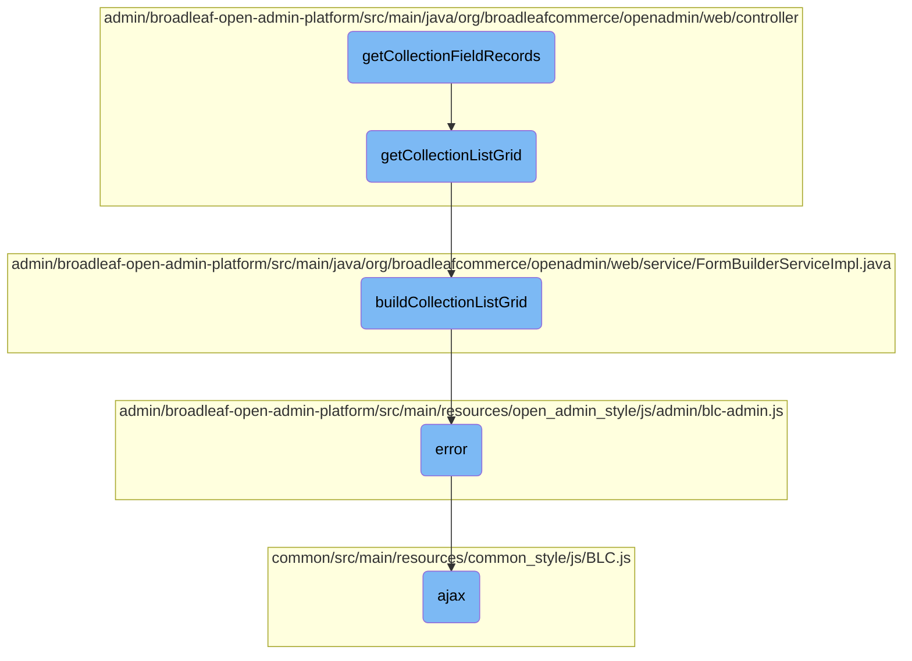

In this document, we will explain the process of retrieving and displaying collection field records. The process involves gathering metadata, obtaining a list grid, building the list grid, handling errors, and making AJAX requests.

The flow starts by gathering necessary metadata and entity information. Then, it calls a helper function to obtain a list grid representing the collection. This list grid is built by setting up header fields and configuring properties like editability and sortability. If any errors occur during this process, they are handled gracefully. Finally, AJAX requests are made to facilitate smooth communication with the server.

# Flow drill down



<SwmSnippet path="/admin/broadleaf-open-admin-platform/src/main/java/org/broadleafcommerce/openadmin/web/controller/entity/AdminBasicEntityController.java" line="926">

---

## Retrieving Collection Field Records

The <SwmToken path="admin/broadleaf-open-admin-platform/src/main/java/org/broadleafcommerce/openadmin/web/controller/entity/AdminBasicEntityController.java" pos="921:5:5" line-data="    public String getCollectionFieldRecords(HttpServletRequest request, HttpServletResponse response, Model model,">`getCollectionFieldRecords`</SwmToken> method retrieves records for a given collection field filtered by specific criteria. It first gathers necessary metadata and entity information, then calls <SwmToken path="admin/broadleaf-open-admin-platform/src/main/java/org/broadleafcommerce/openadmin/web/controller/entity/AdminBasicEntityController.java" pos="937:7:7" line-data="        ListGrid listGrid = getCollectionListGrid(mainMetadata, entity, collectionProperty, requestParams, sectionKey, sectionCrumbs);">`getCollectionListGrid`</SwmToken> to obtain the list grid representing the collection.

```java
        String sectionKey = getSectionKey(pathVars);
        String mainClassName = getClassNameForSection(sectionKey);
        List<SectionCrumb> sectionCrumbs = getSectionCrumbs(request, sectionKey, id);
        PersistencePackageRequest ppr = getSectionPersistencePackageRequest(mainClassName, requestParams, sectionCrumbs, pathVars);
        ClassMetadata mainMetadata = service.getClassMetadata(ppr).getDynamicResultSet().getClassMetaData();
        Property collectionProperty = mainMetadata.getPMap().get(collectionField);

        ppr = getSectionPersistencePackageRequest(mainClassName, sectionCrumbs, pathVars);
        Entity entity = service.getRecord(ppr, id, mainMetadata, false).getDynamicResultSet().getRecords()[0];

        // Next, we must get the new list grid that represents this collection
        ListGrid listGrid = getCollectionListGrid(mainMetadata, entity, collectionProperty, requestParams, sectionKey, sectionCrumbs);
        model.addAttribute("listGrid", listGrid);

        model.addAttribute("currentParams", new ObjectMapper().writeValueAsString(requestParams));

        // We return the new list grid so that it can replace the currently visible one
        setModelAttributes(model, sectionKey);
        return "views/standaloneListGrid";
```

---

</SwmSnippet>

<SwmSnippet path="/admin/broadleaf-open-admin-platform/src/main/java/org/broadleafcommerce/openadmin/web/controller/AdminAbstractController.java" line="217">

---

## Obtaining Collection List Grid

The <SwmToken path="admin/broadleaf-open-admin-platform/src/main/java/org/broadleafcommerce/openadmin/web/controller/AdminAbstractController.java" pos="217:5:5" line-data="    protected ListGrid getCollectionListGrid(ClassMetadata mainMetadata, Entity entity, Property collectionProperty,">`getCollectionListGrid`</SwmToken> method is a helper function that constructs a <SwmToken path="admin/broadleaf-open-admin-platform/src/main/java/org/broadleafcommerce/openadmin/web/controller/AdminAbstractController.java" pos="217:3:3" line-data="    protected ListGrid getCollectionListGrid(ClassMetadata mainMetadata, Entity entity, Property collectionProperty,">`ListGrid`</SwmToken> DTO for a collection. It fetches paged records for the collection and then builds the list grid using the <SwmToken path="admin/broadleaf-open-admin-platform/src/main/java/org/broadleafcommerce/openadmin/web/controller/AdminAbstractController.java" pos="236:9:9" line-data="        ListGrid listGrid = formService.buildCollectionListGrid(entity.findProperty(idProperty).getValue(), drs,">`buildCollectionListGrid`</SwmToken> method.

```java
    protected ListGrid getCollectionListGrid(ClassMetadata mainMetadata, Entity entity, Property collectionProperty,
            MultiValueMap<String, String> requestParams, String sectionKey, PersistenceResponse persistenceResponse, List<SectionCrumb> sectionCrumbs)
            throws ServiceException {
        String idProperty = service.getIdProperty(mainMetadata);
        if (persistenceResponse != null && persistenceResponse.getAdditionalData().containsKey(PersistenceResponse.AdditionalData.CLONEID)) {
            entity.findProperty(idProperty).setValue((String) persistenceResponse.getAdditionalData().get(PersistenceResponse.AdditionalData.CLONEID));
        }
        FetchPageRequest pageRequest = new FetchPageRequest()
            .withLastId(getLastId(requestParams))
            .withFirstId(getFirstId(requestParams))
            .withStartIndex(getStartIndex(requestParams))
            .withMaxIndex(getMaxIndex(requestParams))
            .withUpperCount(getUpperCount(requestParams))
            .withLowerCount(getLowerCount(requestParams))
            .withPageSize(getPageSize(requestParams));

        DynamicResultSet drs = service.getPagedRecordsForCollection(mainMetadata, entity, collectionProperty,
                getCriteria(requestParams), pageRequest, null, sectionCrumbs).getDynamicResultSet();

        ListGrid listGrid = formService.buildCollectionListGrid(entity.findProperty(idProperty).getValue(), drs,
                collectionProperty, sectionKey, sectionCrumbs);
```

---

</SwmSnippet>

<SwmSnippet path="/admin/broadleaf-open-admin-platform/src/main/java/org/broadleafcommerce/openadmin/web/service/FormBuilderServiceImpl.java" line="414">

---

### Building Collection List Grid

The <SwmToken path="admin/broadleaf-open-admin-platform/src/main/java/org/broadleafcommerce/openadmin/web/service/FormBuilderServiceImpl.java" pos="414:5:5" line-data="    public ListGrid buildCollectionListGrid(String containingEntityId, DynamicResultSet drs, Property field, ">`buildCollectionListGrid`</SwmToken> method constructs the <SwmToken path="admin/broadleaf-open-admin-platform/src/main/java/org/broadleafcommerce/openadmin/web/service/FormBuilderServiceImpl.java" pos="414:3:3" line-data="    public ListGrid buildCollectionListGrid(String containingEntityId, DynamicResultSet drs, Property field, ">`ListGrid`</SwmToken> object by setting up header fields, determining the grid type, and configuring various properties like editability and sortability. It ensures the list grid is properly formatted and ready for display.

```java
    public ListGrid buildCollectionListGrid(String containingEntityId, DynamicResultSet drs, Property field, 
            String sectionKey, List<SectionCrumb> sectionCrumbs)
            throws ServiceException {
        FieldMetadata fmd = field.getMetadata();
        // Get the class metadata for this particular field
        PersistencePackageRequest ppr = PersistencePackageRequest.fromMetadata(fmd, sectionCrumbs);
        // TODO: 9/27/2022 remove "if (field != null)" or move up before "field.getMetadata()"
        if (field != null) {
            ppr.setSectionEntityField(field.getName());
        }
        ClassMetadata cmd = adminEntityService.getClassMetadata(ppr).getDynamicResultSet().getClassMetaData();

        List<Field> headerFields = new ArrayList<>();
        ListGrid.Type type = null;
        boolean editable = false;
        boolean sortable = false;
        boolean readOnly = false;
        boolean hideIdColumn = false;
        boolean canFilterAndSort = true;
        boolean modalSingleSelectable = false;
        boolean modalMultiSelectable = false;
```

---

</SwmSnippet>

<SwmSnippet path="/admin/broadleaf-open-admin-platform/src/main/resources/open_admin_style/js/admin/blc-admin.js" line="1180">

---

## Handling Errors

The <SwmToken path="admin/broadleaf-open-admin-platform/src/main/resources/open_admin_style/js/admin/blc-admin.js" pos="1180:1:1" line-data="                error: function (error) {">`error`</SwmToken> function handles any errors that occur during the AJAX request, ensuring that the application can gracefully manage issues.

```javascript
                error: function (error) {
                }
```

---

</SwmSnippet>

<SwmSnippet path="/common/src/main/resources/common_style/js/BLC.js" line="135">

---

## Making AJAX Requests

The <SwmToken path="common/src/main/resources/common_style/js/BLC.js" pos="135:3:3" line-data="    function ajax(options, callback) {">`ajax`</SwmToken> function is a utility for making AJAX requests. It sets default options, appends necessary tokens, and handles the success and error callbacks, facilitating smooth communication with the server.

```javascript
    function ajax(options, callback) {
        if (options.type == null) {
            options.type = 'GET';
        }

        var baseUrl = window.location.href;
        if (baseUrl.indexOf('isPostAdd') != -1) {
            if (options.url.indexOf('isPostAdd') < 0) {
                if (options.url.indexOf('?') > 0) {
                    options.url += "&";
                } else {
                    options.url += "?";
                }
                options.url += "isPostAdd=true";
            }
        }
        var savedCatalogElement = $('input[name ="catalogEntityCatalogDiscriminatorId"]');
        var savedCatalog=null;

        if(savedCatalogElement.length){
            //0 should be the one we need, other can be from the modal form
```

---

</SwmSnippet>

&nbsp;

*This is an auto-generated document by Swimm AI 🌊 and has not yet been verified by a human*

<SwmMeta version="3.0.0" repo-id="Z2l0aHViJTNBJTNBQnJvYWRsZWFmQ29tbWVyY2UtZGVtby1uZXclM0ElM0FTd2ltbS1EZW1v" repo-name="BroadleafCommerce-demo-new" doc-type="flows"><sup>Powered by [Swimm](/)</sup></SwmMeta>
