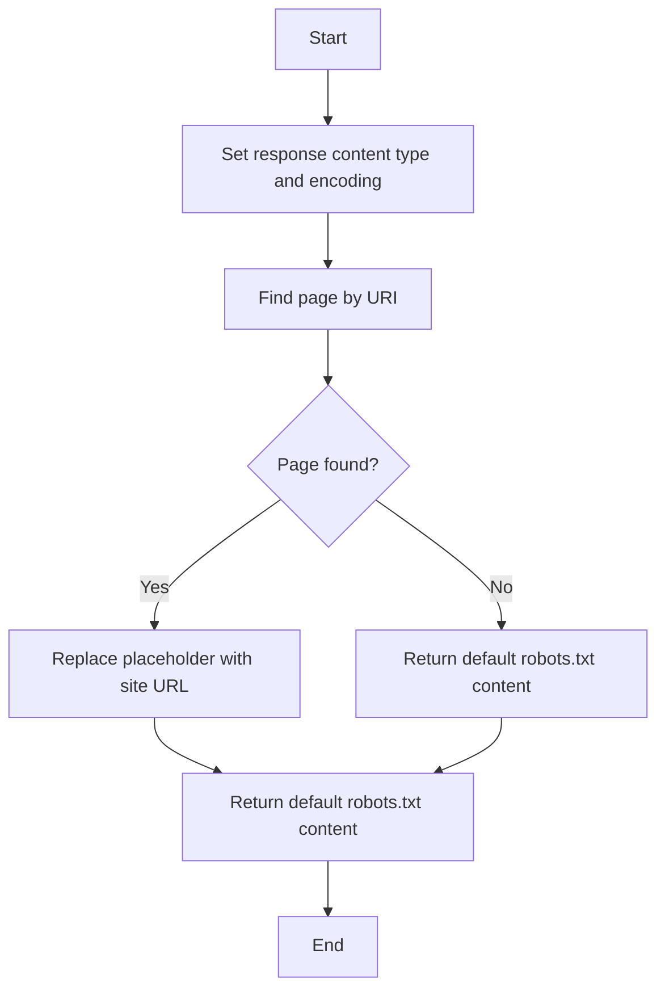

This document will cover the process of retrieving and processing the robots.txt file, which includes:

1. Setting the response content type and encoding
2. Finding the page by URI
3. Handling the page content or returning a default robots.txt content.

Technical document: <SwmLink doc-title="Retrieving and Processing Robots.txt">[Retrieving and Processing Robots.txt](/.swm/retrieving-and-processing-robotstxt.i7g2lxen.sw.md)</SwmLink>

# [Setting the response content type and encoding](https://app.swimm.io/repos/Z2l0aHViJTNBJTNBQnJvYWRsZWFmQ29tbWVyY2UtZGVtby1uZXclM0ElM0FTd2ltbS1EZW1v/docs/i7g2lxen#setting-the-response-content-type-and-encoding)

The process begins by setting the response content type to 'text/plain' and the character encoding to 'UTF-8'. This ensures that the robots.txt file is correctly interpreted by web crawlers and other clients that request it.

# [Finding the page by URI](https://app.swimm.io/repos/Z2l0aHViJTNBJTNBQnJvYWRsZWFmQ29tbWVyY2UtZGVtby1uZXclM0ElM0FTd2ltbS1EZW1v/docs/i7g2lxen#finding-the-page-by-uri)

Next, the system attempts to find a page using the URI '/robots.txt'. This involves checking if the page is cached. If not, it retrieves a list of PageDTOs for the URI and evaluates the page rules. If a valid PageDTO is found, it fetches the page by ID and allows extensions to override the PageDTO. Finally, it hydrates foreign lookups in the PageDTO before returning it.

# [Handling the page content or returning a default robots.txt content](https://app.swimm.io/repos/Z2l0aHViJTNBJTNBQnJvYWRsZWFmQ29tbWVyY2UtZGVtby1uZXclM0ElM0FTd2ltbS1EZW1v/docs/i7g2lxen#handling-the-page-content-or-returning-a-default-robotstxt-content)

If the page is found and contains a 'body' field, the system replaces the '${siteBaseUrl}' placeholder with the actual site base URL and returns the body content. This ensures that the robots.txt file is customized for the specific site. If the page is not found, the system returns a default robots.txt content. This default content provides basic instructions to web crawlers on how to interact with the site.

&nbsp;

*This is an auto-generated document by Swimm AI 🌊 and has not yet been verified by a human*

<SwmMeta version="3.0.0" repo-id="Z2l0aHViJTNBJTNBQnJvYWRsZWFmQ29tbWVyY2UtZGVtby1uZXclM0ElM0FTd2ltbS1EZW1v" repo-name="BroadleafCommerce-demo-new" doc-type="product-flows">Powered by [Swimm](/)</SwmMeta>
