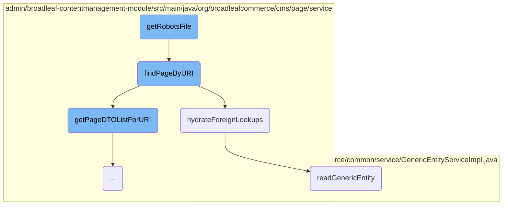

This document explains the process of retrieving and processing the <SwmToken path="admin/broadleaf-contentmanagement-module/src/main/java/org/broadleafcommerce/cms/web/controller/BroadleafRobotsController.java" pos="66:3:5" line-data="                &quot;/robots.txt&quot;, buildMvelParameters(request), isSecure(request));">`robots.txt`</SwmToken> file. The process involves setting the response content type and encoding, finding the page by URI, and handling the page content or returning a default <SwmToken path="admin/broadleaf-contentmanagement-module/src/main/java/org/broadleafcommerce/cms/web/controller/BroadleafRobotsController.java" pos="66:3:5" line-data="                &quot;/robots.txt&quot;, buildMvelParameters(request), isSecure(request));">`robots.txt`</SwmToken> content.

The flow starts by setting the response type and encoding. Then, it tries to find the page using the URI <SwmToken path="admin/broadleaf-contentmanagement-module/src/main/java/org/broadleafcommerce/cms/web/controller/BroadleafRobotsController.java" pos="66:2:5" line-data="                &quot;/robots.txt&quot;, buildMvelParameters(request), isSecure(request));">`/robots.txt`</SwmToken>. If the page is found and contains a 'body' field, it replaces a placeholder with the actual site URL and returns the content. If the page is not found, it returns a default <SwmToken path="admin/broadleaf-contentmanagement-module/src/main/java/org/broadleafcommerce/cms/web/controller/BroadleafRobotsController.java" pos="66:3:5" line-data="                &quot;/robots.txt&quot;, buildMvelParameters(request), isSecure(request));">`robots.txt`</SwmToken> content.

Here is a high level diagram of the flow, showing only the most important functions:

```mermaid
graph TD;
      subgraph admin/broadleaf-contentmanagement-module/src/main/java/org/broadleafcommerce/cms/page/service
7215d56750b94a7b69446d29c5225d21c63b35791ff4941bd7cc361e2516e838(getRobotsFile):::mainFlowStyle --> 918e7a7651d2a5b9b33cc3b516cb9e02f5b5d56e737dec5f8d393f6e2c2206e1(findPageByURI):::mainFlowStyle
end

subgraph admin/broadleaf-contentmanagement-module/src/main/java/org/broadleafcommerce/cms/page/service
918e7a7651d2a5b9b33cc3b516cb9e02f5b5d56e737dec5f8d393f6e2c2206e1(findPageByURI):::mainFlowStyle --> 08b14212f6fc4d087e69c01e8de926ded7b1a7de0ce55a00c5d350e3a395a822(hydrateForeignLookups)
end

subgraph admin/broadleaf-contentmanagement-module/src/main/java/org/broadleafcommerce/cms/page/service
918e7a7651d2a5b9b33cc3b516cb9e02f5b5d56e737dec5f8d393f6e2c2206e1(findPageByURI):::mainFlowStyle --> 2ae106fcfcc044246ba42ba9c7a4091a9e011f45a2a869ad2ec7e3d15c196bbe(getPageDTOListForURI):::mainFlowStyle
end

subgraph admin/broadleaf-contentmanagement-module/src/main/java/org/broadleafcommerce/cms/page/service
2ae106fcfcc044246ba42ba9c7a4091a9e011f45a2a869ad2ec7e3d15c196bbe(getPageDTOListForURI):::mainFlowStyle --> 1ca30e2b8c8bbfdca0ca7c7e365c9d0fcea46b880193ed4540fc83b9cf2d7cf3(buildPageDTOList):::mainFlowStyle
end

subgraph admin/broadleaf-contentmanagement-module/src/main/java/org/broadleafcommerce/cms/page/service
1ca30e2b8c8bbfdca0ca7c7e365c9d0fcea46b880193ed4540fc83b9cf2d7cf3(buildPageDTOList):::mainFlowStyle --> 19b49f66287c2a0c853166aa47a07ef7cd4aa2877015951a5239c891b07700e6(buildPageDTOListUsingCache):::mainFlowStyle
end

subgraph admin/broadleaf-contentmanagement-module/src/main/java/org/broadleafcommerce/cms/page/service
19b49f66287c2a0c853166aa47a07ef7cd4aa2877015951a5239c891b07700e6(buildPageDTOListUsingCache):::mainFlowStyle --> 3e266e1d88b9f0a6bc696d99832c5fd543896bd57ffa92660fd4cdd32ba2a2a8(getCachedPageDTOList)
end

subgraph admin/broadleaf-contentmanagement-module/src/main/java/org/broadleafcommerce/cms/page/service
19b49f66287c2a0c853166aa47a07ef7cd4aa2877015951a5239c891b07700e6(buildPageDTOListUsingCache):::mainFlowStyle --> 133f7a31184bad6500d3f50c4f24774ae2352cb1ac0f707d67bb3eb2db733c15(addPageListToPageDTOList):::mainFlowStyle
end

subgraph admin/broadleaf-contentmanagement-module/src/main/java/org/broadleafcommerce/cms/page/service
133f7a31184bad6500d3f50c4f24774ae2352cb1ac0f707d67bb3eb2db733c15(addPageListToPageDTOList):::mainFlowStyle --> fb4625e1472de8da4f3624f66f9feb2d877d00d95867f692a81ca7edefc9b051(buildPageDTO):::mainFlowStyle
end


      classDef mainFlowStyle color:#000000,fill:#7CB9F4
classDef rootsStyle color:#000000,fill:#00FFF4
classDef Style1 color:#000000,fill:#00FFAA
classDef Style2 color:#000000,fill:#FFFF00
classDef Style3 color:#000000,fill:#AA7CB9

%% Swimm:
%% graph TD;
%%       subgraph <SwmPath>[admin/broadleaf-contentmanagement-module/src/main/java/org/broadleafcommerce/cms/page/service/](admin/broadleaf-contentmanagement-module/src/main/java/org/broadleafcommerce/cms/page/service/)</SwmPath>
%% 7215d56750b94a7b69446d29c5225d21c63b35791ff4941bd7cc361e2516e838(getRobotsFile):::mainFlowStyle --> 918e7a7651d2a5b9b33cc3b516cb9e02f5b5d56e737dec5f8d393f6e2c2206e1(findPageByURI):::mainFlowStyle
%% end
%% 
%% subgraph <SwmPath>[admin/broadleaf-contentmanagement-module/src/main/java/org/broadleafcommerce/cms/page/service/](admin/broadleaf-contentmanagement-module/src/main/java/org/broadleafcommerce/cms/page/service/)</SwmPath>
%% 918e7a7651d2a5b9b33cc3b516cb9e02f5b5d56e737dec5f8d393f6e2c2206e1(findPageByURI):::mainFlowStyle --> 08b14212f6fc4d087e69c01e8de926ded7b1a7de0ce55a00c5d350e3a395a822(hydrateForeignLookups)
%% end
%% 
%% subgraph <SwmPath>[admin/broadleaf-contentmanagement-module/src/main/java/org/broadleafcommerce/cms/page/service/](admin/broadleaf-contentmanagement-module/src/main/java/org/broadleafcommerce/cms/page/service/)</SwmPath>
%% 918e7a7651d2a5b9b33cc3b516cb9e02f5b5d56e737dec5f8d393f6e2c2206e1(findPageByURI):::mainFlowStyle --> 2ae106fcfcc044246ba42ba9c7a4091a9e011f45a2a869ad2ec7e3d15c196bbe(getPageDTOListForURI):::mainFlowStyle
%% end
%% 
%% subgraph <SwmPath>[admin/broadleaf-contentmanagement-module/src/main/java/org/broadleafcommerce/cms/page/service/](admin/broadleaf-contentmanagement-module/src/main/java/org/broadleafcommerce/cms/page/service/)</SwmPath>
%% 2ae106fcfcc044246ba42ba9c7a4091a9e011f45a2a869ad2ec7e3d15c196bbe(getPageDTOListForURI):::mainFlowStyle --> 1ca30e2b8c8bbfdca0ca7c7e365c9d0fcea46b880193ed4540fc83b9cf2d7cf3(buildPageDTOList):::mainFlowStyle
%% end
%% 
%% subgraph <SwmPath>[admin/broadleaf-contentmanagement-module/src/main/java/org/broadleafcommerce/cms/page/service/](admin/broadleaf-contentmanagement-module/src/main/java/org/broadleafcommerce/cms/page/service/)</SwmPath>
%% 1ca30e2b8c8bbfdca0ca7c7e365c9d0fcea46b880193ed4540fc83b9cf2d7cf3(buildPageDTOList):::mainFlowStyle --> 19b49f66287c2a0c853166aa47a07ef7cd4aa2877015951a5239c891b07700e6(buildPageDTOListUsingCache):::mainFlowStyle
%% end
%% 
%% subgraph <SwmPath>[admin/broadleaf-contentmanagement-module/src/main/java/org/broadleafcommerce/cms/page/service/](admin/broadleaf-contentmanagement-module/src/main/java/org/broadleafcommerce/cms/page/service/)</SwmPath>
%% 19b49f66287c2a0c853166aa47a07ef7cd4aa2877015951a5239c891b07700e6(buildPageDTOListUsingCache):::mainFlowStyle --> 3e266e1d88b9f0a6bc696d99832c5fd543896bd57ffa92660fd4cdd32ba2a2a8(getCachedPageDTOList)
%% end
%% 
%% subgraph <SwmPath>[admin/broadleaf-contentmanagement-module/src/main/java/org/broadleafcommerce/cms/page/service/](admin/broadleaf-contentmanagement-module/src/main/java/org/broadleafcommerce/cms/page/service/)</SwmPath>
%% 19b49f66287c2a0c853166aa47a07ef7cd4aa2877015951a5239c891b07700e6(buildPageDTOListUsingCache):::mainFlowStyle --> 133f7a31184bad6500d3f50c4f24774ae2352cb1ac0f707d67bb3eb2db733c15(addPageListToPageDTOList):::mainFlowStyle
%% end
%% 
%% subgraph <SwmPath>[admin/broadleaf-contentmanagement-module/src/main/java/org/broadleafcommerce/cms/page/service/](admin/broadleaf-contentmanagement-module/src/main/java/org/broadleafcommerce/cms/page/service/)</SwmPath>
%% 133f7a31184bad6500d3f50c4f24774ae2352cb1ac0f707d67bb3eb2db733c15(addPageListToPageDTOList):::mainFlowStyle --> fb4625e1472de8da4f3624f66f9feb2d877d00d95867f692a81ca7edefc9b051(buildPageDTO):::mainFlowStyle
%% end
%% 
%% 
%%       classDef mainFlowStyle color:#000000,fill:#7CB9F4
%% classDef rootsStyle color:#000000,fill:#00FFF4
%% classDef Style1 color:#000000,fill:#00FFAA
%% classDef Style2 color:#000000,fill:#FFFF00
%% classDef Style3 color:#000000,fill:#AA7CB9
```



# Flow drill down

First, we'll zoom into this section of the flow:



<SwmSnippet path="/admin/broadleaf-contentmanagement-module/src/main/java/org/broadleafcommerce/cms/web/controller/BroadleafRobotsController.java" line="59">

---

## Retrieving and processing the <SwmToken path="admin/broadleaf-contentmanagement-module/src/main/java/org/broadleafcommerce/cms/web/controller/BroadleafRobotsController.java" pos="66:3:5" line-data="                &quot;/robots.txt&quot;, buildMvelParameters(request), isSecure(request));">`robots.txt`</SwmToken> file

The <SwmToken path="admin/broadleaf-contentmanagement-module/src/main/java/org/broadleafcommerce/cms/web/controller/BroadleafRobotsController.java" pos="59:5:5" line-data="    public String getRobotsFile(HttpServletRequest request, HttpServletResponse response) {">`getRobotsFile`</SwmToken> method is responsible for retrieving the <SwmToken path="admin/broadleaf-contentmanagement-module/src/main/java/org/broadleafcommerce/cms/web/controller/BroadleafRobotsController.java" pos="66:3:5" line-data="                &quot;/robots.txt&quot;, buildMvelParameters(request), isSecure(request));">`robots.txt`</SwmToken> file. It sets the response content type and encoding, then attempts to find the page by URI using <SwmToken path="admin/broadleaf-contentmanagement-module/src/main/java/org/broadleafcommerce/cms/web/controller/BroadleafRobotsController.java" pos="65:9:9" line-data="        PageDTO page = pageService.findPageByURI(null,">`findPageByURI`</SwmToken>. If the page is found and contains a 'body' field, it replaces the <SwmToken path="admin/broadleaf-contentmanagement-module/src/main/java/org/broadleafcommerce/cms/web/controller/BroadleafRobotsController.java" pos="70:10:13" line-data="            body = body.replace(&quot;${siteBaseUrl}&quot;, baseUrlResolver.getSiteBaseUrl());">`${siteBaseUrl}`</SwmToken> placeholder with the actual site base URL and returns the body content. If the page is not found, it returns a default <SwmToken path="admin/broadleaf-contentmanagement-module/src/main/java/org/broadleafcommerce/cms/web/controller/BroadleafRobotsController.java" pos="66:3:5" line-data="                &quot;/robots.txt&quot;, buildMvelParameters(request), isSecure(request));">`robots.txt`</SwmToken> content.

```java
    public String getRobotsFile(HttpServletRequest request, HttpServletResponse response) {
    	blcContextUtil.establishThinRequestContext();
    	
        response.setContentType("text/plain");
        response.setCharacterEncoding("UTF-8");

        PageDTO page = pageService.findPageByURI(null,
                "/robots.txt", buildMvelParameters(request), isSecure(request));

        if (page != null && page.getPageFields().containsKey("body")) {
            String body = (String) page.getPageFields().get("body");
            body = body.replace("${siteBaseUrl}", baseUrlResolver.getSiteBaseUrl());
            return body;
        } else {
            return getDefaultRobotsTxt();
        }
    }
```

---

</SwmSnippet>

<SwmSnippet path="/admin/broadleaf-contentmanagement-module/src/main/java/org/broadleafcommerce/cms/page/service/PageServiceImpl.java" line="136">

---

### Finding the page by URI

The <SwmToken path="admin/broadleaf-contentmanagement-module/src/main/java/org/broadleafcommerce/cms/page/service/PageServiceImpl.java" pos="140:5:5" line-data="    public PageDTO findPageByURI(Locale locale, String uri, Map&lt;String,Object&gt; ruleDTOs, boolean secure) {">`findPageByURI`</SwmToken> method retrieves a page based on the given URI. It first checks if the page is cached. If not, it retrieves a list of <SwmToken path="admin/broadleaf-contentmanagement-module/src/main/java/org/broadleafcommerce/cms/page/service/PageServiceImpl.java" pos="224:21:21" line-data="     * Converts a list of pages to a list of pageDTOs, and caches the list.">`pageDTOs`</SwmToken> for the URI and evaluates the page rules. If a valid <SwmToken path="admin/broadleaf-contentmanagement-module/src/main/java/org/broadleafcommerce/cms/page/service/PageServiceImpl.java" pos="140:3:3" line-data="    public PageDTO findPageByURI(Locale locale, String uri, Map&lt;String,Object&gt; ruleDTOs, boolean secure) {">`PageDTO`</SwmToken> is found, it fetches the page by ID and allows extensions to override the <SwmToken path="admin/broadleaf-contentmanagement-module/src/main/java/org/broadleafcommerce/cms/page/service/PageServiceImpl.java" pos="140:3:3" line-data="    public PageDTO findPageByURI(Locale locale, String uri, Map&lt;String,Object&gt; ruleDTOs, boolean secure) {">`PageDTO`</SwmToken>. Finally, it hydrates foreign lookups in the <SwmToken path="admin/broadleaf-contentmanagement-module/src/main/java/org/broadleafcommerce/cms/page/service/PageServiceImpl.java" pos="140:3:3" line-data="    public PageDTO findPageByURI(Locale locale, String uri, Map&lt;String,Object&gt; ruleDTOs, boolean secure) {">`PageDTO`</SwmToken> before returning it.

```java
    /*
     * Retrieve the page if one is available for the passed in uri.
     */
    @Override
    public PageDTO findPageByURI(Locale locale, String uri, Map<String,Object> ruleDTOs, boolean secure) {
        PageDTO dto;

        if (!isNullPageCached(locale, uri, secure)) {
            final List<PageDTO> returnList = getPageDTOListForURI(locale, uri, secure);
            dto = evaluatePageRules(returnList, locale, ruleDTOs);

            if (dto.getId() != null) {
                final Page page = findPageById(dto.getId());
                final ExtensionResultHolder<PageDTO> newDTO = new ExtensionResultHolder<>();

                // Allow an extension point to override the page to render.
                extensionManager.getProxy().overridePageDto(newDTO, dto, page);
                if (newDTO.getResult() != null) {
                    dto = newDTO.getResult();
                }
            }
```

---

</SwmSnippet>

<SwmSnippet path="/admin/broadleaf-contentmanagement-module/src/main/java/org/broadleafcommerce/cms/page/service/PageServiceUtility.java" line="187">

---

### Hydrating foreign lookups

The <SwmToken path="admin/broadleaf-contentmanagement-module/src/main/java/org/broadleafcommerce/cms/page/service/PageServiceUtility.java" pos="187:5:5" line-data="    public PageDTO hydrateForeignLookups(PageDTO page) {">`hydrateForeignLookups`</SwmToken> method processes the <SwmToken path="admin/broadleaf-contentmanagement-module/src/main/java/org/broadleafcommerce/cms/page/service/PageServiceUtility.java" pos="187:3:3" line-data="    public PageDTO hydrateForeignLookups(PageDTO page) {">`PageDTO`</SwmToken> to replace any foreign lookup placeholders with actual entity values. It iterates over the page fields, identifies foreign lookups, and reads the corresponding entities using <SwmToken path="admin/broadleaf-contentmanagement-module/src/main/java/org/broadleafcommerce/cms/page/service/PageServiceUtility.java" pos="203:7:7" line-data="                    newValue = genericDao.readGenericEntity(genericDao.getImplClass(clazz), id);">`readGenericEntity`</SwmToken>. The method then updates the <SwmToken path="admin/broadleaf-contentmanagement-module/src/main/java/org/broadleafcommerce/cms/page/service/PageServiceUtility.java" pos="187:3:3" line-data="    public PageDTO hydrateForeignLookups(PageDTO page) {">`PageDTO`</SwmToken> with the actual entity values or removes the placeholder if the entity is not found.

```java
    public PageDTO hydrateForeignLookups(PageDTO page) {
        for (Entry<String, Object> entry : page.getPageFields().entrySet()) {
            if (entry.getValue() instanceof String && ((String) entry.getValue()).startsWith(FOREIGN_LOOKUP)) {
                page.getForeignPageFields().put(entry.getKey(), entry.getValue());
            }
        }

        if (page.getForeignPageFields().size() > 0) {
            PageDTO clone = new PageDTO();
            clone.copy(page);

            for (Entry<String, Object> entry : page.getForeignPageFields().entrySet()) {
                String clazz = ((String) entry.getValue()).split("\\|")[1];
                String id = ((String) entry.getValue()).split("\\|")[2];
                Object newValue = null;
                if (StringUtils.isNotBlank(clazz) && StringUtils.isNotBlank(id) && !"null".equals(id)) {
                    newValue = genericDao.readGenericEntity(genericDao.getImplClass(clazz), id);
                }
                if (newValue != null) {
                    clone.getPageFields().put(entry.getKey(), newValue);
                } else {
```

---

</SwmSnippet>

<SwmSnippet path="/common/src/main/java/org/broadleafcommerce/common/service/GenericEntityServiceImpl.java" line="39">

---

### Reading a generic entity

The <SwmToken path="common/src/main/java/org/broadleafcommerce/common/service/GenericEntityServiceImpl.java" pos="40:5:5" line-data="    public Object readGenericEntity(String className, Object id) {">`readGenericEntity`</SwmToken> method reads a generic entity based on the class name and ID. It retrieves the implementation class for the given class name and then reads the entity using the generic entity DAO.

```java
    @Override
    public Object readGenericEntity(String className, Object id) {
        Class<?> clazz = genericEntityDao.getImplClass(className);
        return genericEntityDao.readGenericEntity(clazz, id);
    }
```

---

</SwmSnippet>

Now, lets zoom into this section of the flow:

```mermaid
graph TD;
      subgraph admin/broadleaf-contentmanagement-module/src/main/java/org/broadleafcommerce/cms/page/service
2ae106fcfcc044246ba42ba9c7a4091a9e011f45a2a869ad2ec7e3d15c196bbe(getPageDTOListForURI):::mainFlowStyle --> 1ca30e2b8c8bbfdca0ca7c7e365c9d0fcea46b880193ed4540fc83b9cf2d7cf3(buildPageDTOList):::mainFlowStyle
end

subgraph admin/broadleaf-contentmanagement-module/src/main/java/org/broadleafcommerce/cms/page/service
1ca30e2b8c8bbfdca0ca7c7e365c9d0fcea46b880193ed4540fc83b9cf2d7cf3(buildPageDTOList):::mainFlowStyle --> 19b49f66287c2a0c853166aa47a07ef7cd4aa2877015951a5239c891b07700e6(buildPageDTOListUsingCache):::mainFlowStyle
end

subgraph admin/broadleaf-contentmanagement-module/src/main/java/org/broadleafcommerce/cms/page/service
19b49f66287c2a0c853166aa47a07ef7cd4aa2877015951a5239c891b07700e6(buildPageDTOListUsingCache):::mainFlowStyle --> 3e266e1d88b9f0a6bc696d99832c5fd543896bd57ffa92660fd4cdd32ba2a2a8(getCachedPageDTOList)
end

subgraph admin/broadleaf-contentmanagement-module/src/main/java/org/broadleafcommerce/cms/page/service
19b49f66287c2a0c853166aa47a07ef7cd4aa2877015951a5239c891b07700e6(buildPageDTOListUsingCache):::mainFlowStyle --> 133f7a31184bad6500d3f50c4f24774ae2352cb1ac0f707d67bb3eb2db733c15(addPageListToPageDTOList):::mainFlowStyle
end

subgraph admin/broadleaf-contentmanagement-module/src/main/java/org/broadleafcommerce/cms/page/service
133f7a31184bad6500d3f50c4f24774ae2352cb1ac0f707d67bb3eb2db733c15(addPageListToPageDTOList):::mainFlowStyle --> fb4625e1472de8da4f3624f66f9feb2d877d00d95867f692a81ca7edefc9b051(buildPageDTO):::mainFlowStyle
end

subgraph admin/broadleaf-contentmanagement-module/src/main/java/org/broadleafcommerce/cms/page/service
3e266e1d88b9f0a6bc696d99832c5fd543896bd57ffa92660fd4cdd32ba2a2a8(getCachedPageDTOList) --> 8ae37b5070d62914746b5cd7c13ea418d916cd55b857287faaa7606165e7bb0b(getPageListFromCache)
end


      classDef mainFlowStyle color:#000000,fill:#7CB9F4
classDef rootsStyle color:#000000,fill:#00FFF4
classDef Style1 color:#000000,fill:#00FFAA
classDef Style2 color:#000000,fill:#FFFF00
classDef Style3 color:#000000,fill:#AA7CB9

%% Swimm:
%% graph TD;
%%       subgraph <SwmPath>[admin/broadleaf-contentmanagement-module/src/main/java/org/broadleafcommerce/cms/page/service/](admin/broadleaf-contentmanagement-module/src/main/java/org/broadleafcommerce/cms/page/service/)</SwmPath>
%% 2ae106fcfcc044246ba42ba9c7a4091a9e011f45a2a869ad2ec7e3d15c196bbe(getPageDTOListForURI):::mainFlowStyle --> 1ca30e2b8c8bbfdca0ca7c7e365c9d0fcea46b880193ed4540fc83b9cf2d7cf3(buildPageDTOList):::mainFlowStyle
%% end
%% 
%% subgraph <SwmPath>[admin/broadleaf-contentmanagement-module/src/main/java/org/broadleafcommerce/cms/page/service/](admin/broadleaf-contentmanagement-module/src/main/java/org/broadleafcommerce/cms/page/service/)</SwmPath>
%% 1ca30e2b8c8bbfdca0ca7c7e365c9d0fcea46b880193ed4540fc83b9cf2d7cf3(buildPageDTOList):::mainFlowStyle --> 19b49f66287c2a0c853166aa47a07ef7cd4aa2877015951a5239c891b07700e6(buildPageDTOListUsingCache):::mainFlowStyle
%% end
%% 
%% subgraph <SwmPath>[admin/broadleaf-contentmanagement-module/src/main/java/org/broadleafcommerce/cms/page/service/](admin/broadleaf-contentmanagement-module/src/main/java/org/broadleafcommerce/cms/page/service/)</SwmPath>
%% 19b49f66287c2a0c853166aa47a07ef7cd4aa2877015951a5239c891b07700e6(buildPageDTOListUsingCache):::mainFlowStyle --> 3e266e1d88b9f0a6bc696d99832c5fd543896bd57ffa92660fd4cdd32ba2a2a8(getCachedPageDTOList)
%% end
%% 
%% subgraph <SwmPath>[admin/broadleaf-contentmanagement-module/src/main/java/org/broadleafcommerce/cms/page/service/](admin/broadleaf-contentmanagement-module/src/main/java/org/broadleafcommerce/cms/page/service/)</SwmPath>
%% 19b49f66287c2a0c853166aa47a07ef7cd4aa2877015951a5239c891b07700e6(buildPageDTOListUsingCache):::mainFlowStyle --> 133f7a31184bad6500d3f50c4f24774ae2352cb1ac0f707d67bb3eb2db733c15(addPageListToPageDTOList):::mainFlowStyle
%% end
%% 
%% subgraph <SwmPath>[admin/broadleaf-contentmanagement-module/src/main/java/org/broadleafcommerce/cms/page/service/](admin/broadleaf-contentmanagement-module/src/main/java/org/broadleafcommerce/cms/page/service/)</SwmPath>
%% 133f7a31184bad6500d3f50c4f24774ae2352cb1ac0f707d67bb3eb2db733c15(addPageListToPageDTOList):::mainFlowStyle --> fb4625e1472de8da4f3624f66f9feb2d877d00d95867f692a81ca7edefc9b051(buildPageDTO):::mainFlowStyle
%% end
%% 
%% subgraph <SwmPath>[admin/broadleaf-contentmanagement-module/src/main/java/org/broadleafcommerce/cms/page/service/](admin/broadleaf-contentmanagement-module/src/main/java/org/broadleafcommerce/cms/page/service/)</SwmPath>
%% 3e266e1d88b9f0a6bc696d99832c5fd543896bd57ffa92660fd4cdd32ba2a2a8(getCachedPageDTOList) --> 8ae37b5070d62914746b5cd7c13ea418d916cd55b857287faaa7606165e7bb0b(getPageListFromCache)
%% end
%% 
%% 
%%       classDef mainFlowStyle color:#000000,fill:#7CB9F4
%% classDef rootsStyle color:#000000,fill:#00FFF4
%% classDef Style1 color:#000000,fill:#00FFAA
%% classDef Style2 color:#000000,fill:#FFFF00
%% classDef Style3 color:#000000,fill:#AA7CB9
```



<SwmSnippet path="/admin/broadleaf-contentmanagement-module/src/main/java/org/broadleafcommerce/cms/page/service/PageServiceImpl.java" line="223">

---

## Building and Caching <SwmToken path="admin/broadleaf-contentmanagement-module/src/main/java/org/broadleafcommerce/cms/page/service/PageServiceImpl.java" pos="224:21:21" line-data="     * Converts a list of pages to a list of pageDTOs, and caches the list.">`pageDTOs`</SwmToken>

The <SwmToken path="admin/broadleaf-contentmanagement-module/src/main/java/org/broadleafcommerce/cms/page/service/PageServiceImpl.java" pos="227:8:8" line-data="    public List&lt;PageDTO&gt; buildPageDTOList(List&lt;Page&gt; pageList, boolean secure, String identifier, Locale locale) {">`buildPageDTOList`</SwmToken> method converts a list of <SwmToken path="admin/broadleaf-contentmanagement-module/src/main/java/org/broadleafcommerce/cms/page/service/PageServiceImpl.java" pos="227:12:12" line-data="    public List&lt;PageDTO&gt; buildPageDTOList(List&lt;Page&gt; pageList, boolean secure, String identifier, Locale locale) {">`Page`</SwmToken> objects to a list of <SwmToken path="admin/broadleaf-contentmanagement-module/src/main/java/org/broadleafcommerce/cms/page/service/PageServiceImpl.java" pos="227:5:5" line-data="    public List&lt;PageDTO&gt; buildPageDTOList(List&lt;Page&gt; pageList, boolean secure, String identifier, Locale locale) {">`PageDTO`</SwmToken> objects. It checks if the context is a production sandbox and uses caching if it is. Otherwise, it directly adds the pages to the DTO list.

```java
    /*
     * Converts a list of pages to a list of pageDTOs, and caches the list.
     */
    @Override
    public List<PageDTO> buildPageDTOList(List<Page> pageList, boolean secure, String identifier, Locale locale) {
        List<PageDTO> dtoList = new ArrayList<>();
        BroadleafRequestContext context = BroadleafRequestContext.getBroadleafRequestContext();

        if (context.isProductionSandBox()) {
            dtoList = buildPageDTOListUsingCache(pageList, identifier, locale, secure);
        } else {
            // no caching actions needed if not production sandbox
            addPageListToPageDTOList(pageList, secure, dtoList);
        }

        return copyDTOList(dtoList);
    }
```

---

</SwmSnippet>

<SwmSnippet path="/admin/broadleaf-contentmanagement-module/src/main/java/org/broadleafcommerce/cms/page/service/PageServiceImpl.java" line="241">

---

### Using Cache for <SwmToken path="admin/broadleaf-contentmanagement-module/src/main/java/org/broadleafcommerce/cms/page/service/PageServiceImpl.java" pos="224:21:21" line-data="     * Converts a list of pages to a list of pageDTOs, and caches the list.">`pageDTOs`</SwmToken>

The <SwmToken path="admin/broadleaf-contentmanagement-module/src/main/java/org/broadleafcommerce/cms/page/service/PageServiceImpl.java" pos="242:8:8" line-data="    protected List&lt;PageDTO&gt; buildPageDTOListUsingCache(List&lt;Page&gt; pageList, String identifier, Locale locale, boolean secure) {">`buildPageDTOListUsingCache`</SwmToken> method attempts to retrieve <SwmToken path="admin/broadleaf-contentmanagement-module/src/main/java/org/broadleafcommerce/cms/page/service/PageServiceImpl.java" pos="242:5:5" line-data="    protected List&lt;PageDTO&gt; buildPageDTOListUsingCache(List&lt;Page&gt; pageList, String identifier, Locale locale, boolean secure) {">`PageDTO`</SwmToken> objects from the cache. If the cache is empty, it builds the DTO list and adds it to the cache.

```java
    @SuppressWarnings("unchecked")
    protected List<PageDTO> buildPageDTOListUsingCache(List<Page> pageList, String identifier, Locale locale, boolean secure) {
        List<PageDTO> dtoList = getCachedPageDTOList(pageList, identifier, locale, secure);

        if (dtoList == null || dtoList.isEmpty()) {
            addPageListToPageDTOList(pageList, secure, dtoList);

            if (dtoList != null && !dtoList.isEmpty()) {
                Collections.sort(dtoList, new BeanComparator("priority"));
                addPageListToCache(dtoList, identifier, locale, secure);
            }
        }

        return dtoList;
    }
```

---

</SwmSnippet>

<SwmSnippet path="/admin/broadleaf-contentmanagement-module/src/main/java/org/broadleafcommerce/cms/page/service/PageServiceImpl.java" line="257">

---

### Retrieving Cached <SwmToken path="admin/broadleaf-contentmanagement-module/src/main/java/org/broadleafcommerce/cms/page/service/PageServiceImpl.java" pos="224:21:21" line-data="     * Converts a list of pages to a list of pageDTOs, and caches the list.">`pageDTOs`</SwmToken>

The <SwmToken path="admin/broadleaf-contentmanagement-module/src/main/java/org/broadleafcommerce/cms/page/service/PageServiceImpl.java" pos="257:8:8" line-data="    protected List&lt;PageDTO&gt; getCachedPageDTOList(List&lt;Page&gt; pageList, String identifier, Locale locale, boolean secure) {">`getCachedPageDTOList`</SwmToken> method retrieves a list of <SwmToken path="admin/broadleaf-contentmanagement-module/src/main/java/org/broadleafcommerce/cms/page/service/PageServiceImpl.java" pos="257:5:5" line-data="    protected List&lt;PageDTO&gt; getCachedPageDTOList(List&lt;Page&gt; pageList, String identifier, Locale locale, boolean secure) {">`PageDTO`</SwmToken> objects from the cache based on a key. If the cached list matches the size of the page list, it is returned.

```java
    protected List<PageDTO> getCachedPageDTOList(List<Page> pageList, String identifier, Locale locale, boolean secure) {
        List<PageDTO> dtoList = new ArrayList<>();
        String key = buildKey(identifier, locale, secure);
        List<PageDTO> cachedList = getPageListFromCache(key);

        if (cachedList != null && cachedList.size() == pageList.size()) {
            dtoList = cachedList;
        }

        return dtoList;
    }
```

---

</SwmSnippet>

<SwmSnippet path="/admin/broadleaf-contentmanagement-module/src/main/java/org/broadleafcommerce/cms/page/service/PageServiceImpl.java" line="269">

---

### Adding Pages to DTO List

The <SwmToken path="admin/broadleaf-contentmanagement-module/src/main/java/org/broadleafcommerce/cms/page/service/PageServiceImpl.java" pos="269:5:5" line-data="    protected void addPageListToPageDTOList(List&lt;Page&gt; pageList, boolean secure, List&lt;PageDTO&gt; dtoList) {">`addPageListToPageDTOList`</SwmToken> method iterates over the list of <SwmToken path="admin/broadleaf-contentmanagement-module/src/main/java/org/broadleafcommerce/cms/page/service/PageServiceImpl.java" pos="269:9:9" line-data="    protected void addPageListToPageDTOList(List&lt;Page&gt; pageList, boolean secure, List&lt;PageDTO&gt; dtoList) {">`Page`</SwmToken> objects and converts each to a <SwmToken path="admin/broadleaf-contentmanagement-module/src/main/java/org/broadleafcommerce/cms/page/service/PageServiceImpl.java" pos="269:22:22" line-data="    protected void addPageListToPageDTOList(List&lt;Page&gt; pageList, boolean secure, List&lt;PageDTO&gt; dtoList) {">`PageDTO`</SwmToken> object using the <SwmToken path="admin/broadleaf-contentmanagement-module/src/main/java/org/broadleafcommerce/cms/page/service/PageServiceImpl.java" pos="272:9:9" line-data="                PageDTO pageDTO = pageServiceUtility.buildPageDTO(page, secure);">`buildPageDTO`</SwmToken> method. It then adds the <SwmToken path="admin/broadleaf-contentmanagement-module/src/main/java/org/broadleafcommerce/cms/page/service/PageServiceImpl.java" pos="269:22:22" line-data="    protected void addPageListToPageDTOList(List&lt;Page&gt; pageList, boolean secure, List&lt;PageDTO&gt; dtoList) {">`PageDTO`</SwmToken> to the DTO list if it is not already present.

```java
    protected void addPageListToPageDTOList(List<Page> pageList, boolean secure, List<PageDTO> dtoList) {
        if (pageList != null) {
            for(Page page : pageList) {
                PageDTO pageDTO = pageServiceUtility.buildPageDTO(page, secure);

                if (!dtoList.contains(pageDTO)) {
                    dtoList.add(pageDTO);
                }
            }
        }
    }
```

---

</SwmSnippet>

<SwmSnippet path="/admin/broadleaf-contentmanagement-module/src/main/java/org/broadleafcommerce/cms/page/service/PageServiceUtility.java" line="75">

---

### Building <SwmToken path="admin/broadleaf-contentmanagement-module/src/main/java/org/broadleafcommerce/cms/page/service/PageServiceUtility.java" pos="75:3:3" line-data="    public PageDTO buildPageDTO(Page page, boolean secure) {">`PageDTO`</SwmToken>

The <SwmToken path="admin/broadleaf-contentmanagement-module/src/main/java/org/broadleafcommerce/cms/page/service/PageServiceUtility.java" pos="75:5:5" line-data="    public PageDTO buildPageDTO(Page page, boolean secure) {">`buildPageDTO`</SwmToken> method constructs a <SwmToken path="admin/broadleaf-contentmanagement-module/src/main/java/org/broadleafcommerce/cms/page/service/PageServiceUtility.java" pos="75:3:3" line-data="    public PageDTO buildPageDTO(Page page, boolean secure) {">`PageDTO`</SwmToken> object from a <SwmToken path="admin/broadleaf-contentmanagement-module/src/main/java/org/broadleafcommerce/cms/page/service/PageServiceUtility.java" pos="75:7:7" line-data="    public PageDTO buildPageDTO(Page page, boolean secure) {">`Page`</SwmToken> object. It sets various properties such as ID, description, URL, priority, and additional attributes.

```java
    public PageDTO buildPageDTO(Page page, boolean secure) {
        PageDTO pageDTO = new PageDTO();
        pageDTO.setId(page.getId());
        pageDTO.setDescription(page.getDescription());
        pageDTO.setUrl(page.getFullUrl());
        pageDTO.setPriority(page.getPriority());

        if (page.getPageTemplate() != null) {
            pageDTO.setTemplatePath(page.getPageTemplate().getTemplatePath());
            if (page.getPageTemplate().getLocale() != null) {
                pageDTO.setLocaleCode(page.getPageTemplate().getLocale().getLocaleCode());
            }
        }

        for (String fieldKey : page.getPageFields().keySet()) {
            addPageFieldToDTO(page, secure, pageDTO, fieldKey);
        }

        pageDTO.setRuleExpression(buildRuleExpression(page));

        if (page.getQualifyingItemCriteria() != null && page.getQualifyingItemCriteria().size() > 0) {
```

---

</SwmSnippet>

&nbsp;

*This is an auto-generated document by Swimm AI 🌊 and has not yet been verified by a human*

<SwmMeta version="3.0.0" repo-id="Z2l0aHViJTNBJTNBQnJvYWRsZWFmQ29tbWVyY2UtZGVtby1uZXclM0ElM0FTd2ltbS1EZW1v" repo-name="BroadleafCommerce-demo-new" doc-type="flows"><sup>Powered by [Swimm](/)</sup></SwmMeta>
