In this document, we will explain the process of retrieving records. The process involves several steps, starting from setting up filter criteria to fetching the records and handling different types of persistence operations.

The flow starts with setting up filter criteria based on the provided ID. Then, it delegates the actual fetching of the record to another method. If no records are found, an exception is thrown. The process also involves creating a persistence package and determining the class name for a given section key.

# Flow drill down

```mermaid
graph TD;
      subgraph admin/broadleaf-open-admin-platform/src/main/java/org/broadleafcommerce/openadmin/server
5651d50122fa79eecce004d05350e9e6ded7cad13f9178de3fd5c8999c210429(getRecord):::mainFlowStyle --> 199cd36766a9a8b50a43924c8eeb94204827a263d4eafd3c9fbc999683d6fdda(getRecords):::mainFlowStyle
end

subgraph admin/broadleaf-open-admin-platform/src/main/java/org/broadleafcommerce/openadmin/server
199cd36766a9a8b50a43924c8eeb94204827a263d4eafd3c9fbc999683d6fdda(getRecords):::mainFlowStyle --> 97bc44f4f7a24aa37c9f5b6091312a408c4705d94347e49c89d1840a65cffe1a(fetch):::mainFlowStyle
end

subgraph admin/broadleaf-open-admin-platform/src/main/java/org/broadleafcommerce/openadmin/server
97bc44f4f7a24aa37c9f5b6091312a408c4705d94347e49c89d1840a65cffe1a(fetch):::mainFlowStyle --> 352c303664da1b650831ca6fa2ec0ba59f0e96827e2adea94dc124424c57ebfd(create):::mainFlowStyle
end

subgraph admin/broadleaf-open-admin-platform/src/main/java/org/broadleafcommerce/openadmin/server
352c303664da1b650831ca6fa2ec0ba59f0e96827e2adea94dc124424c57ebfd(create):::mainFlowStyle --> c67e0dc08857a0cd944aaba7f43e41d7db443ba071ab86aa72a44b4c1a31e2ab(getClassNameForSection):::mainFlowStyle
end


      classDef mainFlowStyle color:#000000,fill:#7CB9F4
classDef rootsStyle color:#000000,fill:#00FFF4
classDef Style1 color:#000000,fill:#00FFAA
classDef Style2 color:#000000,fill:#FFFF00
classDef Style3 color:#000000,fill:#AA7CB9

%% Swimm:
%% graph TD;
%%       subgraph <SwmPath>[admin/broadleaf-open-admin-platform/src/main/java/org/broadleafcommerce/openadmin/server/](admin/broadleaf-open-admin-platform/src/main/java/org/broadleafcommerce/openadmin/server/)</SwmPath>
%% 5651d50122fa79eecce004d05350e9e6ded7cad13f9178de3fd5c8999c210429(getRecord):::mainFlowStyle --> 199cd36766a9a8b50a43924c8eeb94204827a263d4eafd3c9fbc999683d6fdda(getRecords):::mainFlowStyle
%% end
%% 
%% subgraph <SwmPath>[admin/broadleaf-open-admin-platform/src/main/java/org/broadleafcommerce/openadmin/server/](admin/broadleaf-open-admin-platform/src/main/java/org/broadleafcommerce/openadmin/server/)</SwmPath>
%% 199cd36766a9a8b50a43924c8eeb94204827a263d4eafd3c9fbc999683d6fdda(getRecords):::mainFlowStyle --> 97bc44f4f7a24aa37c9f5b6091312a408c4705d94347e49c89d1840a65cffe1a(fetch):::mainFlowStyle
%% end
%% 
%% subgraph <SwmPath>[admin/broadleaf-open-admin-platform/src/main/java/org/broadleafcommerce/openadmin/server/](admin/broadleaf-open-admin-platform/src/main/java/org/broadleafcommerce/openadmin/server/)</SwmPath>
%% 97bc44f4f7a24aa37c9f5b6091312a408c4705d94347e49c89d1840a65cffe1a(fetch):::mainFlowStyle --> 352c303664da1b650831ca6fa2ec0ba59f0e96827e2adea94dc124424c57ebfd(create):::mainFlowStyle
%% end
%% 
%% subgraph <SwmPath>[admin/broadleaf-open-admin-platform/src/main/java/org/broadleafcommerce/openadmin/server/](admin/broadleaf-open-admin-platform/src/main/java/org/broadleafcommerce/openadmin/server/)</SwmPath>
%% 352c303664da1b650831ca6fa2ec0ba59f0e96827e2adea94dc124424c57ebfd(create):::mainFlowStyle --> c67e0dc08857a0cd944aaba7f43e41d7db443ba071ab86aa72a44b4c1a31e2ab(getClassNameForSection):::mainFlowStyle
%% end
%% 
%% 
%%       classDef mainFlowStyle color:#000000,fill:#7CB9F4
%% classDef rootsStyle color:#000000,fill:#00FFF4
%% classDef Style1 color:#000000,fill:#00FFAA
%% classDef Style2 color:#000000,fill:#FFFF00
%% classDef Style3 color:#000000,fill:#AA7CB9
```



<SwmSnippet path="/admin/broadleaf-open-admin-platform/src/main/java/org/broadleafcommerce/openadmin/server/service/AdminEntityServiceImpl.java" line="121">

---

## <SwmToken path="admin/broadleaf-open-admin-platform/src/main/java/org/broadleafcommerce/openadmin/server/service/AdminEntityServiceImpl.java" pos="122:5:5" line-data="    public PersistenceResponse getRecord(PersistencePackageRequest request, String id, ClassMetadata cmd, boolean isCollectionRequest)">`getRecord`</SwmToken>

The <SwmToken path="admin/broadleaf-open-admin-platform/src/main/java/org/broadleafcommerce/openadmin/server/service/AdminEntityServiceImpl.java" pos="122:5:5" line-data="    public PersistenceResponse getRecord(PersistencePackageRequest request, String id, ClassMetadata cmd, boolean isCollectionRequest)">`getRecord`</SwmToken> function is responsible for retrieving a single record based on the provided ID. It first sets up filter criteria using the ID and then delegates the actual fetching of the record to the <SwmToken path="admin/broadleaf-open-admin-platform/src/main/java/org/broadleafcommerce/openadmin/server/service/AdminEntityServiceImpl.java" pos="130:7:7" line-data="        PersistenceResponse response = fetch(request);">`fetch`</SwmToken> method. If no records are found, it throws an <SwmToken path="admin/broadleaf-open-admin-platform/src/main/java/org/broadleafcommerce/openadmin/server/service/AdminEntityServiceImpl.java" pos="134:5:5" line-data="            throw new EntityNotFoundException(String.format(&quot;Could not find Entity %s with ID %s&quot;, celiningEntity, id));">`EntityNotFoundException`</SwmToken>.

```java
    @Override
    public PersistenceResponse getRecord(PersistencePackageRequest request, String id, ClassMetadata cmd, boolean isCollectionRequest)
            throws ServiceException {
        String idProperty = getIdProperty(cmd);

        FilterAndSortCriteria fasc = new FilterAndSortCriteria(idProperty);
        fasc.setFilterValue(id);
        request.addFilterAndSortCriteria(fasc);

        PersistenceResponse response = fetch(request);
        Entity[] entities = response.getDynamicResultSet().getRecords();
        if (ArrayUtils.isEmpty(entities)) {
            String celiningEntity = request.getCeilingEntityClassname();
            throw new EntityNotFoundException(String.format("Could not find Entity %s with ID %s", celiningEntity, id));
        }

        return response;
    }
```

---

</SwmSnippet>

<SwmSnippet path="/admin/broadleaf-open-admin-platform/src/main/java/org/broadleafcommerce/openadmin/server/service/AdminEntityServiceImpl.java" line="116">

---

## <SwmToken path="admin/broadleaf-open-admin-platform/src/main/java/org/broadleafcommerce/openadmin/server/service/AdminEntityServiceImpl.java" pos="117:5:5" line-data="    public PersistenceResponse getRecords(PersistencePackageRequest request) throws ServiceException {">`getRecords`</SwmToken>

The <SwmToken path="admin/broadleaf-open-admin-platform/src/main/java/org/broadleafcommerce/openadmin/server/service/AdminEntityServiceImpl.java" pos="117:5:5" line-data="    public PersistenceResponse getRecords(PersistencePackageRequest request) throws ServiceException {">`getRecords`</SwmToken> function is a simplified version that retrieves multiple records based on the criteria specified in the <SwmToken path="admin/broadleaf-open-admin-platform/src/main/java/org/broadleafcommerce/openadmin/server/service/AdminEntityServiceImpl.java" pos="117:7:7" line-data="    public PersistenceResponse getRecords(PersistencePackageRequest request) throws ServiceException {">`PersistencePackageRequest`</SwmToken>. It directly calls the <SwmToken path="admin/broadleaf-open-admin-platform/src/main/java/org/broadleafcommerce/openadmin/server/service/AdminEntityServiceImpl.java" pos="118:3:3" line-data="        return fetch(request);">`fetch`</SwmToken> method to perform the retrieval.

```java
    @Override
    public PersistenceResponse getRecords(PersistencePackageRequest request) throws ServiceException {
        return fetch(request);
    }
```

---

</SwmSnippet>

<SwmSnippet path="/admin/broadleaf-open-admin-platform/src/main/java/org/broadleafcommerce/openadmin/server/service/AdminEntityServiceImpl.java" line="958">

---

## fetch

The <SwmToken path="admin/broadleaf-open-admin-platform/src/main/java/org/broadleafcommerce/openadmin/server/service/AdminEntityServiceImpl.java" pos="959:5:5" line-data="    public PersistenceResponse fetch(PersistencePackageRequest request)">`fetch`</SwmToken> function is the core method that interacts with the persistence layer to retrieve records. It constructs a <SwmToken path="admin/broadleaf-open-admin-platform/src/main/java/org/broadleafcommerce/openadmin/server/service/AdminEntityServiceImpl.java" pos="961:1:1" line-data="        PersistencePackage pkg = persistencePackageFactory.create(request);">`PersistencePackage`</SwmToken> and a <SwmToken path="admin/broadleaf-open-admin-platform/src/main/java/org/broadleafcommerce/openadmin/server/service/AdminEntityServiceImpl.java" pos="963:1:1" line-data="        CriteriaTransferObject cto = getDefaultCto();">`CriteriaTransferObject`</SwmToken> based on the request parameters, and then calls the <SwmToken path="admin/broadleaf-open-admin-platform/src/main/java/org/broadleafcommerce/openadmin/server/service/AdminEntityServiceImpl.java" pos="1004:3:5" line-data="        return service.fetch(pkg, cto);">`service.fetch`</SwmToken> method to get the data.

```java
    @Override
    public PersistenceResponse fetch(PersistencePackageRequest request)
            throws ServiceException {
        PersistencePackage pkg = persistencePackageFactory.create(request);

        CriteriaTransferObject cto = getDefaultCto();
        if (request.getFilterAndSortCriteria() != null) {
            cto.addAll(Arrays.asList(request.getFilterAndSortCriteria()));
        }

        if (request.getMaxResults() != null) {
            cto.setMaxResults(request.getMaxResults());
        }

        if (request.getStartIndex() == null) {
            cto.setFirstResult(0);
        } else {
            cto.setFirstResult(request.getStartIndex());
        }

        if (request.getMaxIndex() != null) {
```

---

</SwmSnippet>

<SwmSnippet path="/admin/broadleaf-open-admin-platform/src/main/java/org/broadleafcommerce/openadmin/server/factory/PersistencePackageFactoryImpl.java" line="54">

---

## create

The <SwmToken path="admin/broadleaf-open-admin-platform/src/main/java/org/broadleafcommerce/openadmin/server/factory/PersistencePackageFactoryImpl.java" pos="55:5:5" line-data="    public PersistencePackage create(PersistencePackageRequest request) {">`create`</SwmToken> function constructs a <SwmToken path="admin/broadleaf-open-admin-platform/src/main/java/org/broadleafcommerce/openadmin/server/factory/PersistencePackageFactoryImpl.java" pos="55:3:3" line-data="    public PersistencePackage create(PersistencePackageRequest request) {">`PersistencePackage`</SwmToken> from a <SwmToken path="admin/broadleaf-open-admin-platform/src/main/java/org/broadleafcommerce/openadmin/server/factory/PersistencePackageFactoryImpl.java" pos="55:7:7" line-data="    public PersistencePackage create(PersistencePackageRequest request) {">`PersistencePackageRequest`</SwmToken>. It sets up various properties and perspectives required for the persistence operations, including handling different types like STANDARD, ADORNED, and MAP.

```java
    @Override
    public PersistencePackage create(PersistencePackageRequest request) {
        PersistencePerspective persistencePerspective = new PersistencePerspective();

        persistencePerspective.setAdditionalForeignKeys(request.getAdditionalForeignKeys());
        persistencePerspective.setAdditionalNonPersistentProperties(new String[] {});

        if (request.getForeignKey() != null) {
            persistencePerspective.addPersistencePerspectiveItem(PersistencePerspectiveItemType.FOREIGNKEY,
                    request.getForeignKey());
        }

        switch (request.getType()) {
            case STANDARD:
                persistencePerspective.setOperationTypes(getDefaultOperationTypes());
                break;

            case ADORNED:
                if (request.getAdornedList() == null) {
                    throw new IllegalArgumentException("ADORNED type requires the adornedList to be set");
                }
```

---

</SwmSnippet>

<SwmSnippet path="/admin/broadleaf-open-admin-platform/src/main/java/org/broadleafcommerce/openadmin/server/factory/PersistencePackageFactoryImpl.java" line="167">

---

## <SwmToken path="admin/broadleaf-open-admin-platform/src/main/java/org/broadleafcommerce/openadmin/server/factory/PersistencePackageFactoryImpl.java" pos="167:5:5" line-data="    protected String getClassNameForSection(String sectionKey) {">`getClassNameForSection`</SwmToken>

The <SwmToken path="admin/broadleaf-open-admin-platform/src/main/java/org/broadleafcommerce/openadmin/server/factory/PersistencePackageFactoryImpl.java" pos="167:5:5" line-data="    protected String getClassNameForSection(String sectionKey) {">`getClassNameForSection`</SwmToken> function determines the fully qualified class name for a given section key. It uses the <SwmToken path="admin/broadleaf-open-admin-platform/src/main/java/org/broadleafcommerce/openadmin/server/factory/PersistencePackageFactoryImpl.java" pos="169:7:7" line-data="            AdminSection section = adminNavigationService.findAdminSectionByURI(&quot;/&quot; + sectionKey);">`adminNavigationService`</SwmToken> to find the corresponding <SwmToken path="admin/broadleaf-open-admin-platform/src/main/java/org/broadleafcommerce/openadmin/server/factory/PersistencePackageFactoryImpl.java" pos="169:1:1" line-data="            AdminSection section = adminNavigationService.findAdminSectionByURI(&quot;/&quot; + sectionKey);">`AdminSection`</SwmToken> and retrieves the ceiling entity class name.

```java
    protected String getClassNameForSection(String sectionKey) {
        try {
            AdminSection section = adminNavigationService.findAdminSectionByURI("/" + sectionKey);
            String className = (section == null) ? sectionKey : section.getCeilingEntity();

            if (className == null) {
                throw new RuntimeException("Could not determine the class related to the following Section: " + section.getName());
            }

            Class<?>[] entities = dynamicDaoHelper.getAllPolymorphicEntitiesFromCeiling(Class.forName(className), true, true);

            return entities[entities.length - 1].getName();
        } catch (ClassNotFoundException e) {
            throw ExceptionHelper.refineException(RuntimeException.class, RuntimeException.class, e);
        }
    }
```

---

</SwmSnippet>

&nbsp;

*This is an auto-generated document by Swimm AI 🌊 and has not yet been verified by a human*

<SwmMeta version="3.0.0" repo-id="Z2l0aHViJTNBJTNBQnJvYWRsZWFmQ29tbWVyY2UtZGVtby1uZXclM0ElM0FTd2ltbS1EZW1v" repo-name="BroadleafCommerce-demo-new" doc-type="flows"><sup>Powered by [Swimm](/)</sup></SwmMeta>
