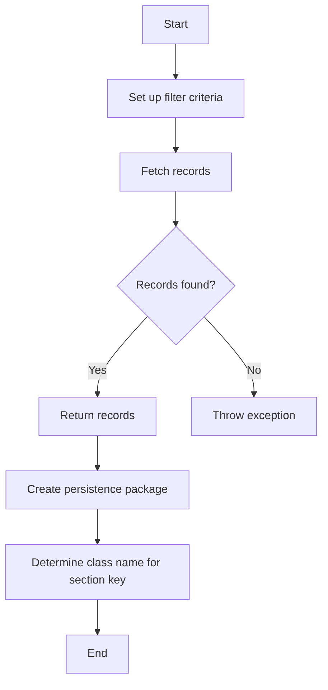

This document will cover the process of retrieving records in the Broadleaf Commerce framework. We'll cover:

1. Setting up filter criteria
2. Fetching records
3. Handling exceptions
4. Creating a persistence package
5. Determining the class name for a section key.

Technical document: <SwmLink doc-title="Retrieving Records Flow">[Retrieving Records Flow](/.swm/retrieving-records-flow.57990inn.sw.md)</SwmLink>

# [Setting up filter criteria](https://app.swimm.io/repos/Z2l0aHViJTNBJTNBQnJvYWRsZWFmQ29tbWVyY2UtZGVtby1uZXclM0ElM0FTd2ltbS1EZW1v/docs/57990inn#getrecord)

The process begins by setting up filter criteria based on the provided ID. This involves identifying the property that represents the ID within the class metadata and creating a filter criterion that matches this ID. This filter criterion is then added to the request, ensuring that only records matching the specified ID are retrieved.

# [Fetching records](https://app.swimm.io/repos/Z2l0aHViJTNBJTNBQnJvYWRsZWFmQ29tbWVyY2UtZGVtby1uZXclM0ElM0FTd2ltbS1EZW1v/docs/57990inn#getrecords)

Once the filter criteria are set up, the next step is to fetch the records. This is done by delegating the request to a method that interacts with the persistence layer. The method constructs a persistence package and a criteria transfer object based on the request parameters, and then calls the service to fetch the data.

# [Handling exceptions](https://app.swimm.io/repos/Z2l0aHViJTNBJTNBQnJvYWRsZWFmQ29tbWVyY2UtZGVtby1uZXclM0ElM0FTd2ltbS1EZW1v/docs/57990inn#getrecord)

If no records are found during the fetch operation, an exception is thrown. This ensures that the system can handle cases where the requested record does not exist, providing a clear error message indicating that the entity could not be found.

# [Creating a persistence package](https://app.swimm.io/repos/Z2l0aHViJTNBJTNBQnJvYWRsZWFmQ29tbWVyY2UtZGVtby1uZXclM0ElM0FTd2ltbS1EZW1v/docs/57990inn#create)

The persistence package is a crucial component in the retrieval process. It encapsulates all the necessary information for the persistence operations, including filter criteria, sorting options, and pagination settings. The package is created based on the request parameters, ensuring that all relevant data is included for the fetch operation.

# [Determining the class name for a section key](https://app.swimm.io/repos/Z2l0aHViJTNBJTNBQnJvYWRsZWFmQ29tbWVyY2UtZGVtby1uZXclM0ElM0FTd2ltbS1EZW1v/docs/57990inn#getclassnameforsection)

In some cases, it is necessary to determine the fully qualified class name for a given section key. This is done by using the admin navigation service to find the corresponding admin section and retrieve the ceiling entity class name. This class name is then used in the persistence operations to ensure that the correct entity type is being handled.

&nbsp;

*This is an auto-generated document by Swimm AI 🌊 and has not yet been verified by a human*

<SwmMeta version="3.0.0" repo-id="Z2l0aHViJTNBJTNBQnJvYWRsZWFmQ29tbWVyY2UtZGVtby1uZXclM0ElM0FTd2ltbS1EZW1v" repo-name="BroadleafCommerce-demo-new" doc-type="product-flows">Powered by [Swimm](/)</SwmMeta>
