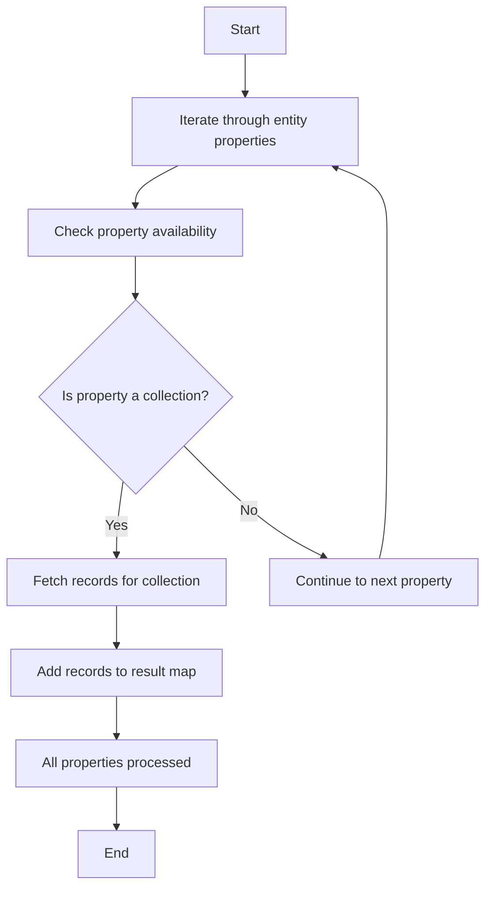

This document will cover the process of retrieving all records for sub-collections of a given entity. We'll cover:

1. Iterating through entity properties
2. Checking property availability
3. Fetching records for collections
4. Organizing the results.

Technical document: <SwmLink doc-title="Retrieving All Records for Sub-Collections">[Retrieving All Records for Sub-Collections](/.swm/retrieving-all-records-for-sub-collections.1ov4m6ro.sw.md)</SwmLink>

# [Iterating through entity properties](https://app.swimm.io/repos/Z2l0aHViJTNBJTNBQnJvYWRsZWFmQ29tbWVyY2UtZGVtby1uZXclM0ElM0FTd2ltbS1EZW1v/docs/1ov4m6ro#flow-drill-down)

The process begins by iterating through the properties of the given entity's metadata. This step ensures that each property of the entity is examined to determine if it contains a sub-collection that needs to be retrieved.

# [Checking property availability](https://app.swimm.io/repos/Z2l0aHViJTNBJTNBQnJvYWRsZWFmQ29tbWVyY2UtZGVtby1uZXclM0ElM0FTd2ltbS1EZW1v/docs/1ov4m6ro#flow-drill-down)

For each property, we check if it is available to the entity type. This means verifying if the property is relevant to the current entity. For example, if the entity type is 'Product', we check if the property is applicable to 'Product'.

# [Fetching records for collections](https://app.swimm.io/repos/Z2l0aHViJTNBJTNBQnJvYWRsZWFmQ29tbWVyY2UtZGVtby1uZXclM0ElM0FTd2ltbS1EZW1v/docs/1ov4m6ro#flow-drill-down)

If the property is a collection, we proceed to fetch the records for that collection. This involves retrieving all the items within the collection, ensuring that we gather all relevant data. For instance, if the property is a list of 'Product Reviews', we fetch all reviews associated with the product.

# [Organizing the results](https://app.swimm.io/repos/Z2l0aHViJTNBJTNBQnJvYWRsZWFmQ29tbWVyY2UtZGVtby1uZXclM0ElM0FTd2ltbS1EZW1v/docs/1ov4m6ro#flow-drill-down)

After fetching the records for each collection, we add them to a result map. This map organizes the records by property name, making it easy to access all sub-collection records for the given entity. For example, the result map might have entries for 'Product Reviews', 'Product Images', etc., each containing the respective records.

&nbsp;

*This is an auto-generated document by Swimm AI 🌊 and has not yet been verified by a human*

<SwmMeta version="3.0.0" repo-id="Z2l0aHViJTNBJTNBQnJvYWRsZWFmQ29tbWVyY2UtZGVtby1uZXclM0ElM0FTd2ltbS1EZW1v" repo-name="BroadleafCommerce-demo-new" doc-type="product-flows">Powered by [Swimm](/)</SwmMeta>
