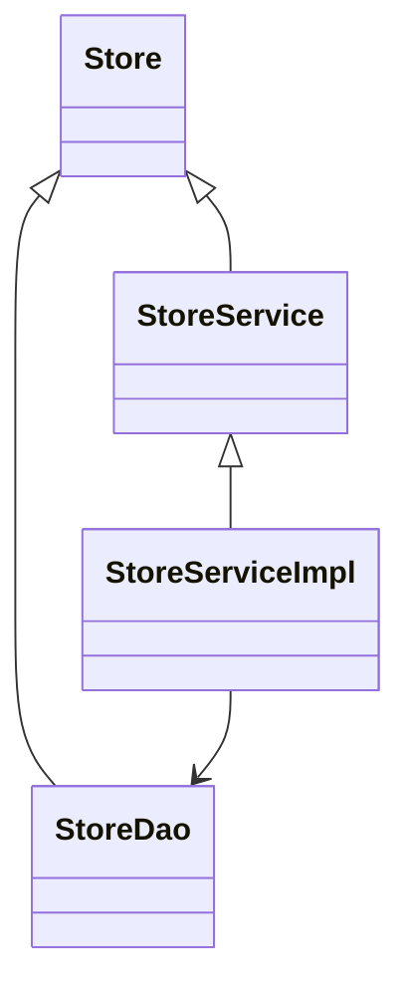

<SwmSnippet path="/core/broadleaf-framework/src/main/java/org/broadleafcommerce/core/store/domain/Store.java" line="25">

---

# Store Interface

The <SwmToken path="core/broadleaf-framework/src/main/java/org/broadleafcommerce/core/store/domain/Store.java" pos="25:4:4" line-data="public interface Store extends Status, Serializable{">`Store`</SwmToken> interface represents a physical or online store within the Broadleaf Commerce framework. It extends the <SwmToken path="core/broadleaf-framework/src/main/java/org/broadleafcommerce/core/store/domain/Store.java" pos="25:8:8" line-data="public interface Store extends Status, Serializable{">`Status`</SwmToken> and <SwmToken path="core/broadleaf-framework/src/main/java/org/broadleafcommerce/core/store/domain/Store.java" pos="25:11:11" line-data="public interface Store extends Status, Serializable{">`Serializable`</SwmToken> interfaces, indicating that it includes status information and can be serialized. The interface defines methods for accessing and modifying store-related information, such as <SwmToken path="core/broadleaf-framework/src/main/java/org/broadleafcommerce/core/store/domain/Store.java" pos="27:5:5" line-data="    public Long getId();">`getId`</SwmToken>, <SwmToken path="core/broadleaf-framework/src/main/java/org/broadleafcommerce/core/store/domain/Store.java" pos="30:5:5" line-data="    public String getName();">`getName`</SwmToken>, <SwmToken path="core/broadleaf-framework/src/main/java/org/broadleafcommerce/core/store/domain/Store.java" pos="33:5:5" line-data="    public String getStoreNumber();">`getStoreNumber`</SwmToken>, <SwmToken path="core/broadleaf-framework/src/main/java/org/broadleafcommerce/core/store/domain/Store.java" pos="36:5:5" line-data="    public Boolean getOpen();">`getOpen`</SwmToken>, <SwmToken path="core/broadleaf-framework/src/main/java/org/broadleafcommerce/core/store/domain/Store.java" pos="39:5:5" line-data="    public String getStoreHours();">`getStoreHours`</SwmToken>, <SwmToken path="core/broadleaf-framework/src/main/java/org/broadleafcommerce/core/store/domain/Store.java" pos="42:5:5" line-data="    public Address getAddress();">`getAddress`</SwmToken>, <SwmToken path="core/broadleaf-framework/src/main/java/org/broadleafcommerce/core/store/domain/Store.java" pos="45:5:5" line-data="    public Double getLongitude();">`getLongitude`</SwmToken>, and <SwmToken path="core/broadleaf-framework/src/main/java/org/broadleafcommerce/core/store/domain/Store.java" pos="48:5:5" line-data="    public Double getLatitude();">`getLatitude`</SwmToken>.

```java
public interface Store extends Status, Serializable{

    public Long getId();
    public void setId(Long id);

    public String getName();
    public void setName(String name);

    public String getStoreNumber();
    public void setStoreNumber(String storeNumber);

    public Boolean getOpen();
    public void setOpen(Boolean open);

    public String getStoreHours();
    public void setStoreHours(String storeHours);
    
    public Address getAddress();
    public void setAddress(Address address);
    
    public Double getLongitude();
```

---

</SwmSnippet>

<SwmSnippet path="/core/broadleaf-framework/src/main/java/org/broadleafcommerce/core/store/service/StoreService.java" line="26">

---

# <SwmToken path="core/broadleaf-framework/src/main/java/org/broadleafcommerce/core/store/service/StoreService.java" pos="26:4:4" line-data="public interface StoreService {">`StoreService`</SwmToken> Interface

The <SwmToken path="core/broadleaf-framework/src/main/java/org/broadleafcommerce/core/store/service/StoreService.java" pos="26:4:4" line-data="public interface StoreService {">`StoreService`</SwmToken> interface provides methods for interacting with <SwmToken path="core/broadleaf-framework/src/main/java/org/broadleafcommerce/core/store/service/StoreService.java" pos="28:3:3" line-data="    public Store readStoreById(Long id);">`Store`</SwmToken> entities. It includes methods for reading stores by ID or name, saving stores, finding stores by address, and retrieving all stores or stores by state.

```java
public interface StoreService {

    public Store readStoreById(Long id);

    public Store readStoreByStoreName(String storeName);

    /**
     * @deprecated use {@link #readStoreByStoreName(String)} instead.
     *
     * @param storeCode
     * @return
     */
    @Deprecated
    public Store readStoreByStoreCode(String storeCode);

    public Store saveStore(Store store);

    public Map<Store,Double> findStoresByAddress(Address searchAddress, double distance);

    public List<Store> readAllStores();
```

---

</SwmSnippet>

<SwmSnippet path="/core/broadleaf-framework/src/main/java/org/broadleafcommerce/core/store/service/StoreServiceImpl.java" line="33">

---

# <SwmToken path="core/broadleaf-framework/src/main/java/org/broadleafcommerce/core/store/service/StoreServiceImpl.java" pos="34:4:4" line-data="public class StoreServiceImpl implements StoreService {">`StoreServiceImpl`</SwmToken> Class

The <SwmToken path="core/broadleaf-framework/src/main/java/org/broadleafcommerce/core/store/service/StoreServiceImpl.java" pos="34:4:4" line-data="public class StoreServiceImpl implements StoreService {">`StoreServiceImpl`</SwmToken> class implements the <SwmToken path="core/broadleaf-framework/src/main/java/org/broadleafcommerce/core/store/service/StoreServiceImpl.java" pos="34:8:8" line-data="public class StoreServiceImpl implements StoreService {">`StoreService`</SwmToken> interface and provides the actual business logic for the methods defined in <SwmToken path="core/broadleaf-framework/src/main/java/org/broadleafcommerce/core/store/service/StoreServiceImpl.java" pos="34:8:8" line-data="public class StoreServiceImpl implements StoreService {">`StoreService`</SwmToken>. It uses the <SwmToken path="core/broadleaf-framework/src/main/java/org/broadleafcommerce/core/store/service/StoreServiceImpl.java" pos="38:3:3" line-data="    private StoreDao storeDao;">`StoreDao`</SwmToken> interface to interact with the database and perform CRUD operations on <SwmToken path="core/broadleaf-framework/src/main/java/org/broadleafcommerce/core/store/domain/Store.java" pos="25:4:4" line-data="public interface Store extends Status, Serializable{">`Store`</SwmToken> entities.

```java
@Service("blStoreService")
public class StoreServiceImpl implements StoreService {

    // private final static int MAXIMUM_DISTANCE = Integer.valueOf(25);
    @Resource(name = "blStoreDao")
    private StoreDao storeDao;
```

---

</SwmSnippet>

# Main Functions

There are several main functions in this folder. Some of them are <SwmToken path="core/broadleaf-framework/src/main/java/org/broadleafcommerce/core/store/service/StoreService.java" pos="28:5:5" line-data="    public Store readStoreById(Long id);">`readStoreById`</SwmToken>, <SwmToken path="core/broadleaf-framework/src/main/java/org/broadleafcommerce/core/store/service/StoreService.java" pos="30:5:5" line-data="    public Store readStoreByStoreName(String storeName);">`readStoreByStoreName`</SwmToken>, <SwmToken path="core/broadleaf-framework/src/main/java/org/broadleafcommerce/core/store/service/StoreService.java" pos="39:5:5" line-data="    public Store readStoreByStoreCode(String storeCode);">`readStoreByStoreCode`</SwmToken>, <SwmToken path="core/broadleaf-framework/src/main/java/org/broadleafcommerce/core/store/service/StoreService.java" pos="41:5:5" line-data="    public Store saveStore(Store store);">`saveStore`</SwmToken>, <SwmToken path="core/broadleaf-framework/src/main/java/org/broadleafcommerce/core/store/service/StoreService.java" pos="43:10:10" line-data="    public Map&lt;Store,Double&gt; findStoresByAddress(Address searchAddress, double distance);">`findStoresByAddress`</SwmToken>, <SwmToken path="core/broadleaf-framework/src/main/java/org/broadleafcommerce/core/store/service/StoreService.java" pos="45:8:8" line-data="    public List&lt;Store&gt; readAllStores();">`readAllStores`</SwmToken>, and <SwmToken path="core/broadleaf-framework/src/main/java/org/broadleafcommerce/core/store/service/StoreService.java" pos="47:8:8" line-data="    public List&lt;Store&gt; readAllStoresByState(String state);">`readAllStoresByState`</SwmToken>. We will dive a little into <SwmToken path="core/broadleaf-framework/src/main/java/org/broadleafcommerce/core/store/service/StoreService.java" pos="30:5:5" line-data="    public Store readStoreByStoreName(String storeName);">`readStoreByStoreName`</SwmToken> and <SwmToken path="core/broadleaf-framework/src/main/java/org/broadleafcommerce/core/store/service/StoreService.java" pos="43:10:10" line-data="    public Map&lt;Store,Double&gt; findStoresByAddress(Address searchAddress, double distance);">`findStoresByAddress`</SwmToken>.

<SwmSnippet path="/core/broadleaf-framework/src/main/java/org/broadleafcommerce/core/store/service/StoreService.java" line="30">

---

## <SwmToken path="core/broadleaf-framework/src/main/java/org/broadleafcommerce/core/store/service/StoreService.java" pos="30:5:5" line-data="    public Store readStoreByStoreName(String storeName);">`readStoreByStoreName`</SwmToken>

The <SwmToken path="core/broadleaf-framework/src/main/java/org/broadleafcommerce/core/store/service/StoreService.java" pos="30:5:5" line-data="    public Store readStoreByStoreName(String storeName);">`readStoreByStoreName`</SwmToken> function retrieves a store entity based on its name. This function is essential for operations that require store identification by name rather than ID.

```java
    public Store readStoreByStoreName(String storeName);
```

---

</SwmSnippet>

<SwmSnippet path="/core/broadleaf-framework/src/main/java/org/broadleafcommerce/core/store/service/StoreService.java" line="43">

---

## <SwmToken path="core/broadleaf-framework/src/main/java/org/broadleafcommerce/core/store/service/StoreService.java" pos="43:10:10" line-data="    public Map&lt;Store,Double&gt; findStoresByAddress(Address searchAddress, double distance);">`findStoresByAddress`</SwmToken>

The <SwmToken path="core/broadleaf-framework/src/main/java/org/broadleafcommerce/core/store/service/StoreService.java" pos="43:10:10" line-data="    public Map&lt;Store,Double&gt; findStoresByAddress(Address searchAddress, double distance);">`findStoresByAddress`</SwmToken> function finds stores within a certain distance from a given address. This function is crucial for location-based store searches and helps in identifying nearby stores.

```java
    public Map<Store,Double> findStoresByAddress(Address searchAddress, double distance);
```

---

</SwmSnippet>

&nbsp;

*This is an auto-generated document by Swimm AI 🌊 and has not yet been verified by a human*

<SwmMeta version="3.0.0" repo-id="Z2l0aHViJTNBJTNBQnJvYWRsZWFmQ29tbWVyY2UtZGVtby1uZXclM0ElM0FTd2ltbS1EZW1v" repo-name="BroadleafCommerce-demo-new" doc-type="overview"><sup>Powered by [Swimm](/)</sup></SwmMeta>
