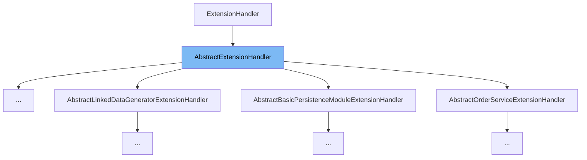

This document will cover the class <SwmToken path="common/src/main/java/org/broadleafcommerce/common/web/payment/processor/AbstractTRCreditCardExtensionHandler.java" pos="42:10:10" line-data="public abstract class AbstractTRCreditCardExtensionHandler extends AbstractExtensionHandler">`AbstractExtensionHandler`</SwmToken>. We will explain:

1. What <SwmToken path="common/src/main/java/org/broadleafcommerce/common/web/payment/processor/AbstractTRCreditCardExtensionHandler.java" pos="42:10:10" line-data="public abstract class AbstractTRCreditCardExtensionHandler extends AbstractExtensionHandler">`AbstractExtensionHandler`</SwmToken> is.
2. The variables and functions defined in <SwmToken path="common/src/main/java/org/broadleafcommerce/common/web/payment/processor/AbstractTRCreditCardExtensionHandler.java" pos="42:10:10" line-data="public abstract class AbstractTRCreditCardExtensionHandler extends AbstractExtensionHandler">`AbstractExtensionHandler`</SwmToken>.
3. An example of how to use <SwmToken path="common/src/main/java/org/broadleafcommerce/common/web/payment/processor/AbstractTRCreditCardExtensionHandler.java" pos="42:10:10" line-data="public abstract class AbstractTRCreditCardExtensionHandler extends AbstractExtensionHandler">`AbstractExtensionHandler`</SwmToken> in <SwmToken path="common/src/main/java/org/broadleafcommerce/common/web/payment/processor/AbstractTRCreditCardExtensionHandler.java" pos="42:6:6" line-data="public abstract class AbstractTRCreditCardExtensionHandler extends AbstractExtensionHandler">`AbstractTRCreditCardExtensionHandler`</SwmToken>.



# What is <SwmToken path="common/src/main/java/org/broadleafcommerce/common/web/payment/processor/AbstractTRCreditCardExtensionHandler.java" pos="42:10:10" line-data="public abstract class AbstractTRCreditCardExtensionHandler extends AbstractExtensionHandler">`AbstractExtensionHandler`</SwmToken>

<SwmToken path="common/src/main/java/org/broadleafcommerce/common/web/payment/processor/AbstractTRCreditCardExtensionHandler.java" pos="42:10:10" line-data="public abstract class AbstractTRCreditCardExtensionHandler extends AbstractExtensionHandler">`AbstractExtensionHandler`</SwmToken> is an abstract class that provides basic properties and methods for extension handlers in the Broadleaf Commerce framework. It includes properties for setting the priority of the handler, which determines the execution order, and a flag to enable or disable the handler.

<SwmSnippet path="/common/src/main/java/org/broadleafcommerce/common/extension/AbstractExtensionHandler.java" line="31">

---

# Variables and functions

The variable <SwmToken path="common/src/main/java/org/broadleafcommerce/common/extension/AbstractExtensionHandler.java" pos="31:5:5" line-data="    protected int priority;">`priority`</SwmToken> is used to store the priority of the extension handler. It determines the execution order of handlers.

```java
    protected int priority;
```

---

</SwmSnippet>

<SwmSnippet path="/common/src/main/java/org/broadleafcommerce/common/extension/AbstractExtensionHandler.java" line="32">

---

The variable <SwmToken path="common/src/main/java/org/broadleafcommerce/common/extension/AbstractExtensionHandler.java" pos="32:5:5" line-data="    protected boolean enabled = true;">`enabled`</SwmToken> is a boolean flag that indicates whether the handler is enabled or not. By default, it is set to `true`.

```java
    protected boolean enabled = true;
```

---

</SwmSnippet>

<SwmSnippet path="/common/src/main/java/org/broadleafcommerce/common/extension/AbstractExtensionHandler.java" line="38">

---

The function <SwmToken path="common/src/main/java/org/broadleafcommerce/common/extension/AbstractExtensionHandler.java" pos="39:5:5" line-data="    public int getPriority() {">`getPriority`</SwmToken> returns the priority of the extension handler.

```java
    @Override
    public int getPriority() {
        return priority;
    }
```

---

</SwmSnippet>

<SwmSnippet path="/common/src/main/java/org/broadleafcommerce/common/extension/AbstractExtensionHandler.java" line="43">

---

The function <SwmToken path="common/src/main/java/org/broadleafcommerce/common/extension/AbstractExtensionHandler.java" pos="43:5:5" line-data="    public void setPriority(int priority) {">`setPriority`</SwmToken> sets the priority of the extension handler.

```java
    public void setPriority(int priority) {
        this.priority = priority;
    }
```

---

</SwmSnippet>

<SwmSnippet path="/common/src/main/java/org/broadleafcommerce/common/extension/AbstractExtensionHandler.java" line="48">

---

The function <SwmToken path="common/src/main/java/org/broadleafcommerce/common/extension/AbstractExtensionHandler.java" pos="48:5:5" line-data="    public boolean isEnabled() {">`isEnabled`</SwmToken> returns the enabled status of the extension handler.

```java
    public boolean isEnabled() {
        return enabled;
    }
```

---

</SwmSnippet>

<SwmSnippet path="/common/src/main/java/org/broadleafcommerce/common/extension/AbstractExtensionHandler.java" line="52">

---

The function <SwmToken path="common/src/main/java/org/broadleafcommerce/common/extension/AbstractExtensionHandler.java" pos="52:5:5" line-data="    public void setEnabled(boolean enabled) {">`setEnabled`</SwmToken> sets the enabled status of the extension handler.

```java
    public void setEnabled(boolean enabled) {
        this.enabled = enabled;
    }
```

---

</SwmSnippet>

# Usage example

Here is an example of how to use <SwmToken path="common/src/main/java/org/broadleafcommerce/common/web/payment/processor/AbstractTRCreditCardExtensionHandler.java" pos="42:10:10" line-data="public abstract class AbstractTRCreditCardExtensionHandler extends AbstractExtensionHandler">`AbstractExtensionHandler`</SwmToken> in the <SwmToken path="common/src/main/java/org/broadleafcommerce/common/web/payment/processor/AbstractTRCreditCardExtensionHandler.java" pos="42:6:6" line-data="public abstract class AbstractTRCreditCardExtensionHandler extends AbstractExtensionHandler">`AbstractTRCreditCardExtensionHandler`</SwmToken> class.

<SwmSnippet path="/common/src/main/java/org/broadleafcommerce/common/web/payment/processor/AbstractTRCreditCardExtensionHandler.java" line="42">

---

The <SwmToken path="common/src/main/java/org/broadleafcommerce/common/web/payment/processor/AbstractTRCreditCardExtensionHandler.java" pos="42:6:6" line-data="public abstract class AbstractTRCreditCardExtensionHandler extends AbstractExtensionHandler">`AbstractTRCreditCardExtensionHandler`</SwmToken> class extends <SwmToken path="common/src/main/java/org/broadleafcommerce/common/web/payment/processor/AbstractTRCreditCardExtensionHandler.java" pos="42:10:10" line-data="public abstract class AbstractTRCreditCardExtensionHandler extends AbstractExtensionHandler">`AbstractExtensionHandler`</SwmToken> and implements the <SwmToken path="common/src/main/java/org/broadleafcommerce/common/web/payment/processor/AbstractTRCreditCardExtensionHandler.java" pos="43:3:3" line-data="        implements TRCreditCardExtensionHandler {">`TRCreditCardExtensionHandler`</SwmToken> interface.

```java
public abstract class AbstractTRCreditCardExtensionHandler extends AbstractExtensionHandler
        implements TRCreditCardExtensionHandler {
```

---

</SwmSnippet>

&nbsp;

*This is an auto-generated document by Swimm AI 🌊 and has not yet been verified by a human*

<SwmMeta version="3.0.0" repo-id="Z2l0aHViJTNBJTNBQnJvYWRsZWFmQ29tbWVyY2UtZGVtby1uZXclM0ElM0FTd2ltbS1EZW1v" repo-name="BroadleafCommerce-demo-new" doc-type="general-class"><sup>Powered by [Swimm](/)</sup></SwmMeta>
