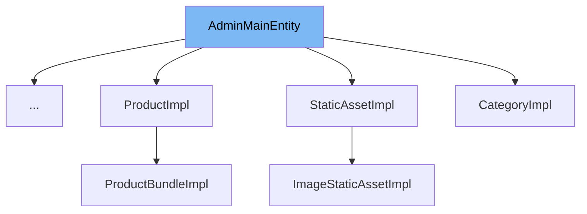

This document will cover the <SwmToken path="common/src/main/java/org/broadleafcommerce/common/sandbox/domain/SandBoxImpl.java" pos="65:11:11" line-data="public class SandBoxImpl implements SandBox, AdminMainEntity {">`AdminMainEntity`</SwmToken> class. We will cover:

1. What <SwmToken path="common/src/main/java/org/broadleafcommerce/common/sandbox/domain/SandBoxImpl.java" pos="65:11:11" line-data="public class SandBoxImpl implements SandBox, AdminMainEntity {">`AdminMainEntity`</SwmToken> is.
2. Main variables and functions.
3. Example of how to use <SwmToken path="common/src/main/java/org/broadleafcommerce/common/sandbox/domain/SandBoxImpl.java" pos="65:11:11" line-data="public class SandBoxImpl implements SandBox, AdminMainEntity {">`AdminMainEntity`</SwmToken> in <SwmToken path="common/src/main/java/org/broadleafcommerce/common/sandbox/domain/SandBoxImpl.java" pos="65:4:4" line-data="public class SandBoxImpl implements SandBox, AdminMainEntity {">`SandBoxImpl`</SwmToken>.



# What is <SwmToken path="common/src/main/java/org/broadleafcommerce/common/sandbox/domain/SandBoxImpl.java" pos="65:11:11" line-data="public class SandBoxImpl implements SandBox, AdminMainEntity {">`AdminMainEntity`</SwmToken>

<SwmToken path="common/src/main/java/org/broadleafcommerce/common/sandbox/domain/SandBoxImpl.java" pos="65:11:11" line-data="public class SandBoxImpl implements SandBox, AdminMainEntity {">`AdminMainEntity`</SwmToken> is an interface in the <SwmToken path="common/src/main/java/org/broadleafcommerce/common/admin/domain/AdminMainEntity.java" pos="3:5:5" line-data=" * BroadleafCommerce Common Libraries">`Common`</SwmToken> module of the Broadleaf Commerce framework. It is used to define entities that will be displayed in the admin interface. The primary purpose of this interface is to provide a method, <SwmToken path="common/src/main/java/org/broadleafcommerce/common/admin/domain/AdminMainEntity.java" pos="33:5:5" line-data="    public String getMainEntityName();">`getMainEntityName`</SwmToken>, which returns the display name of the entity for the admin screen.

<SwmSnippet path="/common/src/main/java/org/broadleafcommerce/common/admin/domain/AdminMainEntity.java" line="28">

---

# Variables and functions

The constant <SwmToken path="common/src/main/java/org/broadleafcommerce/common/admin/domain/AdminMainEntity.java" pos="28:9:9" line-data="    public static final String MAIN_ENTITY_NAME_PROPERTY = &quot;__adminMainEntity&quot;;">`MAIN_ENTITY_NAME_PROPERTY`</SwmToken> is used to store the property name for the main entity name. It is a static final string with the value <SwmToken path="common/src/main/java/org/broadleafcommerce/common/admin/domain/AdminMainEntity.java" pos="28:14:14" line-data="    public static final String MAIN_ENTITY_NAME_PROPERTY = &quot;__adminMainEntity&quot;;">`__adminMainEntity`</SwmToken>.

```java
    public static final String MAIN_ENTITY_NAME_PROPERTY = "__adminMainEntity";
```

---

</SwmSnippet>

<SwmSnippet path="/common/src/main/java/org/broadleafcommerce/common/admin/domain/AdminMainEntity.java" line="30">

---

The method <SwmToken path="common/src/main/java/org/broadleafcommerce/common/admin/domain/AdminMainEntity.java" pos="33:5:5" line-data="    public String getMainEntityName();">`getMainEntityName`</SwmToken> is used to return the display name of the entity for the admin screen. This method is abstract and must be implemented by any class that implements the <SwmToken path="common/src/main/java/org/broadleafcommerce/common/sandbox/domain/SandBoxImpl.java" pos="65:11:11" line-data="public class SandBoxImpl implements SandBox, AdminMainEntity {">`AdminMainEntity`</SwmToken> interface.

```java
    /**
     * @return the display name of this entity for the admin screen
     */
    public String getMainEntityName();
```

---

</SwmSnippet>

# Usage example

Here is an example of how to use <SwmToken path="common/src/main/java/org/broadleafcommerce/common/sandbox/domain/SandBoxImpl.java" pos="65:11:11" line-data="public class SandBoxImpl implements SandBox, AdminMainEntity {">`AdminMainEntity`</SwmToken> in the <SwmToken path="common/src/main/java/org/broadleafcommerce/common/sandbox/domain/SandBoxImpl.java" pos="65:4:4" line-data="public class SandBoxImpl implements SandBox, AdminMainEntity {">`SandBoxImpl`</SwmToken> class.

<SwmSnippet path="/common/src/main/java/org/broadleafcommerce/common/sandbox/domain/SandBoxImpl.java" line="64">

---

The <SwmToken path="common/src/main/java/org/broadleafcommerce/common/sandbox/domain/SandBoxImpl.java" pos="65:4:4" line-data="public class SandBoxImpl implements SandBox, AdminMainEntity {">`SandBoxImpl`</SwmToken> class implements the <SwmToken path="common/src/main/java/org/broadleafcommerce/common/sandbox/domain/SandBoxImpl.java" pos="65:11:11" line-data="public class SandBoxImpl implements SandBox, AdminMainEntity {">`AdminMainEntity`</SwmToken> interface. This means that it must provide an implementation for the <SwmToken path="common/src/main/java/org/broadleafcommerce/common/admin/domain/AdminMainEntity.java" pos="33:5:5" line-data="    public String getMainEntityName();">`getMainEntityName`</SwmToken> method.

```java
})
public class SandBoxImpl implements SandBox, AdminMainEntity {
```

---

</SwmSnippet>

&nbsp;

*This is an auto-generated document by Swimm AI 🌊 and has not yet been verified by a human*

<SwmMeta version="3.0.0" repo-id="Z2l0aHViJTNBJTNBQnJvYWRsZWFmQ29tbWVyY2UtZGVtby1uZXclM0ElM0FTd2ltbS1EZW1v" repo-name="BroadleafCommerce-demo-new" doc-type="general-class"><sup>Powered by [Swimm](/)</sup></SwmMeta>
