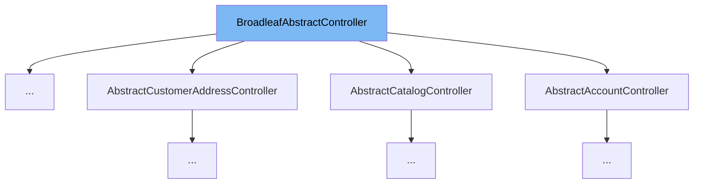

This document will cover the class <SwmToken path="admin/broadleaf-open-admin-platform/src/main/java/org/broadleafcommerce/openadmin/web/controller/AdminLoginController.java" pos="59:8:8" line-data="public class AdminLoginController extends BroadleafAbstractController {">`BroadleafAbstractController`</SwmToken>. We will cover:

1. What <SwmToken path="admin/broadleaf-open-admin-platform/src/main/java/org/broadleafcommerce/openadmin/web/controller/AdminLoginController.java" pos="59:8:8" line-data="public class AdminLoginController extends BroadleafAbstractController {">`BroadleafAbstractController`</SwmToken> is.
2. Main variables and functions in <SwmToken path="admin/broadleaf-open-admin-platform/src/main/java/org/broadleafcommerce/openadmin/web/controller/AdminLoginController.java" pos="59:8:8" line-data="public class AdminLoginController extends BroadleafAbstractController {">`BroadleafAbstractController`</SwmToken>.
3. Example of how to use <SwmToken path="admin/broadleaf-open-admin-platform/src/main/java/org/broadleafcommerce/openadmin/web/controller/AdminLoginController.java" pos="59:8:8" line-data="public class AdminLoginController extends BroadleafAbstractController {">`BroadleafAbstractController`</SwmToken> in <SwmToken path="admin/broadleaf-open-admin-platform/src/main/java/org/broadleafcommerce/openadmin/web/controller/AdminLoginController.java" pos="59:4:4" line-data="public class AdminLoginController extends BroadleafAbstractController {">`AdminLoginController`</SwmToken>.



# What is <SwmToken path="admin/broadleaf-open-admin-platform/src/main/java/org/broadleafcommerce/openadmin/web/controller/AdminLoginController.java" pos="59:8:8" line-data="public class AdminLoginController extends BroadleafAbstractController {">`BroadleafAbstractController`</SwmToken>

<SwmToken path="admin/broadleaf-open-admin-platform/src/main/java/org/broadleafcommerce/openadmin/web/controller/AdminLoginController.java" pos="59:8:8" line-data="public class AdminLoginController extends BroadleafAbstractController {">`BroadleafAbstractController`</SwmToken> is an abstract controller that provides convenience methods and resource declarations for its children. It is designed to handle operations that are shared between all controllers in the Broadleaf Commerce framework. By using this abstract class, developers can ensure that common functionalities are centralized and reused across different controllers.

<SwmSnippet path="/common/src/main/java/org/broadleafcommerce/common/web/controller/BroadleafAbstractController.java" line="51">

---

# Variables and functions

The function <SwmToken path="common/src/main/java/org/broadleafcommerce/common/web/controller/BroadleafAbstractController.java" pos="57:5:5" line-data="    protected boolean isAjaxRequest(HttpServletRequest request) {">`isAjaxRequest`</SwmToken> is a helper method that returns whether or not the given request was invoked via an AJAX call. It uses <SwmToken path="common/src/main/java/org/broadleafcommerce/common/web/controller/BroadleafAbstractController.java" pos="58:3:5" line-data="        return BroadleafControllerUtility.isAjaxRequest(request);       ">`BroadleafControllerUtility.isAjaxRequest`</SwmToken> to determine this.

```java
    /**
     * A helper method that returns whether or not the given request was invoked via an AJAX call
     * 
     * @param request
     * @return - whether or not it was an AJAX request
     */
    protected boolean isAjaxRequest(HttpServletRequest request) {
        return BroadleafControllerUtility.isAjaxRequest(request);       
    }
```

---

</SwmSnippet>

<SwmSnippet path="/common/src/main/java/org/broadleafcommerce/common/web/controller/BroadleafAbstractController.java" line="61">

---

The function <SwmToken path="common/src/main/java/org/broadleafcommerce/common/web/controller/BroadleafAbstractController.java" pos="69:5:5" line-data="    protected String getContextPath(HttpServletRequest request) {">`getContextPath`</SwmToken> returns the current servlet context path. If the application is deployed as root, it returns "/". Otherwise, it returns the context path with a leading slash but without a trailing slash.

```java
    /**
     * Returns the current servlet context path. This will return a "/" if the application is
     * deployed as root. If it's not deployed as root, it will return the context path BOTH a 
     * leading slash but without a trailing slash.
     * 
     * @param request
     * @return the context path
     */
    protected String getContextPath(HttpServletRequest request) {
        String ctxPath = request.getContextPath();
        if (StringUtils.isBlank(ctxPath)) {
            return "/";
        } else {
            if (ctxPath.charAt(0) != '/') {
                ctxPath = '/' + ctxPath;
            }
            if (ctxPath.charAt(ctxPath.length() - 1) != '/') {
                ctxPath = ctxPath + '/';
            }
            
            return ctxPath;
```

---

</SwmSnippet>

<SwmSnippet path="/common/src/main/java/org/broadleafcommerce/common/web/controller/BroadleafAbstractController.java" line="86">

---

The function <SwmToken path="common/src/main/java/org/broadleafcommerce/common/web/controller/BroadleafAbstractController.java" pos="86:9:9" line-data="    protected &lt;T&gt; void addDeepLink(ModelAndView model, DeepLinkService&lt;T&gt; service, T item) {">`addDeepLink`</SwmToken> adds deep links to the model if the <SwmToken path="common/src/main/java/org/broadleafcommerce/common/web/controller/BroadleafAbstractController.java" pos="86:16:16" line-data="    protected &lt;T&gt; void addDeepLink(ModelAndView model, DeepLinkService&lt;T&gt; service, T item) {">`DeepLinkService`</SwmToken> is not null and the <SwmToken path="common/src/main/java/org/broadleafcommerce/common/web/controller/BroadleafAbstractController.java" pos="91:1:1" line-data="        BroadleafRequestContext brc = BroadleafRequestContext.getBroadleafRequestContext();">`BroadleafRequestContext`</SwmToken> has a sandbox. It adds either a single deep link or a list of deep links to the model.

```java
    protected <T> void addDeepLink(ModelAndView model, DeepLinkService<T> service, T item) {
        if (service == null) {
            return;
        }

        BroadleafRequestContext brc = BroadleafRequestContext.getBroadleafRequestContext();
        if (brc.getSandBox() != null) {
            List<DeepLink> links = service.getLinks(item);
            if (links.size() == 1) {
                model.addObject("adminDeepLink", links.get(0));
            } else {
                model.addObject("adminDeepLink", links);
            }
        }
    }
```

---

</SwmSnippet>

<SwmSnippet path="/common/src/main/java/org/broadleafcommerce/common/web/controller/BroadleafAbstractController.java" line="102">

---

The function <SwmToken path="common/src/main/java/org/broadleafcommerce/common/web/controller/BroadleafAbstractController.java" pos="115:5:5" line-data="    protected String jsonResponse(HttpServletResponse response, Map&lt;?, ?&gt; responseMap) ">`jsonResponse`</SwmToken> sets the appropriate headers and serializes the given map to JSON. It is used when the error state for a controller action should return JSON instead of a fully rendered template.

```java
    /**
     * Typically, controller methods are set to return a String that points to the necessary template path.
     * 
     * However, there may be occasions where the error state for a controller action should instead return
     * JSON instead of a fully rendered template. This convenience method will achieve that by setting the
     * appropriate headers and serializing the given map.
     * 
     * @param response
     * @param responseMap
     * @throws JsonGenerationException
     * @throws JsonMappingException
     * @throws IOException
     */
    protected String jsonResponse(HttpServletResponse response, Map<?, ?> responseMap) 
            throws JsonGenerationException, JsonMappingException, IOException {
        response.setHeader("Content-Type", "application/json");
        new ObjectMapper().writeValue(response.getWriter(), responseMap);
        return null;
    }
```

---

</SwmSnippet>

# Usage example

Here is an example of how to use <SwmToken path="admin/broadleaf-open-admin-platform/src/main/java/org/broadleafcommerce/openadmin/web/controller/AdminLoginController.java" pos="59:8:8" line-data="public class AdminLoginController extends BroadleafAbstractController {">`BroadleafAbstractController`</SwmToken> in <SwmToken path="admin/broadleaf-open-admin-platform/src/main/java/org/broadleafcommerce/openadmin/web/controller/AdminLoginController.java" pos="59:4:4" line-data="public class AdminLoginController extends BroadleafAbstractController {">`AdminLoginController`</SwmToken>.

<SwmSnippet path="/admin/broadleaf-open-admin-platform/src/main/java/org/broadleafcommerce/openadmin/web/controller/AdminLoginController.java" line="58">

---

The <SwmToken path="admin/broadleaf-open-admin-platform/src/main/java/org/broadleafcommerce/openadmin/web/controller/AdminLoginController.java" pos="59:4:4" line-data="public class AdminLoginController extends BroadleafAbstractController {">`AdminLoginController`</SwmToken> extends <SwmToken path="admin/broadleaf-open-admin-platform/src/main/java/org/broadleafcommerce/openadmin/web/controller/AdminLoginController.java" pos="59:8:8" line-data="public class AdminLoginController extends BroadleafAbstractController {">`BroadleafAbstractController`</SwmToken>. This allows it to use the convenience methods provided by <SwmToken path="admin/broadleaf-open-admin-platform/src/main/java/org/broadleafcommerce/openadmin/web/controller/AdminLoginController.java" pos="59:8:8" line-data="public class AdminLoginController extends BroadleafAbstractController {">`BroadleafAbstractController`</SwmToken>.

```java
@Controller("blAdminLoginController")
public class AdminLoginController extends BroadleafAbstractController {
```

---

</SwmSnippet>

&nbsp;

*This is an auto-generated document by Swimm AI 🌊 and has not yet been verified by a human*

<SwmMeta version="3.0.0" repo-id="Z2l0aHViJTNBJTNBQnJvYWRsZWFmQ29tbWVyY2UtZGVtby1uZXclM0ElM0FTd2ltbS1EZW1v" repo-name="BroadleafCommerce-demo-new" doc-type="general-class"><sup>Powered by [Swimm](/)</sup></SwmMeta>
