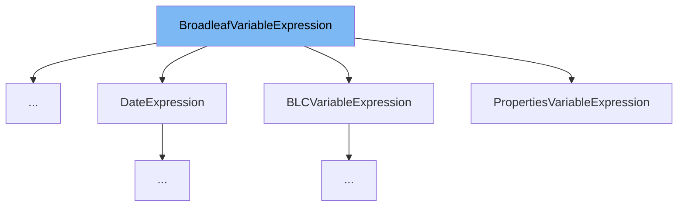

This document will cover the class <SwmToken path="common/src/main/java/org/broadleafcommerce/common/web/expression/BRCVariableExpression.java" pos="50:8:8" line-data="public class BRCVariableExpression implements BroadleafVariableExpression {">`BroadleafVariableExpression`</SwmToken>. We will cover:

1. What <SwmToken path="common/src/main/java/org/broadleafcommerce/common/web/expression/BRCVariableExpression.java" pos="50:8:8" line-data="public class BRCVariableExpression implements BroadleafVariableExpression {">`BroadleafVariableExpression`</SwmToken> is.
2. Variables and functions defined in <SwmToken path="common/src/main/java/org/broadleafcommerce/common/web/expression/BRCVariableExpression.java" pos="50:8:8" line-data="public class BRCVariableExpression implements BroadleafVariableExpression {">`BroadleafVariableExpression`</SwmToken>.
3. Usage example of <SwmToken path="common/src/main/java/org/broadleafcommerce/common/web/expression/BRCVariableExpression.java" pos="50:8:8" line-data="public class BRCVariableExpression implements BroadleafVariableExpression {">`BroadleafVariableExpression`</SwmToken> in <SwmToken path="common/src/main/java/org/broadleafcommerce/common/web/expression/BRCVariableExpression.java" pos="50:4:4" line-data="public class BRCVariableExpression implements BroadleafVariableExpression {">`BRCVariableExpression`</SwmToken>.



# What is <SwmToken path="common/src/main/java/org/broadleafcommerce/common/web/expression/BRCVariableExpression.java" pos="50:8:8" line-data="public class BRCVariableExpression implements BroadleafVariableExpression {">`BroadleafVariableExpression`</SwmToken>

<SwmToken path="common/src/main/java/org/broadleafcommerce/common/web/expression/BRCVariableExpression.java" pos="50:8:8" line-data="public class BRCVariableExpression implements BroadleafVariableExpression {">`BroadleafVariableExpression`</SwmToken> is an interface in the Broadleaf Commerce framework. It is used to expose classes to the Thymeleaf expression evaluation context. Implementing classes can define a name and methods that can be invoked within Thymeleaf templates using expressions like <SwmToken path="common/src/main/java/org/broadleafcommerce/common/web/expression/BroadleafVariableExpression.java" pos="23:13:24" line-data=" * could then be invoked by ${#theme.attr(&#39;someName&#39;)}.">`${#theme.attr('someName')}`</SwmToken>.

<SwmSnippet path="/common/src/main/java/org/broadleafcommerce/common/web/expression/BroadleafVariableExpression.java" line="29">

---

# Variables and functions

The function <SwmToken path="common/src/main/java/org/broadleafcommerce/common/web/expression/BroadleafVariableExpression.java" pos="29:5:5" line-data="    public String getName();">`getName`</SwmToken> is used to get the name of the implementing class. This name is used in Thymeleaf expressions to reference the class.

```java
    public String getName();
    
```

---

</SwmSnippet>

# Usage example

Here is an example of how to use <SwmToken path="common/src/main/java/org/broadleafcommerce/common/web/expression/BRCVariableExpression.java" pos="50:8:8" line-data="public class BRCVariableExpression implements BroadleafVariableExpression {">`BroadleafVariableExpression`</SwmToken> in <SwmToken path="common/src/main/java/org/broadleafcommerce/common/web/expression/BRCVariableExpression.java" pos="50:4:4" line-data="public class BRCVariableExpression implements BroadleafVariableExpression {">`BRCVariableExpression`</SwmToken>.

<SwmSnippet path="/common/src/main/java/org/broadleafcommerce/common/web/expression/BRCVariableExpression.java" line="49">

---

<SwmToken path="common/src/main/java/org/broadleafcommerce/common/web/expression/BRCVariableExpression.java" pos="50:4:4" line-data="public class BRCVariableExpression implements BroadleafVariableExpression {">`BRCVariableExpression`</SwmToken> implements <SwmToken path="common/src/main/java/org/broadleafcommerce/common/web/expression/BRCVariableExpression.java" pos="50:8:8" line-data="public class BRCVariableExpression implements BroadleafVariableExpression {">`BroadleafVariableExpression`</SwmToken> and is annotated with <SwmToken path="common/src/main/java/org/broadleafcommerce/common/web/expression/BRCVariableExpression.java" pos="49:0:1" line-data="@ConditionalOnTemplating">`@ConditionalOnTemplating`</SwmToken>, making it available for Thymeleaf templates.

```java
@ConditionalOnTemplating
public class BRCVariableExpression implements BroadleafVariableExpression {
```

---

</SwmSnippet>

&nbsp;

*This is an auto-generated document by Swimm AI 🌊 and has not yet been verified by a human*

<SwmMeta version="3.0.0" repo-id="Z2l0aHViJTNBJTNBQnJvYWRsZWFmQ29tbWVyY2UtZGVtby1uZXclM0ElM0FTd2ltbS1EZW1v" repo-name="BroadleafCommerce-demo-new" doc-type="general-class"><sup>Powered by [Swimm](/)</sup></SwmMeta>
