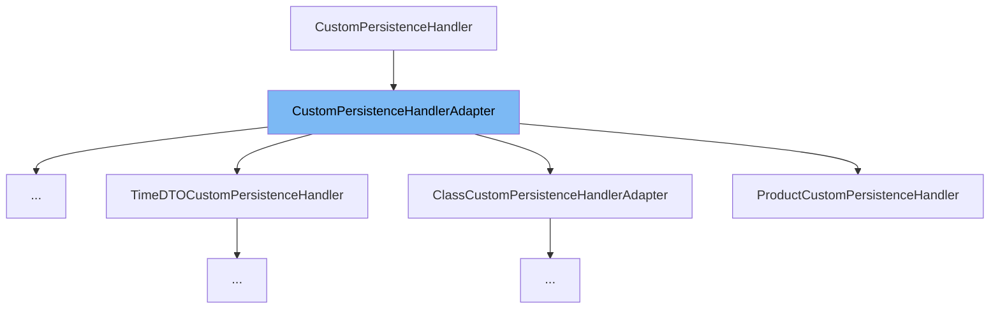

This document will cover the <SwmToken path="admin/broadleaf-open-admin-platform/src/main/java/org/broadleafcommerce/openadmin/server/service/handler/CustomPersistenceHandlerAdapter.java" pos="47:4:4" line-data="public class CustomPersistenceHandlerAdapter implements CustomPersistenceHandler {">`CustomPersistenceHandlerAdapter`</SwmToken> class. We will cover:

1. What <SwmToken path="admin/broadleaf-open-admin-platform/src/main/java/org/broadleafcommerce/openadmin/server/service/handler/CustomPersistenceHandlerAdapter.java" pos="47:4:4" line-data="public class CustomPersistenceHandlerAdapter implements CustomPersistenceHandler {">`CustomPersistenceHandlerAdapter`</SwmToken> is.
2. Main variables and functions.
3. Example of how to use <SwmToken path="admin/broadleaf-open-admin-platform/src/main/java/org/broadleafcommerce/openadmin/server/service/handler/CustomPersistenceHandlerAdapter.java" pos="47:4:4" line-data="public class CustomPersistenceHandlerAdapter implements CustomPersistenceHandler {">`CustomPersistenceHandlerAdapter`</SwmToken>.



# What is <SwmToken path="admin/broadleaf-open-admin-platform/src/main/java/org/broadleafcommerce/openadmin/server/service/handler/CustomPersistenceHandlerAdapter.java" pos="47:4:4" line-data="public class CustomPersistenceHandlerAdapter implements CustomPersistenceHandler {">`CustomPersistenceHandlerAdapter`</SwmToken>

<SwmToken path="admin/broadleaf-open-admin-platform/src/main/java/org/broadleafcommerce/openadmin/server/service/handler/CustomPersistenceHandlerAdapter.java" pos="47:4:4" line-data="public class CustomPersistenceHandlerAdapter implements CustomPersistenceHandler {">`CustomPersistenceHandlerAdapter`</SwmToken> is a convenience class for <SwmToken path="admin/broadleaf-open-admin-platform/src/main/java/org/broadleafcommerce/openadmin/server/service/handler/CustomPersistenceHandlerAdapter.java" pos="106:3:3" line-data="        return CustomPersistenceHandler.DEFAULT_ORDER;">`CustomPersistenceHandler`</SwmToken> implementations that do not wish to implement all the methods of the interface. It provides default implementations for all methods, returning `false` or throwing <SwmToken path="admin/broadleaf-open-admin-platform/src/main/java/org/broadleafcommerce/openadmin/server/service/handler/CustomPersistenceHandlerAdapter.java" pos="75:24:24" line-data="    public DynamicResultSet inspect(PersistencePackage persistencePackage, DynamicEntityDao dynamicEntityDao, InspectHelper helper) throws ServiceException {">`ServiceException`</SwmToken> where appropriate.

<SwmSnippet path="/admin/broadleaf-open-admin-platform/src/main/java/org/broadleafcommerce/openadmin/server/service/handler/CustomPersistenceHandlerAdapter.java" line="50">

---

# Variables and functions

The function <SwmToken path="admin/broadleaf-open-admin-platform/src/main/java/org/broadleafcommerce/openadmin/server/service/handler/CustomPersistenceHandlerAdapter.java" pos="50:5:5" line-data="    public Boolean canHandleInspect(PersistencePackage persistencePackage) {">`canHandleInspect`</SwmToken> determines if the handler can handle the inspect operation. It always returns `false`.

```java
    public Boolean canHandleInspect(PersistencePackage persistencePackage) {
        return false;
    }
```

---

</SwmSnippet>

<SwmSnippet path="/admin/broadleaf-open-admin-platform/src/main/java/org/broadleafcommerce/openadmin/server/service/handler/CustomPersistenceHandlerAdapter.java" line="55">

---

The function <SwmToken path="admin/broadleaf-open-admin-platform/src/main/java/org/broadleafcommerce/openadmin/server/service/handler/CustomPersistenceHandlerAdapter.java" pos="55:5:5" line-data="    public Boolean canHandleFetch(PersistencePackage persistencePackage) {">`canHandleFetch`</SwmToken> determines if the handler can handle the fetch operation. It always returns `false`.

```java
    public Boolean canHandleFetch(PersistencePackage persistencePackage) {
        return false;
    }
```

---

</SwmSnippet>

<SwmSnippet path="/admin/broadleaf-open-admin-platform/src/main/java/org/broadleafcommerce/openadmin/server/service/handler/CustomPersistenceHandlerAdapter.java" line="60">

---

The function <SwmToken path="admin/broadleaf-open-admin-platform/src/main/java/org/broadleafcommerce/openadmin/server/service/handler/CustomPersistenceHandlerAdapter.java" pos="60:5:5" line-data="    public Boolean canHandleAdd(PersistencePackage persistencePackage) {">`canHandleAdd`</SwmToken> determines if the handler can handle the add operation. It always returns `false`.

```java
    public Boolean canHandleAdd(PersistencePackage persistencePackage) {
        return false;
    }
```

---

</SwmSnippet>

<SwmSnippet path="/admin/broadleaf-open-admin-platform/src/main/java/org/broadleafcommerce/openadmin/server/service/handler/CustomPersistenceHandlerAdapter.java" line="65">

---

The function <SwmToken path="admin/broadleaf-open-admin-platform/src/main/java/org/broadleafcommerce/openadmin/server/service/handler/CustomPersistenceHandlerAdapter.java" pos="65:5:5" line-data="    public Boolean canHandleRemove(PersistencePackage persistencePackage) {">`canHandleRemove`</SwmToken> determines if the handler can handle the remove operation. It always returns `false`.

```java
    public Boolean canHandleRemove(PersistencePackage persistencePackage) {
        return false;
    }
```

---

</SwmSnippet>

<SwmSnippet path="/admin/broadleaf-open-admin-platform/src/main/java/org/broadleafcommerce/openadmin/server/service/handler/CustomPersistenceHandlerAdapter.java" line="70">

---

The function <SwmToken path="admin/broadleaf-open-admin-platform/src/main/java/org/broadleafcommerce/openadmin/server/service/handler/CustomPersistenceHandlerAdapter.java" pos="70:5:5" line-data="    public Boolean canHandleUpdate(PersistencePackage persistencePackage) {">`canHandleUpdate`</SwmToken> determines if the handler can handle the update operation. It always returns `false`.

```java
    public Boolean canHandleUpdate(PersistencePackage persistencePackage) {
        return false;
    }
```

---

</SwmSnippet>

<SwmSnippet path="/admin/broadleaf-open-admin-platform/src/main/java/org/broadleafcommerce/openadmin/server/service/handler/CustomPersistenceHandlerAdapter.java" line="75">

---

The function <SwmToken path="admin/broadleaf-open-admin-platform/src/main/java/org/broadleafcommerce/openadmin/server/service/handler/CustomPersistenceHandlerAdapter.java" pos="75:5:5" line-data="    public DynamicResultSet inspect(PersistencePackage persistencePackage, DynamicEntityDao dynamicEntityDao, InspectHelper helper) throws ServiceException {">`inspect`</SwmToken> throws a <SwmToken path="admin/broadleaf-open-admin-platform/src/main/java/org/broadleafcommerce/openadmin/server/service/handler/CustomPersistenceHandlerAdapter.java" pos="75:24:24" line-data="    public DynamicResultSet inspect(PersistencePackage persistencePackage, DynamicEntityDao dynamicEntityDao, InspectHelper helper) throws ServiceException {">`ServiceException`</SwmToken> indicating that the inspect operation is not supported.

```java
    public DynamicResultSet inspect(PersistencePackage persistencePackage, DynamicEntityDao dynamicEntityDao, InspectHelper helper) throws ServiceException {
        throw new ServiceException("Inspect not supported");
    }
```

---

</SwmSnippet>

<SwmSnippet path="/admin/broadleaf-open-admin-platform/src/main/java/org/broadleafcommerce/openadmin/server/service/handler/CustomPersistenceHandlerAdapter.java" line="80">

---

The function <SwmToken path="admin/broadleaf-open-admin-platform/src/main/java/org/broadleafcommerce/openadmin/server/service/handler/CustomPersistenceHandlerAdapter.java" pos="80:5:5" line-data="    public DynamicResultSet fetch(PersistencePackage persistencePackage, CriteriaTransferObject cto, DynamicEntityDao dynamicEntityDao, RecordHelper helper) throws ServiceException {">`fetch`</SwmToken> throws a <SwmToken path="admin/broadleaf-open-admin-platform/src/main/java/org/broadleafcommerce/openadmin/server/service/handler/CustomPersistenceHandlerAdapter.java" pos="80:29:29" line-data="    public DynamicResultSet fetch(PersistencePackage persistencePackage, CriteriaTransferObject cto, DynamicEntityDao dynamicEntityDao, RecordHelper helper) throws ServiceException {">`ServiceException`</SwmToken> indicating that the fetch operation is not supported.

```java
    public DynamicResultSet fetch(PersistencePackage persistencePackage, CriteriaTransferObject cto, DynamicEntityDao dynamicEntityDao, RecordHelper helper) throws ServiceException {
        throw new ServiceException("Fetch not supported");
    }
```

---

</SwmSnippet>

<SwmSnippet path="/admin/broadleaf-open-admin-platform/src/main/java/org/broadleafcommerce/openadmin/server/service/handler/CustomPersistenceHandlerAdapter.java" line="85">

---

The function <SwmToken path="admin/broadleaf-open-admin-platform/src/main/java/org/broadleafcommerce/openadmin/server/service/handler/CustomPersistenceHandlerAdapter.java" pos="85:5:5" line-data="    public Entity add(PersistencePackage persistencePackage, DynamicEntityDao dynamicEntityDao, RecordHelper helper) throws ServiceException {">`add`</SwmToken> throws a <SwmToken path="admin/broadleaf-open-admin-platform/src/main/java/org/broadleafcommerce/openadmin/server/service/handler/CustomPersistenceHandlerAdapter.java" pos="85:24:24" line-data="    public Entity add(PersistencePackage persistencePackage, DynamicEntityDao dynamicEntityDao, RecordHelper helper) throws ServiceException {">`ServiceException`</SwmToken> indicating that the add operation is not supported.

```java
    public Entity add(PersistencePackage persistencePackage, DynamicEntityDao dynamicEntityDao, RecordHelper helper) throws ServiceException {
        throw new ServiceException("Add not supported");
    }
```

---

</SwmSnippet>

<SwmSnippet path="/admin/broadleaf-open-admin-platform/src/main/java/org/broadleafcommerce/openadmin/server/service/handler/CustomPersistenceHandlerAdapter.java" line="90">

---

The function <SwmToken path="admin/broadleaf-open-admin-platform/src/main/java/org/broadleafcommerce/openadmin/server/service/handler/CustomPersistenceHandlerAdapter.java" pos="90:5:5" line-data="    public void remove(PersistencePackage persistencePackage, DynamicEntityDao dynamicEntityDao, RecordHelper helper) throws ServiceException {">`remove`</SwmToken> throws a <SwmToken path="admin/broadleaf-open-admin-platform/src/main/java/org/broadleafcommerce/openadmin/server/service/handler/CustomPersistenceHandlerAdapter.java" pos="90:24:24" line-data="    public void remove(PersistencePackage persistencePackage, DynamicEntityDao dynamicEntityDao, RecordHelper helper) throws ServiceException {">`ServiceException`</SwmToken> indicating that the remove operation is not supported.

```java
    public void remove(PersistencePackage persistencePackage, DynamicEntityDao dynamicEntityDao, RecordHelper helper) throws ServiceException {
       throw new ServiceException("Remove not supported");
    }
```

---

</SwmSnippet>

<SwmSnippet path="/admin/broadleaf-open-admin-platform/src/main/java/org/broadleafcommerce/openadmin/server/service/handler/CustomPersistenceHandlerAdapter.java" line="95">

---

The function <SwmToken path="admin/broadleaf-open-admin-platform/src/main/java/org/broadleafcommerce/openadmin/server/service/handler/CustomPersistenceHandlerAdapter.java" pos="95:5:5" line-data="    public Entity update(PersistencePackage persistencePackage, DynamicEntityDao dynamicEntityDao, RecordHelper helper) throws ServiceException {">`update`</SwmToken> throws a <SwmToken path="admin/broadleaf-open-admin-platform/src/main/java/org/broadleafcommerce/openadmin/server/service/handler/CustomPersistenceHandlerAdapter.java" pos="95:24:24" line-data="    public Entity update(PersistencePackage persistencePackage, DynamicEntityDao dynamicEntityDao, RecordHelper helper) throws ServiceException {">`ServiceException`</SwmToken> indicating that the update operation is not supported.

```java
    public Entity update(PersistencePackage persistencePackage, DynamicEntityDao dynamicEntityDao, RecordHelper helper) throws ServiceException {
        throw new ServiceException("Update not supported");
    }
```

---

</SwmSnippet>

<SwmSnippet path="/admin/broadleaf-open-admin-platform/src/main/java/org/broadleafcommerce/openadmin/server/service/handler/CustomPersistenceHandlerAdapter.java" line="100">

---

The function <SwmToken path="admin/broadleaf-open-admin-platform/src/main/java/org/broadleafcommerce/openadmin/server/service/handler/CustomPersistenceHandlerAdapter.java" pos="100:5:5" line-data="    public Boolean willHandleSecurity(PersistencePackage persistencePackage) {">`willHandleSecurity`</SwmToken> determines if the handler will handle security. It always returns `false`.

```java
    public Boolean willHandleSecurity(PersistencePackage persistencePackage) {
        return false;
    }
```

---

</SwmSnippet>

<SwmSnippet path="/admin/broadleaf-open-admin-platform/src/main/java/org/broadleafcommerce/openadmin/server/service/handler/CustomPersistenceHandlerAdapter.java" line="105">

---

The function <SwmToken path="admin/broadleaf-open-admin-platform/src/main/java/org/broadleafcommerce/openadmin/server/service/handler/CustomPersistenceHandlerAdapter.java" pos="105:5:5" line-data="    public int getOrder() {">`getOrder`</SwmToken> returns the order of the handler. It returns <SwmToken path="admin/broadleaf-open-admin-platform/src/main/java/org/broadleafcommerce/openadmin/server/service/handler/CustomPersistenceHandlerAdapter.java" pos="106:3:5" line-data="        return CustomPersistenceHandler.DEFAULT_ORDER;">`CustomPersistenceHandler.DEFAULT_ORDER`</SwmToken>.

```java
    public int getOrder() {
        return CustomPersistenceHandler.DEFAULT_ORDER;
    }
```

---

</SwmSnippet>

<SwmSnippet path="/admin/broadleaf-open-admin-platform/src/main/java/org/broadleafcommerce/openadmin/server/service/handler/CustomPersistenceHandlerAdapter.java" line="112">

---

The function <SwmToken path="admin/broadleaf-open-admin-platform/src/main/java/org/broadleafcommerce/openadmin/server/service/handler/CustomPersistenceHandlerAdapter.java" pos="112:11:11" line-data="    protected Map&lt;String, FieldMetadata&gt; getMetadata(PersistencePackage persistencePackage, InspectHelper helper)">`getMetadata`</SwmToken> is a helper method that can be invoked as a first step in a custom inspect phase. It returns a map of <SwmToken path="admin/broadleaf-open-admin-platform/src/main/java/org/broadleafcommerce/openadmin/server/service/handler/CustomPersistenceHandlerAdapter.java" pos="112:8:8" line-data="    protected Map&lt;String, FieldMetadata&gt; getMetadata(PersistencePackage persistencePackage, InspectHelper helper)">`FieldMetadata`</SwmToken>.

```java
    protected Map<String, FieldMetadata> getMetadata(PersistencePackage persistencePackage, InspectHelper helper)
            throws ServiceException {
        String entityName = persistencePackage.getCeilingEntityFullyQualifiedClassname();
        PersistencePerspective perspective = persistencePackage.getPersistencePerspective();
        return helper.getSimpleMergedProperties(entityName, perspective);
    }
```

---

</SwmSnippet>

<SwmSnippet path="/admin/broadleaf-open-admin-platform/src/main/java/org/broadleafcommerce/openadmin/server/service/handler/CustomPersistenceHandlerAdapter.java" line="123">

---

The function <SwmToken path="admin/broadleaf-open-admin-platform/src/main/java/org/broadleafcommerce/openadmin/server/service/handler/CustomPersistenceHandlerAdapter.java" pos="123:5:5" line-data="    protected DynamicResultSet getResultSet(PersistencePackage persistencePackage, InspectHelper helper,">`getResultSet`</SwmToken> is a helper method that can be invoked as the last step in a custom inspect phase. It assembles the appropriate <SwmToken path="admin/broadleaf-open-admin-platform/src/main/java/org/broadleafcommerce/openadmin/server/service/handler/CustomPersistenceHandlerAdapter.java" pos="123:3:3" line-data="    protected DynamicResultSet getResultSet(PersistencePackage persistencePackage, InspectHelper helper,">`DynamicResultSet`</SwmToken> from the given parameters.

```java
    protected DynamicResultSet getResultSet(PersistencePackage persistencePackage, InspectHelper helper,
            Map<String, FieldMetadata> metadata) throws ServiceException {
        String entityName = persistencePackage.getCeilingEntityFullyQualifiedClassname();
        try {
            if (helper instanceof PersistenceManager) {
                Class<?>[] entities = ((PersistenceManager) helper).getPolymorphicEntities(entityName);
                Map<MergedPropertyType, Map<String, FieldMetadata>> allMergedProperties =
                        new HashMap<MergedPropertyType, Map<String, FieldMetadata>>();
                allMergedProperties.put(MergedPropertyType.PRIMARY, metadata);
                ClassMetadata mergedMetadata = helper.buildClassMetadata(entities, persistencePackage, allMergedProperties);
                DynamicResultSet results = new DynamicResultSet(mergedMetadata);
                return results;
            }
        } catch (ClassNotFoundException e) {
            throw new ServiceException(e);
        }
        return new DynamicResultSet();
    }
```

---

</SwmSnippet>

<SwmSnippet path="/admin/broadleaf-open-admin-platform/src/main/java/org/broadleafcommerce/openadmin/server/service/handler/CustomPersistenceHandlerAdapter.java" line="142">

---

The function <SwmToken path="admin/broadleaf-open-admin-platform/src/main/java/org/broadleafcommerce/openadmin/server/service/handler/CustomPersistenceHandlerAdapter.java" pos="142:7:7" line-data="    protected String[] getPolymorphicClasses(Class&lt;?&gt; clazz, EntityManager em, boolean useCache) {">`getPolymorphicClasses`</SwmToken> returns an array of polymorphic class names for a given class.

```java
    protected String[] getPolymorphicClasses(Class<?> clazz, EntityManager em, boolean useCache) {
        DynamicDaoHelperImpl helper = new DynamicDaoHelperImpl();
        Class<?>[] classes = helper.getAllPolymorphicEntitiesFromCeiling(clazz, true, useCache);
        String[] result = new String[classes.length];
        for (int i = 0; i < classes.length; i++) {
            result[i] = classes[i].getName();
        }
        return result;
    }
```

---

</SwmSnippet>

<SwmSnippet path="/admin/broadleaf-open-admin-platform/src/main/java/org/broadleafcommerce/openadmin/server/service/handler/CustomPersistenceHandlerAdapter.java" line="152">

---

The function <SwmToken path="admin/broadleaf-open-admin-platform/src/main/java/org/broadleafcommerce/openadmin/server/service/handler/CustomPersistenceHandlerAdapter.java" pos="152:5:5" line-data="    protected Class getClassForName(String ceilingEntityFullyQualifiedClassname) {">`getClassForName`</SwmToken> returns the `Class` object associated with the given class name.

```java
    protected Class getClassForName(String ceilingEntityFullyQualifiedClassname) {
        try {
            return Class.forName(ceilingEntityFullyQualifiedClassname);
        } catch (ClassNotFoundException e) {
            return null;
        }
    }
```

---

</SwmSnippet>

<SwmSnippet path="/admin/broadleaf-open-admin-platform/src/main/java/org/broadleafcommerce/openadmin/server/service/handler/CustomPersistenceHandlerAdapter.java" line="160">

---

The function <SwmToken path="admin/broadleaf-open-admin-platform/src/main/java/org/broadleafcommerce/openadmin/server/service/handler/CustomPersistenceHandlerAdapter.java" pos="160:5:5" line-data="    protected boolean isAssignableFrom(String ceilingEntityFullyQualifiedClassname, Class targetClass) {">`isAssignableFrom`</SwmToken> checks if the target class is assignable from the class represented by the given class name.

```java
    protected boolean isAssignableFrom(String ceilingEntityFullyQualifiedClassname, Class targetClass) {
        try {
            Class<?> clazz = Class.forName(ceilingEntityFullyQualifiedClassname);
            return targetClass.isAssignableFrom(clazz);
        } catch (ClassNotFoundException e) {
            return false;
        }
    }
```

---

</SwmSnippet>

<SwmSnippet path="/admin/broadleaf-open-admin-platform/src/main/java/org/broadleafcommerce/openadmin/server/service/handler/CustomPersistenceHandlerAdapter.java" line="169">

---

The function <SwmToken path="admin/broadleaf-open-admin-platform/src/main/java/org/broadleafcommerce/openadmin/server/service/handler/CustomPersistenceHandlerAdapter.java" pos="169:5:5" line-data="    protected boolean meetsCustomCriteria(PersistencePackage pkg, String[] customCriteria) {">`meetsCustomCriteria`</SwmToken> checks if the persistence package meets the given custom criteria.

```java
    protected boolean meetsCustomCriteria(PersistencePackage pkg, String[] customCriteria) {
        if (pkg.getCustomCriteria() == null) {
            return false;
        }
        for (String criteria : pkg.getCustomCriteria()) {
            if (criteria != null) {
                for (String search : customCriteria) {
                    if (criteria.equals(search)) {
                        return true;
                    }
                }
            }
        }
        return false;
    }
```

---

</SwmSnippet>

<SwmSnippet path="/admin/broadleaf-open-admin-platform/src/main/java/org/broadleafcommerce/openadmin/server/service/handler/CustomPersistenceHandlerAdapter.java" line="185">

---

The function <SwmToken path="admin/broadleaf-open-admin-platform/src/main/java/org/broadleafcommerce/openadmin/server/service/handler/CustomPersistenceHandlerAdapter.java" pos="185:5:5" line-data="    protected boolean isBasicOperation(PersistencePackage pkg) {">`isBasicOperation`</SwmToken> checks if the add operation type is <SwmToken path="admin/broadleaf-open-admin-platform/src/main/java/org/broadleafcommerce/openadmin/server/service/handler/CustomPersistenceHandlerAdapter.java" pos="186:19:21" line-data="        return pkg.getPersistencePerspective().getOperationTypes().getAddType().equals(OperationType.BASIC);">`OperationType.BASIC`</SwmToken>.

```java
    protected boolean isBasicOperation(PersistencePackage pkg) {
        return pkg.getPersistencePerspective().getOperationTypes().getAddType().equals(OperationType.BASIC);
    }
```

---

</SwmSnippet>

<SwmSnippet path="/admin/broadleaf-open-admin-platform/src/main/java/org/broadleafcommerce/openadmin/server/service/handler/CustomPersistenceHandlerAdapter.java" line="189">

---

The function <SwmToken path="admin/broadleaf-open-admin-platform/src/main/java/org/broadleafcommerce/openadmin/server/service/handler/CustomPersistenceHandlerAdapter.java" pos="189:5:5" line-data="    protected boolean isMapOperation(PersistencePackage pkg) {">`isMapOperation`</SwmToken> checks if the add operation type is <SwmToken path="admin/broadleaf-open-admin-platform/src/main/java/org/broadleafcommerce/openadmin/server/service/handler/CustomPersistenceHandlerAdapter.java" pos="190:19:21" line-data="        return pkg.getPersistencePerspective().getOperationTypes().getAddType().equals(OperationType.MAP);">`OperationType.MAP`</SwmToken>.

```java
    protected boolean isMapOperation(PersistencePackage pkg) {
        return pkg.getPersistencePerspective().getOperationTypes().getAddType().equals(OperationType.MAP);
    }
```

---

</SwmSnippet>

<SwmSnippet path="/admin/broadleaf-open-admin-platform/src/main/java/org/broadleafcommerce/openadmin/server/service/handler/CustomPersistenceHandlerAdapter.java" line="193">

---

The function <SwmToken path="admin/broadleaf-open-admin-platform/src/main/java/org/broadleafcommerce/openadmin/server/service/handler/CustomPersistenceHandlerAdapter.java" pos="193:5:5" line-data="    protected boolean isAdornedListOperation(PersistencePackage pkg) {">`isAdornedListOperation`</SwmToken> checks if the add operation type is <SwmToken path="admin/broadleaf-open-admin-platform/src/main/java/org/broadleafcommerce/openadmin/server/service/handler/CustomPersistenceHandlerAdapter.java" pos="194:19:21" line-data="        return pkg.getPersistencePerspective().getOperationTypes().getAddType().equals(OperationType.ADORNEDTARGETLIST);">`OperationType.ADORNEDTARGETLIST`</SwmToken>.

```java
    protected boolean isAdornedListOperation(PersistencePackage pkg) {
        return pkg.getPersistencePerspective().getOperationTypes().getAddType().equals(OperationType.ADORNEDTARGETLIST);
    }
```

---

</SwmSnippet>

# Usage example

Here is an example of how to use <SwmToken path="admin/broadleaf-open-admin-platform/src/main/java/org/broadleafcommerce/openadmin/server/service/handler/CustomPersistenceHandlerAdapter.java" pos="47:4:4" line-data="public class CustomPersistenceHandlerAdapter implements CustomPersistenceHandler {">`CustomPersistenceHandlerAdapter`</SwmToken> in <SwmToken path="admin/broadleaf-open-admin-platform/src/main/java/org/broadleafcommerce/openadmin/server/service/handler/SystemPropertyCustomPersistenceHandler.java" pos="44:4:4" line-data="public class SystemPropertyCustomPersistenceHandler extends CustomPersistenceHandlerAdapter {">`SystemPropertyCustomPersistenceHandler`</SwmToken>.

<SwmSnippet path="/admin/broadleaf-open-admin-platform/src/main/java/org/broadleafcommerce/openadmin/server/service/handler/SystemPropertyCustomPersistenceHandler.java" line="48">

---

<SwmToken path="admin/broadleaf-open-admin-platform/src/main/java/org/broadleafcommerce/openadmin/server/service/handler/SystemPropertyCustomPersistenceHandler.java" pos="44:4:4" line-data="public class SystemPropertyCustomPersistenceHandler extends CustomPersistenceHandlerAdapter {">`SystemPropertyCustomPersistenceHandler`</SwmToken> extends <SwmToken path="admin/broadleaf-open-admin-platform/src/main/java/org/broadleafcommerce/openadmin/server/service/handler/CustomPersistenceHandlerAdapter.java" pos="47:4:4" line-data="public class CustomPersistenceHandlerAdapter implements CustomPersistenceHandler {">`CustomPersistenceHandlerAdapter`</SwmToken> and overrides its methods to provide custom behavior.

```java
    protected SystemPropertiesService spService;

    protected Boolean classMatches(PersistencePackage persistencePackage) {
        String ceilingEntityFullyQualifiedClassname = persistencePackage.getCeilingEntityFullyQualifiedClassname();
        return SystemProperty.class.getName().equals(ceilingEntityFullyQualifiedClassname);
```

---

</SwmSnippet>

&nbsp;

*This is an auto-generated document by Swimm AI 🌊 and has not yet been verified by a human*

<SwmMeta version="3.0.0" repo-id="Z2l0aHViJTNBJTNBQnJvYWRsZWFmQ29tbWVyY2UtZGVtby1uZXclM0ElM0FTd2ltbS1EZW1v" repo-name="BroadleafCommerce-demo-new" doc-type="class"><sup>Powered by [Swimm](/)</sup></SwmMeta>
