```mermaid
graph TD;
  ExtensionManager:::currentBaseStyle
ExtensionManager --> BreadcrumbServiceExtensionManager
ExtensionManager --> RuleBuilderFieldServiceExtensionManager
ExtensionManager --> FormBuilderExtensionManager
ExtensionManager --> OfferServiceExtensionManager
ExtensionManager --> TemplateOverrideExtensionManager
ExtensionManager --> SolrIndexServiceExtensionManager
ExtensionManager --> MultiTenantCopierExtensionManager
ExtensionManager --> EntityDuplicatorExtensionManager
ExtensionManager --> AdminAbstractControllerExtensionManager
ExtensionManager --> AdornedTargetAutoPopulateExtensionManager
ExtensionManager --> 1[...]

 classDef currentBaseStyle color:#000000,fill:#7CB9F4

%% Swimm:
%% graph TD;
%%   ExtensionManager:::currentBaseStyle
%% <SwmToken path="common/src/main/java/org/broadleafcommerce/common/extension/ExtensionManager.java" pos="57:3:3" line-data="    public ExtensionManager(Class&lt;T&gt; _clazz) {">`ExtensionManager`</SwmToken> --> BreadcrumbServiceExtensionManager
%% <SwmToken path="common/src/main/java/org/broadleafcommerce/common/extension/ExtensionManager.java" pos="57:3:3" line-data="    public ExtensionManager(Class&lt;T&gt; _clazz) {">`ExtensionManager`</SwmToken> --> RuleBuilderFieldServiceExtensionManager
%% <SwmToken path="common/src/main/java/org/broadleafcommerce/common/extension/ExtensionManager.java" pos="57:3:3" line-data="    public ExtensionManager(Class&lt;T&gt; _clazz) {">`ExtensionManager`</SwmToken> --> FormBuilderExtensionManager
%% <SwmToken path="common/src/main/java/org/broadleafcommerce/common/extension/ExtensionManager.java" pos="57:3:3" line-data="    public ExtensionManager(Class&lt;T&gt; _clazz) {">`ExtensionManager`</SwmToken> --> OfferServiceExtensionManager
%% <SwmToken path="common/src/main/java/org/broadleafcommerce/common/extension/ExtensionManager.java" pos="57:3:3" line-data="    public ExtensionManager(Class&lt;T&gt; _clazz) {">`ExtensionManager`</SwmToken> --> TemplateOverrideExtensionManager
%% <SwmToken path="common/src/main/java/org/broadleafcommerce/common/extension/ExtensionManager.java" pos="57:3:3" line-data="    public ExtensionManager(Class&lt;T&gt; _clazz) {">`ExtensionManager`</SwmToken> --> SolrIndexServiceExtensionManager
%% <SwmToken path="common/src/main/java/org/broadleafcommerce/common/extension/ExtensionManager.java" pos="57:3:3" line-data="    public ExtensionManager(Class&lt;T&gt; _clazz) {">`ExtensionManager`</SwmToken> --> MultiTenantCopierExtensionManager
%% <SwmToken path="common/src/main/java/org/broadleafcommerce/common/extension/ExtensionManager.java" pos="57:3:3" line-data="    public ExtensionManager(Class&lt;T&gt; _clazz) {">`ExtensionManager`</SwmToken> --> EntityDuplicatorExtensionManager
%% <SwmToken path="common/src/main/java/org/broadleafcommerce/common/extension/ExtensionManager.java" pos="57:3:3" line-data="    public ExtensionManager(Class&lt;T&gt; _clazz) {">`ExtensionManager`</SwmToken> --> AdminAbstractControllerExtensionManager
%% <SwmToken path="common/src/main/java/org/broadleafcommerce/common/extension/ExtensionManager.java" pos="57:3:3" line-data="    public ExtensionManager(Class&lt;T&gt; _clazz) {">`ExtensionManager`</SwmToken> --> AdornedTargetAutoPopulateExtensionManager
%% <SwmToken path="common/src/main/java/org/broadleafcommerce/common/extension/ExtensionManager.java" pos="57:3:3" line-data="    public ExtensionManager(Class&lt;T&gt; _clazz) {">`ExtensionManager`</SwmToken> --> 1[...]
%% 
%%  classDef currentBaseStyle color:#000000,fill:#7CB9F4
```

This document will cover the <SwmToken path="common/src/main/java/org/broadleafcommerce/common/extension/ExtensionManager.java" pos="57:3:3" line-data="    public ExtensionManager(Class&lt;T&gt; _clazz) {">`ExtensionManager`</SwmToken> class. We will explain:

1. What <SwmToken path="common/src/main/java/org/broadleafcommerce/common/extension/ExtensionManager.java" pos="57:3:3" line-data="    public ExtensionManager(Class&lt;T&gt; _clazz) {">`ExtensionManager`</SwmToken> is.
2. The variables and functions defined in <SwmToken path="common/src/main/java/org/broadleafcommerce/common/extension/ExtensionManager.java" pos="57:3:3" line-data="    public ExtensionManager(Class&lt;T&gt; _clazz) {">`ExtensionManager`</SwmToken>.
3. An example of how to use <SwmToken path="common/src/main/java/org/broadleafcommerce/common/extension/ExtensionManager.java" pos="57:3:3" line-data="    public ExtensionManager(Class&lt;T&gt; _clazz) {">`ExtensionManager`</SwmToken> in <SwmToken path="admin/broadleaf-admin-module/src/main/java/org/broadleafcommerce/admin/server/service/extension/ProductCustomPersistenceHandlerExtensionManager.java" pos="30:4:4" line-data="public class ProductCustomPersistenceHandlerExtensionManager extends ExtensionManager&lt;ProductCustomPersistenceHandlerExtensionHandler&gt; {">`ProductCustomPersistenceHandlerExtensionManager`</SwmToken>.



# What is <SwmToken path="common/src/main/java/org/broadleafcommerce/common/extension/ExtensionManager.java" pos="57:3:3" line-data="    public ExtensionManager(Class&lt;T&gt; _clazz) {">`ExtensionManager`</SwmToken>

The <SwmToken path="common/src/main/java/org/broadleafcommerce/common/extension/ExtensionManager.java" pos="57:3:3" line-data="    public ExtensionManager(Class&lt;T&gt; _clazz) {">`ExtensionManager`</SwmToken> class in <SwmPath>[common/src/main/java/org/broadleafcommerce/common/extension/ExtensionManager.java](common/src/main/java/org/broadleafcommerce/common/extension/ExtensionManager.java)</SwmPath> is an abstract class designed to manage and extend out-of-the-box components in Broadleaf Commerce. It allows different modules to define their own extension handlers, which can be managed and invoked by the <SwmToken path="common/src/main/java/org/broadleafcommerce/common/extension/ExtensionManager.java" pos="57:3:3" line-data="    public ExtensionManager(Class&lt;T&gt; _clazz) {">`ExtensionManager`</SwmToken>. The class uses the <SwmToken path="common/src/main/java/org/broadleafcommerce/common/extension/ExtensionManager.java" pos="22:8:8" line-data="import java.lang.reflect.InvocationHandler;">`InvocationHandler`</SwmToken> interface to dynamically handle method calls on the extension handlers.

<SwmSnippet path="/common/src/main/java/org/broadleafcommerce/common/extension/ExtensionManager.java" line="57">

---

# Variables and functions

The constructor <SwmToken path="common/src/main/java/org/broadleafcommerce/common/extension/ExtensionManager.java" pos="57:3:3" line-data="    public ExtensionManager(Class&lt;T&gt; _clazz) {">`ExtensionManager`</SwmToken> initializes the <SwmToken path="common/src/main/java/org/broadleafcommerce/common/extension/ExtensionManager.java" pos="58:1:1" line-data="        extensionHandler = (T) Proxy.newProxyInstance(_clazz.getClassLoader(),">`extensionHandler`</SwmToken> using Java's Proxy mechanism. It takes a class type that matches the <SwmToken path="common/src/main/java/org/broadleafcommerce/common/extension/ExtensionManager.java" pos="58:1:1" line-data="        extensionHandler = (T) Proxy.newProxyInstance(_clazz.getClassLoader(),">`extensionHandler`</SwmToken> interface being managed.

```java
    public ExtensionManager(Class<T> _clazz) {
        extensionHandler = (T) Proxy.newProxyInstance(_clazz.getClassLoader(),
                new Class[] { _clazz },
                this);
    }
```

---

</SwmSnippet>

<SwmSnippet path="/common/src/main/java/org/broadleafcommerce/common/extension/ExtensionManager.java" line="63">

---

The function <SwmToken path="common/src/main/java/org/broadleafcommerce/common/extension/ExtensionManager.java" pos="63:5:5" line-data="    public T getProxy() {">`getProxy`</SwmToken> returns the proxy instance of the <SwmToken path="common/src/main/java/org/broadleafcommerce/common/extension/ExtensionManager.java" pos="64:3:3" line-data="        return extensionHandler;">`extensionHandler`</SwmToken>.

```java
    public T getProxy() {
        return extensionHandler;
    }
```

---

</SwmSnippet>

<SwmSnippet path="/common/src/main/java/org/broadleafcommerce/common/extension/ExtensionManager.java" line="76">

---

The function <SwmToken path="common/src/main/java/org/broadleafcommerce/common/extension/ExtensionManager.java" pos="76:8:8" line-data="    public List&lt;T&gt; getHandlers() {">`getHandlers`</SwmToken> returns a list of handlers sorted by their priority. It ensures thread safety while sorting the handlers.

```java
    public List<T> getHandlers() {
        if (!handlersSorted) {
            synchronized (LOCK_OBJECT) {
                sortHandlers();
            }
        }
        return handlers;
    }
```

---

</SwmSnippet>

<SwmSnippet path="/common/src/main/java/org/broadleafcommerce/common/extension/ExtensionManager.java" line="86">

---

The function <SwmToken path="common/src/main/java/org/broadleafcommerce/common/extension/ExtensionManager.java" pos="86:5:5" line-data="    protected void sortHandlers() {">`sortHandlers`</SwmToken> sorts the handlers based on their priority using a <SwmToken path="common/src/main/java/org/broadleafcommerce/common/extension/ExtensionManager.java" pos="88:9:9" line-data="            Comparator fieldCompare = new BeanComparator(&quot;priority&quot;);">`BeanComparator`</SwmToken>.

```java
    protected void sortHandlers() {
        if (!handlersSorted) {
            Comparator fieldCompare = new BeanComparator("priority");
            Collections.sort(handlers, fieldCompare);
            handlersSorted = true;
        }
    }
```

---

</SwmSnippet>

<SwmSnippet path="/common/src/main/java/org/broadleafcommerce/common/extension/ExtensionManager.java" line="105">

---

The function <SwmToken path="common/src/main/java/org/broadleafcommerce/common/extension/ExtensionManager.java" pos="105:5:5" line-data="    public boolean registerHandler(T handler) {">`registerHandler`</SwmToken> adds a handler to the manager's list of handlers if it hasn't been already registered. This method is thread-safe.

```java
    public boolean registerHandler(T handler) {
        synchronized (LOCK_OBJECT) {
            boolean add = true;
            for (T item : this.handlers) {
                if (item.getClass().equals(handler.getClass())) {
                    add = false;
                }
            }
            if (add) {
                this.handlers.add(handler);
                handlersSorted = false;
            }
            
            return add;
        }
    }
```

---

</SwmSnippet>

<SwmSnippet path="/common/src/main/java/org/broadleafcommerce/common/extension/ExtensionManager.java" line="122">

---

The function <SwmToken path="common/src/main/java/org/broadleafcommerce/common/extension/ExtensionManager.java" pos="122:5:5" line-data="    public void setHandlers(List&lt;T&gt; handlers) {">`setHandlers`</SwmToken> sets the list of handlers for the manager.

```java
    public void setHandlers(List<T> handlers) {
        this.handlers = handlers;
    }
```

---

</SwmSnippet>

<SwmSnippet path="/common/src/main/java/org/broadleafcommerce/common/extension/ExtensionManager.java" line="134">

---

The function <SwmToken path="common/src/main/java/org/broadleafcommerce/common/extension/ExtensionManager.java" pos="134:5:5" line-data="    public boolean shouldContinue(ExtensionResultStatusType result, ExtensionHandler handler,">`shouldContinue`</SwmToken> determines whether the <SwmToken path="common/src/main/java/org/broadleafcommerce/common/extension/ExtensionManager.java" pos="57:3:3" line-data="    public ExtensionManager(Class&lt;T&gt; _clazz) {">`ExtensionManager`</SwmToken> should continue processing after an <SwmToken path="common/src/main/java/org/broadleafcommerce/common/extension/ExtensionManager.java" pos="134:12:12" line-data="    public boolean shouldContinue(ExtensionResultStatusType result, ExtensionHandler handler,">`ExtensionHandler`</SwmToken> call based on the <SwmToken path="common/src/main/java/org/broadleafcommerce/common/extension/ExtensionManager.java" pos="134:7:7" line-data="    public boolean shouldContinue(ExtensionResultStatusType result, ExtensionHandler handler,">`ExtensionResultStatusType`</SwmToken>.

```java
    public boolean shouldContinue(ExtensionResultStatusType result, ExtensionHandler handler,
            Method method, Object[] args) {
        if (result != null) {
            if (ExtensionResultStatusType.HANDLED_STOP.equals(result)) {
                return false;
            }
            
            if (ExtensionResultStatusType.HANDLED.equals(result) && ! continueOnHandled()) {
                return false;
            }
        }
        return true;
    }
```

---

</SwmSnippet>

<SwmSnippet path="/common/src/main/java/org/broadleafcommerce/common/extension/ExtensionManager.java" line="153">

---

The function <SwmToken path="common/src/main/java/org/broadleafcommerce/common/extension/ExtensionManager.java" pos="153:5:5" line-data="    public boolean continueOnHandled() {">`continueOnHandled`</SwmToken> returns whether the <SwmToken path="common/src/main/java/org/broadleafcommerce/common/extension/ExtensionManager.java" pos="57:3:3" line-data="    public ExtensionManager(Class&lt;T&gt; _clazz) {">`ExtensionManager`</SwmToken> should continue on <SwmToken path="common/src/main/java/org/broadleafcommerce/common/extension/ExtensionManager.java" pos="141:4:6" line-data="            if (ExtensionResultStatusType.HANDLED.equals(result) &amp;&amp; ! continueOnHandled()) {">`ExtensionResultStatusType.HANDLED`</SwmToken>. By default, it returns false.

```java
    public boolean continueOnHandled() {
        return false;
    }
```

---

</SwmSnippet>

<SwmSnippet path="/common/src/main/java/org/broadleafcommerce/common/extension/ExtensionManager.java" line="163">

---

The function <SwmToken path="common/src/main/java/org/broadleafcommerce/common/extension/ExtensionManager.java" pos="163:5:5" line-data="    public int getPriority() {">`getPriority`</SwmToken> throws an <SwmToken path="common/src/main/java/org/broadleafcommerce/common/extension/ExtensionManager.java" pos="164:5:5" line-data="        throw new UnsupportedOperationException();">`UnsupportedOperationException`</SwmToken> as <SwmToken path="common/src/main/java/org/broadleafcommerce/common/extension/ExtensionManager.java" pos="57:3:3" line-data="    public ExtensionManager(Class&lt;T&gt; _clazz) {">`ExtensionManager`</SwmToken> itself does not need a priority.

```java
    public int getPriority() {
        throw new UnsupportedOperationException();
    }
```

---

</SwmSnippet>

<SwmSnippet path="/common/src/main/java/org/broadleafcommerce/common/extension/ExtensionManager.java" line="168">

---

The function <SwmToken path="common/src/main/java/org/broadleafcommerce/common/extension/ExtensionManager.java" pos="168:5:5" line-data="    public Object invoke(Object proxy, Method method, Object[] args) throws Throwable {">`invoke`</SwmToken> is an overridden method from <SwmToken path="common/src/main/java/org/broadleafcommerce/common/extension/ExtensionManager.java" pos="22:8:8" line-data="import java.lang.reflect.InvocationHandler;">`InvocationHandler`</SwmToken>. It loops through all handlers and invokes the method on each handler. It checks the result to decide whether to continue with other handlers.

```java
    public Object invoke(Object proxy, Method method, Object[] args) throws Throwable {
        boolean notHandled = true;
        for (ExtensionHandler handler : getHandlers()) {
            try {
                if (handler.isEnabled()) {
                    ExtensionResultStatusType result = (ExtensionResultStatusType) method.invoke(handler, args);
                    if (!ExtensionResultStatusType.NOT_HANDLED.equals(result)) {
                        notHandled = false;
                    }
                    if (!shouldContinue(result, handler, method, args)) {
                        break;
                    }
                }
            } catch (InvocationTargetException e) {
                throw e.getCause();
            }
        }
        if (notHandled) {
            return ExtensionResultStatusType.NOT_HANDLED;
        } else {
            return ExtensionResultStatusType.HANDLED;
```

---

</SwmSnippet>

<SwmSnippet path="/common/src/main/java/org/broadleafcommerce/common/extension/ExtensionManager.java" line="201">

---

The function <SwmToken path="common/src/main/java/org/broadleafcommerce/common/extension/ExtensionManager.java" pos="201:5:5" line-data="    protected ExtensionResultStatusType execute(ExtensionManagerOperation operation, Object... params) {">`execute`</SwmToken> provides a mechanism for executing multiple extension handler touchpoints without utilizing reflection. It is useful for operations sensitive to the time cost involved in reflection.

```java
    protected ExtensionResultStatusType execute(ExtensionManagerOperation operation, Object... params) {
        boolean notHandled = true;
        for (ExtensionHandler handler : getHandlers()) {
            if (handler.isEnabled()) {
                ExtensionResultStatusType result = operation.execute(handler, params);
                if (!ExtensionResultStatusType.NOT_HANDLED.equals(result)) {
                    notHandled = false;
                }
                if (!shouldContinue(result, handler, null, null)) {
                    break;
                }
            }
        }
        if (notHandled) {
            return ExtensionResultStatusType.NOT_HANDLED;
        } else {
            return ExtensionResultStatusType.HANDLED;
        }
    }
```

---

</SwmSnippet>

# Usage example

Here is an example of how to use <SwmToken path="common/src/main/java/org/broadleafcommerce/common/extension/ExtensionManager.java" pos="57:3:3" line-data="    public ExtensionManager(Class&lt;T&gt; _clazz) {">`ExtensionManager`</SwmToken> in <SwmToken path="admin/broadleaf-admin-module/src/main/java/org/broadleafcommerce/admin/server/service/extension/ProductCustomPersistenceHandlerExtensionManager.java" pos="30:4:4" line-data="public class ProductCustomPersistenceHandlerExtensionManager extends ExtensionManager&lt;ProductCustomPersistenceHandlerExtensionHandler&gt; {">`ProductCustomPersistenceHandlerExtensionManager`</SwmToken>.

<SwmSnippet path="/admin/broadleaf-admin-module/src/main/java/org/broadleafcommerce/admin/server/service/extension/ProductCustomPersistenceHandlerExtensionManager.java" line="23">

---

<SwmToken path="admin/broadleaf-admin-module/src/main/java/org/broadleafcommerce/admin/server/service/extension/ProductCustomPersistenceHandlerExtensionManager.java" pos="30:4:4" line-data="public class ProductCustomPersistenceHandlerExtensionManager extends ExtensionManager&lt;ProductCustomPersistenceHandlerExtensionHandler&gt; {">`ProductCustomPersistenceHandlerExtensionManager`</SwmToken> extends <SwmToken path="common/src/main/java/org/broadleafcommerce/common/extension/ExtensionManager.java" pos="57:3:3" line-data="    public ExtensionManager(Class&lt;T&gt; _clazz) {">`ExtensionManager`</SwmToken> and manages <SwmToken path="admin/broadleaf-admin-module/src/main/java/org/broadleafcommerce/admin/server/service/extension/ProductCustomPersistenceHandlerExtensionManager.java" pos="25:25:25" line-data=" * Extension manager for {@link org.broadleafcommerce.admin.server.service.handler.ProductCustomPersistenceHandler}">`ProductCustomPersistenceHandler`</SwmToken> instances.

```java

/**
 * Extension manager for {@link org.broadleafcommerce.admin.server.service.handler.ProductCustomPersistenceHandler}
 *
 * @author Jeff Fischer
```

---

</SwmSnippet>

&nbsp;

*This is an auto-generated document by Swimm AI 🌊 and has not yet been verified by a human*

<SwmMeta version="3.0.0" repo-id="Z2l0aHViJTNBJTNBQnJvYWRsZWFmQ29tbWVyY2UtZGVtby1uZXclM0ElM0FTd2ltbS1EZW1v" repo-name="BroadleafCommerce-demo-new" doc-type="general-class"><sup>Powered by [Swimm](/)</sup></SwmMeta>
