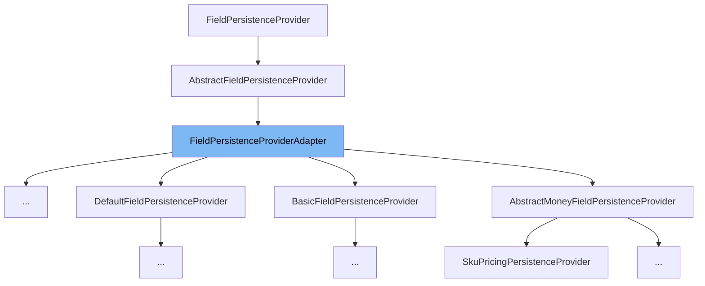

This document will cover the class <SwmToken path="admin/broadleaf-open-admin-platform/src/main/java/org/broadleafcommerce/openadmin/server/service/persistence/module/provider/RuleFieldPersistenceProvider.java" pos="78:8:8" line-data="public class RuleFieldPersistenceProvider extends FieldPersistenceProviderAdapter {">`FieldPersistenceProviderAdapter`</SwmToken> in detail. We will cover:

1. What is <SwmToken path="admin/broadleaf-open-admin-platform/src/main/java/org/broadleafcommerce/openadmin/server/service/persistence/module/provider/RuleFieldPersistenceProvider.java" pos="78:8:8" line-data="public class RuleFieldPersistenceProvider extends FieldPersistenceProviderAdapter {">`FieldPersistenceProviderAdapter`</SwmToken>
2. Variables and functions
3. Usage example



# What is <SwmToken path="admin/broadleaf-open-admin-platform/src/main/java/org/broadleafcommerce/openadmin/server/service/persistence/module/provider/RuleFieldPersistenceProvider.java" pos="78:8:8" line-data="public class RuleFieldPersistenceProvider extends FieldPersistenceProviderAdapter {">`FieldPersistenceProviderAdapter`</SwmToken>

The <SwmToken path="admin/broadleaf-open-admin-platform/src/main/java/org/broadleafcommerce/openadmin/server/service/persistence/module/provider/RuleFieldPersistenceProvider.java" pos="78:8:8" line-data="public class RuleFieldPersistenceProvider extends FieldPersistenceProviderAdapter {">`FieldPersistenceProviderAdapter`</SwmToken> is a class in the Broadleaf Commerce framework, specifically within the admin module. It extends the <SwmToken path="admin/broadleaf-open-admin-platform/src/main/java/org/broadleafcommerce/openadmin/server/service/persistence/module/provider/FieldPersistenceProviderAdapter.java" pos="43:8:8" line-data="public class FieldPersistenceProviderAdapter extends AbstractFieldPersistenceProvider {">`AbstractFieldPersistenceProvider`</SwmToken> and provides default implementations for various methods related to field persistence. This class is used as a base class for other field persistence providers, allowing them to inherit common functionality and override specific methods as needed.

<SwmSnippet path="/admin/broadleaf-open-admin-platform/src/main/java/org/broadleafcommerce/openadmin/server/service/persistence/module/provider/FieldPersistenceProviderAdapter.java" line="46">

---

# Variables and functions

The function <SwmToken path="admin/broadleaf-open-admin-platform/src/main/java/org/broadleafcommerce/openadmin/server/service/persistence/module/provider/FieldPersistenceProviderAdapter.java" pos="46:5:5" line-data="    public MetadataProviderResponse addSearchMapping(AddSearchMappingRequest addSearchMappingRequest, List&lt;FilterMapping&gt; filterMappings) {">`addSearchMapping`</SwmToken> is used to add search mappings to the provided list of filter mappings. In this implementation, it returns <SwmToken path="admin/broadleaf-open-admin-platform/src/main/java/org/broadleafcommerce/openadmin/server/service/persistence/module/provider/FieldPersistenceProviderAdapter.java" pos="47:3:5" line-data="        return MetadataProviderResponse.NOT_HANDLED;">`MetadataProviderResponse.NOT_HANDLED`</SwmToken>, indicating that it does not handle the request.

```java
    public MetadataProviderResponse addSearchMapping(AddSearchMappingRequest addSearchMappingRequest, List<FilterMapping> filterMappings) {
        return MetadataProviderResponse.NOT_HANDLED;
    }
```

---

</SwmSnippet>

<SwmSnippet path="/admin/broadleaf-open-admin-platform/src/main/java/org/broadleafcommerce/openadmin/server/service/persistence/module/provider/FieldPersistenceProviderAdapter.java" line="51">

---

The function <SwmToken path="admin/broadleaf-open-admin-platform/src/main/java/org/broadleafcommerce/openadmin/server/service/persistence/module/provider/FieldPersistenceProviderAdapter.java" pos="51:5:5" line-data="    public MetadataProviderResponse populateValue(PopulateValueRequest populateValueRequest, Serializable instance) {">`populateValue`</SwmToken> is used to populate the value of a field in the given instance. In this implementation, it returns <SwmToken path="admin/broadleaf-open-admin-platform/src/main/java/org/broadleafcommerce/openadmin/server/service/persistence/module/provider/FieldPersistenceProviderAdapter.java" pos="52:3:5" line-data="        return MetadataProviderResponse.NOT_HANDLED;">`MetadataProviderResponse.NOT_HANDLED`</SwmToken>, indicating that it does not handle the request.

```java
    public MetadataProviderResponse populateValue(PopulateValueRequest populateValueRequest, Serializable instance) {
        return MetadataProviderResponse.NOT_HANDLED;
    }
```

---

</SwmSnippet>

<SwmSnippet path="/admin/broadleaf-open-admin-platform/src/main/java/org/broadleafcommerce/openadmin/server/service/persistence/module/provider/FieldPersistenceProviderAdapter.java" line="56">

---

The function <SwmToken path="admin/broadleaf-open-admin-platform/src/main/java/org/broadleafcommerce/openadmin/server/service/persistence/module/provider/FieldPersistenceProviderAdapter.java" pos="56:5:5" line-data="    public MetadataProviderResponse extractValue(ExtractValueRequest extractValueRequest, Property property) {">`extractValue`</SwmToken> is used to extract the value of a field from the given property. In this implementation, it returns <SwmToken path="admin/broadleaf-open-admin-platform/src/main/java/org/broadleafcommerce/openadmin/server/service/persistence/module/provider/FieldPersistenceProviderAdapter.java" pos="57:3:5" line-data="        return MetadataProviderResponse.NOT_HANDLED;">`MetadataProviderResponse.NOT_HANDLED`</SwmToken>, indicating that it does not handle the request.

```java
    public MetadataProviderResponse extractValue(ExtractValueRequest extractValueRequest, Property property) {
        return MetadataProviderResponse.NOT_HANDLED;
    }
```

---

</SwmSnippet>

<SwmSnippet path="/admin/broadleaf-open-admin-platform/src/main/java/org/broadleafcommerce/openadmin/server/service/persistence/module/provider/FieldPersistenceProviderAdapter.java" line="61">

---

The function <SwmToken path="admin/broadleaf-open-admin-platform/src/main/java/org/broadleafcommerce/openadmin/server/service/persistence/module/provider/FieldPersistenceProviderAdapter.java" pos="61:5:5" line-data="    public MetadataProviderResponse filterProperties(AddFilterPropertiesRequest addFilterPropertiesRequest, Map&lt;String, FieldMetadata&gt; properties) {">`filterProperties`</SwmToken> is used to filter the properties based on the given request. In this implementation, it returns <SwmToken path="admin/broadleaf-open-admin-platform/src/main/java/org/broadleafcommerce/openadmin/server/service/persistence/module/provider/FieldPersistenceProviderAdapter.java" pos="62:3:5" line-data="        return MetadataProviderResponse.NOT_HANDLED;">`MetadataProviderResponse.NOT_HANDLED`</SwmToken>, indicating that it does not handle the request.

```java
    public MetadataProviderResponse filterProperties(AddFilterPropertiesRequest addFilterPropertiesRequest, Map<String, FieldMetadata> properties) {
        return MetadataProviderResponse.NOT_HANDLED;
    }
```

---

</SwmSnippet>

<SwmSnippet path="/admin/broadleaf-open-admin-platform/src/main/java/org/broadleafcommerce/openadmin/server/service/persistence/module/provider/FieldPersistenceProviderAdapter.java" line="66">

---

The function <SwmToken path="admin/broadleaf-open-admin-platform/src/main/java/org/broadleafcommerce/openadmin/server/service/persistence/module/provider/FieldPersistenceProviderAdapter.java" pos="66:5:5" line-data="    public int getOrder() {">`getOrder`</SwmToken> returns the order in which this provider should be executed. In this implementation, it returns <SwmToken path="admin/broadleaf-open-admin-platform/src/main/java/org/broadleafcommerce/openadmin/server/service/persistence/module/provider/FieldPersistenceProviderAdapter.java" pos="67:3:5" line-data="        return Ordered.LOWEST_PRECEDENCE;">`Ordered.LOWEST_PRECEDENCE`</SwmToken>, indicating that it has the lowest priority.

```java
    public int getOrder() {
        return Ordered.LOWEST_PRECEDENCE;
    }
```

---

</SwmSnippet>

<SwmSnippet path="/admin/broadleaf-open-admin-platform/src/main/java/org/broadleafcommerce/openadmin/server/service/persistence/module/provider/FieldPersistenceProviderAdapter.java" line="70">

---

The function <SwmToken path="admin/broadleaf-open-admin-platform/src/main/java/org/broadleafcommerce/openadmin/server/service/persistence/module/provider/FieldPersistenceProviderAdapter.java" pos="70:5:5" line-data="    protected boolean checkDirtyState(PopulateValueRequest request, Object instance, Object checkValue) throws Exception {">`checkDirtyState`</SwmToken> checks if the field's state is dirty, meaning it has been modified. It uses the <SwmToken path="admin/broadleaf-open-admin-platform/src/main/java/org/broadleafcommerce/openadmin/server/service/persistence/module/provider/FieldPersistenceProviderAdapter.java" pos="71:7:7" line-data="        boolean dirty = isFieldDirty(request, instance, checkValue);">`isFieldDirty`</SwmToken> function to determine this and also checks if the field has a default value.

```java
    protected boolean checkDirtyState(PopulateValueRequest request, Object instance, Object checkValue) throws Exception {
        boolean dirty = isFieldDirty(request, instance, checkValue);
        boolean hasDefaultValue = !StringUtils.isEmpty(request.getMetadata().getDefaultValue());

        return (!request.getPreAdd() || hasDefaultValue) && dirty;
    }
```

---

</SwmSnippet>

<SwmSnippet path="/admin/broadleaf-open-admin-platform/src/main/java/org/broadleafcommerce/openadmin/server/service/persistence/module/provider/FieldPersistenceProviderAdapter.java" line="77">

---

The function <SwmToken path="admin/broadleaf-open-admin-platform/src/main/java/org/broadleafcommerce/openadmin/server/service/persistence/module/provider/FieldPersistenceProviderAdapter.java" pos="77:5:5" line-data="    protected boolean isFieldDirty(PopulateValueRequest request, Object instance, Object checkValue) throws IllegalAccessException, FieldNotAvailableException {">`isFieldDirty`</SwmToken> checks if the field's value has changed. It compares the current value of the field with the provided check value and returns true if they are different.

```java
    protected boolean isFieldDirty(PopulateValueRequest request, Object instance, Object checkValue) throws IllegalAccessException, FieldNotAvailableException {
        boolean dirty = !(instance == null && checkValue == null) && (instance == null || checkValue == null);
        if (!dirty) {
            Object value = request.getFieldManager().getFieldValue(instance, request.getProperty().getName());
            if (checkValue instanceof String) {
                checkValue = ((String) checkValue).replaceAll("\\s+[</]|\\r\\n+[</]","</").trim();
            }
            if (value instanceof String) {
                value = ((String) value).replaceAll("\\s+[</]|\\r\\n+[</]","</").trim();
            }
            if (value instanceof BigDecimal) {
                BigDecimal origValue = (BigDecimal) value;
                BigDecimal newValue = (BigDecimal) checkValue;
                //set the scale of one of the BigDecimal values to the larger of the two scales
                if (newValue.scale() < origValue.scale()) {
                    checkValue = newValue.setScale(origValue.scale(), RoundingMode.UNNECESSARY);
                } else if (origValue.scale() < newValue.scale()) {
                    value = origValue.setScale(newValue.scale(), RoundingMode.UNNECESSARY);
                }
            }
            dirty = value == null || !value.equals(checkValue);
```

---

</SwmSnippet>

<SwmSnippet path="/admin/broadleaf-open-admin-platform/src/main/java/org/broadleafcommerce/openadmin/server/service/persistence/module/provider/FieldPersistenceProviderAdapter.java" line="102">

---

The function <SwmToken path="admin/broadleaf-open-admin-platform/src/main/java/org/broadleafcommerce/openadmin/server/service/persistence/module/provider/FieldPersistenceProviderAdapter.java" pos="102:5:5" line-data="    protected void setNonDisplayableValues(PopulateValueRequest request) {">`setNonDisplayableValues`</SwmToken> sets the display value of the property to indicate that it is not displayable. It uses the <SwmToken path="admin/broadleaf-open-admin-platform/src/main/java/org/broadleafcommerce/openadmin/server/service/persistence/module/provider/FieldPersistenceProviderAdapter.java" pos="103:1:1" line-data="        BroadleafRequestContext context = BroadleafRequestContext.getBroadleafRequestContext();">`BroadleafRequestContext`</SwmToken> to get the message source and sets the display value accordingly.

```java
    protected void setNonDisplayableValues(PopulateValueRequest request) {
        BroadleafRequestContext context = BroadleafRequestContext.getBroadleafRequestContext();
        MessageSource messages = context.getMessageSource();
        String label = "(" + messages.getMessage("Workflow_not_displayable", null, "Not Displayable", context.getJavaLocale()) + ")";
        request.getProperty().setDisplayValue(label);
        request.getProperty().setOriginalDisplayValue(label);
    }
```

---

</SwmSnippet>

# Usage example

The <SwmToken path="admin/broadleaf-open-admin-platform/src/main/java/org/broadleafcommerce/openadmin/server/service/persistence/module/provider/RuleFieldPersistenceProvider.java" pos="78:8:8" line-data="public class RuleFieldPersistenceProvider extends FieldPersistenceProviderAdapter {">`FieldPersistenceProviderAdapter`</SwmToken> class is extended by other classes to provide specific field persistence functionality. For example, the <SwmToken path="admin/broadleaf-open-admin-platform/src/main/java/org/broadleafcommerce/openadmin/server/service/persistence/module/provider/RuleFieldPersistenceProvider.java" pos="78:4:4" line-data="public class RuleFieldPersistenceProvider extends FieldPersistenceProviderAdapter {">`RuleFieldPersistenceProvider`</SwmToken> class extends <SwmToken path="admin/broadleaf-open-admin-platform/src/main/java/org/broadleafcommerce/openadmin/server/service/persistence/module/provider/RuleFieldPersistenceProvider.java" pos="78:8:8" line-data="public class RuleFieldPersistenceProvider extends FieldPersistenceProviderAdapter {">`FieldPersistenceProviderAdapter`</SwmToken> and overrides its methods to provide custom behavior for rule fields.

<SwmSnippet path="/admin/broadleaf-open-admin-platform/src/main/java/org/broadleafcommerce/openadmin/server/service/persistence/module/provider/RuleFieldPersistenceProvider.java" line="77">

---

The <SwmToken path="admin/broadleaf-open-admin-platform/src/main/java/org/broadleafcommerce/openadmin/server/service/persistence/module/provider/RuleFieldPersistenceProvider.java" pos="78:4:4" line-data="public class RuleFieldPersistenceProvider extends FieldPersistenceProviderAdapter {">`RuleFieldPersistenceProvider`</SwmToken> class extends <SwmToken path="admin/broadleaf-open-admin-platform/src/main/java/org/broadleafcommerce/openadmin/server/service/persistence/module/provider/RuleFieldPersistenceProvider.java" pos="78:8:8" line-data="public class RuleFieldPersistenceProvider extends FieldPersistenceProviderAdapter {">`FieldPersistenceProviderAdapter`</SwmToken> and provides custom implementations for its methods.

```java
@Scope("prototype")
public class RuleFieldPersistenceProvider extends FieldPersistenceProviderAdapter {
```

---

</SwmSnippet>

&nbsp;

*This is an auto-generated document by Swimm AI 🌊 and has not yet been verified by a human*

<SwmMeta version="3.0.0" repo-id="Z2l0aHViJTNBJTNBQnJvYWRsZWFmQ29tbWVyY2UtZGVtby1uZXclM0ElM0FTd2ltbS1EZW1v" repo-name="BroadleafCommerce-demo-new" doc-type="class"><sup>Powered by [Swimm](/)</sup></SwmMeta>
