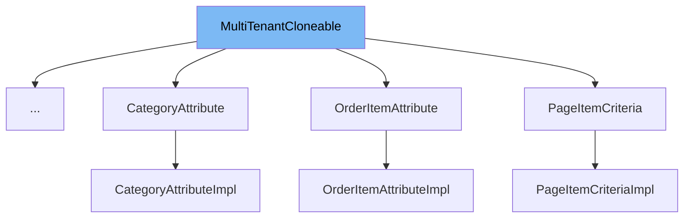

This document will cover the class <SwmToken path="common/src/main/java/org/broadleafcommerce/common/copy/MultiTenantCloneable.java" pos="25:4:4" line-data="public interface MultiTenantCloneable&lt;T&gt; {">`MultiTenantCloneable`</SwmToken>. We will discuss:

1. What <SwmToken path="common/src/main/java/org/broadleafcommerce/common/copy/MultiTenantCloneable.java" pos="25:4:4" line-data="public interface MultiTenantCloneable&lt;T&gt; {">`MultiTenantCloneable`</SwmToken> is.
2. The variables and functions defined in <SwmToken path="common/src/main/java/org/broadleafcommerce/common/copy/MultiTenantCloneable.java" pos="25:4:4" line-data="public interface MultiTenantCloneable&lt;T&gt; {">`MultiTenantCloneable`</SwmToken>.
3. An example of how to use <SwmToken path="common/src/main/java/org/broadleafcommerce/common/copy/MultiTenantCloneable.java" pos="25:4:4" line-data="public interface MultiTenantCloneable&lt;T&gt; {">`MultiTenantCloneable`</SwmToken> in <SwmToken path="core/broadleaf-framework/src/main/java/org/broadleafcommerce/core/catalog/domain/UpSaleProductImpl.java" pos="55:4:4" line-data="public class UpSaleProductImpl implements UpSaleProduct, MultiTenantCloneable&lt;UpSaleProductImpl&gt; {">`UpSaleProductImpl`</SwmToken>.



# What is <SwmToken path="common/src/main/java/org/broadleafcommerce/common/copy/MultiTenantCloneable.java" pos="25:4:4" line-data="public interface MultiTenantCloneable&lt;T&gt; {">`MultiTenantCloneable`</SwmToken>

<SwmToken path="common/src/main/java/org/broadleafcommerce/common/copy/MultiTenantCloneable.java" pos="25:4:4" line-data="public interface MultiTenantCloneable&lt;T&gt; {">`MultiTenantCloneable`</SwmToken> is an interface in <SwmPath>[common/src/main/java/org/broadleafcommerce/common/copy/MultiTenantCloneable.java](common/src/main/java/org/broadleafcommerce/common/copy/MultiTenantCloneable.java)</SwmPath>. It describes an entity or <SwmToken path="common/src/main/java/org/broadleafcommerce/common/copy/MultiTenantCloneable.java" pos="44:15:16" line-data="     * Support should also be added for @Embeddable classes that contribute fields (collections or basic) to a cloneable entity:">`@Embeddable`</SwmToken> that can be cloned for the purpose of multiple tenancy. This interface is used to create or retrieve a copy of an entity within a multi-tenant environment, ensuring that each tenant has its own instance of the entity.

<SwmSnippet path="/common/src/main/java/org/broadleafcommerce/common/copy/MultiTenantCloneable.java" line="27">

---

# Variables and functions

The function <SwmToken path="common/src/main/java/org/broadleafcommerce/common/copy/MultiTenantCloneable.java" pos="31:14:14" line-data="     * public CreateResponse&amp;lt;MyClass&amp;gt; createOrRetrieveCopyInstance(MultiTenantCopyContext context) throws CloneNotSupportedException {">`createOrRetrieveCopyInstance`</SwmToken> is used to clone the entity for multiple tenancy. It takes a <SwmToken path="common/src/main/java/org/broadleafcommerce/common/copy/MultiTenantCloneable.java" pos="31:16:16" line-data="     * public CreateResponse&amp;lt;MyClass&amp;gt; createOrRetrieveCopyInstance(MultiTenantCopyContext context) throws CloneNotSupportedException {">`MultiTenantCopyContext`</SwmToken> as a parameter and returns a <SwmToken path="common/src/main/java/org/broadleafcommerce/common/copy/MultiTenantCloneable.java" pos="31:5:5" line-data="     * public CreateResponse&amp;lt;MyClass&amp;gt; createOrRetrieveCopyInstance(MultiTenantCopyContext context) throws CloneNotSupportedException {">`CreateResponse`</SwmToken> object. This function may throw a <SwmToken path="common/src/main/java/org/broadleafcommerce/common/copy/MultiTenantCloneable.java" pos="31:23:23" line-data="     * public CreateResponse&amp;lt;MyClass&amp;gt; createOrRetrieveCopyInstance(MultiTenantCopyContext context) throws CloneNotSupportedException {">`CloneNotSupportedException`</SwmToken> if there is an issue with the cloning configuration.

```java
    /**
     * Clone this entity for the purpose of multiple tenancy. Note, extending classes should follow this pattern:
     * </p>
     * <code>
     * public CreateResponse&lt;MyClass&gt; createOrRetrieveCopyInstance(MultiTenantCopyContext context) throws CloneNotSupportedException {
     *      CreateResponse&lt;MyClass&gt; createResponse = super.createOrRetrieveCopyInstance(context);
     *      if (createResponse.isAlreadyPopulated()) {
     *          return createResponse;
     *      }
     *      MyClass myClone = createResponse.getClone();
     *
     *      //copy extended field values on myClone here
     *
     *      return createResponse;
     * }
     * </code>
     * </p>
     * Support should also be added for @Embeddable classes that contribute fields (collections or basic) to a cloneable entity:
     * </p>
     * <code>
     * public CreateResponse&lt;G extends MyClass&gt; createOrRetrieveCopyInstance(MultiTenantCopyContext context) throws CloneNotSupportedException {
```

---

</SwmSnippet>

# Usage example

Here is an example of how to use <SwmToken path="common/src/main/java/org/broadleafcommerce/common/copy/MultiTenantCloneable.java" pos="25:4:4" line-data="public interface MultiTenantCloneable&lt;T&gt; {">`MultiTenantCloneable`</SwmToken> in <SwmToken path="core/broadleaf-framework/src/main/java/org/broadleafcommerce/core/catalog/domain/UpSaleProductImpl.java" pos="55:4:4" line-data="public class UpSaleProductImpl implements UpSaleProduct, MultiTenantCloneable&lt;UpSaleProductImpl&gt; {">`UpSaleProductImpl`</SwmToken>.

<SwmSnippet path="/core/broadleaf-framework/src/main/java/org/broadleafcommerce/core/catalog/domain/UpSaleProductImpl.java" line="1">

---

<SwmToken path="core/broadleaf-framework/src/main/java/org/broadleafcommerce/core/catalog/domain/UpSaleProductImpl.java" pos="55:4:4" line-data="public class UpSaleProductImpl implements UpSaleProduct, MultiTenantCloneable&lt;UpSaleProductImpl&gt; {">`UpSaleProductImpl`</SwmToken> implements <SwmToken path="common/src/main/java/org/broadleafcommerce/common/copy/MultiTenantCloneable.java" pos="25:4:4" line-data="public interface MultiTenantCloneable&lt;T&gt; {">`MultiTenantCloneable`</SwmToken>. This class provides an example of how to implement the <SwmToken path="common/src/main/java/org/broadleafcommerce/common/copy/MultiTenantCloneable.java" pos="31:14:14" line-data="     * public CreateResponse&amp;lt;MyClass&amp;gt; createOrRetrieveCopyInstance(MultiTenantCopyContext context) throws CloneNotSupportedException {">`createOrRetrieveCopyInstance`</SwmToken> method to clone an entity for multiple tenancy.

```java
/*-
 * #%L
 * BroadleafCommerce Framework
 * %%
 * Copyright (C) 2009 - 2024 Broadleaf Commerce
 * %%
 * Licensed under the Broadleaf Fair Use License Agreement, Version 1.0
 * (the "Fair Use License" located  at http://license.broadleafcommerce.org/fair_use_license-1.0.txt)
 * unless the restrictions on use therein are violated and require payment to Broadleaf in which case
 * the Broadleaf End User License Agreement (EULA), Version 1.1
 * (the "Commercial License" located at http://license.broadleafcommerce.org/commercial_license-1.1.txt)
 * shall apply.
 * 
 * Alternatively, the Commercial License may be replaced with a mutually agreed upon license (the "Custom License")
 * between you and Broadleaf Commerce. You may not use this file except in compliance with the applicable license.
 * #L%
 */
package org.broadleafcommerce.core.catalog.domain;

import org.broadleafcommerce.common.copy.CreateResponse;
```

---

</SwmSnippet>

&nbsp;

*This is an auto-generated document by Swimm AI 🌊 and has not yet been verified by a human*

<SwmMeta version="3.0.0" repo-id="Z2l0aHViJTNBJTNBQnJvYWRsZWFmQ29tbWVyY2UtZGVtby1uZXclM0ElM0FTd2ltbS1EZW1v" repo-name="BroadleafCommerce-demo-new" doc-type="general-class"><sup>Powered by [Swimm](/)</sup></SwmMeta>
