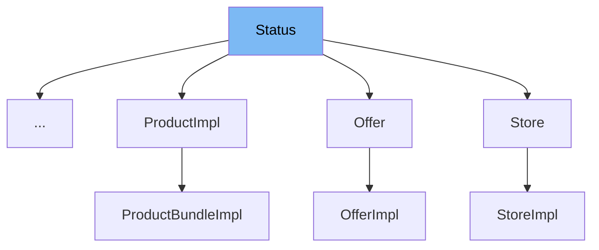

This document will cover the <SwmToken path="common/src/main/java/org/broadleafcommerce/common/weave/WeaveArchiveStatus.java" pos="29:10:10" line-data="public final class WeaveArchiveStatus implements Status {">`Status`</SwmToken> interface in the Broadleaf Commerce framework. We will discuss:

1. What <SwmToken path="common/src/main/java/org/broadleafcommerce/common/weave/WeaveArchiveStatus.java" pos="29:10:10" line-data="public final class WeaveArchiveStatus implements Status {">`Status`</SwmToken> is.
2. The variables and functions defined in <SwmToken path="common/src/main/java/org/broadleafcommerce/common/weave/WeaveArchiveStatus.java" pos="29:10:10" line-data="public final class WeaveArchiveStatus implements Status {">`Status`</SwmToken>.
3. An example of how to use <SwmToken path="common/src/main/java/org/broadleafcommerce/common/weave/WeaveArchiveStatus.java" pos="29:10:10" line-data="public final class WeaveArchiveStatus implements Status {">`Status`</SwmToken> in <SwmToken path="common/src/main/java/org/broadleafcommerce/common/weave/WeaveArchiveStatus.java" pos="29:6:6" line-data="public final class WeaveArchiveStatus implements Status {">`WeaveArchiveStatus`</SwmToken>.



# What is Status

The <SwmToken path="common/src/main/java/org/broadleafcommerce/common/weave/WeaveArchiveStatus.java" pos="29:10:10" line-data="public final class WeaveArchiveStatus implements Status {">`Status`</SwmToken> interface in <SwmPath>[common/src/main/java/org/broadleafcommerce/common/persistence/Status.java](common/src/main/java/org/broadleafcommerce/common/persistence/Status.java)</SwmPath> is used to denote whether an entity is archived. Entities implementing this interface typically undergo <SwmToken path="common/src/main/java/org/broadleafcommerce/common/persistence/Status.java" pos="22:5:7" line-data=" * undergo soft-deletes.">`soft-deletes`</SwmToken>, meaning they are marked as archived rather than being permanently deleted.

<SwmSnippet path="/common/src/main/java/org/broadleafcommerce/common/persistence/Status.java" line="28">

---

# Variables and functions

The function <SwmToken path="common/src/main/java/org/broadleafcommerce/common/persistence/Status.java" pos="28:5:5" line-data="    public void setArchived(Character archived);">`setArchived`</SwmToken> is used to set the archived status of an entity. It takes a <SwmToken path="common/src/main/java/org/broadleafcommerce/common/persistence/Status.java" pos="28:7:7" line-data="    public void setArchived(Character archived);">`Character`</SwmToken> parameter that indicates the archived status.

```java
    public void setArchived(Character archived);
```

---

</SwmSnippet>

<SwmSnippet path="/common/src/main/java/org/broadleafcommerce/common/persistence/Status.java" line="30">

---

The function <SwmToken path="common/src/main/java/org/broadleafcommerce/common/persistence/Status.java" pos="30:5:5" line-data="    public Character getArchived();">`getArchived`</SwmToken> returns the archived status of an entity as a <SwmToken path="common/src/main/java/org/broadleafcommerce/common/persistence/Status.java" pos="30:3:3" line-data="    public Character getArchived();">`Character`</SwmToken>.

```java
    public Character getArchived();
```

---

</SwmSnippet>

<SwmSnippet path="/common/src/main/java/org/broadleafcommerce/common/persistence/Status.java" line="32">

---

The function <SwmToken path="common/src/main/java/org/broadleafcommerce/common/persistence/Status.java" pos="32:5:5" line-data="    public boolean isActive();">`isActive`</SwmToken> returns a <SwmToken path="common/src/main/java/org/broadleafcommerce/common/persistence/Status.java" pos="32:3:3" line-data="    public boolean isActive();">`boolean`</SwmToken> indicating whether the entity is active. An entity is considered active if it is not archived.

```java
    public boolean isActive();
```

---

</SwmSnippet>

# Usage example

Here is an example of how to use the <SwmToken path="common/src/main/java/org/broadleafcommerce/common/weave/WeaveArchiveStatus.java" pos="29:10:10" line-data="public final class WeaveArchiveStatus implements Status {">`Status`</SwmToken> interface in the <SwmToken path="common/src/main/java/org/broadleafcommerce/common/weave/WeaveArchiveStatus.java" pos="29:6:6" line-data="public final class WeaveArchiveStatus implements Status {">`WeaveArchiveStatus`</SwmToken> class.

<SwmSnippet path="/common/src/main/java/org/broadleafcommerce/common/weave/WeaveArchiveStatus.java" line="29">

---

The <SwmToken path="common/src/main/java/org/broadleafcommerce/common/weave/WeaveArchiveStatus.java" pos="29:6:6" line-data="public final class WeaveArchiveStatus implements Status {">`WeaveArchiveStatus`</SwmToken> class implements the <SwmToken path="common/src/main/java/org/broadleafcommerce/common/weave/WeaveArchiveStatus.java" pos="29:10:10" line-data="public final class WeaveArchiveStatus implements Status {">`Status`</SwmToken> interface. It provides concrete implementations for the <SwmToken path="common/src/main/java/org/broadleafcommerce/common/persistence/Status.java" pos="28:5:5" line-data="    public void setArchived(Character archived);">`setArchived`</SwmToken>, <SwmToken path="common/src/main/java/org/broadleafcommerce/common/persistence/Status.java" pos="30:5:5" line-data="    public Character getArchived();">`getArchived`</SwmToken>, and <SwmToken path="common/src/main/java/org/broadleafcommerce/common/persistence/Status.java" pos="32:5:5" line-data="    public boolean isActive();">`isActive`</SwmToken> methods.

```java
public final class WeaveArchiveStatus implements Status {
```

---

</SwmSnippet>

&nbsp;

*This is an auto-generated document by Swimm AI 🌊 and has not yet been verified by a human*

<SwmMeta version="3.0.0" repo-id="Z2l0aHViJTNBJTNBQnJvYWRsZWFmQ29tbWVyY2UtZGVtby1uZXclM0ElM0FTd2ltbS1EZW1v" repo-name="BroadleafCommerce-demo-new" doc-type="general-class"><sup>Powered by [Swimm](/)</sup></SwmMeta>
