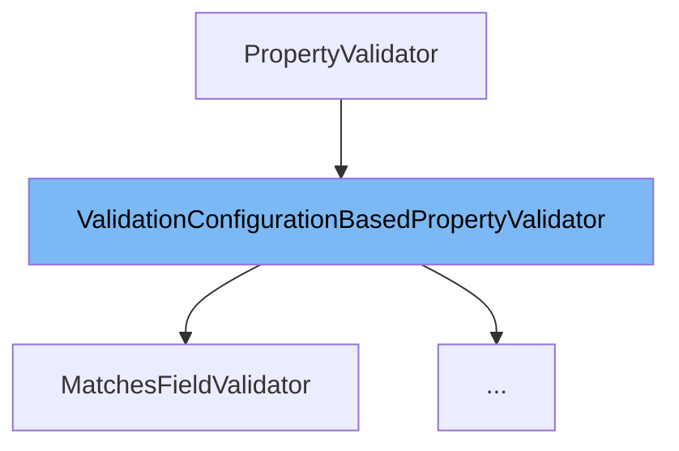

This document will cover the class <SwmToken path="admin/broadleaf-open-admin-platform/src/main/java/org/broadleafcommerce/openadmin/server/service/persistence/validation/AfterStartDateValidator.java" pos="43:8:8" line-data="public class AfterStartDateValidator extends ValidationConfigurationBasedPropertyValidator {">`ValidationConfigurationBasedPropertyValidator`</SwmToken>. We will cover:

1. What <SwmToken path="admin/broadleaf-open-admin-platform/src/main/java/org/broadleafcommerce/openadmin/server/service/persistence/validation/AfterStartDateValidator.java" pos="43:8:8" line-data="public class AfterStartDateValidator extends ValidationConfigurationBasedPropertyValidator {">`ValidationConfigurationBasedPropertyValidator`</SwmToken> is.
2. Main variables and functions in <SwmToken path="admin/broadleaf-open-admin-platform/src/main/java/org/broadleafcommerce/openadmin/server/service/persistence/validation/AfterStartDateValidator.java" pos="43:8:8" line-data="public class AfterStartDateValidator extends ValidationConfigurationBasedPropertyValidator {">`ValidationConfigurationBasedPropertyValidator`</SwmToken>.
3. Example of how to use <SwmToken path="admin/broadleaf-open-admin-platform/src/main/java/org/broadleafcommerce/openadmin/server/service/persistence/validation/AfterStartDateValidator.java" pos="43:8:8" line-data="public class AfterStartDateValidator extends ValidationConfigurationBasedPropertyValidator {">`ValidationConfigurationBasedPropertyValidator`</SwmToken> in <SwmToken path="admin/broadleaf-open-admin-platform/src/main/java/org/broadleafcommerce/openadmin/server/service/persistence/validation/AfterStartDateValidator.java" pos="43:4:4" line-data="public class AfterStartDateValidator extends ValidationConfigurationBasedPropertyValidator {">`AfterStartDateValidator`</SwmToken>.



# What is <SwmToken path="admin/broadleaf-open-admin-platform/src/main/java/org/broadleafcommerce/openadmin/server/service/persistence/validation/AfterStartDateValidator.java" pos="43:8:8" line-data="public class AfterStartDateValidator extends ValidationConfigurationBasedPropertyValidator {">`ValidationConfigurationBasedPropertyValidator`</SwmToken>

<SwmToken path="admin/broadleaf-open-admin-platform/src/main/java/org/broadleafcommerce/openadmin/server/service/persistence/validation/AfterStartDateValidator.java" pos="43:8:8" line-data="public class AfterStartDateValidator extends ValidationConfigurationBasedPropertyValidator {">`ValidationConfigurationBasedPropertyValidator`</SwmToken> is an abstract class that provides a default <SwmToken path="admin/broadleaf-open-admin-platform/src/main/java/org/broadleafcommerce/openadmin/server/service/persistence/validation/ValidationConfigurationBasedPropertyValidator.java" pos="41:5:5" line-data="    public PropertyValidationResult validate(Entity entity, Serializable instance, Map&lt;String, FieldMetadata&gt; entityFieldMetadata,">`validate`</SwmToken> method. This method uses the validation configuration map to extract the error key and <SwmToken path="admin/broadleaf-open-admin-platform/src/main/java/org/broadleafcommerce/openadmin/server/service/persistence/validation/ValidationConfigurationBasedPropertyValidator.java" pos="31:39:41" line-data=" * Provides a default validate method that uses the validation configuration map to pull out the error key and pre-populate">`pre-populate`</SwmToken> the <SwmToken path="admin/broadleaf-open-admin-platform/src/main/java/org/broadleafcommerce/openadmin/server/service/persistence/validation/ValidationConfigurationBasedPropertyValidator.java" pos="41:3:3" line-data="    public PropertyValidationResult validate(Entity entity, Serializable instance, Map&lt;String, FieldMetadata&gt; entityFieldMetadata,">`PropertyValidationResult`</SwmToken> based on <SwmToken path="admin/broadleaf-open-admin-platform/src/main/java/org/broadleafcommerce/openadmin/server/service/persistence/validation/ValidationConfigurationBasedPropertyValidator.java" pos="52:9:11" line-data="                value), validationConfiguration.get(ConfigurationItem.ERROR_MESSAGE));">`ConfigurationItem.ERROR_MESSAGE`</SwmToken>. This class serves as a base for writing validators based on a <SwmToken path="admin/broadleaf-open-admin-platform/src/main/java/org/broadleafcommerce/openadmin/server/service/persistence/validation/ValidationConfigurationBasedPropertyValidator.java" pos="42:9:9" line-data="            Map&lt;String, String&gt; validationConfiguration,">`validationConfiguration`</SwmToken>.

<SwmSnippet path="/admin/broadleaf-open-admin-platform/src/main/java/org/broadleafcommerce/openadmin/server/service/persistence/validation/ValidationConfigurationBasedPropertyValidator.java" line="40">

---

# Variables and functions

The <SwmToken path="admin/broadleaf-open-admin-platform/src/main/java/org/broadleafcommerce/openadmin/server/service/persistence/validation/ValidationConfigurationBasedPropertyValidator.java" pos="41:5:5" line-data="    public PropertyValidationResult validate(Entity entity, Serializable instance, Map&lt;String, FieldMetadata&gt; entityFieldMetadata,">`validate`</SwmToken> function is the main method that performs validation. It takes several parameters including <SwmToken path="admin/broadleaf-open-admin-platform/src/main/java/org/broadleafcommerce/openadmin/server/service/persistence/validation/ValidationConfigurationBasedPropertyValidator.java" pos="41:7:7" line-data="    public PropertyValidationResult validate(Entity entity, Serializable instance, Map&lt;String, FieldMetadata&gt; entityFieldMetadata,">`Entity`</SwmToken>, <SwmToken path="admin/broadleaf-open-admin-platform/src/main/java/org/broadleafcommerce/openadmin/server/service/persistence/validation/ValidationConfigurationBasedPropertyValidator.java" pos="41:12:14" line-data="    public PropertyValidationResult validate(Entity entity, Serializable instance, Map&lt;String, FieldMetadata&gt; entityFieldMetadata,">`Serializable instance`</SwmToken>, <SwmToken path="admin/broadleaf-open-admin-platform/src/main/java/org/broadleafcommerce/openadmin/server/service/persistence/validation/ValidationConfigurationBasedPropertyValidator.java" pos="41:17:25" line-data="    public PropertyValidationResult validate(Entity entity, Serializable instance, Map&lt;String, FieldMetadata&gt; entityFieldMetadata,">`Map<String, FieldMetadata> entityFieldMetadata`</SwmToken>, <SwmToken path="admin/broadleaf-open-admin-platform/src/main/java/org/broadleafcommerce/openadmin/server/service/persistence/validation/ValidationConfigurationBasedPropertyValidator.java" pos="42:1:9" line-data="            Map&lt;String, String&gt; validationConfiguration,">`Map<String, String> validationConfiguration`</SwmToken>, <SwmToken path="admin/broadleaf-open-admin-platform/src/main/java/org/broadleafcommerce/openadmin/server/service/persistence/validation/ValidationConfigurationBasedPropertyValidator.java" pos="43:1:3" line-data="            BasicFieldMetadata propertyMetadata,">`BasicFieldMetadata propertyMetadata`</SwmToken>, <SwmToken path="admin/broadleaf-open-admin-platform/src/main/java/org/broadleafcommerce/openadmin/server/service/persistence/validation/ValidationConfigurationBasedPropertyValidator.java" pos="44:1:3" line-data="            String propertyName,">`String propertyName`</SwmToken>, and <SwmToken path="admin/broadleaf-open-admin-platform/src/main/java/org/broadleafcommerce/openadmin/server/service/persistence/validation/ValidationConfigurationBasedPropertyValidator.java" pos="45:1:3" line-data="            String value) {">`String value`</SwmToken>. It returns a <SwmToken path="admin/broadleaf-open-admin-platform/src/main/java/org/broadleafcommerce/openadmin/server/service/persistence/validation/ValidationConfigurationBasedPropertyValidator.java" pos="41:3:3" line-data="    public PropertyValidationResult validate(Entity entity, Serializable instance, Map&lt;String, FieldMetadata&gt; entityFieldMetadata,">`PropertyValidationResult`</SwmToken> object.

```java
    @Override
    public PropertyValidationResult validate(Entity entity, Serializable instance, Map<String, FieldMetadata> entityFieldMetadata,
            Map<String, String> validationConfiguration,
            BasicFieldMetadata propertyMetadata,
            String propertyName,
            String value) {
        return new PropertyValidationResult(validateInternal(entity,
                instance,
                entityFieldMetadata,
                validationConfiguration,
                propertyMetadata,
                propertyName,
                value), validationConfiguration.get(ConfigurationItem.ERROR_MESSAGE));
    }
```

---

</SwmSnippet>

<SwmSnippet path="/admin/broadleaf-open-admin-platform/src/main/java/org/broadleafcommerce/openadmin/server/service/persistence/validation/ValidationConfigurationBasedPropertyValidator.java" line="55">

---

The <SwmToken path="admin/broadleaf-open-admin-platform/src/main/java/org/broadleafcommerce/openadmin/server/service/persistence/validation/ValidationConfigurationBasedPropertyValidator.java" pos="58:5:5" line-data="    public boolean validateInternal(Entity entity,">`validateInternal`</SwmToken> function is a delegate method for <SwmToken path="admin/broadleaf-open-admin-platform/src/main/java/org/broadleafcommerce/openadmin/server/service/persistence/validation/ValidationConfigurationBasedPropertyValidator.java" pos="56:13:13" line-data="     * Delegate method for {@link ValidationConfiguration}-based processors that don&#39;t need to return an error message">`ValidationConfiguration`</SwmToken>-based processors that do not need to return an error message. It takes the same parameters as the <SwmToken path="admin/broadleaf-open-admin-platform/src/main/java/org/broadleafcommerce/openadmin/server/service/persistence/validation/ValidationConfigurationBasedPropertyValidator.java" pos="41:5:5" line-data="    public PropertyValidationResult validate(Entity entity, Serializable instance, Map&lt;String, FieldMetadata&gt; entityFieldMetadata,">`validate`</SwmToken> method and returns a boolean value.

```java
    /**
     * Delegate method for {@link ValidationConfiguration}-based processors that don't need to return an error message
     */
    public boolean validateInternal(Entity entity,
            Serializable instance,
            Map<String, FieldMetadata> entityFieldMetadata,
            Map<String, String> validationConfiguration,
            BasicFieldMetadata propertyMetadata,
            String propertyName,
            String value) {
        return false;
    }
```

---

</SwmSnippet>

# Usage example

Here is an example of how to use <SwmToken path="admin/broadleaf-open-admin-platform/src/main/java/org/broadleafcommerce/openadmin/server/service/persistence/validation/AfterStartDateValidator.java" pos="43:8:8" line-data="public class AfterStartDateValidator extends ValidationConfigurationBasedPropertyValidator {">`ValidationConfigurationBasedPropertyValidator`</SwmToken> in the <SwmToken path="admin/broadleaf-open-admin-platform/src/main/java/org/broadleafcommerce/openadmin/server/service/persistence/validation/AfterStartDateValidator.java" pos="43:4:4" line-data="public class AfterStartDateValidator extends ValidationConfigurationBasedPropertyValidator {">`AfterStartDateValidator`</SwmToken> class.

<SwmSnippet path="/admin/broadleaf-open-admin-platform/src/main/java/org/broadleafcommerce/openadmin/server/service/persistence/validation/AfterStartDateValidator.java" line="42">

---

The <SwmToken path="admin/broadleaf-open-admin-platform/src/main/java/org/broadleafcommerce/openadmin/server/service/persistence/validation/AfterStartDateValidator.java" pos="43:4:4" line-data="public class AfterStartDateValidator extends ValidationConfigurationBasedPropertyValidator {">`AfterStartDateValidator`</SwmToken> class extends <SwmToken path="admin/broadleaf-open-admin-platform/src/main/java/org/broadleafcommerce/openadmin/server/service/persistence/validation/AfterStartDateValidator.java" pos="43:8:8" line-data="public class AfterStartDateValidator extends ValidationConfigurationBasedPropertyValidator {">`ValidationConfigurationBasedPropertyValidator`</SwmToken> and is annotated with <SwmToken path="admin/broadleaf-open-admin-platform/src/main/java/org/broadleafcommerce/openadmin/server/service/persistence/validation/AfterStartDateValidator.java" pos="42:0:6" line-data="@Component(&quot;blAfterStartDateValidator&quot;)">`@Component("blAfterStartDateValidator")`</SwmToken>. This shows how to create a custom validator by extending <SwmToken path="admin/broadleaf-open-admin-platform/src/main/java/org/broadleafcommerce/openadmin/server/service/persistence/validation/AfterStartDateValidator.java" pos="43:8:8" line-data="public class AfterStartDateValidator extends ValidationConfigurationBasedPropertyValidator {">`ValidationConfigurationBasedPropertyValidator`</SwmToken>.

```java
@Component("blAfterStartDateValidator")
public class AfterStartDateValidator extends ValidationConfigurationBasedPropertyValidator {
```

---

</SwmSnippet>

&nbsp;

*This is an auto-generated document by Swimm AI 🌊 and has not yet been verified by a human*

<SwmMeta version="3.0.0" repo-id="Z2l0aHViJTNBJTNBQnJvYWRsZWFmQ29tbWVyY2UtZGVtby1uZXclM0ElM0FTd2ltbS1EZW1v" repo-name="BroadleafCommerce-demo-new" doc-type="class"><sup>Powered by [Swimm](/)</sup></SwmMeta>
