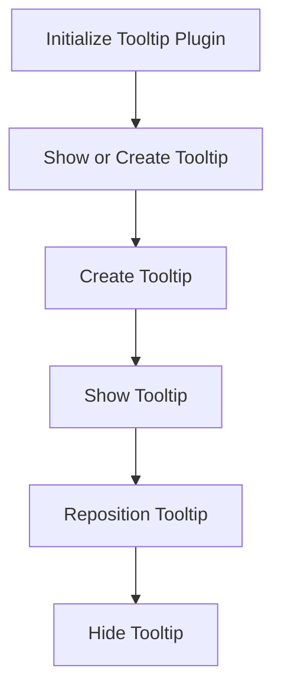

The process of initializing tooltips involves several steps to ensure they are displayed correctly based on the user's device and interactions. This document will cover:

1. Initializing the tooltip plugin
2. Showing or creating tooltips
3. Creating tooltips
4. Showing tooltips
5. Repositioning tooltips
6. Hiding tooltips

Technical document: <SwmLink doc-title="Tooltip Initialization Flow">[Tooltip Initialization Flow](/.swm/tooltip-initialization-flow.uu3wez4s.sw.md)</SwmLink>

# [Initializing the Tooltip Plugin](https://app.swimm.io/repos/Z2l0aHViJTNBJTNBQnJvYWRsZWFmQ29tbWVyY2UtZGVtby1uZXclM0ElM0FTd2ltbS1EZW1v/docs/uu3wez4s#initialization)

The initialization process begins by setting up the tooltip plugin with either default settings or any provided options. This step ensures that the tooltips behave consistently across different devices. For touch devices, the system listens for click and touch events to show or hide tooltips. For non-touch devices, it listens for mouseenter and mouseleave events. This differentiation ensures that the tooltips are user-friendly and responsive to the type of device being used.

# [Showing or Creating Tooltips](https://app.swimm.io/repos/Z2l0aHViJTNBJTNBQnJvYWRsZWFmQ29tbWVyY2UtZGVtby1uZXclM0ElM0FTd2ltbS1EZW1v/docs/uu3wez4s#showing-or-creating-tooltip)

When a user interacts with an element that should display a tooltip, the system first checks if a tooltip already exists for that element. If a tooltip exists, it is shown to the user. If not, a new tooltip is created. This step ensures that tooltips are not redundantly created, which optimizes performance and maintains a clean user interface.

# [Creating Tooltips](https://app.swimm.io/repos/Z2l0aHViJTNBJTNBQnJvYWRsZWFmQ29tbWVyY2UtZGVtby1uZXclM0ElM0FTd2ltbS1EZW1v/docs/uu3wez4s#creating-tooltip)

If a tooltip does not already exist, a new one is created. This involves generating a new tooltip element, applying necessary classes, and appending it to the body of the document. Additionally, the title attribute is removed from the target element to prevent default browser tooltips from appearing. This step ensures that the custom tooltips are displayed correctly and do not conflict with the browser's default behavior.

# [Showing Tooltips](https://app.swimm.io/repos/Z2l0aHViJTNBJTNBQnJvYWRsZWFmQ29tbWVyY2UtZGVtby1uZXclM0ElM0FTd2ltbS1EZW1v/docs/uu3wez4s#showing-tooltip)

Once a tooltip is created or identified, it needs to be shown to the user. This involves making the tooltip visible by repositioning it relative to the target element and then fading it in. This step ensures that the tooltip appears in the correct position and is visually appealing to the user.

# [Repositioning Tooltips](https://app.swimm.io/repos/Z2l0aHViJTNBJTNBQnJvYWRsZWFmQ29tbWVyY2UtZGVtby1uZXclM0ElM0FTd2ltbS1EZW1v/docs/uu3wez4s#repositioning-tooltip)

Repositioning the tooltip is crucial for ensuring that it is displayed correctly relative to the target element. This involves calculating the appropriate position based on the target element's position and dimensions. The tooltip's position and visibility are then adjusted accordingly. This step ensures that the tooltip does not obstruct other elements and is easily readable by the user.

# [Hiding Tooltips](https://app.swimm.io/repos/Z2l0aHViJTNBJTNBQnJvYWRsZWFmQ29tbWVyY2UtZGVtby1uZXclM0ElM0FTd2ltbS1EZW1v/docs/uu3wez4s#hide-function)

When the tooltip is no longer needed, it needs to be hidden. This involves retrieving the tooltip element associated with the target element and then fading it out over a short duration. This step ensures that the tooltip is removed from view in a smooth and visually appealing manner, maintaining a clean user interface.

&nbsp;

*This is an auto-generated document by Swimm AI 🌊 and has not yet been verified by a human*

<SwmMeta version="3.0.0" repo-id="Z2l0aHViJTNBJTNBQnJvYWRsZWFmQ29tbWVyY2UtZGVtby1uZXclM0ElM0FTd2ltbS1EZW1v" repo-name="BroadleafCommerce-demo-new" doc-type="product-flows">Powered by [Swimm](/)</SwmMeta>
