In this document, we will explain the initialization process of a tooltip plugin. The process involves setting up the plugin with default or provided options, and configuring event listeners based on the device type.

The flow starts by initializing the tooltip plugin with default settings or any provided options. Then, it sets up event listeners to show or hide tooltips. For touch devices, it listens for click and touch events, while for non-touch devices, it listens for mouseenter and mouseleave events.

Here is a high level diagram of the flow, showing only the most important functions:

```mermaid
graph TD;
      subgraph admin/broadleaf-open-admin-platform/src/main/resources/open_admin_style/js/admin/lib/plugins
4ba6ab473a3ad65a72fefeb5afbf344fc195c2176658eb7aef075a7422b37c35(init):::mainFlowStyle --> 9196b9ffed94837bd8b38c4fb365339b8013f974847631c3ba0f0e4b3a0b4516(showOrCreateTip):::mainFlowStyle
end

subgraph admin/broadleaf-open-admin-platform/src/main/resources/open_admin_style/js/admin/lib/plugins
9196b9ffed94837bd8b38c4fb365339b8013f974847631c3ba0f0e4b3a0b4516(showOrCreateTip):::mainFlowStyle --> 61121efe338211360b70f1b8adc3cb8fa68b6df27292e90b7bd95ba77a0dd2c9(create):::mainFlowStyle
end

subgraph admin/broadleaf-open-admin-platform/src/main/resources/open_admin_style/js/admin/lib/plugins
61121efe338211360b70f1b8adc3cb8fa68b6df27292e90b7bd95ba77a0dd2c9(create):::mainFlowStyle --> 130f66d61da8c326bdae12d522a799c51249f7f3df85f27d3c91bf89e56371e4(show):::mainFlowStyle
end

subgraph admin/broadleaf-open-admin-platform/src/main/resources/open_admin_style/js/admin/lib/plugins
130f66d61da8c326bdae12d522a799c51249f7f3df85f27d3c91bf89e56371e4(show):::mainFlowStyle --> e28c323f0cfb1fe780ee970cb90f76113352658868475021af37ebdb8228044c(reposition):::mainFlowStyle
end

subgraph admin/broadleaf-open-admin-platform/src/main/resources/open_admin_style/js/admin/lib/plugins
e28c323f0cfb1fe780ee970cb90f76113352658868475021af37ebdb8228044c(reposition):::mainFlowStyle --> 852c8935d6caaa4461d3c66021edfd3aff0688799d853943e851a508154e0af2(objPos)
end

subgraph admin/broadleaf-open-admin-platform/src/main/resources/open_admin_style/js/admin/lib/plugins
e28c323f0cfb1fe780ee970cb90f76113352658868475021af37ebdb8228044c(reposition):::mainFlowStyle --> 91509a0e1b40906ed568f6e8e5b50d65980239ff5090302340a8ef062a96ef75(end)
end

subgraph admin/broadleaf-open-admin-platform/src/main/resources/open_admin_style/js/admin/lib/plugins
e28c323f0cfb1fe780ee970cb90f76113352658868475021af37ebdb8228044c(reposition):::mainFlowStyle --> d85cc1d8c81a6d5c3e4223fc92cc45368270e2fc6e90c397b7cf2290484dad1b(hide):::mainFlowStyle
end

subgraph admin/broadleaf-open-admin-platform/src/main/resources/open_admin_style/js/admin/lib/plugins
d85cc1d8c81a6d5c3e4223fc92cc45368270e2fc6e90c397b7cf2290484dad1b(hide):::mainFlowStyle --> 051437e5d97cdef08e320760ce68e81b0d21d5eae3957b47cd16a825b8052274(getTip):::mainFlowStyle
end

subgraph admin/broadleaf-open-admin-platform/src/main/resources/open_admin_style/js/admin/lib/plugins
051437e5d97cdef08e320760ce68e81b0d21d5eae3957b47cd16a825b8052274(getTip):::mainFlowStyle --> 193c5ddfda428464dd220bb93ff7d5add4c6c7e8eb114cd0be26af01d2a1fd8d(selector):::mainFlowStyle
end

subgraph admin/broadleaf-open-admin-platform/src/main/resources/open_admin_style/js/admin/lib/plugins
193c5ddfda428464dd220bb93ff7d5add4c6c7e8eb114cd0be26af01d2a1fd8d(selector):::mainFlowStyle --> 1fdabe985efce8b4bf35bbc48066bbca7aa8255ba6f62dd81f01edbfc2628674(random):::mainFlowStyle
end

subgraph admin/broadleaf-open-admin-platform/src/main/resources/open_admin_style/js/admin/lib/plugins
1fdabe985efce8b4bf35bbc48066bbca7aa8255ba6f62dd81f01edbfc2628674(random):::mainFlowStyle --> 9dd54369d35ba3c2d308aa882cbba8c26d4c0a2253527ece4ba4b2c945c25f69(fromRatio):::mainFlowStyle
end

subgraph admin/broadleaf-open-admin-platform/src/main/resources/open_admin_style/js/admin/lib/plugins
9dd54369d35ba3c2d308aa882cbba8c26d4c0a2253527ece4ba4b2c945c25f69(fromRatio):::mainFlowStyle --> 827e5ef1bd81f67cc86f5000890fd55ec710fd9ed024b8598215def426a85f2b(tinycolor):::mainFlowStyle
end


      classDef mainFlowStyle color:#000000,fill:#7CB9F4
classDef rootsStyle color:#000000,fill:#00FFF4
classDef Style1 color:#000000,fill:#00FFAA
classDef Style2 color:#000000,fill:#FFFF00
classDef Style3 color:#000000,fill:#AA7CB9

%% Swimm:
%% graph TD;
%%       subgraph <SwmPath>[admin/broadleaf-open-admin-platform/src/main/resources/open_admin_style/js/admin/lib/plugins/](admin/broadleaf-open-admin-platform/src/main/resources/open_admin_style/js/admin/lib/plugins/)</SwmPath>
%% 4ba6ab473a3ad65a72fefeb5afbf344fc195c2176658eb7aef075a7422b37c35(init):::mainFlowStyle --> 9196b9ffed94837bd8b38c4fb365339b8013f974847631c3ba0f0e4b3a0b4516(showOrCreateTip):::mainFlowStyle
%% end
%% 
%% subgraph <SwmPath>[admin/broadleaf-open-admin-platform/src/main/resources/open_admin_style/js/admin/lib/plugins/](admin/broadleaf-open-admin-platform/src/main/resources/open_admin_style/js/admin/lib/plugins/)</SwmPath>
%% 9196b9ffed94837bd8b38c4fb365339b8013f974847631c3ba0f0e4b3a0b4516(showOrCreateTip):::mainFlowStyle --> 61121efe338211360b70f1b8adc3cb8fa68b6df27292e90b7bd95ba77a0dd2c9(create):::mainFlowStyle
%% end
%% 
%% subgraph <SwmPath>[admin/broadleaf-open-admin-platform/src/main/resources/open_admin_style/js/admin/lib/plugins/](admin/broadleaf-open-admin-platform/src/main/resources/open_admin_style/js/admin/lib/plugins/)</SwmPath>
%% 61121efe338211360b70f1b8adc3cb8fa68b6df27292e90b7bd95ba77a0dd2c9(create):::mainFlowStyle --> 130f66d61da8c326bdae12d522a799c51249f7f3df85f27d3c91bf89e56371e4(show):::mainFlowStyle
%% end
%% 
%% subgraph <SwmPath>[admin/broadleaf-open-admin-platform/src/main/resources/open_admin_style/js/admin/lib/plugins/](admin/broadleaf-open-admin-platform/src/main/resources/open_admin_style/js/admin/lib/plugins/)</SwmPath>
%% 130f66d61da8c326bdae12d522a799c51249f7f3df85f27d3c91bf89e56371e4(show):::mainFlowStyle --> e28c323f0cfb1fe780ee970cb90f76113352658868475021af37ebdb8228044c(reposition):::mainFlowStyle
%% end
%% 
%% subgraph <SwmPath>[admin/broadleaf-open-admin-platform/src/main/resources/open_admin_style/js/admin/lib/plugins/](admin/broadleaf-open-admin-platform/src/main/resources/open_admin_style/js/admin/lib/plugins/)</SwmPath>
%% e28c323f0cfb1fe780ee970cb90f76113352658868475021af37ebdb8228044c(reposition):::mainFlowStyle --> 852c8935d6caaa4461d3c66021edfd3aff0688799d853943e851a508154e0af2(objPos)
%% end
%% 
%% subgraph <SwmPath>[admin/broadleaf-open-admin-platform/src/main/resources/open_admin_style/js/admin/lib/plugins/](admin/broadleaf-open-admin-platform/src/main/resources/open_admin_style/js/admin/lib/plugins/)</SwmPath>
%% e28c323f0cfb1fe780ee970cb90f76113352658868475021af37ebdb8228044c(reposition):::mainFlowStyle --> 91509a0e1b40906ed568f6e8e5b50d65980239ff5090302340a8ef062a96ef75(end)
%% end
%% 
%% subgraph <SwmPath>[admin/broadleaf-open-admin-platform/src/main/resources/open_admin_style/js/admin/lib/plugins/](admin/broadleaf-open-admin-platform/src/main/resources/open_admin_style/js/admin/lib/plugins/)</SwmPath>
%% e28c323f0cfb1fe780ee970cb90f76113352658868475021af37ebdb8228044c(reposition):::mainFlowStyle --> d85cc1d8c81a6d5c3e4223fc92cc45368270e2fc6e90c397b7cf2290484dad1b(hide):::mainFlowStyle
%% end
%% 
%% subgraph <SwmPath>[admin/broadleaf-open-admin-platform/src/main/resources/open_admin_style/js/admin/lib/plugins/](admin/broadleaf-open-admin-platform/src/main/resources/open_admin_style/js/admin/lib/plugins/)</SwmPath>
%% d85cc1d8c81a6d5c3e4223fc92cc45368270e2fc6e90c397b7cf2290484dad1b(hide):::mainFlowStyle --> 051437e5d97cdef08e320760ce68e81b0d21d5eae3957b47cd16a825b8052274(getTip):::mainFlowStyle
%% end
%% 
%% subgraph <SwmPath>[admin/broadleaf-open-admin-platform/src/main/resources/open_admin_style/js/admin/lib/plugins/](admin/broadleaf-open-admin-platform/src/main/resources/open_admin_style/js/admin/lib/plugins/)</SwmPath>
%% 051437e5d97cdef08e320760ce68e81b0d21d5eae3957b47cd16a825b8052274(getTip):::mainFlowStyle --> 193c5ddfda428464dd220bb93ff7d5add4c6c7e8eb114cd0be26af01d2a1fd8d(selector):::mainFlowStyle
%% end
%% 
%% subgraph <SwmPath>[admin/broadleaf-open-admin-platform/src/main/resources/open_admin_style/js/admin/lib/plugins/](admin/broadleaf-open-admin-platform/src/main/resources/open_admin_style/js/admin/lib/plugins/)</SwmPath>
%% 193c5ddfda428464dd220bb93ff7d5add4c6c7e8eb114cd0be26af01d2a1fd8d(selector):::mainFlowStyle --> 1fdabe985efce8b4bf35bbc48066bbca7aa8255ba6f62dd81f01edbfc2628674(random):::mainFlowStyle
%% end
%% 
%% subgraph <SwmPath>[admin/broadleaf-open-admin-platform/src/main/resources/open_admin_style/js/admin/lib/plugins/](admin/broadleaf-open-admin-platform/src/main/resources/open_admin_style/js/admin/lib/plugins/)</SwmPath>
%% 1fdabe985efce8b4bf35bbc48066bbca7aa8255ba6f62dd81f01edbfc2628674(random):::mainFlowStyle --> 9dd54369d35ba3c2d308aa882cbba8c26d4c0a2253527ece4ba4b2c945c25f69(fromRatio):::mainFlowStyle
%% end
%% 
%% subgraph <SwmPath>[admin/broadleaf-open-admin-platform/src/main/resources/open_admin_style/js/admin/lib/plugins/](admin/broadleaf-open-admin-platform/src/main/resources/open_admin_style/js/admin/lib/plugins/)</SwmPath>
%% 9dd54369d35ba3c2d308aa882cbba8c26d4c0a2253527ece4ba4b2c945c25f69(fromRatio):::mainFlowStyle --> 827e5ef1bd81f67cc86f5000890fd55ec710fd9ed024b8598215def426a85f2b(tinycolor):::mainFlowStyle
%% end
%% 
%% 
%%       classDef mainFlowStyle color:#000000,fill:#7CB9F4
%% classDef rootsStyle color:#000000,fill:#00FFF4
%% classDef Style1 color:#000000,fill:#00FFAA
%% classDef Style2 color:#000000,fill:#FFFF00
%% classDef Style3 color:#000000,fill:#AA7CB9
```



# Flow drill down

First, we'll zoom into this section of the flow:

```mermaid
graph TD;
      subgraph admin/broadleaf-open-admin-platform/src/main/resources/open_admin_style/js/admin/lib/plugins
4ba6ab473a3ad65a72fefeb5afbf344fc195c2176658eb7aef075a7422b37c35(init):::mainFlowStyle --> 9196b9ffed94837bd8b38c4fb365339b8013f974847631c3ba0f0e4b3a0b4516(showOrCreateTip):::mainFlowStyle
end

subgraph admin/broadleaf-open-admin-platform/src/main/resources/open_admin_style/js/admin/lib/plugins
9196b9ffed94837bd8b38c4fb365339b8013f974847631c3ba0f0e4b3a0b4516(showOrCreateTip):::mainFlowStyle --> 61121efe338211360b70f1b8adc3cb8fa68b6df27292e90b7bd95ba77a0dd2c9(create):::mainFlowStyle
end

subgraph admin/broadleaf-open-admin-platform/src/main/resources/open_admin_style/js/admin/lib/plugins
61121efe338211360b70f1b8adc3cb8fa68b6df27292e90b7bd95ba77a0dd2c9(create):::mainFlowStyle --> 130f66d61da8c326bdae12d522a799c51249f7f3df85f27d3c91bf89e56371e4(show):::mainFlowStyle
end

subgraph admin/broadleaf-open-admin-platform/src/main/resources/open_admin_style/js/admin/lib/plugins
130f66d61da8c326bdae12d522a799c51249f7f3df85f27d3c91bf89e56371e4(show):::mainFlowStyle --> e28c323f0cfb1fe780ee970cb90f76113352658868475021af37ebdb8228044c(reposition):::mainFlowStyle
end

subgraph admin/broadleaf-open-admin-platform/src/main/resources/open_admin_style/js/admin/lib/plugins
e28c323f0cfb1fe780ee970cb90f76113352658868475021af37ebdb8228044c(reposition):::mainFlowStyle --> 852c8935d6caaa4461d3c66021edfd3aff0688799d853943e851a508154e0af2(objPos)
end

subgraph admin/broadleaf-open-admin-platform/src/main/resources/open_admin_style/js/admin/lib/plugins
e28c323f0cfb1fe780ee970cb90f76113352658868475021af37ebdb8228044c(reposition):::mainFlowStyle --> 91509a0e1b40906ed568f6e8e5b50d65980239ff5090302340a8ef062a96ef75(end)
end

subgraph admin/broadleaf-open-admin-platform/src/main/resources/open_admin_style/js/admin/lib/plugins
e28c323f0cfb1fe780ee970cb90f76113352658868475021af37ebdb8228044c(reposition):::mainFlowStyle --> d85cc1d8c81a6d5c3e4223fc92cc45368270e2fc6e90c397b7cf2290484dad1b(hide):::mainFlowStyle
end

subgraph admin/broadleaf-open-admin-platform/src/main/resources/open_admin_style/js/admin/lib/plugins
d85cc1d8c81a6d5c3e4223fc92cc45368270e2fc6e90c397b7cf2290484dad1b(hide):::mainFlowStyle --> vcwpp(...)
end

subgraph admin/broadleaf-open-admin-platform/src/main/resources/open_admin_style/js/admin/lib/plugins
91509a0e1b40906ed568f6e8e5b50d65980239ff5090302340a8ef062a96ef75(end) --> 720628984f806e2658647ee6c3c90076459b5ce3db002d00004e211844d11be1(cookie)
end

subgraph admin/broadleaf-open-admin-platform/src/main/resources/open_admin_style/js/admin/lib/plugins
852c8935d6caaa4461d3c66021edfd3aff0688799d853943e851a508154e0af2(objPos) --> 91509a0e1b40906ed568f6e8e5b50d65980239ff5090302340a8ef062a96ef75(end)
end


      classDef mainFlowStyle color:#000000,fill:#7CB9F4
classDef rootsStyle color:#000000,fill:#00FFF4
classDef Style1 color:#000000,fill:#00FFAA
classDef Style2 color:#000000,fill:#FFFF00
classDef Style3 color:#000000,fill:#AA7CB9

%% Swimm:
%% graph TD;
%%       subgraph <SwmPath>[admin/broadleaf-open-admin-platform/src/main/resources/open_admin_style/js/admin/lib/plugins/](admin/broadleaf-open-admin-platform/src/main/resources/open_admin_style/js/admin/lib/plugins/)</SwmPath>
%% 4ba6ab473a3ad65a72fefeb5afbf344fc195c2176658eb7aef075a7422b37c35(init):::mainFlowStyle --> 9196b9ffed94837bd8b38c4fb365339b8013f974847631c3ba0f0e4b3a0b4516(showOrCreateTip):::mainFlowStyle
%% end
%% 
%% subgraph <SwmPath>[admin/broadleaf-open-admin-platform/src/main/resources/open_admin_style/js/admin/lib/plugins/](admin/broadleaf-open-admin-platform/src/main/resources/open_admin_style/js/admin/lib/plugins/)</SwmPath>
%% 9196b9ffed94837bd8b38c4fb365339b8013f974847631c3ba0f0e4b3a0b4516(showOrCreateTip):::mainFlowStyle --> 61121efe338211360b70f1b8adc3cb8fa68b6df27292e90b7bd95ba77a0dd2c9(create):::mainFlowStyle
%% end
%% 
%% subgraph <SwmPath>[admin/broadleaf-open-admin-platform/src/main/resources/open_admin_style/js/admin/lib/plugins/](admin/broadleaf-open-admin-platform/src/main/resources/open_admin_style/js/admin/lib/plugins/)</SwmPath>
%% 61121efe338211360b70f1b8adc3cb8fa68b6df27292e90b7bd95ba77a0dd2c9(create):::mainFlowStyle --> 130f66d61da8c326bdae12d522a799c51249f7f3df85f27d3c91bf89e56371e4(show):::mainFlowStyle
%% end
%% 
%% subgraph <SwmPath>[admin/broadleaf-open-admin-platform/src/main/resources/open_admin_style/js/admin/lib/plugins/](admin/broadleaf-open-admin-platform/src/main/resources/open_admin_style/js/admin/lib/plugins/)</SwmPath>
%% 130f66d61da8c326bdae12d522a799c51249f7f3df85f27d3c91bf89e56371e4(show):::mainFlowStyle --> e28c323f0cfb1fe780ee970cb90f76113352658868475021af37ebdb8228044c(reposition):::mainFlowStyle
%% end
%% 
%% subgraph <SwmPath>[admin/broadleaf-open-admin-platform/src/main/resources/open_admin_style/js/admin/lib/plugins/](admin/broadleaf-open-admin-platform/src/main/resources/open_admin_style/js/admin/lib/plugins/)</SwmPath>
%% e28c323f0cfb1fe780ee970cb90f76113352658868475021af37ebdb8228044c(reposition):::mainFlowStyle --> 852c8935d6caaa4461d3c66021edfd3aff0688799d853943e851a508154e0af2(objPos)
%% end
%% 
%% subgraph <SwmPath>[admin/broadleaf-open-admin-platform/src/main/resources/open_admin_style/js/admin/lib/plugins/](admin/broadleaf-open-admin-platform/src/main/resources/open_admin_style/js/admin/lib/plugins/)</SwmPath>
%% e28c323f0cfb1fe780ee970cb90f76113352658868475021af37ebdb8228044c(reposition):::mainFlowStyle --> 91509a0e1b40906ed568f6e8e5b50d65980239ff5090302340a8ef062a96ef75(end)
%% end
%% 
%% subgraph <SwmPath>[admin/broadleaf-open-admin-platform/src/main/resources/open_admin_style/js/admin/lib/plugins/](admin/broadleaf-open-admin-platform/src/main/resources/open_admin_style/js/admin/lib/plugins/)</SwmPath>
%% e28c323f0cfb1fe780ee970cb90f76113352658868475021af37ebdb8228044c(reposition):::mainFlowStyle --> d85cc1d8c81a6d5c3e4223fc92cc45368270e2fc6e90c397b7cf2290484dad1b(hide):::mainFlowStyle
%% end
%% 
%% subgraph <SwmPath>[admin/broadleaf-open-admin-platform/src/main/resources/open_admin_style/js/admin/lib/plugins/](admin/broadleaf-open-admin-platform/src/main/resources/open_admin_style/js/admin/lib/plugins/)</SwmPath>
%% d85cc1d8c81a6d5c3e4223fc92cc45368270e2fc6e90c397b7cf2290484dad1b(hide):::mainFlowStyle --> vcwpp(...)
%% end
%% 
%% subgraph <SwmPath>[admin/broadleaf-open-admin-platform/src/main/resources/open_admin_style/js/admin/lib/plugins/](admin/broadleaf-open-admin-platform/src/main/resources/open_admin_style/js/admin/lib/plugins/)</SwmPath>
%% 91509a0e1b40906ed568f6e8e5b50d65980239ff5090302340a8ef062a96ef75(end) --> 720628984f806e2658647ee6c3c90076459b5ce3db002d00004e211844d11be1(cookie)
%% end
%% 
%% subgraph <SwmPath>[admin/broadleaf-open-admin-platform/src/main/resources/open_admin_style/js/admin/lib/plugins/](admin/broadleaf-open-admin-platform/src/main/resources/open_admin_style/js/admin/lib/plugins/)</SwmPath>
%% 852c8935d6caaa4461d3c66021edfd3aff0688799d853943e851a508154e0af2(objPos) --> 91509a0e1b40906ed568f6e8e5b50d65980239ff5090302340a8ef062a96ef75(end)
%% end
%% 
%% 
%%       classDef mainFlowStyle color:#000000,fill:#7CB9F4
%% classDef rootsStyle color:#000000,fill:#00FFF4
%% classDef Style1 color:#000000,fill:#00FFAA
%% classDef Style2 color:#000000,fill:#FFFF00
%% classDef Style3 color:#000000,fill:#AA7CB9
```



<SwmSnippet path="/admin/broadleaf-open-admin-platform/src/main/resources/open_admin_style/js/admin/lib/plugins/jquery.foundation.tooltips.js" line="24">

---

## Initialization

The <SwmToken path="admin/broadleaf-open-admin-platform/src/main/resources/open_admin_style/js/admin/lib/plugins/jquery.foundation.tooltips.js" pos="24:1:1" line-data="      init : function (options) {">`init`</SwmToken> function initializes the tooltip plugin by extending the default settings with any provided options. It sets up event listeners based on whether the device supports touch events or not. For touch devices, it listens for click and touch events to show or hide tooltips. For non-touch devices, it listens for mouseenter and mouseleave events to manage tooltip visibility.

```javascript
      init : function (options) {
        settings = $.extend(settings, options);

        // alias the old targetClass option
        settings.selector = settings.targetClass ? settings.targetClass : settings.selector;

        return this.each(function () {
          var $body = $('body');

          if (Modernizr.touch) {
            $body.on('click.tooltip touchstart.tooltip touchend.tooltip', settings.selector, function (e) {
              e.preventDefault();
              $(settings.tooltipClass).hide();
              methods.showOrCreateTip($(this));
            });
            $body.on('click.tooltip touchstart.tooltip touchend.tooltip', settings.tooltipClass, function (e) {
              e.preventDefault();
              $(this).fadeOut(150);
            });
          } else {
            $body.on('mouseenter.tooltip mouseleave.tooltip', settings.selector, function (e) {
```

---

</SwmSnippet>

<SwmSnippet path="/admin/broadleaf-open-admin-platform/src/main/resources/open_admin_style/js/admin/lib/plugins/jquery.foundation.tooltips.js" line="59">

---

## Showing or Creating Tooltip

The <SwmToken path="admin/broadleaf-open-admin-platform/src/main/resources/open_admin_style/js/admin/lib/plugins/jquery.foundation.tooltips.js" pos="59:1:1" line-data="      showOrCreateTip : function ($target, content) {">`showOrCreateTip`</SwmToken> function checks if a tooltip already exists for the target element. If it does, it shows the existing tooltip; otherwise, it creates a new tooltip.

```javascript
      showOrCreateTip : function ($target, content) {
        var $tip = methods.getTip($target);

        if ($tip && $tip.length > 0) {
          methods.show($target);
        } else {
          methods.create($target, content);
        }
      },
```

---

</SwmSnippet>

<SwmSnippet path="/admin/broadleaf-open-admin-platform/src/main/resources/open_admin_style/js/admin/lib/plugins/jquery.foundation.tooltips.js" line="87">

---

## Creating Tooltip

The <SwmToken path="admin/broadleaf-open-admin-platform/src/main/resources/open_admin_style/js/admin/lib/plugins/jquery.foundation.tooltips.js" pos="87:1:1" line-data="      create : function ($target, content) {">`create`</SwmToken> function generates a new tooltip element, applies necessary classes, and appends it to the body. It also removes the title attribute from the target element to prevent default browser tooltips from appearing.

```javascript
      create : function ($target, content) {
        var $tip = $(settings.tipTemplate(methods.selector($target),
          $('<div>').html(content ? content : $target.attr('title')).html())),
          classes = methods.inheritable_classes($target);

        $tip.addClass(classes).appendTo('body');
        if (Modernizr.touch) {
          $tip.append('<span class="tap-to-close">tap to close </span>');
        }
        $target.removeAttr('title');
        methods.show($target);
      },
```

---

</SwmSnippet>

<SwmSnippet path="/admin/broadleaf-open-admin-platform/src/main/resources/open_admin_style/js/admin/lib/plugins/jquery.foundation.tooltips.js" line="175">

---

## Showing Tooltip

The <SwmToken path="admin/broadleaf-open-admin-platform/src/main/resources/open_admin_style/js/admin/lib/plugins/jquery.foundation.tooltips.js" pos="175:1:1" line-data="      show : function ($target) {">`show`</SwmToken> function makes the tooltip visible by repositioning it relative to the target element and then fading it in.

```javascript
      show : function ($target) {
        var $tip = methods.getTip($target);

        methods.reposition($target, $tip, $target.attr('class'));
        $tip.fadeIn(150);
      },
```

---

</SwmSnippet>

<SwmSnippet path="/admin/broadleaf-open-admin-platform/src/main/resources/open_admin_style/js/admin/lib/plugins/jquery.foundation.tooltips.js" line="99">

---

## Repositioning Tooltip

The <SwmToken path="admin/broadleaf-open-admin-platform/src/main/resources/open_admin_style/js/admin/lib/plugins/jquery.foundation.tooltips.js" pos="99:1:1" line-data="      reposition : function (target, tip, classes) {">`reposition`</SwmToken> function calculates the appropriate position for the tooltip based on the target element's position and dimensions. It adjusts the tooltip's position and visibility accordingly.

```javascript
      reposition : function (target, tip, classes) {
        var width, nub, nubHeight, nubWidth, column, objPos;

        tip.css('visibility', 'hidden').show();

        width = target.data('width');
        nub = tip.children('.nub');
        nubHeight = nub.outerHeight();
        nubWidth = nub.outerWidth();

        objPos = function (obj, top, right, bottom, left, width) {
          return obj.css({
            'top' : top,
            'bottom' : bottom,
            'left' : left,
            'right' : right,
            'max-width' : (width) ? width : 'auto'
          }).end();
        };

        objPos(tip, (target.offset().top + target.outerHeight() + 10), 'auto', 'auto', target.offset().left, width);
```

---

</SwmSnippet>

<SwmSnippet path="/admin/broadleaf-open-admin-platform/src/main/resources/open_admin_style/js/admin/lib/plugins/jquery.foundation.tooltips.js" line="109">

---

## Setting Object Position

The <SwmToken path="admin/broadleaf-open-admin-platform/src/main/resources/open_admin_style/js/admin/lib/plugins/jquery.foundation.tooltips.js" pos="109:1:1" line-data="        objPos = function (obj, top, right, bottom, left, width) {">`objPos`</SwmToken> function is a helper function used by <SwmToken path="admin/broadleaf-open-admin-platform/src/main/resources/open_admin_style/js/admin/lib/plugins/jquery.foundation.tooltips.js" pos="99:1:1" line-data="      reposition : function (target, tip, classes) {">`reposition`</SwmToken> to set the CSS properties for positioning the tooltip and its nub (pointer).

```javascript
        objPos = function (obj, top, right, bottom, left, width) {
          return obj.css({
            'top' : top,
            'bottom' : bottom,
            'left' : left,
            'right' : right,
            'max-width' : (width) ? width : 'auto'
          }).end();
        };
```

---

</SwmSnippet>

<SwmSnippet path="/admin/broadleaf-open-admin-platform/src/main/resources/open_admin_style/js/admin/lib/plugins/jquery.foundation.joyride.js" line="581">

---

## Ending Tooltip

The <SwmToken path="admin/broadleaf-open-admin-platform/src/main/resources/open_admin_style/js/admin/lib/plugins/jquery.foundation.joyride.js" pos="581:1:1" line-data="      end : function () {">`end`</SwmToken> function handles the cleanup process when the tooltip is no longer needed. It hides the tooltip and any associated modal background, clears timers, and calls any post-step or post-ride callbacks.

```javascript
      end : function () {
        if (settings.cookieMonster) {
          $.cookie(settings.cookieName, 'ridden', { expires: 365, domain: settings.cookieDomain });
        }

        if (settings.timer > 0) {
          clearTimeout(settings.automate);
        }

        $('.joyride-modal-bg').hide();
        settings.$current_tip.hide();
        settings.postStepCallback(settings.$li.index(), settings.$current_tip);
        settings.postRideCallback(settings.$li.index(), settings.$current_tip);
      },
```

---

</SwmSnippet>

<SwmSnippet path="/admin/broadleaf-open-admin-platform/src/main/resources/open_admin_style/js/admin/lib/plugins/jquery.cookie.js" line="15">

---

## Managing Cookies

The <SwmToken path="admin/broadleaf-open-admin-platform/src/main/resources/open_admin_style/js/admin/lib/plugins/jquery.cookie.js" pos="15:2:2" line-data="  $.cookie = function (key, value, options) {">`cookie`</SwmToken> function is used to set, get, and delete cookies. It handles encoding and decoding of cookie values and supports various options such as expiration, path, domain, and secure flags.

```javascript
  $.cookie = function (key, value, options) {

    // key and at least value given, set cookie...
    if (value !== undefined && !/Object/.test(Object.prototype.toString.call(value))) {
      options = $.extend({}, $.cookie.defaults, options);

      if (value === null) {
        options.expires = -1;
      }

      if (typeof options.expires === 'number') {
        var days = options.expires, t = options.expires = new Date();
        t.setDate(t.getDate() + days);
      }

      value = String(value);

      return (document.cookie = [
        encodeURIComponent(key), '=', options.raw ? value : encodeURIComponent(value),
        options.expires ? '; expires=' + options.expires.toUTCString() : '', // use expires attribute, max-age is not supported by IE
        options.path    ? '; path=' + options.path : '',
```

---

</SwmSnippet>

Now, lets zoom into this section of the flow:

```mermaid
graph TD;
      subgraph admin/broadleaf-open-admin-platform/src/main/resources/open_admin_style/js/admin/lib/plugins
d85cc1d8c81a6d5c3e4223fc92cc45368270e2fc6e90c397b7cf2290484dad1b(hide):::mainFlowStyle --> 051437e5d97cdef08e320760ce68e81b0d21d5eae3957b47cd16a825b8052274(getTip):::mainFlowStyle
end

subgraph admin/broadleaf-open-admin-platform/src/main/resources/open_admin_style/js/admin/lib/plugins
051437e5d97cdef08e320760ce68e81b0d21d5eae3957b47cd16a825b8052274(getTip):::mainFlowStyle --> 193c5ddfda428464dd220bb93ff7d5add4c6c7e8eb114cd0be26af01d2a1fd8d(selector):::mainFlowStyle
end

subgraph admin/broadleaf-open-admin-platform/src/main/resources/open_admin_style/js/admin/lib/plugins
193c5ddfda428464dd220bb93ff7d5add4c6c7e8eb114cd0be26af01d2a1fd8d(selector):::mainFlowStyle --> 1fdabe985efce8b4bf35bbc48066bbca7aa8255ba6f62dd81f01edbfc2628674(random):::mainFlowStyle
end

subgraph admin/broadleaf-open-admin-platform/src/main/resources/open_admin_style/js/admin/lib/plugins
1fdabe985efce8b4bf35bbc48066bbca7aa8255ba6f62dd81f01edbfc2628674(random):::mainFlowStyle --> 9dd54369d35ba3c2d308aa882cbba8c26d4c0a2253527ece4ba4b2c945c25f69(fromRatio):::mainFlowStyle
end

subgraph admin/broadleaf-open-admin-platform/src/main/resources/open_admin_style/js/admin/lib/plugins
9dd54369d35ba3c2d308aa882cbba8c26d4c0a2253527ece4ba4b2c945c25f69(fromRatio):::mainFlowStyle --> 827e5ef1bd81f67cc86f5000890fd55ec710fd9ed024b8598215def426a85f2b(tinycolor):::mainFlowStyle
end


      classDef mainFlowStyle color:#000000,fill:#7CB9F4
classDef rootsStyle color:#000000,fill:#00FFF4
classDef Style1 color:#000000,fill:#00FFAA
classDef Style2 color:#000000,fill:#FFFF00
classDef Style3 color:#000000,fill:#AA7CB9

%% Swimm:
%% graph TD;
%%       subgraph <SwmPath>[admin/broadleaf-open-admin-platform/src/main/resources/open_admin_style/js/admin/lib/plugins/](admin/broadleaf-open-admin-platform/src/main/resources/open_admin_style/js/admin/lib/plugins/)</SwmPath>
%% d85cc1d8c81a6d5c3e4223fc92cc45368270e2fc6e90c397b7cf2290484dad1b(hide):::mainFlowStyle --> 051437e5d97cdef08e320760ce68e81b0d21d5eae3957b47cd16a825b8052274(getTip):::mainFlowStyle
%% end
%% 
%% subgraph <SwmPath>[admin/broadleaf-open-admin-platform/src/main/resources/open_admin_style/js/admin/lib/plugins/](admin/broadleaf-open-admin-platform/src/main/resources/open_admin_style/js/admin/lib/plugins/)</SwmPath>
%% 051437e5d97cdef08e320760ce68e81b0d21d5eae3957b47cd16a825b8052274(getTip):::mainFlowStyle --> 193c5ddfda428464dd220bb93ff7d5add4c6c7e8eb114cd0be26af01d2a1fd8d(selector):::mainFlowStyle
%% end
%% 
%% subgraph <SwmPath>[admin/broadleaf-open-admin-platform/src/main/resources/open_admin_style/js/admin/lib/plugins/](admin/broadleaf-open-admin-platform/src/main/resources/open_admin_style/js/admin/lib/plugins/)</SwmPath>
%% 193c5ddfda428464dd220bb93ff7d5add4c6c7e8eb114cd0be26af01d2a1fd8d(selector):::mainFlowStyle --> 1fdabe985efce8b4bf35bbc48066bbca7aa8255ba6f62dd81f01edbfc2628674(random):::mainFlowStyle
%% end
%% 
%% subgraph <SwmPath>[admin/broadleaf-open-admin-platform/src/main/resources/open_admin_style/js/admin/lib/plugins/](admin/broadleaf-open-admin-platform/src/main/resources/open_admin_style/js/admin/lib/plugins/)</SwmPath>
%% 1fdabe985efce8b4bf35bbc48066bbca7aa8255ba6f62dd81f01edbfc2628674(random):::mainFlowStyle --> 9dd54369d35ba3c2d308aa882cbba8c26d4c0a2253527ece4ba4b2c945c25f69(fromRatio):::mainFlowStyle
%% end
%% 
%% subgraph <SwmPath>[admin/broadleaf-open-admin-platform/src/main/resources/open_admin_style/js/admin/lib/plugins/](admin/broadleaf-open-admin-platform/src/main/resources/open_admin_style/js/admin/lib/plugins/)</SwmPath>
%% 9dd54369d35ba3c2d308aa882cbba8c26d4c0a2253527ece4ba4b2c945c25f69(fromRatio):::mainFlowStyle --> 827e5ef1bd81f67cc86f5000890fd55ec710fd9ed024b8598215def426a85f2b(tinycolor):::mainFlowStyle
%% end
%% 
%% 
%%       classDef mainFlowStyle color:#000000,fill:#7CB9F4
%% classDef rootsStyle color:#000000,fill:#00FFF4
%% classDef Style1 color:#000000,fill:#00FFAA
%% classDef Style2 color:#000000,fill:#FFFF00
%% classDef Style3 color:#000000,fill:#AA7CB9
```



<SwmSnippet path="/admin/broadleaf-open-admin-platform/src/main/resources/open_admin_style/js/admin/lib/plugins/jquery.foundation.tooltips.js" line="181">

---

## Hide Function

The <SwmToken path="admin/broadleaf-open-admin-platform/src/main/resources/open_admin_style/js/admin/lib/plugins/jquery.foundation.tooltips.js" pos="181:1:1" line-data="      hide : function ($target) {">`hide`</SwmToken> function is responsible for hiding the tooltip associated with a given target element. It first retrieves the tooltip element using the <SwmToken path="admin/broadleaf-open-admin-platform/src/main/resources/open_admin_style/js/admin/lib/plugins/jquery.foundation.tooltips.js" pos="182:10:10" line-data="        var $tip = methods.getTip($target);">`getTip`</SwmToken> function and then fades it out over 150 milliseconds.

```javascript
      hide : function ($target) {
        var $tip = methods.getTip($target);

        $tip.fadeOut(150);
      },
```

---

</SwmSnippet>

<SwmSnippet path="/admin/broadleaf-open-admin-platform/src/main/resources/open_admin_style/js/admin/lib/plugins/jquery.foundation.tooltips.js" line="68">

---

## <SwmToken path="admin/broadleaf-open-admin-platform/src/main/resources/open_admin_style/js/admin/lib/plugins/jquery.foundation.tooltips.js" pos="68:1:1" line-data="      getTip : function ($target) {">`getTip`</SwmToken> Function

The <SwmToken path="admin/broadleaf-open-admin-platform/src/main/resources/open_admin_style/js/admin/lib/plugins/jquery.foundation.tooltips.js" pos="68:1:1" line-data="      getTip : function ($target) {">`getTip`</SwmToken> function retrieves the tooltip element associated with a given target element. It uses the <SwmToken path="admin/broadleaf-open-admin-platform/src/main/resources/open_admin_style/js/admin/lib/plugins/jquery.foundation.tooltips.js" pos="69:3:3" line-data="        var selector = methods.selector($target),">`selector`</SwmToken> function to generate a unique selector for the target element and then searches for the tooltip element using this selector.

```javascript
      getTip : function ($target) {
        var selector = methods.selector($target),
          tip = null;

        if (selector) {
          tip = $('span[data-selector=' + selector + ']' + settings.tooltipClass);
        }
        return (tip.length > 0) ? tip : false;
      },
```

---

</SwmSnippet>

<SwmSnippet path="/admin/broadleaf-open-admin-platform/src/main/resources/open_admin_style/js/admin/lib/plugins/jquery.foundation.tooltips.js" line="77">

---

## Selector Function

The <SwmToken path="admin/broadleaf-open-admin-platform/src/main/resources/open_admin_style/js/admin/lib/plugins/jquery.foundation.tooltips.js" pos="77:1:1" line-data="      selector : function ($target) {">`selector`</SwmToken> function generates a unique selector for a given target element. If the target element does not have an ID or a <SwmToken path="admin/broadleaf-open-admin-platform/src/main/resources/open_admin_style/js/admin/lib/plugins/jquery.foundation.tooltips.js" pos="83:7:9" line-data="          $target.attr(&#39;data-selector&#39;, dataSelector);">`data-selector`</SwmToken> attribute, it assigns a random <SwmToken path="admin/broadleaf-open-admin-platform/src/main/resources/open_admin_style/js/admin/lib/plugins/jquery.foundation.tooltips.js" pos="83:7:9" line-data="          $target.attr(&#39;data-selector&#39;, dataSelector);">`data-selector`</SwmToken> attribute to the element.

```javascript
      selector : function ($target) {
        var id = $target.attr('id'),
          dataSelector = $target.data('selector');

        if (id === undefined && dataSelector === undefined) {
          dataSelector = 'tooltip' + Math.random().toString(36).substring(7);
          $target.attr('data-selector', dataSelector);
        }
        return (id) ? id : dataSelector;
      },
```

---

</SwmSnippet>

<SwmSnippet path="/admin/broadleaf-open-admin-platform/src/main/resources/open_admin_style/js/admin/lib/plugins/spectrum.js" line="1743">

---

## Random Function

The <SwmToken path="admin/broadleaf-open-admin-platform/src/main/resources/open_admin_style/js/admin/lib/plugins/spectrum.js" pos="1743:3:3" line-data="    tinycolor.random = function() {">`random`</SwmToken> function generates a random color using the <SwmToken path="admin/broadleaf-open-admin-platform/src/main/resources/open_admin_style/js/admin/lib/plugins/spectrum.js" pos="1744:5:5" line-data="        return tinycolor.fromRatio({">`fromRatio`</SwmToken> function. It creates a color object with random red, green, and blue values.

```javascript
    tinycolor.random = function() {
        return tinycolor.fromRatio({
            r: mathRandom(),
            g: mathRandom(),
            b: mathRandom()
        });
    };
```

---

</SwmSnippet>

<SwmSnippet path="/admin/broadleaf-open-admin-platform/src/main/resources/open_admin_style/js/admin/lib/plugins/spectrum.js" line="1479">

---

## <SwmToken path="admin/broadleaf-open-admin-platform/src/main/resources/open_admin_style/js/admin/lib/plugins/spectrum.js" pos="1481:3:3" line-data="    tinycolor.fromRatio = function(color, opts) {">`fromRatio`</SwmToken> Function

The <SwmToken path="admin/broadleaf-open-admin-platform/src/main/resources/open_admin_style/js/admin/lib/plugins/spectrum.js" pos="1481:3:3" line-data="    tinycolor.fromRatio = function(color, opts) {">`fromRatio`</SwmToken> function converts a color object with ratio values (0 to 1) to a color object with percentage values (0% to 100%). It ensures that the color values are correctly interpreted as percentages.

```javascript
    // If input is an object, force 1 into "1.0" to handle ratios properly
    // String input requires "1.0" as input, so 1 will be treated as 1
    tinycolor.fromRatio = function(color, opts) {
        if (typeof color == "object") {
            var newColor = {};
            for (var i in color) {
                if (color.hasOwnProperty(i)) {
                    if (i === "a") {
                        newColor[i] = color[i];
                    }
                    else {
                        newColor[i] = convertToPercentage(color[i]);
                    }
                }
            }
            color = newColor;
        }

        return tinycolor(color, opts);
    };
```

---

</SwmSnippet>

<SwmSnippet path="/admin/broadleaf-open-admin-platform/src/main/resources/open_admin_style/js/admin/lib/plugins/spectrum.js" line="1245">

---

## Tinycolor Function

The <SwmToken path="admin/broadleaf-open-admin-platform/src/main/resources/open_admin_style/js/admin/lib/plugins/spectrum.js" pos="1245:3:3" line-data="    var tinycolor = function(color, opts) {">`tinycolor`</SwmToken> function is a constructor for creating color objects. It takes a color input and options, processes the input to extract RGB values, and initializes various properties of the color object.

```javascript
    var tinycolor = function(color, opts) {

        color = (color) ? color : '';
        opts = opts || { };

        // If input is already a tinycolor, return itself
        if (color instanceof tinycolor) {
           return color;
        }
        // If we are called as a function, call using new instead
        if (!(this instanceof tinycolor)) {
            return new tinycolor(color, opts);
        }

        var rgb = inputToRGB(color);
        this._originalInput = color;
        this._r = rgb.r;
        this._g = rgb.g;
        this._b = rgb.b;
        this._a = rgb.a;
        this._roundA = mathRound(1000 * this._a) / 1000;
```

---

</SwmSnippet>

&nbsp;

*This is an auto-generated document by Swimm AI 🌊 and has not yet been verified by a human*

<SwmMeta version="3.0.0" repo-id="Z2l0aHViJTNBJTNBQnJvYWRsZWFmQ29tbWVyY2UtZGVtby1uZXclM0ElM0FTd2ltbS1EZW1v" repo-name="BroadleafCommerce-demo-new" doc-type="flows"><sup>Powered by [Swimm](/)</sup></SwmMeta>
