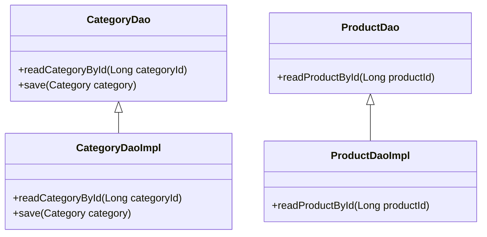

# Understanding Catalog Data Access Objects

In the Catalog module, Data Access Objects (DAOs) provide an abstract interface to the database. They handle the persistence and retrieval of data related to catalog entities such as categories, products, and <SwmToken path="core/broadleaf-framework/src/main/java/org/broadleafcommerce/core/catalog/service/CatalogServiceImpl.java" pos="429:6:6" line-data="        List&lt;Sku&gt; skus = skuDao.findSkuByURI(uri);">`skus`</SwmToken>.

## <SwmToken path="core/broadleaf-framework/src/main/java/org/broadleafcommerce/core/catalog/dao/CategoryDaoImpl.java" pos="54:8:8" line-data="public class CategoryDaoImpl implements CategoryDao {">`CategoryDao`</SwmToken> Interface

The <SwmToken path="core/broadleaf-framework/src/main/java/org/broadleafcommerce/core/catalog/dao/CategoryDaoImpl.java" pos="54:8:8" line-data="public class CategoryDaoImpl implements CategoryDao {">`CategoryDao`</SwmToken> interface defines methods for accessing <SwmToken path="core/broadleaf-framework/src/main/java/org/broadleafcommerce/core/catalog/dao/CategoryDaoImpl.java" pos="84:3:3" line-data="    public Category save(Category category) {">`Category`</SwmToken> instances. These methods include retrieving categories by their primary key, external ID, or name, and saving category instances to the datastore.

## <SwmToken path="core/broadleaf-framework/src/main/java/org/broadleafcommerce/core/catalog/dao/CategoryDaoImpl.java" pos="54:8:8" line-data="public class CategoryDaoImpl implements CategoryDao {">`CategoryDao`</SwmToken> Implementation

The <SwmToken path="core/broadleaf-framework/src/main/java/org/broadleafcommerce/core/catalog/dao/CategoryDaoImpl.java" pos="54:8:8" line-data="public class CategoryDaoImpl implements CategoryDao {">`CategoryDao`</SwmToken> is implemented by the <SwmToken path="core/broadleaf-framework/src/main/java/org/broadleafcommerce/core/catalog/dao/CategoryDaoImpl.java" pos="54:4:4" line-data="public class CategoryDaoImpl implements CategoryDao {">`CategoryDaoImpl`</SwmToken> class, which provides the actual database operations. This implementation is annotated with <SwmToken path="core/broadleaf-framework/src/main/java/org/broadleafcommerce/core/catalog/dao/CategoryDaoImpl.java" pos="53:0:1" line-data="@Repository(&quot;blCategoryDao&quot;)">`@Repository`</SwmToken> to indicate that it is a Spring-managed bean.

<SwmSnippet path="/core/broadleaf-framework/src/main/java/org/broadleafcommerce/core/catalog/dao/CategoryDaoImpl.java" line="53">

---

The <SwmToken path="core/broadleaf-framework/src/main/java/org/broadleafcommerce/core/catalog/dao/CategoryDaoImpl.java" pos="54:4:4" line-data="public class CategoryDaoImpl implements CategoryDao {">`CategoryDaoImpl`</SwmToken> class implements the <SwmToken path="core/broadleaf-framework/src/main/java/org/broadleafcommerce/core/catalog/dao/CategoryDaoImpl.java" pos="54:8:8" line-data="public class CategoryDaoImpl implements CategoryDao {">`CategoryDao`</SwmToken> interface and is annotated with <SwmToken path="core/broadleaf-framework/src/main/java/org/broadleafcommerce/core/catalog/dao/CategoryDaoImpl.java" pos="53:0:1" line-data="@Repository(&quot;blCategoryDao&quot;)">`@Repository`</SwmToken>.

```java
@Repository("blCategoryDao")
public class CategoryDaoImpl implements CategoryDao {
```

---

</SwmSnippet>

<SwmSnippet path="/core/broadleaf-framework/src/main/java/org/broadleafcommerce/core/catalog/service/CategorySiteMapGenerator.java" line="57">

---

The <SwmToken path="core/broadleaf-framework/src/main/java/org/broadleafcommerce/core/catalog/service/CategorySiteMapGenerator.java" pos="58:3:3" line-data="    protected CategoryDao categoryDao;">`CategoryDao`</SwmToken> is injected into the <SwmToken path="core/broadleaf-framework/src/main/java/org/broadleafcommerce/core/catalog/service/CategorySiteMapGenerator.java" pos="51:4:4" line-data="public class CategorySiteMapGenerator implements SiteMapGenerator {">`CategorySiteMapGenerator`</SwmToken> service to perform category-related operations.

```java
    @Resource(name = "blCategoryDao")
    protected CategoryDao categoryDao;
```

---

</SwmSnippet>

<SwmSnippet path="/core/broadleaf-framework/src/main/java/org/broadleafcommerce/core/catalog/service/CatalogServiceImpl.java" line="53">

---

The <SwmToken path="core/broadleaf-framework/src/main/java/org/broadleafcommerce/core/catalog/service/CatalogServiceImpl.java" pos="54:3:3" line-data="    protected CategoryDao categoryDao;">`CategoryDao`</SwmToken> is injected into the <SwmToken path="core/broadleaf-framework/src/main/java/org/broadleafcommerce/core/catalog/service/CatalogServiceImpl.java" pos="51:4:4" line-data="public class CatalogServiceImpl implements CatalogService {">`CatalogServiceImpl`</SwmToken> service to perform category-related operations.

```java
    @Resource(name="blCategoryDao")
    protected CategoryDao categoryDao;
```

---

</SwmSnippet>

<SwmSnippet path="/core/broadleaf-framework/src/main/java/org/broadleafcommerce/core/catalog/dao/CategoryDaoImpl.java" line="83">

---

The <SwmToken path="core/broadleaf-framework/src/main/java/org/broadleafcommerce/core/catalog/dao/CategoryDaoImpl.java" pos="84:5:5" line-data="    public Category save(Category category) {">`save`</SwmToken> method in <SwmToken path="core/broadleaf-framework/src/main/java/org/broadleafcommerce/core/catalog/dao/CategoryDaoImpl.java" pos="54:4:4" line-data="public class CategoryDaoImpl implements CategoryDao {">`CategoryDaoImpl`</SwmToken> merges the state of the given <SwmToken path="core/broadleaf-framework/src/main/java/org/broadleafcommerce/core/catalog/dao/CategoryDaoImpl.java" pos="84:3:3" line-data="    public Category save(Category category) {">`Category`</SwmToken> entity into the current persistence context.

```java
    @Override
    public Category save(Category category) {
        return em.merge(category);
    }
```

---

</SwmSnippet>

### <SwmToken path="core/broadleaf-framework/src/main/java/org/broadleafcommerce/core/catalog/dao/CategoryDaoImpl.java" pos="89:5:5" line-data="    public Category readCategoryById(Long categoryId) {">`readCategoryById`</SwmToken>

The <SwmToken path="core/broadleaf-framework/src/main/java/org/broadleafcommerce/core/catalog/dao/CategoryDaoImpl.java" pos="89:5:5" line-data="    public Category readCategoryById(Long categoryId) {">`readCategoryById`</SwmToken> function retrieves a <SwmToken path="core/broadleaf-framework/src/main/java/org/broadleafcommerce/core/catalog/dao/CategoryDaoImpl.java" pos="84:3:3" line-data="    public Category save(Category category) {">`Category`</SwmToken> instance by its primary key. It uses the <SwmToken path="core/broadleaf-framework/src/main/java/org/broadleafcommerce/core/catalog/dao/CategoryDaoImpl.java" pos="40:6:6" line-data="import javax.persistence.EntityManager;">`EntityManager`</SwmToken> to find the entity by its ID.

<SwmSnippet path="/core/broadleaf-framework/src/main/java/org/broadleafcommerce/core/catalog/dao/CategoryDaoImpl.java" line="88">

---

The <SwmToken path="core/broadleaf-framework/src/main/java/org/broadleafcommerce/core/catalog/dao/CategoryDaoImpl.java" pos="89:5:5" line-data="    public Category readCategoryById(Long categoryId) {">`readCategoryById`</SwmToken> method in <SwmToken path="core/broadleaf-framework/src/main/java/org/broadleafcommerce/core/catalog/dao/CategoryDaoImpl.java" pos="54:4:4" line-data="public class CategoryDaoImpl implements CategoryDao {">`CategoryDaoImpl`</SwmToken> retrieves a <SwmToken path="core/broadleaf-framework/src/main/java/org/broadleafcommerce/core/catalog/dao/CategoryDaoImpl.java" pos="89:3:3" line-data="    public Category readCategoryById(Long categoryId) {">`Category`</SwmToken> instance by its primary key using the <SwmToken path="core/broadleaf-framework/src/main/java/org/broadleafcommerce/core/catalog/dao/CategoryDaoImpl.java" pos="40:6:6" line-data="import javax.persistence.EntityManager;">`EntityManager`</SwmToken>.

```java
    @Override
    public Category readCategoryById(Long categoryId) {
        return em.find(CategoryImpl.class, categoryId);
    }
```

---

</SwmSnippet>

### <SwmToken path="core/broadleaf-framework/src/main/java/org/broadleafcommerce/core/catalog/dao/ProductDaoImpl.java" pos="105:5:5" line-data="    public Product readProductById(Long productId) {">`readProductById`</SwmToken>

The <SwmToken path="core/broadleaf-framework/src/main/java/org/broadleafcommerce/core/catalog/dao/ProductDaoImpl.java" pos="105:5:5" line-data="    public Product readProductById(Long productId) {">`readProductById`</SwmToken> function retrieves a <SwmToken path="core/broadleaf-framework/src/main/java/org/broadleafcommerce/core/catalog/dao/ProductDaoImpl.java" pos="105:3:3" line-data="    public Product readProductById(Long productId) {">`Product`</SwmToken> instance by its primary key. It uses the <SwmToken path="core/broadleaf-framework/src/main/java/org/broadleafcommerce/core/catalog/dao/CategoryDaoImpl.java" pos="40:6:6" line-data="import javax.persistence.EntityManager;">`EntityManager`</SwmToken> to find the entity by its ID.

<SwmSnippet path="/core/broadleaf-framework/src/main/java/org/broadleafcommerce/core/catalog/dao/ProductDaoImpl.java" line="104">

---

The <SwmToken path="core/broadleaf-framework/src/main/java/org/broadleafcommerce/core/catalog/dao/ProductDaoImpl.java" pos="105:5:5" line-data="    public Product readProductById(Long productId) {">`readProductById`</SwmToken> method in <SwmToken path="core/broadleaf-framework/src/main/java/org/broadleafcommerce/core/catalog/dao/ProductDaoImpl.java" pos="75:4:4" line-data="public class ProductDaoImpl implements ProductDao {">`ProductDaoImpl`</SwmToken> retrieves a <SwmToken path="core/broadleaf-framework/src/main/java/org/broadleafcommerce/core/catalog/dao/ProductDaoImpl.java" pos="105:3:3" line-data="    public Product readProductById(Long productId) {">`Product`</SwmToken> instance by its primary key using the <SwmToken path="core/broadleaf-framework/src/main/java/org/broadleafcommerce/core/catalog/dao/CategoryDaoImpl.java" pos="40:6:6" line-data="import javax.persistence.EntityManager;">`EntityManager`</SwmToken>.

```java
    @Override
    public Product readProductById(Long productId) {
        return em.find(ProductImpl.class, productId);
    }
```

---

</SwmSnippet>

## Catalog DAO Endpoints

The Catalog DAO endpoints provide methods for retrieving catalog entities by their primary keys.

### <SwmToken path="core/broadleaf-framework/src/main/java/org/broadleafcommerce/core/catalog/dao/ProductDaoImpl.java" pos="105:5:5" line-data="    public Product readProductById(Long productId) {">`readProductById`</SwmToken>

The <SwmToken path="core/broadleaf-framework/src/main/java/org/broadleafcommerce/core/catalog/dao/ProductDaoImpl.java" pos="105:5:5" line-data="    public Product readProductById(Long productId) {">`readProductById`</SwmToken> method retrieves a <SwmToken path="core/broadleaf-framework/src/main/java/org/broadleafcommerce/core/catalog/dao/ProductDaoImpl.java" pos="105:3:3" line-data="    public Product readProductById(Long productId) {">`Product`</SwmToken> instance by its primary key. This method is essential for fetching product details based on the product ID.

<SwmSnippet path="/core/broadleaf-framework/src/main/java/org/broadleafcommerce/core/catalog/dao/ProductDao.java" line="38">

---

The <SwmToken path="core/broadleaf-framework/src/main/java/org/broadleafcommerce/core/catalog/dao/ProductDao.java" pos="45:5:5" line-data="    public Product readProductById(@Nonnull Long productId);">`readProductById`</SwmToken> method in <SwmToken path="core/broadleaf-framework/src/main/java/org/broadleafcommerce/core/catalog/service/CatalogServiceImpl.java" pos="25:12:12" line-data="import org.broadleafcommerce.core.catalog.dao.ProductDao;">`ProductDao`</SwmToken> retrieves a <SwmToken path="core/broadleaf-framework/src/main/java/org/broadleafcommerce/core/catalog/dao/ProductDao.java" pos="39:11:11" line-data="     * Retrieve a {@code Product} instance by its primary key">`Product`</SwmToken> instance by its primary key.

```java
    /**
     * Retrieve a {@code Product} instance by its primary key
     *
     * @param productId the primary key of the product
     * @return the product instance at the specified primary key
     */
    @Nonnull
    public Product readProductById(@Nonnull Long productId);
```

---

</SwmSnippet>

### <SwmToken path="core/broadleaf-framework/src/main/java/org/broadleafcommerce/core/catalog/dao/CategoryDaoImpl.java" pos="89:5:5" line-data="    public Category readCategoryById(Long categoryId) {">`readCategoryById`</SwmToken>

The <SwmToken path="core/broadleaf-framework/src/main/java/org/broadleafcommerce/core/catalog/dao/CategoryDaoImpl.java" pos="89:5:5" line-data="    public Category readCategoryById(Long categoryId) {">`readCategoryById`</SwmToken> method retrieves a <SwmToken path="core/broadleaf-framework/src/main/java/org/broadleafcommerce/core/catalog/dao/CategoryDaoImpl.java" pos="84:3:3" line-data="    public Category save(Category category) {">`Category`</SwmToken> instance by its primary key. This method is used to fetch category details based on the category ID.

<SwmSnippet path="/core/broadleaf-framework/src/main/java/org/broadleafcommerce/core/catalog/dao/CategoryDao.java" line="38">

---

The <SwmToken path="core/broadleaf-framework/src/main/java/org/broadleafcommerce/core/catalog/dao/CategoryDao.java" pos="45:5:5" line-data="    public Category readCategoryById(@Nonnull Long categoryId);">`readCategoryById`</SwmToken> method in <SwmToken path="core/broadleaf-framework/src/main/java/org/broadleafcommerce/core/catalog/dao/CategoryDaoImpl.java" pos="54:8:8" line-data="public class CategoryDaoImpl implements CategoryDao {">`CategoryDao`</SwmToken> retrieves a <SwmToken path="core/broadleaf-framework/src/main/java/org/broadleafcommerce/core/catalog/dao/CategoryDao.java" pos="39:11:11" line-data="     * Retrieve a {@code Category} instance by its primary key">`Category`</SwmToken> instance by its primary key.

```java
    /**
     * Retrieve a {@code Category} instance by its primary key
     *
     * @param categoryId the primary key of the {@code Category}
     * @return the {@code Category}  at the specified primary key
     */
    @Nonnull
    public Category readCategoryById(@Nonnull Long categoryId);
```

---

</SwmSnippet>

&nbsp;

*This is an auto-generated document by Swimm AI 🌊 and has not yet been verified by a human*

<SwmMeta version="3.0.0" repo-id="Z2l0aHViJTNBJTNBQnJvYWRsZWFmQ29tbWVyY2UtZGVtby1uZXclM0ElM0FTd2ltbS1EZW1v" repo-name="BroadleafCommerce-demo-new" doc-type="overview"><sup>Powered by [Swimm](/)</sup></SwmMeta>
