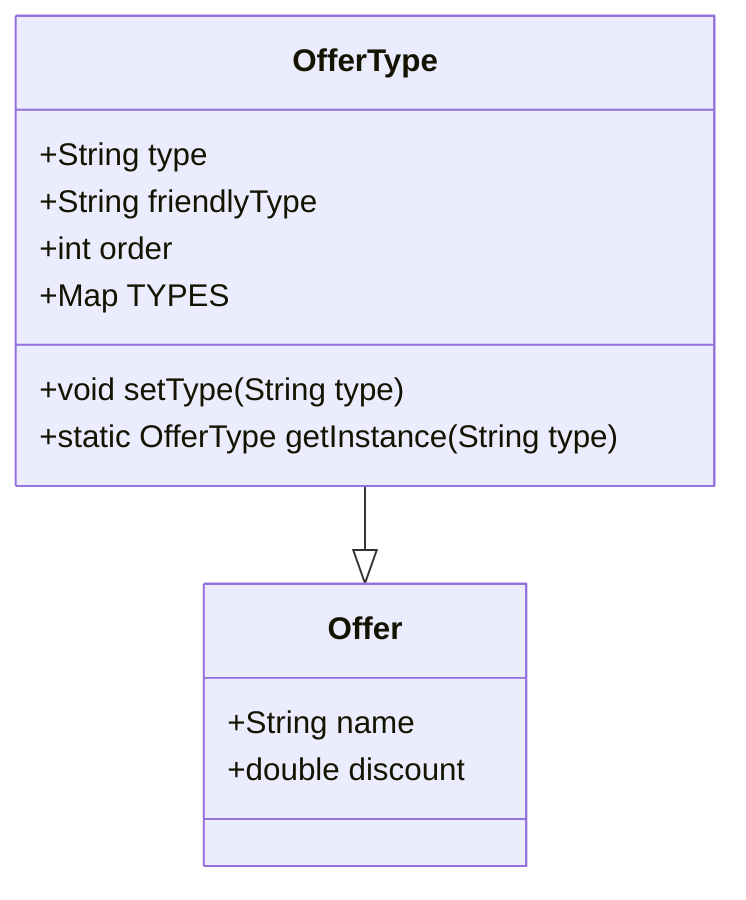

## Type Field

The <SwmToken path="core/broadleaf-framework/src/main/java/org/broadleafcommerce/core/offer/service/type/OfferType.java" pos="40:13:13" line-data="    public static OfferType getInstance(final String type) {">`type`</SwmToken> field in the <SwmToken path="core/broadleaf-framework/src/main/java/org/broadleafcommerce/core/offer/service/type/OfferType.java" pos="40:5:5" line-data="    public static OfferType getInstance(final String type) {">`OfferType`</SwmToken> class represents the type of an offer. It is used to categorize different kinds of offers, such as 'ORDER' or 'DISCOUNT'. This categorization helps in managing and applying offers efficiently within the application.

<SwmSnippet path="/core/broadleaf-framework/src/main/java/org/broadleafcommerce/core/offer/service/type/OfferType.java" line="44">

---

The <SwmToken path="core/broadleaf-framework/src/main/java/org/broadleafcommerce/core/offer/service/type/OfferType.java" pos="44:5:5" line-data="    private String type;">`type`</SwmToken> field is declared in the <SwmToken path="core/broadleaf-framework/src/main/java/org/broadleafcommerce/core/offer/service/type/OfferType.java" pos="40:5:5" line-data="    public static OfferType getInstance(final String type) {">`OfferType`</SwmToken> class to store the type of the offer.

```java
    private String type;
    private String friendlyType;
    private int order;    
```

---

</SwmSnippet>

## <SwmToken path="core/broadleaf-framework/src/main/java/org/broadleafcommerce/core/offer/service/type/OfferType.java" pos="54:1:1" line-data="        setType(type);">`setType`</SwmToken> Method

The <SwmToken path="core/broadleaf-framework/src/main/java/org/broadleafcommerce/core/offer/service/type/OfferType.java" pos="54:1:1" line-data="        setType(type);">`setType`</SwmToken> method assigns a value to the <SwmToken path="core/broadleaf-framework/src/main/java/org/broadleafcommerce/core/offer/service/type/OfferType.java" pos="40:13:13" line-data="    public static OfferType getInstance(final String type) {">`type`</SwmToken> field and ensures that the type is registered in the <SwmToken path="core/broadleaf-framework/src/main/java/org/broadleafcommerce/core/offer/service/type/OfferType.java" pos="41:3:3" line-data="        return TYPES.get(type);">`TYPES`</SwmToken> map. This allows for efficient lookup and management of offer types within the application.

<SwmSnippet path="/core/broadleaf-framework/src/main/java/org/broadleafcommerce/core/offer/service/type/OfferType.java" line="58">

---

The <SwmToken path="core/broadleaf-framework/src/main/java/org/broadleafcommerce/core/offer/service/type/OfferType.java" pos="58:5:5" line-data="    public void setType(final String type) {">`setType`</SwmToken> method assigns a value to the <SwmToken path="core/broadleaf-framework/src/main/java/org/broadleafcommerce/core/offer/service/type/OfferType.java" pos="58:11:11" line-data="    public void setType(final String type) {">`type`</SwmToken> field and ensures that the type is registered in the <SwmToken path="core/broadleaf-framework/src/main/java/org/broadleafcommerce/core/offer/service/type/OfferType.java" pos="60:5:5" line-data="        if (!TYPES.containsKey(type)) {">`TYPES`</SwmToken> map.

```java
    public void setType(final String type) {
        this.type = type;
        if (!TYPES.containsKey(type)) {
            TYPES.put(type, this);
        }
    }
```

---

</SwmSnippet>

## Usage of <SwmToken path="core/broadleaf-framework/src/main/java/org/broadleafcommerce/core/offer/service/type/OfferType.java" pos="54:1:1" line-data="        setType(type);">`setType`</SwmToken>

The <SwmToken path="core/broadleaf-framework/src/main/java/org/broadleafcommerce/core/offer/service/type/OfferType.java" pos="54:1:1" line-data="        setType(type);">`setType`</SwmToken> method is used within the <SwmToken path="core/broadleaf-framework/src/main/java/org/broadleafcommerce/core/offer/service/type/OfferType.java" pos="40:5:5" line-data="    public static OfferType getInstance(final String type) {">`OfferType`</SwmToken> constructor to initialize the type of the offer. This ensures that every offer type is properly categorized upon creation.

<SwmSnippet path="/core/broadleaf-framework/src/main/java/org/broadleafcommerce/core/offer/service/type/OfferType.java" line="53">

---

The <SwmToken path="core/broadleaf-framework/src/main/java/org/broadleafcommerce/core/offer/service/type/OfferType.java" pos="54:1:1" line-data="        setType(type);">`setType`</SwmToken> method is used within the <SwmToken path="core/broadleaf-framework/src/main/java/org/broadleafcommerce/core/offer/service/type/OfferType.java" pos="40:5:5" line-data="    public static OfferType getInstance(final String type) {">`OfferType`</SwmToken> constructor to initialize the type of the offer.

```java
        this.friendlyType = friendlyType;
        setType(type);
        setOrder(order);
```

---

</SwmSnippet>

## Efficient Lookup

The <SwmToken path="core/broadleaf-framework/src/main/java/org/broadleafcommerce/core/offer/service/type/OfferType.java" pos="40:7:7" line-data="    public static OfferType getInstance(final String type) {">`getInstance`</SwmToken> method allows for efficient lookup of offer types using the <SwmToken path="core/broadleaf-framework/src/main/java/org/broadleafcommerce/core/offer/service/type/OfferType.java" pos="41:3:3" line-data="        return TYPES.get(type);">`TYPES`</SwmToken> map. This method retrieves the offer type based on the provided type string, ensuring quick access to the relevant offer type.

<SwmSnippet path="/core/broadleaf-framework/src/main/java/org/broadleafcommerce/core/offer/service/type/OfferType.java" line="40">

---

The <SwmToken path="core/broadleaf-framework/src/main/java/org/broadleafcommerce/core/offer/service/type/OfferType.java" pos="40:7:7" line-data="    public static OfferType getInstance(final String type) {">`getInstance`</SwmToken> method allows for efficient lookup of offer types using the <SwmToken path="core/broadleaf-framework/src/main/java/org/broadleafcommerce/core/offer/service/type/OfferType.java" pos="41:3:3" line-data="        return TYPES.get(type);">`TYPES`</SwmToken> map.

```java
    public static OfferType getInstance(final String type) {
        return TYPES.get(type);
    }
```

---

</SwmSnippet>

&nbsp;

*This is an auto-generated document by Swimm AI 🌊 and has not yet been verified by a human*

<SwmMeta version="3.0.0" repo-id="Z2l0aHViJTNBJTNBQnJvYWRsZWFmQ29tbWVyY2UtZGVtby1uZXclM0ElM0FTd2ltbS1EZW1v" repo-name="BroadleafCommerce-demo-new" doc-type="overview"><sup>Powered by [Swimm](/)</sup></SwmMeta>
