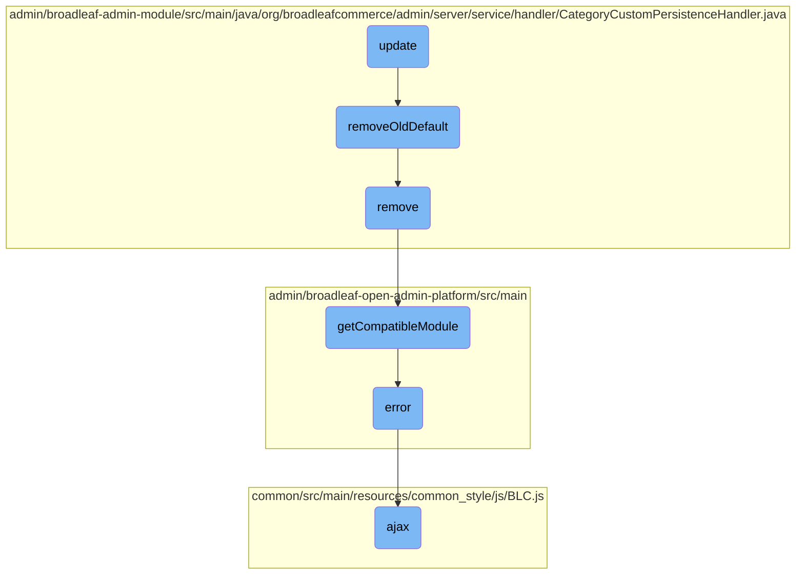

In this document, we will explain the process of updating a category entity. The process involves validating the category, retrieving the current category instance, merging the updated data, and handling the category cross-reference.

The flow starts with validating the category to ensure it meets the required criteria. Next, the current category instance is retrieved from the database. The updated data is then merged into this instance. If the extension manager does not handle the update, the category cross-reference is set up, and the old default category is removed if necessary.

# Flow drill down



<SwmSnippet path="/admin/broadleaf-admin-module/src/main/java/org/broadleafcommerce/admin/server/service/handler/CategoryCustomPersistenceHandler.java" line="148">

---

## Update Flow

The <SwmToken path="admin/broadleaf-admin-module/src/main/java/org/broadleafcommerce/admin/server/service/handler/CategoryCustomPersistenceHandler.java" pos="149:5:5" line-data="    public Entity update(PersistencePackage persistencePackage, DynamicEntityDao dynamicEntityDao, RecordHelper helper) throws ServiceException {">`update`</SwmToken> function is responsible for updating a category entity. It first validates the category, retrieves the current category instance, and then merges the updated data. If the extension manager does not handle the update, it proceeds to set up the category cross-reference and remove the old default category.

```java
    @Override
    public Entity update(PersistencePackage persistencePackage, DynamicEntityDao dynamicEntityDao, RecordHelper helper) throws ServiceException {
        Entity entity = persistencePackage.getEntity();
        this.validateCategory(entity);
        try {
            PersistencePerspective persistencePerspective = persistencePackage.getPersistencePerspective();
            Map<String, FieldMetadata> adminProperties = helper.getSimpleMergedProperties(Category.class.getName(), persistencePerspective);
            Object primaryKey = helper.getPrimaryKey(entity, adminProperties);
            Category adminInstance = (Category) dynamicEntityDao.retrieve(Class.forName(entity.getType()[0]), primaryKey);
            CategoryXref oldDefault = this.getCurrentDefaultXref(adminInstance);
            adminInstance = (Category) helper.createPopulatedInstance(adminInstance, entity, adminProperties, false);
            adminInstance = dynamicEntityDao.merge(adminInstance);
            boolean handled = false;
            if (extensionManager != null) {
                ExtensionResultStatusType result = extensionManager.getProxy()
                        .manageParentCategoryForUpdate(persistencePackage, adminInstance);
                handled = ExtensionResultStatusType.NOT_HANDLED != result;
            }
            if (!handled) {
                setupXref(adminInstance);
                removeOldDefault(adminInstance, oldDefault, entity);
```

---

</SwmSnippet>

<SwmSnippet path="/admin/broadleaf-admin-module/src/main/java/org/broadleafcommerce/admin/server/service/handler/CategoryCustomPersistenceHandler.java" line="280">

---

### Removing Old Default Category

The <SwmToken path="admin/broadleaf-admin-module/src/main/java/org/broadleafcommerce/admin/server/service/handler/CategoryCustomPersistenceHandler.java" pos="280:5:5" line-data="    protected void removeOldDefault(Category adminInstance, CategoryXref oldDefault, Entity entity) {">`removeOldDefault`</SwmToken> function checks if the category is in default legacy mode. If not, it updates the parent category and removes the old default category cross-reference if it has changed.

```java
    protected void removeOldDefault(Category adminInstance, CategoryXref oldDefault, Entity entity) {
        if (!isDefaultCategoryLegacyMode()) {
            if (entity.findProperty(DEFAULT_PARENT_CATEGORY) != null && StringUtils.isEmpty(entity.findProperty(DEFAULT_PARENT_CATEGORY).getValue())) {
                adminInstance.setParentCategory(null);
            }
            CategoryXref newDefault = this.getCurrentDefaultXref(adminInstance);
            if (oldDefault != null && !oldDefault.equals(newDefault)) {
                adminInstance.getAllParentCategoryXrefs().remove(oldDefault);
            }
        }
    }
```

---

</SwmSnippet>

<SwmSnippet path="/admin/broadleaf-admin-module/src/main/java/org/broadleafcommerce/admin/server/service/handler/CategoryCustomPersistenceHandler.java" line="177">

---

### Removing Category

The <SwmToken path="admin/broadleaf-admin-module/src/main/java/org/broadleafcommerce/admin/server/service/handler/CategoryCustomPersistenceHandler.java" pos="178:5:5" line-data="    public void remove(PersistencePackage persistencePackage, DynamicEntityDao dynamicEntityDao, RecordHelper helper) throws ServiceException {">`remove`</SwmToken> function handles the removal of a category. It first checks if the category has subcategories or is a primary category for any products. If not, it proceeds to remove the category using the compatible module.

```java
    @Override
    public void remove(PersistencePackage persistencePackage, DynamicEntityDao dynamicEntityDao, RecordHelper helper) throws ServiceException {
        String id = persistencePackage.getEntity().getPMap().get("id").getValue();
        checkIfHasSubCategories(persistencePackage, id);
        List<CategoryProductXref> resultList = categoryDao.findXrefByCategoryWithDefaultReference(Long.valueOf(id));
        if (resultList.isEmpty()) {
            OperationType removeType = persistencePackage.getPersistencePerspective().getOperationTypes().getRemoveType();
            helper.getCompatibleModule(removeType).remove(persistencePackage);
        } else {
            throw new ValidationException(persistencePackage.getEntity(), "Unable to delete category - found that this category is primary category for some product(s)");
        }
    }
```

---

</SwmSnippet>

<SwmSnippet path="/admin/broadleaf-open-admin-platform/src/main/java/org/broadleafcommerce/openadmin/server/service/persistence/PersistenceManagerImpl.java" line="850">

---

### Getting Compatible Module

The <SwmToken path="admin/broadleaf-open-admin-platform/src/main/java/org/broadleafcommerce/openadmin/server/service/persistence/PersistenceManagerImpl.java" pos="851:5:5" line-data="    public PersistenceModule getCompatibleModule(OperationType operationType) {">`getCompatibleModule`</SwmToken> function iterates through available persistence modules to find one that is compatible with the given operation type. If no compatible module is found, it logs an error and throws a runtime exception.

```java
    @Override
    public PersistenceModule getCompatibleModule(OperationType operationType) {
        PersistenceModule myModule = null;
        for (PersistenceModule module : modules) {
            if (module.isCompatible(operationType)) {
                myModule = module;
                break;
            }
        }
        if (myModule == null) {
            LOG.error("Unable to find a compatible remote service module for the operation type: " + operationType);
            throw new RuntimeException("Unable to find a compatible remote service module for the operation type: " + operationType);
        }

        return myModule;
    }
```

---

</SwmSnippet>

<SwmSnippet path="/admin/broadleaf-open-admin-platform/src/main/resources/open_admin_style/js/admin/blc-admin.js" line="1178">

---

### Handling Errors

The <SwmToken path="admin/broadleaf-open-admin-platform/src/main/resources/open_admin_style/js/admin/blc-admin.js" pos="1180:1:1" line-data="                error: function (error) {">`error`</SwmToken> function is a callback used in AJAX requests to handle errors. It is defined as part of the options for the AJAX request.

```javascript
                url: BLC.servletContext + '/update-navigation',
                type: "GET",
                error: function (error) {
                }
            }, function (data) {
```

---

</SwmSnippet>

<SwmSnippet path="/common/src/main/resources/common_style/js/BLC.js" line="135">

---

### AJAX Requests

The <SwmToken path="common/src/main/resources/common_style/js/BLC.js" pos="135:3:3" line-data="    function ajax(options, callback) {">`ajax`</SwmToken> function is a utility for making AJAX requests. It sets default options, handles CSRF tokens, and defines success and error callbacks. This function is used throughout the application for server communication.

```javascript
    function ajax(options, callback) {
        if (options.type == null) {
            options.type = 'GET';
        }

        var baseUrl = window.location.href;
        if (baseUrl.indexOf('isPostAdd') != -1) {
            if (options.url.indexOf('isPostAdd') < 0) {
                if (options.url.indexOf('?') > 0) {
                    options.url += "&";
                } else {
                    options.url += "?";
                }
                options.url += "isPostAdd=true";
            }
        }
        var savedCatalogElement = $('input[name ="catalogEntityCatalogDiscriminatorId"]');
        var savedCatalog=null;

        if(savedCatalogElement.length){
            //0 should be the one we need, other can be from the modal form
```

---

</SwmSnippet>

&nbsp;

*This is an auto-generated document by Swimm AI 🌊 and has not yet been verified by a human*

<SwmMeta version="3.0.0" repo-id="Z2l0aHViJTNBJTNBQnJvYWRsZWFmQ29tbWVyY2UtZGVtby1uZXclM0ElM0FTd2ltbS1EZW1v" repo-name="BroadleafCommerce-demo-new" doc-type="flows"><sup>Powered by [Swimm](/)</sup></SwmMeta>
