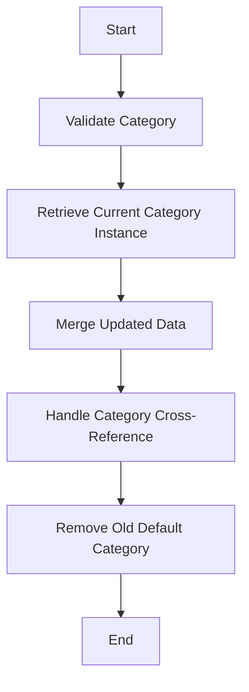

The process of updating a category entity involves several steps to ensure data integrity and proper functionality. This document will cover:

1. Validating the category
2. Retrieving the current category instance
3. Merging the updated data
4. Handling the category cross-reference
5. Removing the old default category

Technical document: <SwmLink doc-title="Updating a Category Entity">[Updating a Category Entity](/.swm/updating-a-category-entity.6yvv3v23.sw.md)</SwmLink>

# [Validating the Category](https://app.swimm.io/repos/Z2l0aHViJTNBJTNBQnJvYWRsZWFmQ29tbWVyY2UtZGVtby1uZXclM0ElM0FTd2ltbS1EZW1v/docs/6yvv3v23#validatecategory)

The first step in updating a category entity is to validate the category. This ensures that the category meets all the required criteria before any changes are made. Validation checks might include ensuring the category name is unique, verifying that mandatory fields are filled, and checking for any business rules specific to the category.

# [Retrieving the Current Category Instance](https://app.swimm.io/repos/Z2l0aHViJTNBJTNBQnJvYWRsZWFmQ29tbWVyY2UtZGVtby1uZXclM0ElM0FTd2ltbS1EZW1v/docs/6yvv3v23#retrieve)

After validation, the current instance of the category is retrieved from the database. This step is crucial as it provides the existing data that will be updated. Retrieving the current instance ensures that the update process works with the most recent data, preventing any potential conflicts or data inconsistencies.

# [Merging the Updated Data](https://app.swimm.io/repos/Z2l0aHViJTNBJTNBQnJvYWRsZWFmQ29tbWVyY2UtZGVtby1uZXclM0ElM0FTd2ltbS1EZW1v/docs/6yvv3v23#merge)

Once the current category instance is retrieved, the next step is to merge the updated data into this instance. This involves taking the new data provided by the user and integrating it with the existing data. The merging process ensures that only the specified fields are updated while preserving the rest of the category's data. This step is essential for maintaining data integrity and ensuring that no unintended changes are made.

# [Handling the Category Cross-Reference](https://app.swimm.io/repos/Z2l0aHViJTNBJTNBQnJvYWRsZWFmQ29tbWVyY2UtZGVtby1uZXclM0ElM0FTd2ltbS1EZW1v/docs/6yvv3v23#setupxref)

If the extension manager does not handle the update, the system sets up the category cross-reference. This involves updating any relationships the category has with other entities, such as parent categories or related products. Properly handling cross-references ensures that all related data remains consistent and accurate after the update.

# [Removing the Old Default Category](https://app.swimm.io/repos/Z2l0aHViJTNBJTNBQnJvYWRsZWFmQ29tbWVyY2UtZGVtby1uZXclM0ElM0FTd2ltbS1EZW1v/docs/6yvv3v23#removeolddefault)

The final step in the process is to remove the old default category if necessary. This step checks if the category is in default legacy mode. If not, it updates the parent category and removes the old default category cross-reference if it has changed. This ensures that the category hierarchy remains accurate and that no outdated references are left in the system.

&nbsp;

*This is an auto-generated document by Swimm AI 🌊 and has not yet been verified by a human*

<SwmMeta version="3.0.0" repo-id="Z2l0aHViJTNBJTNBQnJvYWRsZWFmQ29tbWVyY2UtZGVtby1uZXclM0ElM0FTd2ltbS1EZW1v" repo-name="BroadleafCommerce-demo-new" doc-type="product-flows">Powered by [Swimm](/)</SwmMeta>
