In this document, we will explain the process of updating an entity within a map structure. The process involves several steps to ensure the entity is correctly updated and validated.

The update process starts by checking if the map structure is mutable. If it is, the existing entity instance is retrieved. The key property is then validated to ensure it is not reserved. The map is updated with the new value instance, and the updated instance is merged back into the persistence layer. Finally, the updated entity is returned.

Here is a high level diagram of the flow, showing only the most important functions:

```mermaid
graph TD;
      subgraph admin/broadleaf-open-admin-platform/src/main/java/org/broadleafcommerce/openadmin/server/service/persistence/module
ca3fae5e8fe190d89dfb234ae0d9717c6e3b23b08658c11f17a4d78da09317db(update):::mainFlowStyle --> 07cdb23911b140e966fbd2c0b4299fa7d0e7191f80bf9ebdbf58a6d45de8c5ab(remove)
end

subgraph admin/broadleaf-open-admin-platform/src/main/java/org/broadleafcommerce/openadmin/server/service/persistence/module
ca3fae5e8fe190d89dfb234ae0d9717c6e3b23b08658c11f17a4d78da09317db(update):::mainFlowStyle --> 555d3bff08c82c01d7ddf7db93bd9d542b5008463348b7ef18e56b296586422a(getMapRecords):::mainFlowStyle
end

subgraph admin/broadleaf-open-admin-platform/src/main/java/org/broadleafcommerce/openadmin/server/service/persistence/module
555d3bff08c82c01d7ddf7db93bd9d542b5008463348b7ef18e56b296586422a(getMapRecords):::mainFlowStyle --> 1c298ee39ec9706bc22a5e5b62d5997ef5bc94a179c27d3ee47822bad8886b9c(getMapRecord)
end

subgraph admin/broadleaf-open-admin-platform/src/main/java/org/broadleafcommerce/openadmin/server/service/persistence/module
555d3bff08c82c01d7ddf7db93bd9d542b5008463348b7ef18e56b296586422a(getMapRecords):::mainFlowStyle --> dd6683077215bfa40cc02308ac9c6d99800864f2b5ec92600c92bb392db9b650(add):::mainFlowStyle
end

subgraph admin/broadleaf-open-admin-platform/src/main/java/org/broadleafcommerce/openadmin/server/service/persistence/module
dd6683077215bfa40cc02308ac9c6d99800864f2b5ec92600c92bb392db9b650(add):::mainFlowStyle --> e397e7a4073e60a59abecd2977d6860cc7361ba3dde7b0c462c898d8d9e01241(setFieldValue):::mainFlowStyle
end


      classDef mainFlowStyle color:#000000,fill:#7CB9F4
classDef rootsStyle color:#000000,fill:#00FFF4
classDef Style1 color:#000000,fill:#00FFAA
classDef Style2 color:#000000,fill:#FFFF00
classDef Style3 color:#000000,fill:#AA7CB9

%% Swimm:
%% graph TD;
%%       subgraph <SwmPath>[admin/broadleaf-open-admin-platform/src/main/java/org/broadleafcommerce/openadmin/server/service/persistence/module/](admin/broadleaf-open-admin-platform/src/main/java/org/broadleafcommerce/openadmin/server/service/persistence/module/)</SwmPath>
%% ca3fae5e8fe190d89dfb234ae0d9717c6e3b23b08658c11f17a4d78da09317db(update):::mainFlowStyle --> 07cdb23911b140e966fbd2c0b4299fa7d0e7191f80bf9ebdbf58a6d45de8c5ab(remove)
%% end
%% 
%% subgraph <SwmPath>[admin/broadleaf-open-admin-platform/src/main/java/org/broadleafcommerce/openadmin/server/service/persistence/module/](admin/broadleaf-open-admin-platform/src/main/java/org/broadleafcommerce/openadmin/server/service/persistence/module/)</SwmPath>
%% ca3fae5e8fe190d89dfb234ae0d9717c6e3b23b08658c11f17a4d78da09317db(update):::mainFlowStyle --> 555d3bff08c82c01d7ddf7db93bd9d542b5008463348b7ef18e56b296586422a(getMapRecords):::mainFlowStyle
%% end
%% 
%% subgraph <SwmPath>[admin/broadleaf-open-admin-platform/src/main/java/org/broadleafcommerce/openadmin/server/service/persistence/module/](admin/broadleaf-open-admin-platform/src/main/java/org/broadleafcommerce/openadmin/server/service/persistence/module/)</SwmPath>
%% 555d3bff08c82c01d7ddf7db93bd9d542b5008463348b7ef18e56b296586422a(getMapRecords):::mainFlowStyle --> 1c298ee39ec9706bc22a5e5b62d5997ef5bc94a179c27d3ee47822bad8886b9c(getMapRecord)
%% end
%% 
%% subgraph <SwmPath>[admin/broadleaf-open-admin-platform/src/main/java/org/broadleafcommerce/openadmin/server/service/persistence/module/](admin/broadleaf-open-admin-platform/src/main/java/org/broadleafcommerce/openadmin/server/service/persistence/module/)</SwmPath>
%% 555d3bff08c82c01d7ddf7db93bd9d542b5008463348b7ef18e56b296586422a(getMapRecords):::mainFlowStyle --> dd6683077215bfa40cc02308ac9c6d99800864f2b5ec92600c92bb392db9b650(add):::mainFlowStyle
%% end
%% 
%% subgraph <SwmPath>[admin/broadleaf-open-admin-platform/src/main/java/org/broadleafcommerce/openadmin/server/service/persistence/module/](admin/broadleaf-open-admin-platform/src/main/java/org/broadleafcommerce/openadmin/server/service/persistence/module/)</SwmPath>
%% dd6683077215bfa40cc02308ac9c6d99800864f2b5ec92600c92bb392db9b650(add):::mainFlowStyle --> e397e7a4073e60a59abecd2977d6860cc7361ba3dde7b0c462c898d8d9e01241(setFieldValue):::mainFlowStyle
%% end
%% 
%% 
%%       classDef mainFlowStyle color:#000000,fill:#7CB9F4
%% classDef rootsStyle color:#000000,fill:#00FFF4
%% classDef Style1 color:#000000,fill:#00FFAA
%% classDef Style2 color:#000000,fill:#FFFF00
%% classDef Style3 color:#000000,fill:#AA7CB9
```



# Flow drill down

First, we'll zoom into this section of the flow:

```mermaid
graph TD;
      subgraph admin/broadleaf-open-admin-platform/src/main/java/org/broadleafcommerce/openadmin/server/service/persistence/module
ca3fae5e8fe190d89dfb234ae0d9717c6e3b23b08658c11f17a4d78da09317db(update):::mainFlowStyle --> 07cdb23911b140e966fbd2c0b4299fa7d0e7191f80bf9ebdbf58a6d45de8c5ab(remove)
end

subgraph admin/broadleaf-open-admin-platform/src/main/java/org/broadleafcommerce/openadmin/server/service/persistence/module
ca3fae5e8fe190d89dfb234ae0d9717c6e3b23b08658c11f17a4d78da09317db(update):::mainFlowStyle --> 555d3bff08c82c01d7ddf7db93bd9d542b5008463348b7ef18e56b296586422a(getMapRecords):::mainFlowStyle
end

subgraph admin/broadleaf-open-admin-platform/src/main/java/org/broadleafcommerce/openadmin/server/service/persistence/module
555d3bff08c82c01d7ddf7db93bd9d542b5008463348b7ef18e56b296586422a(getMapRecords):::mainFlowStyle --> 3sc0q(...)
end

subgraph admin/broadleaf-open-admin-platform/src/main/java/org/broadleafcommerce/openadmin/server/service/persistence/module
07cdb23911b140e966fbd2c0b4299fa7d0e7191f80bf9ebdbf58a6d45de8c5ab(remove) --> ddcb073c09911433b61933d36c041aebfceb561643ca926ffe20aa3f19eeb6e2(getFieldValue)
end


      classDef mainFlowStyle color:#000000,fill:#7CB9F4
classDef rootsStyle color:#000000,fill:#00FFF4
classDef Style1 color:#000000,fill:#00FFAA
classDef Style2 color:#000000,fill:#FFFF00
classDef Style3 color:#000000,fill:#AA7CB9

%% Swimm:
%% graph TD;
%%       subgraph <SwmPath>[admin/broadleaf-open-admin-platform/src/main/java/org/broadleafcommerce/openadmin/server/service/persistence/module/](admin/broadleaf-open-admin-platform/src/main/java/org/broadleafcommerce/openadmin/server/service/persistence/module/)</SwmPath>
%% ca3fae5e8fe190d89dfb234ae0d9717c6e3b23b08658c11f17a4d78da09317db(update):::mainFlowStyle --> 07cdb23911b140e966fbd2c0b4299fa7d0e7191f80bf9ebdbf58a6d45de8c5ab(remove)
%% end
%% 
%% subgraph <SwmPath>[admin/broadleaf-open-admin-platform/src/main/java/org/broadleafcommerce/openadmin/server/service/persistence/module/](admin/broadleaf-open-admin-platform/src/main/java/org/broadleafcommerce/openadmin/server/service/persistence/module/)</SwmPath>
%% ca3fae5e8fe190d89dfb234ae0d9717c6e3b23b08658c11f17a4d78da09317db(update):::mainFlowStyle --> 555d3bff08c82c01d7ddf7db93bd9d542b5008463348b7ef18e56b296586422a(getMapRecords):::mainFlowStyle
%% end
%% 
%% subgraph <SwmPath>[admin/broadleaf-open-admin-platform/src/main/java/org/broadleafcommerce/openadmin/server/service/persistence/module/](admin/broadleaf-open-admin-platform/src/main/java/org/broadleafcommerce/openadmin/server/service/persistence/module/)</SwmPath>
%% 555d3bff08c82c01d7ddf7db93bd9d542b5008463348b7ef18e56b296586422a(getMapRecords):::mainFlowStyle --> 3sc0q(...)
%% end
%% 
%% subgraph <SwmPath>[admin/broadleaf-open-admin-platform/src/main/java/org/broadleafcommerce/openadmin/server/service/persistence/module/](admin/broadleaf-open-admin-platform/src/main/java/org/broadleafcommerce/openadmin/server/service/persistence/module/)</SwmPath>
%% 07cdb23911b140e966fbd2c0b4299fa7d0e7191f80bf9ebdbf58a6d45de8c5ab(remove) --> ddcb073c09911433b61933d36c041aebfceb561643ca926ffe20aa3f19eeb6e2(getFieldValue)
%% end
%% 
%% 
%%       classDef mainFlowStyle color:#000000,fill:#7CB9F4
%% classDef rootsStyle color:#000000,fill:#00FFF4
%% classDef Style1 color:#000000,fill:#00FFAA
%% classDef Style2 color:#000000,fill:#FFFF00
%% classDef Style3 color:#000000,fill:#AA7CB9
```



<SwmSnippet path="/admin/broadleaf-open-admin-platform/src/main/java/org/broadleafcommerce/openadmin/server/service/persistence/module/MapStructurePersistenceModule.java" line="297">

---

## Update Function

The <SwmToken path="admin/broadleaf-open-admin-platform/src/main/java/org/broadleafcommerce/openadmin/server/service/persistence/module/MapStructurePersistenceModule.java" pos="298:5:5" line-data="    public Entity update(PersistencePackage persistencePackage) throws ServiceException {">`update`</SwmToken> function is responsible for updating an entity within a map structure. It first checks if the map structure is mutable and then retrieves the existing entity instance. It validates the key property and updates the map with the new value instance. Finally, it merges the updated instance back into the persistence layer and returns the updated entity.

```java
    @Override
    public Entity update(PersistencePackage persistencePackage) throws ServiceException {
        String[] customCriteria = persistencePackage.getCustomCriteria();
        if (customCriteria != null && customCriteria.length > 0) {
            LOG.warn("custom persistence handlers and custom criteria not supported for update types other than BASIC");
        }
        PersistencePerspective persistencePerspective = persistencePackage.getPersistencePerspective();
        Entity entity = persistencePackage.getEntity();
        MapStructure mapStructure = (MapStructure) persistencePerspective.getPersistencePerspectiveItems().get(PersistencePerspectiveItemType.MAPSTRUCTURE);
        if (!mapStructure.getMutable()) {
            throw new SecurityServiceException("Field not mutable");
        }
        try {
            Map<String, FieldMetadata> ceilingMergedProperties = getSimpleMergedProperties(entity.getType()[0],
                    persistencePerspective);
            String mapKey = entity.findProperty(mapStructure.getKeyPropertyName()).getValue();
            if (ceilingMergedProperties.containsKey(mapStructure.getMapProperty() + FieldManager.MAPFIELDSEPARATOR + mapKey)) {
                throw new ServiceException("\"" + mapKey + "\" is a reserved property name.");
            }

            Serializable instance = persistenceManager.getDynamicEntityDao().retrieve(Class.forName(entity.getType()[0]), Long.valueOf(entity.findProperty("symbolicId").getValue()));
```

---

</SwmSnippet>

<SwmSnippet path="/admin/broadleaf-open-admin-platform/src/main/java/org/broadleafcommerce/openadmin/server/service/persistence/module/MapStructurePersistenceModule.java" line="418">

---

## Remove Function

The <SwmToken path="admin/broadleaf-open-admin-platform/src/main/java/org/broadleafcommerce/openadmin/server/service/persistence/module/MapStructurePersistenceModule.java" pos="419:5:5" line-data="    public void remove(PersistencePackage persistencePackage) throws ServiceException {">`remove`</SwmToken> function handles the removal of an entity from a map structure. It ensures the map structure is mutable and retrieves the existing entity instance. The function then removes the specified key from the map and, if configured, deletes the associated value entity from the persistence layer.

```java
    @Override
    public void remove(PersistencePackage persistencePackage) throws ServiceException {
        String[] customCriteria = persistencePackage.getCustomCriteria();
        if (customCriteria != null && customCriteria.length > 0) {
            LOG.warn("custom persistence handlers and custom criteria not supported for remove types other than BASIC");
        }
        PersistencePerspective persistencePerspective = persistencePackage.getPersistencePerspective();
        Entity entity = persistencePackage.getEntity();
        MapStructure mapStructure = (MapStructure) persistencePerspective.getPersistencePerspectiveItems().get(PersistencePerspectiveItemType.MAPSTRUCTURE);
        if (!mapStructure.getMutable()) {
            throw new SecurityServiceException("Field not mutable");
        }
        try {
            Map<String, FieldMetadata> ceilingMergedProperties = getSimpleMergedProperties(entity.getType()[0],
                    persistencePerspective);
            String mapKey = entity.findProperty(mapStructure.getKeyPropertyName()).getValue();
            if (ceilingMergedProperties.containsKey(mapStructure.getMapProperty() + FieldManager.MAPFIELDSEPARATOR + mapKey)) {
                throw new ServiceException("\"" + mapKey + "\" is a reserved property name.");
            }

            Serializable instance = persistenceManager.getDynamicEntityDao().retrieve(Class.forName(entity.getType()[0]), Long.valueOf(entity.findProperty("symbolicId").getValue()));
```

---

</SwmSnippet>

<SwmSnippet path="/admin/broadleaf-open-admin-platform/src/main/java/org/broadleafcommerce/openadmin/server/service/persistence/module/FieldManager.java" line="79">

---

## <SwmToken path="admin/broadleaf-open-admin-platform/src/main/java/org/broadleafcommerce/openadmin/server/service/persistence/module/FieldManager.java" pos="79:5:5" line-data="    public Object getFieldValue(Object bean, String fieldName) throws IllegalAccessException, FieldNotAvailableException {">`getFieldValue`</SwmToken> Function

The <SwmToken path="admin/broadleaf-open-admin-platform/src/main/java/org/broadleafcommerce/openadmin/server/service/persistence/module/FieldManager.java" pos="79:5:5" line-data="    public Object getFieldValue(Object bean, String fieldName) throws IllegalAccessException, FieldNotAvailableException {">`getFieldValue`</SwmToken> function retrieves the value of a specified field from a given bean. It tokenizes the field name to handle nested properties and map keys, accesses the field using reflection, and returns the deproxied value. If a field modifier manager is present, it applies any read value modifications before returning the final value.

```java
    public Object getFieldValue(Object bean, String fieldName) throws IllegalAccessException, FieldNotAvailableException {
        StringTokenizer tokens = new StringTokenizer(fieldName, ".");
        Class<?> componentClass = bean.getClass();
        Field field = null;
        Object value = HibernateUtils.deproxy(bean);

        while (tokens.hasMoreTokens()) {
            String fieldNamePart = tokens.nextToken();
            String mapKey = null;
            if (fieldNamePart.contains(FieldManager.MAPFIELDSEPARATOR)) {
                mapKey = fieldNamePart.substring(fieldNamePart.indexOf(FieldManager.MAPFIELDSEPARATOR) + FieldManager.MAPFIELDSEPARATOR.length(), fieldNamePart.length());
                fieldNamePart = fieldNamePart.substring(0, fieldNamePart.indexOf(FieldManager.MAPFIELDSEPARATOR));
            }
            field = getSingleField(componentClass, fieldNamePart);

            if (field != null) {
                field.setAccessible(true);
                value = field.get(value);
                value = HibernateUtils.deproxy(value);

                if (mapKey != null) {
```

---

</SwmSnippet>

Now, lets zoom into this section of the flow:

```mermaid
graph TD;
      subgraph admin/broadleaf-open-admin-platform/src/main/java/org/broadleafcommerce/openadmin/server/service/persistence/module
555d3bff08c82c01d7ddf7db93bd9d542b5008463348b7ef18e56b296586422a(getMapRecords):::mainFlowStyle --> 1c298ee39ec9706bc22a5e5b62d5997ef5bc94a179c27d3ee47822bad8886b9c(getMapRecord)
end

subgraph admin/broadleaf-open-admin-platform/src/main/java/org/broadleafcommerce/openadmin/server/service/persistence/module
555d3bff08c82c01d7ddf7db93bd9d542b5008463348b7ef18e56b296586422a(getMapRecords):::mainFlowStyle --> dd6683077215bfa40cc02308ac9c6d99800864f2b5ec92600c92bb392db9b650(add):::mainFlowStyle
end

subgraph admin/broadleaf-open-admin-platform/src/main/java/org/broadleafcommerce/openadmin/server/service/persistence/module
dd6683077215bfa40cc02308ac9c6d99800864f2b5ec92600c92bb392db9b650(add):::mainFlowStyle --> e397e7a4073e60a59abecd2977d6860cc7361ba3dde7b0c462c898d8d9e01241(setFieldValue):::mainFlowStyle
end

subgraph admin/broadleaf-open-admin-platform/src/main/java/org/broadleafcommerce/openadmin/server/service/persistence/module
1c298ee39ec9706bc22a5e5b62d5997ef5bc94a179c27d3ee47822bad8886b9c(getMapRecord) --> 5a2cd347a62d6c64d7ac6e81164507333458ca3f5265c19e050b9d8900e76cd8(extractPropertiesFromPersistentEntity)
end


      classDef mainFlowStyle color:#000000,fill:#7CB9F4
classDef rootsStyle color:#000000,fill:#00FFF4
classDef Style1 color:#000000,fill:#00FFAA
classDef Style2 color:#000000,fill:#FFFF00
classDef Style3 color:#000000,fill:#AA7CB9

%% Swimm:
%% graph TD;
%%       subgraph <SwmPath>[admin/broadleaf-open-admin-platform/src/main/java/org/broadleafcommerce/openadmin/server/service/persistence/module/](admin/broadleaf-open-admin-platform/src/main/java/org/broadleafcommerce/openadmin/server/service/persistence/module/)</SwmPath>
%% 555d3bff08c82c01d7ddf7db93bd9d542b5008463348b7ef18e56b296586422a(getMapRecords):::mainFlowStyle --> 1c298ee39ec9706bc22a5e5b62d5997ef5bc94a179c27d3ee47822bad8886b9c(getMapRecord)
%% end
%% 
%% subgraph <SwmPath>[admin/broadleaf-open-admin-platform/src/main/java/org/broadleafcommerce/openadmin/server/service/persistence/module/](admin/broadleaf-open-admin-platform/src/main/java/org/broadleafcommerce/openadmin/server/service/persistence/module/)</SwmPath>
%% 555d3bff08c82c01d7ddf7db93bd9d542b5008463348b7ef18e56b296586422a(getMapRecords):::mainFlowStyle --> dd6683077215bfa40cc02308ac9c6d99800864f2b5ec92600c92bb392db9b650(add):::mainFlowStyle
%% end
%% 
%% subgraph <SwmPath>[admin/broadleaf-open-admin-platform/src/main/java/org/broadleafcommerce/openadmin/server/service/persistence/module/](admin/broadleaf-open-admin-platform/src/main/java/org/broadleafcommerce/openadmin/server/service/persistence/module/)</SwmPath>
%% dd6683077215bfa40cc02308ac9c6d99800864f2b5ec92600c92bb392db9b650(add):::mainFlowStyle --> e397e7a4073e60a59abecd2977d6860cc7361ba3dde7b0c462c898d8d9e01241(setFieldValue):::mainFlowStyle
%% end
%% 
%% subgraph <SwmPath>[admin/broadleaf-open-admin-platform/src/main/java/org/broadleafcommerce/openadmin/server/service/persistence/module/](admin/broadleaf-open-admin-platform/src/main/java/org/broadleafcommerce/openadmin/server/service/persistence/module/)</SwmPath>
%% 1c298ee39ec9706bc22a5e5b62d5997ef5bc94a179c27d3ee47822bad8886b9c(getMapRecord) --> 5a2cd347a62d6c64d7ac6e81164507333458ca3f5265c19e050b9d8900e76cd8(extractPropertiesFromPersistentEntity)
%% end
%% 
%% 
%%       classDef mainFlowStyle color:#000000,fill:#7CB9F4
%% classDef rootsStyle color:#000000,fill:#00FFF4
%% classDef Style1 color:#000000,fill:#00FFAA
%% classDef Style2 color:#000000,fill:#FFFF00
%% classDef Style3 color:#000000,fill:#AA7CB9
```



<SwmSnippet path="/admin/broadleaf-open-admin-platform/src/main/java/org/broadleafcommerce/openadmin/server/service/persistence/module/MapStructurePersistenceModule.java" line="569">

---

## <SwmToken path="admin/broadleaf-open-admin-platform/src/main/java/org/broadleafcommerce/openadmin/server/service/persistence/module/MapStructurePersistenceModule.java" pos="569:7:7" line-data="    protected Entity[] getMapRecords(Serializable record,">`getMapRecords`</SwmToken>

The <SwmToken path="admin/broadleaf-open-admin-platform/src/main/java/org/broadleafcommerce/openadmin/server/service/persistence/module/MapStructurePersistenceModule.java" pos="569:7:7" line-data="    protected Entity[] getMapRecords(Serializable record,">`getMapRecords`</SwmToken> method is responsible for compiling a list of map keys used as map fields and retrieving the corresponding map records. It iterates through the <SwmToken path="admin/broadleaf-open-admin-platform/src/main/java/org/broadleafcommerce/openadmin/server/service/persistence/module/MapStructurePersistenceModule.java" pos="571:9:9" line-data="                                     Map&lt;String, FieldMetadata&gt; ceilingMergedProperties,">`ceilingMergedProperties`</SwmToken> to identify keys that start with the map property prefix and adds them to the <SwmToken path="admin/broadleaf-open-admin-platform/src/main/java/org/broadleafcommerce/openadmin/server/service/persistence/module/MapStructurePersistenceModule.java" pos="576:6:6" line-data="        List&lt;String&gt; mapFieldKeys = new ArrayList&lt;String&gt;();">`mapFieldKeys`</SwmToken> list. The method then retrieves the map from the given record and iterates through its keys, skipping those that are in <SwmToken path="admin/broadleaf-open-admin-platform/src/main/java/org/broadleafcommerce/openadmin/server/service/persistence/module/MapStructurePersistenceModule.java" pos="576:6:6" line-data="        List&lt;String&gt; mapFieldKeys = new ArrayList&lt;String&gt;();">`mapFieldKeys`</SwmToken>. For each remaining key, it calls <SwmToken path="admin/broadleaf-open-admin-platform/src/main/java/org/broadleafcommerce/openadmin/server/service/persistence/module/MapStructurePersistenceModule.java" pos="603:5:5" line-data="    protected Entity getMapRecord(String ceilingClass,">`getMapRecord`</SwmToken> to create an <SwmToken path="admin/broadleaf-open-admin-platform/src/main/java/org/broadleafcommerce/openadmin/server/service/persistence/module/MapStructurePersistenceModule.java" pos="569:3:3" line-data="    protected Entity[] getMapRecords(Serializable record,">`Entity`</SwmToken> object representing the map record and adds it to the list of entities.

```java
    protected Entity[] getMapRecords(Serializable record,
                                     MapStructure mapStructure,
                                     Map<String, FieldMetadata> ceilingMergedProperties,
                                     Map<String, FieldMetadata> valueMergedProperties,
                                     Property symbolicIdProperty,
                                     String[] customCriteria) throws IllegalAccessException, InvocationTargetException, NoSuchMethodException, SecurityException, IllegalArgumentException, ClassNotFoundException, NoSuchFieldException {
        //compile a list of mapKeys that were used as mapFields
        List<String> mapFieldKeys = new ArrayList<String>();
        String mapProperty = mapStructure.getMapProperty();
        for (Map.Entry<String, FieldMetadata> entry : ceilingMergedProperties.entrySet()) {
            if (entry.getKey().startsWith(mapProperty + FieldManager.MAPFIELDSEPARATOR)) {
                mapFieldKeys.add(entry.getKey().substring(entry.getKey().indexOf(FieldManager.MAPFIELDSEPARATOR) + FieldManager.MAPFIELDSEPARATOR.length(), entry.getKey().length()));
            }
        }
        Collections.sort(mapFieldKeys);

        FieldManager fieldManager = getFieldManager();
        Map map;
        try {
            map = (Map) fieldManager.getFieldValue(record, mapProperty);
        } catch (FieldNotAvailableException e) {
```

---

</SwmSnippet>

<SwmSnippet path="/admin/broadleaf-open-admin-platform/src/main/java/org/broadleafcommerce/openadmin/server/service/persistence/module/MapStructurePersistenceModule.java" line="603">

---

### <SwmToken path="admin/broadleaf-open-admin-platform/src/main/java/org/broadleafcommerce/openadmin/server/service/persistence/module/MapStructurePersistenceModule.java" pos="603:5:5" line-data="    protected Entity getMapRecord(String ceilingClass,">`getMapRecord`</SwmToken>

The <SwmToken path="admin/broadleaf-open-admin-platform/src/main/java/org/broadleafcommerce/openadmin/server/service/persistence/module/MapStructurePersistenceModule.java" pos="603:5:5" line-data="    protected Entity getMapRecord(String ceilingClass,">`getMapRecord`</SwmToken> method creates an <SwmToken path="admin/broadleaf-open-admin-platform/src/main/java/org/broadleafcommerce/openadmin/server/service/persistence/module/MapStructurePersistenceModule.java" pos="603:3:3" line-data="    protected Entity getMapRecord(String ceilingClass,">`Entity`</SwmToken> object for a given map record. It sets the type of the entity and initializes a list of properties. The method then creates a key property based on the type of the key and adds it to the properties list. If the map structure is an instance of <SwmToken path="admin/broadleaf-open-admin-platform/src/main/java/org/broadleafcommerce/openadmin/server/service/persistence/module/MapStructurePersistenceModule.java" pos="44:10:10" line-data="import org.broadleafcommerce.openadmin.dto.SimpleValueMapStructure;">`SimpleValueMapStructure`</SwmToken>, it also creates a value property and adds it to the list. The method then calls <SwmToken path="admin/broadleaf-open-admin-platform/src/main/java/org/broadleafcommerce/openadmin/server/service/persistence/module/BasicPersistenceModule.java" pos="632:5:5" line-data="    protected void extractPropertiesFromPersistentEntity(Map&lt;String, FieldMetadata&gt; mergedProperties,">`extractPropertiesFromPersistentEntity`</SwmToken> to extract additional properties from the value instance and adds the symbolic ID property if it exists. Finally, it sets the properties on the entity and returns it.

```java
    protected Entity getMapRecord(String ceilingClass,
                                  Serializable valueInstance,
                                  MapStructure mapStructure,
                                  Map<String, FieldMetadata> valueMergedProperties,
                                  Property symbolicIdProperty,
                                  Object key,
                                  String[] customCriteria) {
        Entity entityItem = new Entity();
        entityItem.setType(new String[]{ceilingClass});
        List<Property> props = new ArrayList<Property>();

        Property keyProperty = new Property();
        keyProperty.setName(mapStructure.getKeyPropertyName());
        String keyPropertyValue;
        if (Date.class.isAssignableFrom(key.getClass())) {
            keyPropertyValue = getSimpleDateFormatter().format((Date) key);
        } else if (Timestamp.class.isAssignableFrom(key.getClass())) {
            keyPropertyValue = getSimpleDateFormatter().format(new Date(((Timestamp) key).getTime()));
        } else if (Calendar.class.isAssignableFrom(key.getClass())) {
            keyPropertyValue = getSimpleDateFormatter().format(((Calendar) key).getTime());
        } else if (Double.class.isAssignableFrom(key.getClass())) {
```

---

</SwmSnippet>

<SwmSnippet path="/admin/broadleaf-open-admin-platform/src/main/java/org/broadleafcommerce/openadmin/server/service/persistence/module/MapStructurePersistenceModule.java" line="168">

---

### add

The <SwmToken path="admin/broadleaf-open-admin-platform/src/main/java/org/broadleafcommerce/openadmin/server/service/persistence/module/MapStructurePersistenceModule.java" pos="169:5:5" line-data="    public Entity add(PersistencePackage persistencePackage) throws ServiceException {">`add`</SwmToken> method handles the addition of a new map record. It retrieves the necessary metadata and validates the key property. If the key is empty or reserved, it adds a validation error. The method then retrieves the instance of the entity and the map from the instance. If the map already contains the key, it adds a validation error. The method then populates the value instance and sets any necessary <SwmToken path="admin/broadleaf-open-admin-platform/src/main/java/org/broadleafcommerce/openadmin/server/service/persistence/module/MapStructurePersistenceModule.java" pos="252:10:12" line-data="                    //Need to fulfill a bi-directional association back to the parent entity">`bi-directional`</SwmToken> associations. It persists the value instance and adds it to the map. Finally, it calls <SwmToken path="admin/broadleaf-open-admin-platform/src/main/java/org/broadleafcommerce/openadmin/server/service/persistence/module/MapStructurePersistenceModule.java" pos="569:7:7" line-data="    protected Entity[] getMapRecords(Serializable record,">`getMapRecords`</SwmToken> to retrieve the updated list of map records and returns the newly added record.

```java
    @Override
    public Entity add(PersistencePackage persistencePackage) throws ServiceException {
        String[] customCriteria = persistencePackage.getCustomCriteria();
        if (customCriteria != null && customCriteria.length > 0) {
            LOG.warn("custom persistence handlers and custom criteria not supported for add types other than BASIC");
        }
        PersistencePerspective persistencePerspective = persistencePackage.getPersistencePerspective();
        Entity entity = persistencePackage.getEntity();
        MapStructure mapStructure = (MapStructure) persistencePerspective.getPersistencePerspectiveItems().get(PersistencePerspectiveItemType.MAPSTRUCTURE);
        if (!mapStructure.getMutable()) {
            throw new SecurityServiceException("Field not mutable");
        }
        try {
            Map<String, FieldMetadata> ceilingMergedProperties = getSimpleMergedProperties(entity.getType()[0],
                    persistencePerspective);
            String mapKey = entity.findProperty(mapStructure.getKeyPropertyName()).getValue();
            if (StringUtils.isEmpty(mapKey)) {
                entity.addValidationError(mapStructure.getKeyPropertyName(), RequiredPropertyValidator.ERROR_MESSAGE);
                LOG.debug("No key property passed in for map, failing validation");
            }
            
```

---

</SwmSnippet>

<SwmSnippet path="/admin/broadleaf-open-admin-platform/src/main/java/org/broadleafcommerce/openadmin/server/service/persistence/module/FieldManager.java" line="121">

---

### <SwmToken path="admin/broadleaf-open-admin-platform/src/main/java/org/broadleafcommerce/openadmin/server/service/persistence/module/FieldManager.java" pos="121:5:5" line-data="    public Object setFieldValue(Object bean, String fieldName, Object newValue) throws IllegalAccessException, InstantiationException {">`setFieldValue`</SwmToken>

The <SwmToken path="admin/broadleaf-open-admin-platform/src/main/java/org/broadleafcommerce/openadmin/server/service/persistence/module/FieldManager.java" pos="121:5:5" line-data="    public Object setFieldValue(Object bean, String fieldName, Object newValue) throws IllegalAccessException, InstantiationException {">`setFieldValue`</SwmToken> method sets the value of a field on a given bean. It tokenizes the field name to handle nested properties and iterates through the tokens to navigate to the desired field. If the field is a map field, it calls <SwmToken path="admin/broadleaf-open-admin-platform/src/main/java/org/broadleafcommerce/openadmin/server/service/persistence/module/FieldManager.java" pos="144:1:1" line-data="                    handleMapFieldPopulation(bean, fieldName, newValue, componentClass, field, value, fieldNamePart, mapKey);">`handleMapFieldPopulation`</SwmToken> to set the value. Otherwise, it sets the value directly on the field. If the field is not the last token, it retrieves or creates the nested object and continues iterating through the tokens. The method returns the final value set on the field.

```java
    public Object setFieldValue(Object bean, String fieldName, Object newValue) throws IllegalAccessException, InstantiationException {
        StringTokenizer tokens = new StringTokenizer(fieldName, ".");
        Class<?> componentClass = bean.getClass();
        Field field;
        bean = HibernateUtils.deproxy(bean);
        Object value = bean;

        int count = tokens.countTokens();
        int j=0;
        StringBuilder sb = new StringBuilder();
        while (tokens.hasMoreTokens()) {
            String fieldNamePart = tokens.nextToken();
            sb.append(fieldNamePart);
            String mapKey = null;
            if (fieldNamePart.contains(FieldManager.MAPFIELDSEPARATOR)) {
                mapKey = fieldNamePart.substring(fieldNamePart.indexOf(FieldManager.MAPFIELDSEPARATOR) + FieldManager.MAPFIELDSEPARATOR.length(), fieldNamePart.length());
                fieldNamePart = fieldNamePart.substring(0, fieldNamePart.indexOf(FieldManager.MAPFIELDSEPARATOR));
            }

            field = getSingleField(componentClass, fieldNamePart);
            field.setAccessible(true);
```

---

</SwmSnippet>

<SwmSnippet path="/admin/broadleaf-open-admin-platform/src/main/java/org/broadleafcommerce/openadmin/server/service/persistence/module/BasicPersistenceModule.java" line="632">

---

### <SwmToken path="admin/broadleaf-open-admin-platform/src/main/java/org/broadleafcommerce/openadmin/server/service/persistence/module/BasicPersistenceModule.java" pos="632:5:5" line-data="    protected void extractPropertiesFromPersistentEntity(Map&lt;String, FieldMetadata&gt; mergedProperties,">`extractPropertiesFromPersistentEntity`</SwmToken>

The <SwmToken path="admin/broadleaf-open-admin-platform/src/main/java/org/broadleafcommerce/openadmin/server/service/persistence/module/BasicPersistenceModule.java" pos="632:5:5" line-data="    protected void extractPropertiesFromPersistentEntity(Map&lt;String, FieldMetadata&gt; mergedProperties,">`extractPropertiesFromPersistentEntity`</SwmToken> method extracts properties from a given entity and adds them to a list of properties. It iterates through the merged properties and retrieves the value of each property from the entity. If the property is an enumeration, it retrieves the enumeration instance. The method then creates a <SwmToken path="admin/broadleaf-open-admin-platform/src/main/java/org/broadleafcommerce/openadmin/server/service/persistence/module/BasicPersistenceModule.java" pos="634:3:3" line-data="                                                         List&lt;Property&gt; props,">`Property`</SwmToken> object for each property and adds it to the list. If the property is not accessible, it tries to retrieve the value using reflection. The method handles various data types, including dates, timestamps, and decimals, and formats them accordingly.

```java
    protected void extractPropertiesFromPersistentEntity(Map<String, FieldMetadata> mergedProperties,
                                                         Serializable entity,
                                                         List<Property> props,
                                                         String[] customCriteria) {
        FieldManager fieldManager = getFieldManager();
        try {
            if (entity instanceof AdminMainEntity) {
                //Create an invisible property for the admin main entity name, if applicable.
                //This is useful for ToOneLookups if that ToOneLookup uses AdminMainEntity to drive
                //its display name.
                try {
                    Property propertyItem = new Property();
                    propertyItem.setName(AdminMainEntity.MAIN_ENTITY_NAME_PROPERTY);
                    propertyItem.setValue(((AdminMainEntity) entity).getMainEntityName());
                    props.add(propertyItem);
                } catch (Exception e) {
                    //do nothing here except for not add the property. Exceptions could occur when there is a validation
                    //issue and some properties/relationships that are used for gleaning the main entity name end up
                    //not being set
                }
            }
```

---

</SwmSnippet>

&nbsp;

*This is an auto-generated document by Swimm AI 🌊 and has not yet been verified by a human*

<SwmMeta version="3.0.0" repo-id="Z2l0aHViJTNBJTNBQnJvYWRsZWFmQ29tbWVyY2UtZGVtby1uZXclM0ElM0FTd2ltbS1EZW1v" repo-name="BroadleafCommerce-demo-new" doc-type="flows"><sup>Powered by [Swimm](/)</sup></SwmMeta>
