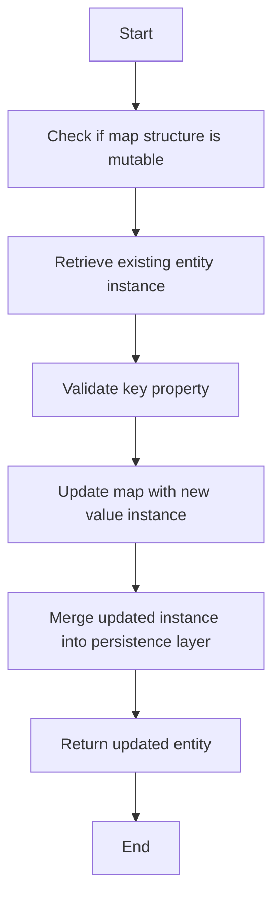

This document will cover the process of updating an entity within a map structure. We'll cover:

1. Checking if the map structure is mutable
2. Retrieving the existing entity instance
3. Validating the key property
4. Updating the map with the new value instance
5. Merging the updated instance back into the persistence layer
6. Returning the updated entity.

Technical document: <SwmLink doc-title="Updating an Entity in a Map Structure">[Updating an Entity in a Map Structure](/.swm/updating-an-entity-in-a-map-structure.5x5idhvu.sw.md)</SwmLink>

# [Checking if the map structure is mutable](https://app.swimm.io/repos/Z2l0aHViJTNBJTNBQnJvYWRsZWFmQ29tbWVyY2UtZGVtby1uZXclM0ElM0FTd2ltbS1EZW1v/docs/5x5idhvu#check-if-the-map-structure-is-mutable)

The first step in updating an entity within a map structure is to check if the map structure is mutable. This ensures that the map can be modified. If the map structure is not mutable, the update process cannot proceed, and an error is raised. This step is crucial for maintaining data integrity and preventing unauthorized modifications.

# [Retrieving the existing entity instance](https://app.swimm.io/repos/Z2l0aHViJTNBJTNBQnJvYWRsZWFmQ29tbWVyY2UtZGVtby1uZXclM0ElM0FTd2ltbS1EZW1v/docs/5x5idhvu#retrieve-existing-entity-instance)

Once the map structure is confirmed to be mutable, the next step is to retrieve the existing entity instance. This involves fetching the current state of the entity from the persistence layer. This step is necessary to ensure that the update is applied to the correct entity and that any existing data is preserved.

# [Validating the key property](https://app.swimm.io/repos/Z2l0aHViJTNBJTNBQnJvYWRsZWFmQ29tbWVyY2UtZGVtby1uZXclM0ElM0FTd2ltbS1EZW1v/docs/5x5idhvu#validate-key-property)

The key property of the entity must be validated to ensure it is not reserved. Reserved keys are special keys that are used internally by the system and cannot be used for regular entities. This validation step helps prevent conflicts and ensures that the key is appropriate for the entity being updated.

# [Updating the map with the new value instance](https://app.swimm.io/repos/Z2l0aHViJTNBJTNBQnJvYWRsZWFmQ29tbWVyY2UtZGVtby1uZXclM0ElM0FTd2ltbS1EZW1v/docs/5x5idhvu#update-map-with-new-value-instance)

After validating the key property, the map is updated with the new value instance. This involves replacing the old value associated with the key in the map with the new value. This step is essential for ensuring that the entity reflects the latest data provided by the user.

# [Merging the updated instance back into the persistence layer](https://app.swimm.io/repos/Z2l0aHViJTNBJTNBQnJvYWRsZWFmQ29tbWVyY2UtZGVtby1uZXclM0ElM0FTd2ltbS1EZW1v/docs/5x5idhvu#merge-updated-instance-into-persistence-layer)

Once the map has been updated with the new value, the updated entity instance is merged back into the persistence layer. This step involves saving the changes made to the entity so that they are persisted in the database. This ensures that the updated data is stored and can be retrieved in future operations.

# [Returning the updated entity](https://app.swimm.io/repos/Z2l0aHViJTNBJTNBQnJvYWRsZWFmQ29tbWVyY2UtZGVtby1uZXclM0ElM0FTd2ltbS1EZW1v/docs/5x5idhvu#return-updated-entity)

The final step in the process is to return the updated entity. This provides confirmation that the update was successful and allows the user to see the changes that were made. Returning the updated entity also enables further operations to be performed on the updated data if needed.

&nbsp;

*This is an auto-generated document by Swimm AI 🌊 and has not yet been verified by a human*

<SwmMeta version="3.0.0" repo-id="Z2l0aHViJTNBJTNBQnJvYWRsZWFmQ29tbWVyY2UtZGVtby1uZXclM0ElM0FTd2ltbS1EZW1v" repo-name="BroadleafCommerce-demo-new" doc-type="product-flows">Powered by [Swimm](/)</SwmMeta>
