In this document, we will explain the process of updating an entity in the adorned target list. The update process involves several steps, including checking field mutability, retrieving the adorned target list, rebalancing the list if necessary, and merging the updated record back into the database.

The update process starts by checking if the field you want to update can be changed. Then, it retrieves the list of items that the entity belongs to. If the order of items in the list has changed, it adjusts the order and updates the sequence numbers. Finally, it saves the updated entity back into the database.

Here is a high level diagram of the flow, showing only the most important functions:

```mermaid
graph TD;
      subgraph admin/broadleaf-open-admin-platform/src/main/java/org/broadleafcommerce/openadmin/server/service/persistence/module
ba6f8996008f6210d0741fdf8a636fe57ad4f73e7dcb62906a292eba29e22615(update):::mainFlowStyle --> 7799d759fdd949961e88528926ba533a6338fb96e043b63a97274a013a6e4d62(remove)
end

subgraph admin/broadleaf-open-admin-platform/src/main/java/org/broadleafcommerce/openadmin/server/service/persistence/module
ba6f8996008f6210d0741fdf8a636fe57ad4f73e7dcb62906a292eba29e22615(update):::mainFlowStyle --> 5199eeaab0f6e093ff78e4a6bd96ddfc12cf857139d53a5ee2f5dd81a3247755(invokeForUpdate):::mainFlowStyle
end

subgraph admin/broadleaf-open-admin-platform/src/main/java/org/broadleafcommerce/openadmin/server/service/persistence/module
5199eeaab0f6e093ff78e4a6bd96ddfc12cf857139d53a5ee2f5dd81a3247755(invokeForUpdate):::mainFlowStyle --> dc7f4c6862e1bf1f6a4c2624cc09bf458152ce9f6223d500c0b1cc8cb090c1e1(invokeInternal):::mainFlowStyle
end

subgraph admin/broadleaf-open-admin-platform/src/main/java/org/broadleafcommerce/openadmin/server/service/persistence/module
dc7f4c6862e1bf1f6a4c2624cc09bf458152ce9f6223d500c0b1cc8cb090c1e1(invokeInternal):::mainFlowStyle --> 8531fa57a21daaac06520ab3529b9567acaf981f057d2d451a8003a8a9e9d398(getAdornedTargetFilterMappings):::mainFlowStyle
end

subgraph admin/broadleaf-open-admin-platform/src/main/java/org/broadleafcommerce/openadmin/server/service/persistence/module
8531fa57a21daaac06520ab3529b9567acaf981f057d2d451a8003a8a9e9d398(getAdornedTargetFilterMappings):::mainFlowStyle --> 9a58b8e17301378e74d370ad76a4ca46c55fc87350a15b855db50d64368fde05(add):::mainFlowStyle
end

subgraph admin/broadleaf-open-admin-platform/src/main/java/org/broadleafcommerce/openadmin/server/service/persistence/module
9a58b8e17301378e74d370ad76a4ca46c55fc87350a15b855db50d64368fde05(add):::mainFlowStyle --> 702310471beb81ea4dd82c91bbff830de53fc38cd7917390f5309587da2a478b(createPopulatedAdornedTargetInstance):::mainFlowStyle
end

subgraph admin/broadleaf-open-admin-platform/src/main/java/org/broadleafcommerce/openadmin/server/service/persistence/module
702310471beb81ea4dd82c91bbff830de53fc38cd7917390f5309587da2a478b(createPopulatedAdornedTargetInstance):::mainFlowStyle --> e397e7a4073e60a59abecd2977d6860cc7361ba3dde7b0c462c898d8d9e01241(setFieldValue):::mainFlowStyle
end


      classDef mainFlowStyle color:#000000,fill:#7CB9F4
classDef rootsStyle color:#000000,fill:#00FFF4
classDef Style1 color:#000000,fill:#00FFAA
classDef Style2 color:#000000,fill:#FFFF00
classDef Style3 color:#000000,fill:#AA7CB9

%% Swimm:
%% graph TD;
%%       subgraph <SwmPath>[admin/broadleaf-open-admin-platform/src/main/java/org/broadleafcommerce/openadmin/server/service/persistence/module/](admin/broadleaf-open-admin-platform/src/main/java/org/broadleafcommerce/openadmin/server/service/persistence/module/)</SwmPath>
%% ba6f8996008f6210d0741fdf8a636fe57ad4f73e7dcb62906a292eba29e22615(update):::mainFlowStyle --> 7799d759fdd949961e88528926ba533a6338fb96e043b63a97274a013a6e4d62(remove)
%% end
%% 
%% subgraph <SwmPath>[admin/broadleaf-open-admin-platform/src/main/java/org/broadleafcommerce/openadmin/server/service/persistence/module/](admin/broadleaf-open-admin-platform/src/main/java/org/broadleafcommerce/openadmin/server/service/persistence/module/)</SwmPath>
%% ba6f8996008f6210d0741fdf8a636fe57ad4f73e7dcb62906a292eba29e22615(update):::mainFlowStyle --> 5199eeaab0f6e093ff78e4a6bd96ddfc12cf857139d53a5ee2f5dd81a3247755(invokeForUpdate):::mainFlowStyle
%% end
%% 
%% subgraph <SwmPath>[admin/broadleaf-open-admin-platform/src/main/java/org/broadleafcommerce/openadmin/server/service/persistence/module/](admin/broadleaf-open-admin-platform/src/main/java/org/broadleafcommerce/openadmin/server/service/persistence/module/)</SwmPath>
%% 5199eeaab0f6e093ff78e4a6bd96ddfc12cf857139d53a5ee2f5dd81a3247755(invokeForUpdate):::mainFlowStyle --> dc7f4c6862e1bf1f6a4c2624cc09bf458152ce9f6223d500c0b1cc8cb090c1e1(invokeInternal):::mainFlowStyle
%% end
%% 
%% subgraph <SwmPath>[admin/broadleaf-open-admin-platform/src/main/java/org/broadleafcommerce/openadmin/server/service/persistence/module/](admin/broadleaf-open-admin-platform/src/main/java/org/broadleafcommerce/openadmin/server/service/persistence/module/)</SwmPath>
%% dc7f4c6862e1bf1f6a4c2624cc09bf458152ce9f6223d500c0b1cc8cb090c1e1(invokeInternal):::mainFlowStyle --> 8531fa57a21daaac06520ab3529b9567acaf981f057d2d451a8003a8a9e9d398(getAdornedTargetFilterMappings):::mainFlowStyle
%% end
%% 
%% subgraph <SwmPath>[admin/broadleaf-open-admin-platform/src/main/java/org/broadleafcommerce/openadmin/server/service/persistence/module/](admin/broadleaf-open-admin-platform/src/main/java/org/broadleafcommerce/openadmin/server/service/persistence/module/)</SwmPath>
%% 8531fa57a21daaac06520ab3529b9567acaf981f057d2d451a8003a8a9e9d398(getAdornedTargetFilterMappings):::mainFlowStyle --> 9a58b8e17301378e74d370ad76a4ca46c55fc87350a15b855db50d64368fde05(add):::mainFlowStyle
%% end
%% 
%% subgraph <SwmPath>[admin/broadleaf-open-admin-platform/src/main/java/org/broadleafcommerce/openadmin/server/service/persistence/module/](admin/broadleaf-open-admin-platform/src/main/java/org/broadleafcommerce/openadmin/server/service/persistence/module/)</SwmPath>
%% 9a58b8e17301378e74d370ad76a4ca46c55fc87350a15b855db50d64368fde05(add):::mainFlowStyle --> 702310471beb81ea4dd82c91bbff830de53fc38cd7917390f5309587da2a478b(createPopulatedAdornedTargetInstance):::mainFlowStyle
%% end
%% 
%% subgraph <SwmPath>[admin/broadleaf-open-admin-platform/src/main/java/org/broadleafcommerce/openadmin/server/service/persistence/module/](admin/broadleaf-open-admin-platform/src/main/java/org/broadleafcommerce/openadmin/server/service/persistence/module/)</SwmPath>
%% 702310471beb81ea4dd82c91bbff830de53fc38cd7917390f5309587da2a478b(createPopulatedAdornedTargetInstance):::mainFlowStyle --> e397e7a4073e60a59abecd2977d6860cc7361ba3dde7b0c462c898d8d9e01241(setFieldValue):::mainFlowStyle
%% end
%% 
%% 
%%       classDef mainFlowStyle color:#000000,fill:#7CB9F4
%% classDef rootsStyle color:#000000,fill:#00FFF4
%% classDef Style1 color:#000000,fill:#00FFAA
%% classDef Style2 color:#000000,fill:#FFFF00
%% classDef Style3 color:#000000,fill:#AA7CB9
```



# Flow drill down

First, we'll zoom into this section of the flow:

```mermaid
graph TD;
      subgraph admin/broadleaf-open-admin-platform/src/main/java/org/broadleafcommerce/openadmin/server/service/persistence/module/AdornedTargetListPersistenceModule.java
ba6f8996008f6210d0741fdf8a636fe57ad4f73e7dcb62906a292eba29e22615(update):::mainFlowStyle --> 7799d759fdd949961e88528926ba533a6338fb96e043b63a97274a013a6e4d62(remove)
end

subgraph admin/broadleaf-open-admin-platform/src/main/java/org/broadleafcommerce/openadmin/server/service/persistence/module/AdornedTargetListPersistenceModule.java
ba6f8996008f6210d0741fdf8a636fe57ad4f73e7dcb62906a292eba29e22615(update):::mainFlowStyle --> 5199eeaab0f6e093ff78e4a6bd96ddfc12cf857139d53a5ee2f5dd81a3247755(invokeForUpdate):::mainFlowStyle
end

subgraph admin/broadleaf-open-admin-platform/src/main/java/org/broadleafcommerce/openadmin/server/service/persistence/module/AdornedTargetListPersistenceModule.java
5199eeaab0f6e093ff78e4a6bd96ddfc12cf857139d53a5ee2f5dd81a3247755(invokeForUpdate):::mainFlowStyle --> gg4sx(...)
end


      classDef mainFlowStyle color:#000000,fill:#7CB9F4
classDef rootsStyle color:#000000,fill:#00FFF4
classDef Style1 color:#000000,fill:#00FFAA
classDef Style2 color:#000000,fill:#FFFF00
classDef Style3 color:#000000,fill:#AA7CB9

%% Swimm:
%% graph TD;
%%       subgraph <SwmPath>[admin/broadleaf-open-admin-platform/src/main/java/org/broadleafcommerce/openadmin/server/service/persistence/module/AdornedTargetListPersistenceModule.java](admin/broadleaf-open-admin-platform/src/main/java/org/broadleafcommerce/openadmin/server/service/persistence/module/AdornedTargetListPersistenceModule.java)</SwmPath>
%% ba6f8996008f6210d0741fdf8a636fe57ad4f73e7dcb62906a292eba29e22615(update):::mainFlowStyle --> 7799d759fdd949961e88528926ba533a6338fb96e043b63a97274a013a6e4d62(remove)
%% end
%% 
%% subgraph <SwmPath>[admin/broadleaf-open-admin-platform/src/main/java/org/broadleafcommerce/openadmin/server/service/persistence/module/AdornedTargetListPersistenceModule.java](admin/broadleaf-open-admin-platform/src/main/java/org/broadleafcommerce/openadmin/server/service/persistence/module/AdornedTargetListPersistenceModule.java)</SwmPath>
%% ba6f8996008f6210d0741fdf8a636fe57ad4f73e7dcb62906a292eba29e22615(update):::mainFlowStyle --> 5199eeaab0f6e093ff78e4a6bd96ddfc12cf857139d53a5ee2f5dd81a3247755(invokeForUpdate):::mainFlowStyle
%% end
%% 
%% subgraph <SwmPath>[admin/broadleaf-open-admin-platform/src/main/java/org/broadleafcommerce/openadmin/server/service/persistence/module/AdornedTargetListPersistenceModule.java](admin/broadleaf-open-admin-platform/src/main/java/org/broadleafcommerce/openadmin/server/service/persistence/module/AdornedTargetListPersistenceModule.java)</SwmPath>
%% 5199eeaab0f6e093ff78e4a6bd96ddfc12cf857139d53a5ee2f5dd81a3247755(invokeForUpdate):::mainFlowStyle --> gg4sx(...)
%% end
%% 
%% 
%%       classDef mainFlowStyle color:#000000,fill:#7CB9F4
%% classDef rootsStyle color:#000000,fill:#00FFF4
%% classDef Style1 color:#000000,fill:#00FFAA
%% classDef Style2 color:#000000,fill:#FFFF00
%% classDef Style3 color:#000000,fill:#AA7CB9
```



<SwmSnippet path="/admin/broadleaf-open-admin-platform/src/main/java/org/broadleafcommerce/openadmin/server/service/persistence/module/AdornedTargetListPersistenceModule.java" line="312">

---

## Update Function

The <SwmToken path="admin/broadleaf-open-admin-platform/src/main/java/org/broadleafcommerce/openadmin/server/service/persistence/module/AdornedTargetListPersistenceModule.java" pos="313:5:5" line-data="    public Entity update(PersistencePackage persistencePackage) throws ServiceException {">`update`</SwmToken> function is responsible for updating an entity in the adorned target list. It first checks if the field is mutable and then retrieves the adorned target list. If the sort field has changed, it rebalances the list and updates the sequence values. Finally, it merges the updated record back into the database.

```java
    @Override
    public Entity update(PersistencePackage persistencePackage) throws ServiceException {
        String[] customCriteria = persistencePackage.getCustomCriteria();
        if (customCriteria != null && customCriteria.length > 0) {
            LOG.warn("custom persistence handlers and custom criteria not supported for update types other than BASIC");
        }
        PersistencePerspective persistencePerspective = persistencePackage.getPersistencePerspective();
        Entity entity = persistencePackage.getEntity();
        AdornedTargetList adornedTargetList = (AdornedTargetList) persistencePerspective.getPersistencePerspectiveItems().get(PersistencePerspectiveItemType.ADORNEDTARGETLIST);
        if (!adornedTargetList.getMutable()) {
            throw new SecurityServiceException("Field is not mutable");
        }
        try {
            AdornedTargetRetrieval adornedTargetRetrieval = new AdornedTargetRetrieval(persistencePackage, entity, adornedTargetList).invokeForUpdate();
            List<Serializable> records = adornedTargetRetrieval.getRecords();

            Assert.isTrue(!CollectionUtils.isEmpty(records), "Entity not found");

            int index = adornedTargetRetrieval.getIndex();
            Map<String, FieldMetadata> mergedProperties = adornedTargetRetrieval.getMergedProperties();
            FieldManager fieldManager = getFieldManager();
```

---

</SwmSnippet>

<SwmSnippet path="/admin/broadleaf-open-admin-platform/src/main/java/org/broadleafcommerce/openadmin/server/service/persistence/module/AdornedTargetListPersistenceModule.java" line="391">

---

## Remove Function

The <SwmToken path="admin/broadleaf-open-admin-platform/src/main/java/org/broadleafcommerce/openadmin/server/service/persistence/module/AdornedTargetListPersistenceModule.java" pos="392:5:5" line-data="    public void remove(PersistencePackage persistencePackage) throws ServiceException {">`remove`</SwmToken> function handles the removal of an entity from the adorned target list. It first checks if the field is mutable and then retrieves the adorned target list. It constructs filter criteria to find the specific record to be removed and then deletes it from the database.

```java
    @Override
    public void remove(PersistencePackage persistencePackage) throws ServiceException {
        String[] customCriteria = persistencePackage.getCustomCriteria();
        if (customCriteria != null && customCriteria.length > 0) {
            LOG.warn("custom persistence handlers and custom criteria not supported for remove types other than BASIC");
        }
        PersistencePerspective persistencePerspective = persistencePackage.getPersistencePerspective();
        Entity entity = persistencePackage.getEntity();
        try {
            AdornedTargetList adornedTargetList = (AdornedTargetList) persistencePerspective.getPersistencePerspectiveItems().get(PersistencePerspectiveItemType.ADORNEDTARGETLIST);
            if (!adornedTargetList.getMutable()) {
                throw new SecurityServiceException("Field is not mutable");
            }
            Class<?>[] entities = persistenceManager.getPolymorphicEntities(adornedTargetList.getAdornedTargetEntityClassname());
            Map<String, FieldMetadata> mergedProperties = persistenceManager.getDynamicEntityDao().getMergedProperties(
                    adornedTargetList.getAdornedTargetEntityClassname(),
                    entities,
                    null,
                    new String[]{},
                    new ForeignKey[]{},
                    MergedPropertyType.ADORNEDTARGETLIST,
```

---

</SwmSnippet>

Now, lets zoom into this section of the flow:

```mermaid
graph TD;
      subgraph admin/broadleaf-open-admin-platform/src/main/java/org/broadleafcommerce/openadmin/server/service/persistence/module
5199eeaab0f6e093ff78e4a6bd96ddfc12cf857139d53a5ee2f5dd81a3247755(invokeForUpdate):::mainFlowStyle --> dc7f4c6862e1bf1f6a4c2624cc09bf458152ce9f6223d500c0b1cc8cb090c1e1(invokeInternal):::mainFlowStyle
end

subgraph admin/broadleaf-open-admin-platform/src/main/java/org/broadleafcommerce/openadmin/server/service/persistence/module
dc7f4c6862e1bf1f6a4c2624cc09bf458152ce9f6223d500c0b1cc8cb090c1e1(invokeInternal):::mainFlowStyle --> 8531fa57a21daaac06520ab3529b9567acaf981f057d2d451a8003a8a9e9d398(getAdornedTargetFilterMappings):::mainFlowStyle
end

subgraph admin/broadleaf-open-admin-platform/src/main/java/org/broadleafcommerce/openadmin/server/service/persistence/module
8531fa57a21daaac06520ab3529b9567acaf981f057d2d451a8003a8a9e9d398(getAdornedTargetFilterMappings):::mainFlowStyle --> 9a58b8e17301378e74d370ad76a4ca46c55fc87350a15b855db50d64368fde05(add):::mainFlowStyle
end

subgraph admin/broadleaf-open-admin-platform/src/main/java/org/broadleafcommerce/openadmin/server/service/persistence/module
9a58b8e17301378e74d370ad76a4ca46c55fc87350a15b855db50d64368fde05(add):::mainFlowStyle --> 702310471beb81ea4dd82c91bbff830de53fc38cd7917390f5309587da2a478b(createPopulatedAdornedTargetInstance):::mainFlowStyle
end

subgraph admin/broadleaf-open-admin-platform/src/main/java/org/broadleafcommerce/openadmin/server/service/persistence/module
702310471beb81ea4dd82c91bbff830de53fc38cd7917390f5309587da2a478b(createPopulatedAdornedTargetInstance):::mainFlowStyle --> e397e7a4073e60a59abecd2977d6860cc7361ba3dde7b0c462c898d8d9e01241(setFieldValue):::mainFlowStyle
end


      classDef mainFlowStyle color:#000000,fill:#7CB9F4
classDef rootsStyle color:#000000,fill:#00FFF4
classDef Style1 color:#000000,fill:#00FFAA
classDef Style2 color:#000000,fill:#FFFF00
classDef Style3 color:#000000,fill:#AA7CB9

%% Swimm:
%% graph TD;
%%       subgraph <SwmPath>[admin/broadleaf-open-admin-platform/src/main/java/org/broadleafcommerce/openadmin/server/service/persistence/module/](admin/broadleaf-open-admin-platform/src/main/java/org/broadleafcommerce/openadmin/server/service/persistence/module/)</SwmPath>
%% 5199eeaab0f6e093ff78e4a6bd96ddfc12cf857139d53a5ee2f5dd81a3247755(invokeForUpdate):::mainFlowStyle --> dc7f4c6862e1bf1f6a4c2624cc09bf458152ce9f6223d500c0b1cc8cb090c1e1(invokeInternal):::mainFlowStyle
%% end
%% 
%% subgraph <SwmPath>[admin/broadleaf-open-admin-platform/src/main/java/org/broadleafcommerce/openadmin/server/service/persistence/module/](admin/broadleaf-open-admin-platform/src/main/java/org/broadleafcommerce/openadmin/server/service/persistence/module/)</SwmPath>
%% dc7f4c6862e1bf1f6a4c2624cc09bf458152ce9f6223d500c0b1cc8cb090c1e1(invokeInternal):::mainFlowStyle --> 8531fa57a21daaac06520ab3529b9567acaf981f057d2d451a8003a8a9e9d398(getAdornedTargetFilterMappings):::mainFlowStyle
%% end
%% 
%% subgraph <SwmPath>[admin/broadleaf-open-admin-platform/src/main/java/org/broadleafcommerce/openadmin/server/service/persistence/module/](admin/broadleaf-open-admin-platform/src/main/java/org/broadleafcommerce/openadmin/server/service/persistence/module/)</SwmPath>
%% 8531fa57a21daaac06520ab3529b9567acaf981f057d2d451a8003a8a9e9d398(getAdornedTargetFilterMappings):::mainFlowStyle --> 9a58b8e17301378e74d370ad76a4ca46c55fc87350a15b855db50d64368fde05(add):::mainFlowStyle
%% end
%% 
%% subgraph <SwmPath>[admin/broadleaf-open-admin-platform/src/main/java/org/broadleafcommerce/openadmin/server/service/persistence/module/](admin/broadleaf-open-admin-platform/src/main/java/org/broadleafcommerce/openadmin/server/service/persistence/module/)</SwmPath>
%% 9a58b8e17301378e74d370ad76a4ca46c55fc87350a15b855db50d64368fde05(add):::mainFlowStyle --> 702310471beb81ea4dd82c91bbff830de53fc38cd7917390f5309587da2a478b(createPopulatedAdornedTargetInstance):::mainFlowStyle
%% end
%% 
%% subgraph <SwmPath>[admin/broadleaf-open-admin-platform/src/main/java/org/broadleafcommerce/openadmin/server/service/persistence/module/](admin/broadleaf-open-admin-platform/src/main/java/org/broadleafcommerce/openadmin/server/service/persistence/module/)</SwmPath>
%% 702310471beb81ea4dd82c91bbff830de53fc38cd7917390f5309587da2a478b(createPopulatedAdornedTargetInstance):::mainFlowStyle --> e397e7a4073e60a59abecd2977d6860cc7361ba3dde7b0c462c898d8d9e01241(setFieldValue):::mainFlowStyle
%% end
%% 
%% 
%%       classDef mainFlowStyle color:#000000,fill:#7CB9F4
%% classDef rootsStyle color:#000000,fill:#00FFF4
%% classDef Style1 color:#000000,fill:#00FFAA
%% classDef Style2 color:#000000,fill:#FFFF00
%% classDef Style3 color:#000000,fill:#AA7CB9
```



<SwmSnippet path="/admin/broadleaf-open-admin-platform/src/main/java/org/broadleafcommerce/openadmin/server/service/persistence/module/AdornedTargetListPersistenceModule.java" line="527">

---

## <SwmToken path="admin/broadleaf-open-admin-platform/src/main/java/org/broadleafcommerce/openadmin/server/service/persistence/module/AdornedTargetListPersistenceModule.java" pos="527:5:5" line-data="        public AdornedTargetRetrieval invokeForUpdate() throws ClassNotFoundException, NoSuchMethodException, IllegalAccessException, InvocationTargetException, FieldNotAvailableException, NoSuchFieldException {">`invokeForUpdate`</SwmToken>

The <SwmToken path="admin/broadleaf-open-admin-platform/src/main/java/org/broadleafcommerce/openadmin/server/service/persistence/module/AdornedTargetListPersistenceModule.java" pos="527:5:5" line-data="        public AdornedTargetRetrieval invokeForUpdate() throws ClassNotFoundException, NoSuchMethodException, IllegalAccessException, InvocationTargetException, FieldNotAvailableException, NoSuchFieldException {">`invokeForUpdate`</SwmToken> method initiates the update process by setting filter criteria and invoking the <SwmToken path="admin/broadleaf-open-admin-platform/src/main/java/org/broadleafcommerce/openadmin/server/service/persistence/module/AdornedTargetListPersistenceModule.java" pos="531:1:1" line-data="            invokeInternal();">`invokeInternal`</SwmToken> method. It then iterates through records to find a matching entity ID.

```java
        public AdornedTargetRetrieval invokeForUpdate() throws ClassNotFoundException, NoSuchMethodException, IllegalAccessException, InvocationTargetException, FieldNotAvailableException, NoSuchFieldException {
            FilterAndSortCriteria filterCriteria = cto.get(adornedTargetList.getCollectionFieldName());
            filterCriteria.setFilterValue(entity.findProperty(adornedTargetList.getLinkedObjectPath() + "." + adornedTargetList.getLinkedIdProperty()).getValue());
            
            invokeInternal();
            
            index = 0;
            Long myEntityId = Long.valueOf(entity.findProperty(adornedTargetList.getTargetObjectPath() + "." + adornedTargetList.getTargetIdProperty()).getValue());
            FieldManager fieldManager = getFieldManager();
            for (Serializable record : records) {
                Long targetId = (Long) fieldManager.getFieldValue(record, adornedTargetList.getTargetObjectPath() + "." + adornedTargetList.getTargetIdProperty());
                if (myEntityId.equals(targetId)) {
                    break;
                }
                index++;
            }
            
            return this;
        }
```

---

</SwmSnippet>

<SwmSnippet path="/admin/broadleaf-open-admin-platform/src/main/java/org/broadleafcommerce/openadmin/server/service/persistence/module/AdornedTargetListPersistenceModule.java" line="547">

---

### <SwmToken path="admin/broadleaf-open-admin-platform/src/main/java/org/broadleafcommerce/openadmin/server/service/persistence/module/AdornedTargetListPersistenceModule.java" pos="547:5:5" line-data="        private void invokeInternal() throws ClassNotFoundException {">`invokeInternal`</SwmToken>

The <SwmToken path="admin/broadleaf-open-admin-platform/src/main/java/org/broadleafcommerce/openadmin/server/service/persistence/module/AdornedTargetListPersistenceModule.java" pos="547:5:5" line-data="        private void invokeInternal() throws ClassNotFoundException {">`invokeInternal`</SwmToken> method sets up sorting criteria, retrieves polymorphic entities, and merges properties. It also generates filter mappings by calling <SwmToken path="admin/broadleaf-open-admin-platform/src/main/java/org/broadleafcommerce/openadmin/server/service/persistence/module/AdornedTargetListPersistenceModule.java" pos="81:8:8" line-data="    public List&lt;FilterMapping&gt; getAdornedTargetFilterMappings(PersistencePerspective persistencePerspective,">`getAdornedTargetFilterMappings`</SwmToken>.

```java
        private void invokeInternal() throws ClassNotFoundException {
            if (adornedTargetList.getSortField() != null) {
                FilterAndSortCriteria sortCriteria = cto.get(adornedTargetList.getSortField());
                sortCriteria.setSortAscending(adornedTargetList.getSortAscending());
            }
            
            Class<?>[] entities = persistenceManager.getPolymorphicEntities(adornedTargetList
                    .getAdornedTargetEntityClassname());
            mergedProperties = persistenceManager.getDynamicEntityDao().getMergedProperties(
                    adornedTargetList.getAdornedTargetEntityClassname(),
                    entities,
                    null,
                    new String[]{},
                    new ForeignKey[]{},
                    MergedPropertyType.ADORNEDTARGETLIST,
                    persistencePerspective.getPopulateToOneFields(),
                    persistencePerspective.getIncludeFields(),
                    persistencePerspective.getExcludeFields(),
                    persistencePerspective.getConfigurationKey(),
                    ""
            );
```

---

</SwmSnippet>

<SwmSnippet path="/admin/broadleaf-open-admin-platform/src/main/java/org/broadleafcommerce/openadmin/server/service/persistence/module/AdornedTargetListPersistenceModule.java" line="81">

---

### <SwmToken path="admin/broadleaf-open-admin-platform/src/main/java/org/broadleafcommerce/openadmin/server/service/persistence/module/AdornedTargetListPersistenceModule.java" pos="81:8:8" line-data="    public List&lt;FilterMapping&gt; getAdornedTargetFilterMappings(PersistencePerspective persistencePerspective,">`getAdornedTargetFilterMappings`</SwmToken>

The <SwmToken path="admin/broadleaf-open-admin-platform/src/main/java/org/broadleafcommerce/openadmin/server/service/persistence/module/AdornedTargetListPersistenceModule.java" pos="81:8:8" line-data="    public List&lt;FilterMapping&gt; getAdornedTargetFilterMappings(PersistencePerspective persistencePerspective,">`getAdornedTargetFilterMappings`</SwmToken> method creates filter mappings based on the criteria transfer object (CTO) and adorned target list. It builds predicates for filtering records.

```java
    public List<FilterMapping> getAdornedTargetFilterMappings(PersistencePerspective persistencePerspective,
                    CriteriaTransferObject cto, Map<String, FieldMetadata> mergedProperties,
                    AdornedTargetList adornedTargetList) throws ClassNotFoundException {
        List<FilterMapping> filterMappings = getFilterMappings(persistencePerspective, cto, adornedTargetList.
                getAdornedTargetEntityClassname(), mergedProperties);
        FilterMapping filterMapping = new FilterMapping()
            .withFieldPath(new FieldPath()
                    .withTargetProperty(adornedTargetList.getLinkedObjectPath() + "." + adornedTargetList.getLinkedIdProperty()))
            .withFilterValues(cto.get(adornedTargetList.getCollectionFieldName()).getFilterValues())
            .withRestriction(new Restriction()
                .withPredicateProvider(new PredicateProvider<Serializable, String>() {
                    @Override
                    public Predicate buildPredicate(CriteriaBuilder builder, FieldPathBuilder fieldPathBuilder, From root,
                                                    String ceilingEntity, String fullPropertyName, Path<Serializable> explicitPath,
                                                    List<String> directValues) {
                        if (String.class.isAssignableFrom(explicitPath.getJavaType())) {
                            return builder.equal(explicitPath, directValues.get(0));
                        } else {
                            return builder.equal(explicitPath, Long.parseLong(directValues.get(0)));
                        }
                    }
```

---

</SwmSnippet>

<SwmSnippet path="/admin/broadleaf-open-admin-platform/src/main/java/org/broadleafcommerce/openadmin/server/service/persistence/module/AdornedTargetListPersistenceModule.java" line="197">

---

### add

The <SwmToken path="admin/broadleaf-open-admin-platform/src/main/java/org/broadleafcommerce/openadmin/server/service/persistence/module/AdornedTargetListPersistenceModule.java" pos="198:5:5" line-data="    public Entity add(PersistencePackage persistencePackage) throws ServiceException {">`add`</SwmToken> method handles the addition of new entities to the adorned target list. It checks for mutability, retrieves merged properties, and creates or updates instances as needed.

```java
    @Override
    public Entity add(PersistencePackage persistencePackage) throws ServiceException {
        String[] customCriteria = persistencePackage.getCustomCriteria();
        if (customCriteria != null && customCriteria.length > 0) {
            LOG.warn("custom persistence handlers and custom criteria not supported for add types other than BASIC");
        }
        PersistencePerspective persistencePerspective = persistencePackage.getPersistencePerspective();
        String ceilingEntityFullyQualifiedClassname = persistencePackage.getCeilingEntityFullyQualifiedClassname();
        Entity entity = persistencePackage.getEntity();
        AdornedTargetList adornedTargetList = (AdornedTargetList) persistencePerspective.getPersistencePerspectiveItems().get(PersistencePerspectiveItemType.ADORNEDTARGETLIST);
        if (!adornedTargetList.getMutable()) {
            throw new SecurityServiceException("Field is not mutable");
        }
        Entity payload;
        try {
            Class<?>[] entities = persistenceManager.getPolymorphicEntities(ceilingEntityFullyQualifiedClassname);
            Map<String, FieldMetadata> mergedPropertiesTarget = persistenceManager.getDynamicEntityDao().getMergedProperties(
                    ceilingEntityFullyQualifiedClassname,
                    entities,
                    null,
                    persistencePerspective.getAdditionalNonPersistentProperties(),
```

---

</SwmSnippet>

<SwmSnippet path="/admin/broadleaf-open-admin-platform/src/main/java/org/broadleafcommerce/openadmin/server/service/persistence/module/AdornedTargetListPersistenceModule.java" line="129">

---

### <SwmToken path="admin/broadleaf-open-admin-platform/src/main/java/org/broadleafcommerce/openadmin/server/service/persistence/module/AdornedTargetListPersistenceModule.java" pos="129:5:5" line-data="    protected Serializable createPopulatedAdornedTargetInstance(AdornedTargetList adornedTargetList, Entity entity) throws InstantiationException, IllegalAccessException, ClassNotFoundException, NumberFormatException, InvocationTargetException, NoSuchMethodException, FieldNotAvailableException {">`createPopulatedAdornedTargetInstance`</SwmToken>

The <SwmToken path="admin/broadleaf-open-admin-platform/src/main/java/org/broadleafcommerce/openadmin/server/service/persistence/module/AdornedTargetListPersistenceModule.java" pos="129:5:5" line-data="    protected Serializable createPopulatedAdornedTargetInstance(AdornedTargetList adornedTargetList, Entity entity) throws InstantiationException, IllegalAccessException, ClassNotFoundException, NumberFormatException, InvocationTargetException, NoSuchMethodException, FieldNotAvailableException {">`createPopulatedAdornedTargetInstance`</SwmToken> method creates a new instance of the adorned target entity and populates it with values from the provided entity.

```java
    protected Serializable createPopulatedAdornedTargetInstance(AdornedTargetList adornedTargetList, Entity entity) throws InstantiationException, IllegalAccessException, ClassNotFoundException, NumberFormatException, InvocationTargetException, NoSuchMethodException, FieldNotAvailableException {
        Serializable instance = (Serializable) Class.forName(StringUtils.isEmpty(adornedTargetList
                .getAdornedTargetEntityPolymorphicType())? adornedTargetList.getAdornedTargetEntityClassname(): adornedTargetList.getAdornedTargetEntityPolymorphicType()).newInstance();
        String targetPath = adornedTargetList.getTargetObjectPath() + "." + adornedTargetList.getTargetIdProperty();
        String linkedPath = adornedTargetList.getLinkedObjectPath() + "." + adornedTargetList.getLinkedIdProperty();
        getFieldManager().setFieldValue(instance, linkedPath, Long.valueOf(entity.findProperty(linkedPath).getValue()));

        Object test1 = getFieldManager().getFieldValue(instance, adornedTargetList.getLinkedObjectPath());
        Object test1PersistedObject = persistenceManager.getDynamicEntityDao().retrieve(test1.getClass(), Long.valueOf(entity.findProperty(linkedPath).getValue()));
        Assert.isTrue(test1PersistedObject != null, "Entity not found");

        Class<?> type = getFieldManager().getField(instance.getClass(), targetPath).getType();
        if (String.class.isAssignableFrom(type)) {
            getFieldManager().setFieldValue(instance, targetPath, entity.findProperty(targetPath).getValue());
        } else {
            getFieldManager().setFieldValue(instance, targetPath, Long.valueOf(entity.findProperty(targetPath).getValue()));
        }

        Object test2 = getFieldManager().getFieldValue(instance, adornedTargetList.getTargetObjectPath());
        Object test2PersistedObject;
        if (String.class.isAssignableFrom(type)) {
```

---

</SwmSnippet>

<SwmSnippet path="/admin/broadleaf-open-admin-platform/src/main/java/org/broadleafcommerce/openadmin/server/service/persistence/module/FieldManager.java" line="121">

---

### <SwmToken path="admin/broadleaf-open-admin-platform/src/main/java/org/broadleafcommerce/openadmin/server/service/persistence/module/FieldManager.java" pos="121:5:5" line-data="    public Object setFieldValue(Object bean, String fieldName, Object newValue) throws IllegalAccessException, InstantiationException {">`setFieldValue`</SwmToken>

The <SwmToken path="admin/broadleaf-open-admin-platform/src/main/java/org/broadleafcommerce/openadmin/server/service/persistence/module/FieldManager.java" pos="121:5:5" line-data="    public Object setFieldValue(Object bean, String fieldName, Object newValue) throws IllegalAccessException, InstantiationException {">`setFieldValue`</SwmToken> method sets the value of a specified field in a given bean. It handles nested fields and maps, and ensures the correct type is used for the new value.

```java
    public Object setFieldValue(Object bean, String fieldName, Object newValue) throws IllegalAccessException, InstantiationException {
        StringTokenizer tokens = new StringTokenizer(fieldName, ".");
        Class<?> componentClass = bean.getClass();
        Field field;
        bean = HibernateUtils.deproxy(bean);
        Object value = bean;

        int count = tokens.countTokens();
        int j=0;
        StringBuilder sb = new StringBuilder();
        while (tokens.hasMoreTokens()) {
            String fieldNamePart = tokens.nextToken();
            sb.append(fieldNamePart);
            String mapKey = null;
            if (fieldNamePart.contains(FieldManager.MAPFIELDSEPARATOR)) {
                mapKey = fieldNamePart.substring(fieldNamePart.indexOf(FieldManager.MAPFIELDSEPARATOR) + FieldManager.MAPFIELDSEPARATOR.length(), fieldNamePart.length());
                fieldNamePart = fieldNamePart.substring(0, fieldNamePart.indexOf(FieldManager.MAPFIELDSEPARATOR));
            }

            field = getSingleField(componentClass, fieldNamePart);
            field.setAccessible(true);
```

---

</SwmSnippet>

&nbsp;

*This is an auto-generated document by Swimm AI 🌊 and has not yet been verified by a human*

<SwmMeta version="3.0.0" repo-id="Z2l0aHViJTNBJTNBQnJvYWRsZWFmQ29tbWVyY2UtZGVtby1uZXclM0ElM0FTd2ltbS1EZW1v" repo-name="BroadleafCommerce-demo-new" doc-type="flows"><sup>Powered by [Swimm](/)</sup></SwmMeta>
