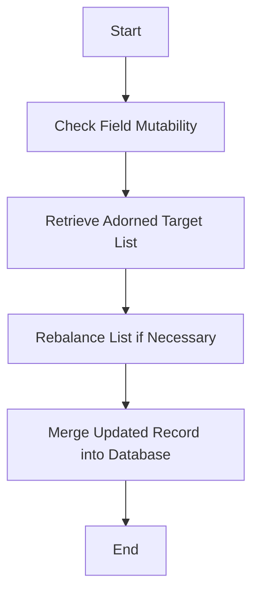

This document will cover the process of updating an entity in the adorned target list. We'll cover:

1. Checking field mutability
2. Retrieving the adorned target list
3. Rebalancing the list if necessary
4. Merging the updated record back into the database.

Technical document: <SwmLink doc-title="Updating an Entity in the Adorned Target List">[Updating an Entity in the Adorned Target List](/.swm/updating-an-entity-in-the-adorned-target-list.3ul3gb3b.sw.md)</SwmLink>

# [Checking Field Mutability](https://app.swimm.io/repos/Z2l0aHViJTNBJTNBQnJvYWRsZWFmQ29tbWVyY2UtZGVtby1uZXclM0ElM0FTd2ltbS1EZW1v/docs/3ul3gb3b#checking-field-mutability)

The first step in updating an entity in the adorned target list is to check if the field you want to update is mutable. This ensures that only fields that are allowed to be changed can be updated. If the field is not mutable, the update process is halted, and an error is raised. This step is crucial for maintaining data integrity and security, ensuring that only authorized changes are made to the data.

# [Retrieving the Adorned Target List](https://app.swimm.io/repos/Z2l0aHViJTNBJTNBQnJvYWRsZWFmQ29tbWVyY2UtZGVtby1uZXclM0ElM0FTd2ltbS1EZW1v/docs/3ul3gb3b#retrieving-the-adorned-target-list)

Once the field's mutability is confirmed, the next step is to retrieve the adorned target list that the entity belongs to. This list contains all the items related to the entity. Retrieving this list is essential for understanding the context of the entity within the list and for making any necessary adjustments to the list's order or sequence numbers.

# [Rebalancing the List if Necessary](https://app.swimm.io/repos/Z2l0aHViJTNBJTNBQnJvYWRsZWFmQ29tbWVyY2UtZGVtby1uZXclM0ElM0FTd2ltbS1EZW1v/docs/3ul3gb3b#rebalancing-the-list-if-necessary)

If the order of items in the adorned target list has changed, the list needs to be rebalanced. This involves adjusting the sequence numbers of the items to reflect their new order. Rebalancing ensures that the list maintains its intended structure and order, which is important for both data consistency and user experience. For example, if the list represents a ranked order of products, rebalancing ensures that the rankings are accurate after the update.

# [Merging the Updated Record Back into the Database](https://app.swimm.io/repos/Z2l0aHViJTNBJTNBQnJvYWRsZWFmQ29tbWVyY2UtZGVtby1uZXclM0ElM0FTd2ltbS1EZW1v/docs/3ul3gb3b#merging-the-updated-record-back-into-the-database)

The final step in the update process is to merge the updated entity back into the database. This involves saving the changes made to the entity and ensuring that the database reflects the updated state of the adorned target list. Merging the updated record is crucial for persisting the changes and making them available for future operations and queries. This step ensures that the updated information is stored securely and accurately in the database.

&nbsp;

*This is an auto-generated document by Swimm AI 🌊 and has not yet been verified by a human*

<SwmMeta version="3.0.0" repo-id="Z2l0aHViJTNBJTNBQnJvYWRsZWFmQ29tbWVyY2UtZGVtby1uZXclM0ElM0FTd2ltbS1EZW1v" repo-name="BroadleafCommerce-demo-new" doc-type="product-flows">Powered by [Swimm](/)</SwmMeta>
