In this document, we will explain the process of updating merged properties in an adorned target list. The process involves several steps, including retrieving the adorned target list, fetching merged properties, and updating the properties map.

The flow starts with retrieving the adorned target list from the persistence perspective. Next, it fetches the merged properties for the adorned target entity. Finally, it updates the <SwmToken path="admin/broadleaf-open-admin-platform/src/main/java/org/broadleafcommerce/openadmin/server/service/persistence/module/AdornedTargetListPersistenceModule.java" pos="160:25:25" line-data="    public void updateMergedProperties(PersistencePackage persistencePackage, Map&lt;MergedPropertyType, Map&lt;String, FieldMetadata&gt;&gt; allMergedProperties) throws ServiceException {">`allMergedProperties`</SwmToken> map with these properties.

# Flow drill down

```mermaid
graph TD;
      subgraph admin/broadleaf-open-admin-platform/src/main/java/org/broadleafcommerce/openadmin/server/service/persistence/module
54dfab8b414035f7ed2c399f89151c5c897e49fb4203952cd811fcd350e4bfee(updateMergedProperties):::mainFlowStyle --> 7799d759fdd949961e88528926ba533a6338fb96e043b63a97274a013a6e4d62(remove):::mainFlowStyle
end

subgraph admin/broadleaf-open-admin-platform/src/main/java/org/broadleafcommerce/openadmin/server/service/persistence/module
7799d759fdd949961e88528926ba533a6338fb96e043b63a97274a013a6e4d62(remove):::mainFlowStyle --> 8531fa57a21daaac06520ab3529b9567acaf981f057d2d451a8003a8a9e9d398(getAdornedTargetFilterMappings):::mainFlowStyle
end

subgraph admin/broadleaf-open-admin-platform/src/main/java/org/broadleafcommerce/openadmin/server/service/persistence/module
8531fa57a21daaac06520ab3529b9567acaf981f057d2d451a8003a8a9e9d398(getAdornedTargetFilterMappings):::mainFlowStyle --> 9a58b8e17301378e74d370ad76a4ca46c55fc87350a15b855db50d64368fde05(add):::mainFlowStyle
end

subgraph admin/broadleaf-open-admin-platform/src/main/java/org/broadleafcommerce/openadmin/server/service/persistence/module
9a58b8e17301378e74d370ad76a4ca46c55fc87350a15b855db50d64368fde05(add):::mainFlowStyle --> 702310471beb81ea4dd82c91bbff830de53fc38cd7917390f5309587da2a478b(createPopulatedAdornedTargetInstance):::mainFlowStyle
end

subgraph admin/broadleaf-open-admin-platform/src/main/java/org/broadleafcommerce/openadmin/server/service/persistence/module
702310471beb81ea4dd82c91bbff830de53fc38cd7917390f5309587da2a478b(createPopulatedAdornedTargetInstance):::mainFlowStyle --> ddcb073c09911433b61933d36c041aebfceb561643ca926ffe20aa3f19eeb6e2(getFieldValue)
end

subgraph admin/broadleaf-open-admin-platform/src/main/java/org/broadleafcommerce/openadmin/server/service/persistence/module
702310471beb81ea4dd82c91bbff830de53fc38cd7917390f5309587da2a478b(createPopulatedAdornedTargetInstance):::mainFlowStyle --> e397e7a4073e60a59abecd2977d6860cc7361ba3dde7b0c462c898d8d9e01241(setFieldValue):::mainFlowStyle
end


      classDef mainFlowStyle color:#000000,fill:#7CB9F4
classDef rootsStyle color:#000000,fill:#00FFF4
classDef Style1 color:#000000,fill:#00FFAA
classDef Style2 color:#000000,fill:#FFFF00
classDef Style3 color:#000000,fill:#AA7CB9

%% Swimm:
%% graph TD;
%%       subgraph <SwmPath>[admin/broadleaf-open-admin-platform/src/main/java/org/broadleafcommerce/openadmin/server/service/persistence/module/](admin/broadleaf-open-admin-platform/src/main/java/org/broadleafcommerce/openadmin/server/service/persistence/module/)</SwmPath>
%% 54dfab8b414035f7ed2c399f89151c5c897e49fb4203952cd811fcd350e4bfee(updateMergedProperties):::mainFlowStyle --> 7799d759fdd949961e88528926ba533a6338fb96e043b63a97274a013a6e4d62(remove):::mainFlowStyle
%% end
%% 
%% subgraph <SwmPath>[admin/broadleaf-open-admin-platform/src/main/java/org/broadleafcommerce/openadmin/server/service/persistence/module/](admin/broadleaf-open-admin-platform/src/main/java/org/broadleafcommerce/openadmin/server/service/persistence/module/)</SwmPath>
%% 7799d759fdd949961e88528926ba533a6338fb96e043b63a97274a013a6e4d62(remove):::mainFlowStyle --> 8531fa57a21daaac06520ab3529b9567acaf981f057d2d451a8003a8a9e9d398(getAdornedTargetFilterMappings):::mainFlowStyle
%% end
%% 
%% subgraph <SwmPath>[admin/broadleaf-open-admin-platform/src/main/java/org/broadleafcommerce/openadmin/server/service/persistence/module/](admin/broadleaf-open-admin-platform/src/main/java/org/broadleafcommerce/openadmin/server/service/persistence/module/)</SwmPath>
%% 8531fa57a21daaac06520ab3529b9567acaf981f057d2d451a8003a8a9e9d398(getAdornedTargetFilterMappings):::mainFlowStyle --> 9a58b8e17301378e74d370ad76a4ca46c55fc87350a15b855db50d64368fde05(add):::mainFlowStyle
%% end
%% 
%% subgraph <SwmPath>[admin/broadleaf-open-admin-platform/src/main/java/org/broadleafcommerce/openadmin/server/service/persistence/module/](admin/broadleaf-open-admin-platform/src/main/java/org/broadleafcommerce/openadmin/server/service/persistence/module/)</SwmPath>
%% 9a58b8e17301378e74d370ad76a4ca46c55fc87350a15b855db50d64368fde05(add):::mainFlowStyle --> 702310471beb81ea4dd82c91bbff830de53fc38cd7917390f5309587da2a478b(createPopulatedAdornedTargetInstance):::mainFlowStyle
%% end
%% 
%% subgraph <SwmPath>[admin/broadleaf-open-admin-platform/src/main/java/org/broadleafcommerce/openadmin/server/service/persistence/module/](admin/broadleaf-open-admin-platform/src/main/java/org/broadleafcommerce/openadmin/server/service/persistence/module/)</SwmPath>
%% 702310471beb81ea4dd82c91bbff830de53fc38cd7917390f5309587da2a478b(createPopulatedAdornedTargetInstance):::mainFlowStyle --> ddcb073c09911433b61933d36c041aebfceb561643ca926ffe20aa3f19eeb6e2(getFieldValue)
%% end
%% 
%% subgraph <SwmPath>[admin/broadleaf-open-admin-platform/src/main/java/org/broadleafcommerce/openadmin/server/service/persistence/module/](admin/broadleaf-open-admin-platform/src/main/java/org/broadleafcommerce/openadmin/server/service/persistence/module/)</SwmPath>
%% 702310471beb81ea4dd82c91bbff830de53fc38cd7917390f5309587da2a478b(createPopulatedAdornedTargetInstance):::mainFlowStyle --> e397e7a4073e60a59abecd2977d6860cc7361ba3dde7b0c462c898d8d9e01241(setFieldValue):::mainFlowStyle
%% end
%% 
%% 
%%       classDef mainFlowStyle color:#000000,fill:#7CB9F4
%% classDef rootsStyle color:#000000,fill:#00FFF4
%% classDef Style1 color:#000000,fill:#00FFAA
%% classDef Style2 color:#000000,fill:#FFFF00
%% classDef Style3 color:#000000,fill:#AA7CB9
```



<SwmSnippet path="/admin/broadleaf-open-admin-platform/src/main/java/org/broadleafcommerce/openadmin/server/service/persistence/module/AdornedTargetListPersistenceModule.java" line="159">

---

## Updating Merged Properties

The <SwmToken path="admin/broadleaf-open-admin-platform/src/main/java/org/broadleafcommerce/openadmin/server/service/persistence/module/AdornedTargetListPersistenceModule.java" pos="160:5:5" line-data="    public void updateMergedProperties(PersistencePackage persistencePackage, Map&lt;MergedPropertyType, Map&lt;String, FieldMetadata&gt;&gt; allMergedProperties) throws ServiceException {">`updateMergedProperties`</SwmToken> method is responsible for updating the merged properties of an adorned target list. It retrieves the adorned target list from the persistence perspective, fetches the merged properties for the adorned target entity, and updates the <SwmToken path="admin/broadleaf-open-admin-platform/src/main/java/org/broadleafcommerce/openadmin/server/service/persistence/module/AdornedTargetListPersistenceModule.java" pos="160:25:25" line-data="    public void updateMergedProperties(PersistencePackage persistencePackage, Map&lt;MergedPropertyType, Map&lt;String, FieldMetadata&gt;&gt; allMergedProperties) throws ServiceException {">`allMergedProperties`</SwmToken> map with these properties.

```java
    @Override
    public void updateMergedProperties(PersistencePackage persistencePackage, Map<MergedPropertyType, Map<String, FieldMetadata>> allMergedProperties) throws ServiceException {
        String ceilingEntityFullyQualifiedClassname = persistencePackage.getCeilingEntityFullyQualifiedClassname();
        try {
            PersistencePerspective persistencePerspective = persistencePackage.getPersistencePerspective();
            AdornedTargetList adornedTargetList = (AdornedTargetList) persistencePerspective.getPersistencePerspectiveItems().get(PersistencePerspectiveItemType.ADORNEDTARGETLIST);
            if (adornedTargetList != null) {
                Class<?>[] entities = persistenceManager.getPolymorphicEntities(adornedTargetList.getAdornedTargetEntityClassname());
                Map<String, FieldMetadata> joinMergedProperties = persistenceManager.getDynamicEntityDao().getMergedProperties(
                        adornedTargetList.getAdornedTargetEntityClassname(),
                        entities,
                        null,
                        new String[]{},
                        new ForeignKey[]{},
                        MergedPropertyType.ADORNEDTARGETLIST,
                        persistencePerspective.getPopulateToOneFields(),
                        persistencePerspective.getIncludeFields(),
                        persistencePerspective.getExcludeFields(),
                        persistencePerspective.getConfigurationKey(),
                        ""
                );
```

---

</SwmSnippet>

<SwmSnippet path="/admin/broadleaf-open-admin-platform/src/main/java/org/broadleafcommerce/openadmin/server/service/persistence/module/AdornedTargetListPersistenceModule.java" line="391">

---

### Removing Existing Records

The <SwmToken path="admin/broadleaf-open-admin-platform/src/main/java/org/broadleafcommerce/openadmin/server/service/persistence/module/AdornedTargetListPersistenceModule.java" pos="392:5:5" line-data="    public void remove(PersistencePackage persistencePackage) throws ServiceException {">`remove`</SwmToken> method handles the removal of existing records from the adorned target list. It retrieves the adorned target list, constructs filter mappings, and removes the specified records from the database.

```java
    @Override
    public void remove(PersistencePackage persistencePackage) throws ServiceException {
        String[] customCriteria = persistencePackage.getCustomCriteria();
        if (customCriteria != null && customCriteria.length > 0) {
            LOG.warn("custom persistence handlers and custom criteria not supported for remove types other than BASIC");
        }
        PersistencePerspective persistencePerspective = persistencePackage.getPersistencePerspective();
        Entity entity = persistencePackage.getEntity();
        try {
            AdornedTargetList adornedTargetList = (AdornedTargetList) persistencePerspective.getPersistencePerspectiveItems().get(PersistencePerspectiveItemType.ADORNEDTARGETLIST);
            if (!adornedTargetList.getMutable()) {
                throw new SecurityServiceException("Field is not mutable");
            }
            Class<?>[] entities = persistenceManager.getPolymorphicEntities(adornedTargetList.getAdornedTargetEntityClassname());
            Map<String, FieldMetadata> mergedProperties = persistenceManager.getDynamicEntityDao().getMergedProperties(
                    adornedTargetList.getAdornedTargetEntityClassname(),
                    entities,
                    null,
                    new String[]{},
                    new ForeignKey[]{},
                    MergedPropertyType.ADORNEDTARGETLIST,
```

---

</SwmSnippet>

<SwmSnippet path="/admin/broadleaf-open-admin-platform/src/main/java/org/broadleafcommerce/openadmin/server/service/persistence/module/AdornedTargetListPersistenceModule.java" line="81">

---

### Getting Adorned Target Filter Mappings

The <SwmToken path="admin/broadleaf-open-admin-platform/src/main/java/org/broadleafcommerce/openadmin/server/service/persistence/module/AdornedTargetListPersistenceModule.java" pos="81:8:8" line-data="    public List&lt;FilterMapping&gt; getAdornedTargetFilterMappings(PersistencePerspective persistencePerspective,">`getAdornedTargetFilterMappings`</SwmToken> method constructs filter mappings for the adorned target list based on the provided criteria transfer object and merged properties. These filter mappings are used to query the database for the relevant records.

```java
    public List<FilterMapping> getAdornedTargetFilterMappings(PersistencePerspective persistencePerspective,
                    CriteriaTransferObject cto, Map<String, FieldMetadata> mergedProperties,
                    AdornedTargetList adornedTargetList) throws ClassNotFoundException {
        List<FilterMapping> filterMappings = getFilterMappings(persistencePerspective, cto, adornedTargetList.
                getAdornedTargetEntityClassname(), mergedProperties);
        FilterMapping filterMapping = new FilterMapping()
            .withFieldPath(new FieldPath()
                    .withTargetProperty(adornedTargetList.getLinkedObjectPath() + "." + adornedTargetList.getLinkedIdProperty()))
            .withFilterValues(cto.get(adornedTargetList.getCollectionFieldName()).getFilterValues())
            .withRestriction(new Restriction()
                .withPredicateProvider(new PredicateProvider<Serializable, String>() {
                    @Override
                    public Predicate buildPredicate(CriteriaBuilder builder, FieldPathBuilder fieldPathBuilder, From root,
                                                    String ceilingEntity, String fullPropertyName, Path<Serializable> explicitPath,
                                                    List<String> directValues) {
                        if (String.class.isAssignableFrom(explicitPath.getJavaType())) {
                            return builder.equal(explicitPath, directValues.get(0));
                        } else {
                            return builder.equal(explicitPath, Long.parseLong(directValues.get(0)));
                        }
                    }
```

---

</SwmSnippet>

<SwmSnippet path="/admin/broadleaf-open-admin-platform/src/main/java/org/broadleafcommerce/openadmin/server/service/persistence/module/AdornedTargetListPersistenceModule.java" line="197">

---

### Adding New Records

The <SwmToken path="admin/broadleaf-open-admin-platform/src/main/java/org/broadleafcommerce/openadmin/server/service/persistence/module/AdornedTargetListPersistenceModule.java" pos="198:5:5" line-data="    public Entity add(PersistencePackage persistencePackage) throws ServiceException {">`add`</SwmToken> method is responsible for adding new records to the adorned target list. It retrieves the adorned target list, constructs filter mappings, and either retrieves existing records or creates a new instance of the adorned target entity. The new instance is then populated with the provided entity data and persisted to the database.

```java
    @Override
    public Entity add(PersistencePackage persistencePackage) throws ServiceException {
        String[] customCriteria = persistencePackage.getCustomCriteria();
        if (customCriteria != null && customCriteria.length > 0) {
            LOG.warn("custom persistence handlers and custom criteria not supported for add types other than BASIC");
        }
        PersistencePerspective persistencePerspective = persistencePackage.getPersistencePerspective();
        String ceilingEntityFullyQualifiedClassname = persistencePackage.getCeilingEntityFullyQualifiedClassname();
        Entity entity = persistencePackage.getEntity();
        AdornedTargetList adornedTargetList = (AdornedTargetList) persistencePerspective.getPersistencePerspectiveItems().get(PersistencePerspectiveItemType.ADORNEDTARGETLIST);
        if (!adornedTargetList.getMutable()) {
            throw new SecurityServiceException("Field is not mutable");
        }
        Entity payload;
        try {
            Class<?>[] entities = persistenceManager.getPolymorphicEntities(ceilingEntityFullyQualifiedClassname);
            Map<String, FieldMetadata> mergedPropertiesTarget = persistenceManager.getDynamicEntityDao().getMergedProperties(
                    ceilingEntityFullyQualifiedClassname,
                    entities,
                    null,
                    persistencePerspective.getAdditionalNonPersistentProperties(),
```

---

</SwmSnippet>

<SwmSnippet path="/admin/broadleaf-open-admin-platform/src/main/java/org/broadleafcommerce/openadmin/server/service/persistence/module/AdornedTargetListPersistenceModule.java" line="129">

---

### Creating Populated Adorned Target Instance

The <SwmToken path="admin/broadleaf-open-admin-platform/src/main/java/org/broadleafcommerce/openadmin/server/service/persistence/module/AdornedTargetListPersistenceModule.java" pos="129:5:5" line-data="    protected Serializable createPopulatedAdornedTargetInstance(AdornedTargetList adornedTargetList, Entity entity) throws InstantiationException, IllegalAccessException, ClassNotFoundException, NumberFormatException, InvocationTargetException, NoSuchMethodException, FieldNotAvailableException {">`createPopulatedAdornedTargetInstance`</SwmToken> method creates a new instance of the adorned target entity and populates it with the provided entity data. It sets the linked and target object paths and ensures that the linked and target entities exist in the database.

```java
    protected Serializable createPopulatedAdornedTargetInstance(AdornedTargetList adornedTargetList, Entity entity) throws InstantiationException, IllegalAccessException, ClassNotFoundException, NumberFormatException, InvocationTargetException, NoSuchMethodException, FieldNotAvailableException {
        Serializable instance = (Serializable) Class.forName(StringUtils.isEmpty(adornedTargetList
                .getAdornedTargetEntityPolymorphicType())? adornedTargetList.getAdornedTargetEntityClassname(): adornedTargetList.getAdornedTargetEntityPolymorphicType()).newInstance();
        String targetPath = adornedTargetList.getTargetObjectPath() + "." + adornedTargetList.getTargetIdProperty();
        String linkedPath = adornedTargetList.getLinkedObjectPath() + "." + adornedTargetList.getLinkedIdProperty();
        getFieldManager().setFieldValue(instance, linkedPath, Long.valueOf(entity.findProperty(linkedPath).getValue()));

        Object test1 = getFieldManager().getFieldValue(instance, adornedTargetList.getLinkedObjectPath());
        Object test1PersistedObject = persistenceManager.getDynamicEntityDao().retrieve(test1.getClass(), Long.valueOf(entity.findProperty(linkedPath).getValue()));
        Assert.isTrue(test1PersistedObject != null, "Entity not found");

        Class<?> type = getFieldManager().getField(instance.getClass(), targetPath).getType();
        if (String.class.isAssignableFrom(type)) {
            getFieldManager().setFieldValue(instance, targetPath, entity.findProperty(targetPath).getValue());
        } else {
            getFieldManager().setFieldValue(instance, targetPath, Long.valueOf(entity.findProperty(targetPath).getValue()));
        }

        Object test2 = getFieldManager().getFieldValue(instance, adornedTargetList.getTargetObjectPath());
        Object test2PersistedObject;
        if (String.class.isAssignableFrom(type)) {
```

---

</SwmSnippet>

<SwmSnippet path="/admin/broadleaf-open-admin-platform/src/main/java/org/broadleafcommerce/openadmin/server/service/persistence/module/FieldManager.java" line="79">

---

### Getting Field Value

The <SwmToken path="admin/broadleaf-open-admin-platform/src/main/java/org/broadleafcommerce/openadmin/server/service/persistence/module/FieldManager.java" pos="79:5:5" line-data="    public Object getFieldValue(Object bean, String fieldName) throws IllegalAccessException, FieldNotAvailableException {">`getFieldValue`</SwmToken> method retrieves the value of a specified field from a given bean. It handles nested fields and map fields, and applies any field modifiers if present.

```java
    public Object getFieldValue(Object bean, String fieldName) throws IllegalAccessException, FieldNotAvailableException {
        StringTokenizer tokens = new StringTokenizer(fieldName, ".");
        Class<?> componentClass = bean.getClass();
        Field field = null;
        Object value = HibernateUtils.deproxy(bean);

        while (tokens.hasMoreTokens()) {
            String fieldNamePart = tokens.nextToken();
            String mapKey = null;
            if (fieldNamePart.contains(FieldManager.MAPFIELDSEPARATOR)) {
                mapKey = fieldNamePart.substring(fieldNamePart.indexOf(FieldManager.MAPFIELDSEPARATOR) + FieldManager.MAPFIELDSEPARATOR.length(), fieldNamePart.length());
                fieldNamePart = fieldNamePart.substring(0, fieldNamePart.indexOf(FieldManager.MAPFIELDSEPARATOR));
            }
            field = getSingleField(componentClass, fieldNamePart);

            if (field != null) {
                field.setAccessible(true);
                value = field.get(value);
                value = HibernateUtils.deproxy(value);

                if (mapKey != null) {
```

---

</SwmSnippet>

<SwmSnippet path="/admin/broadleaf-open-admin-platform/src/main/java/org/broadleafcommerce/openadmin/server/service/persistence/module/FieldManager.java" line="121">

---

### Setting Field Value

The <SwmToken path="admin/broadleaf-open-admin-platform/src/main/java/org/broadleafcommerce/openadmin/server/service/persistence/module/FieldManager.java" pos="121:5:5" line-data="    public Object setFieldValue(Object bean, String fieldName, Object newValue) throws IllegalAccessException, InstantiationException {">`setFieldValue`</SwmToken> method sets the value of a specified field in a given bean. It handles nested fields and map fields, creates new instances of nested entities if necessary, and applies any field modifiers if present.

```java
    public Object setFieldValue(Object bean, String fieldName, Object newValue) throws IllegalAccessException, InstantiationException {
        StringTokenizer tokens = new StringTokenizer(fieldName, ".");
        Class<?> componentClass = bean.getClass();
        Field field;
        bean = HibernateUtils.deproxy(bean);
        Object value = bean;

        int count = tokens.countTokens();
        int j=0;
        StringBuilder sb = new StringBuilder();
        while (tokens.hasMoreTokens()) {
            String fieldNamePart = tokens.nextToken();
            sb.append(fieldNamePart);
            String mapKey = null;
            if (fieldNamePart.contains(FieldManager.MAPFIELDSEPARATOR)) {
                mapKey = fieldNamePart.substring(fieldNamePart.indexOf(FieldManager.MAPFIELDSEPARATOR) + FieldManager.MAPFIELDSEPARATOR.length(), fieldNamePart.length());
                fieldNamePart = fieldNamePart.substring(0, fieldNamePart.indexOf(FieldManager.MAPFIELDSEPARATOR));
            }

            field = getSingleField(componentClass, fieldNamePart);
            field.setAccessible(true);
```

---

</SwmSnippet>

&nbsp;

*This is an auto-generated document by Swimm AI 🌊 and has not yet been verified by a human*

<SwmMeta version="3.0.0" repo-id="Z2l0aHViJTNBJTNBQnJvYWRsZWFmQ29tbWVyY2UtZGVtby1uZXclM0ElM0FTd2ltbS1EZW1v" repo-name="BroadleafCommerce-demo-new" doc-type="flows"><sup>Powered by [Swimm](/)</sup></SwmMeta>
