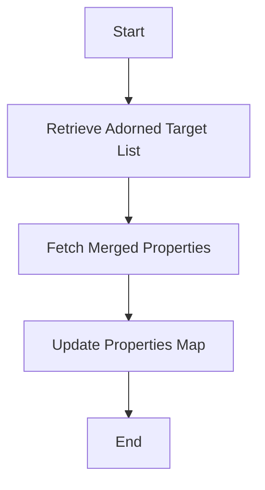

This document will cover the process of updating merged properties in an adorned target list. We'll cover:

1. Retrieving the adorned target list
2. Fetching merged properties
3. Updating the properties map.

Technical document: <SwmLink doc-title="Updating Merged Properties Flow">[Updating Merged Properties Flow](/.swm/updating-merged-properties-flow.nmbi00n7.sw.md)</SwmLink>

# [Retrieving the Adorned Target List](https://app.swimm.io/repos/Z2l0aHViJTNBJTNBQnJvYWRsZWFmQ29tbWVyY2UtZGVtby1uZXclM0ElM0FTd2ltbS1EZW1v/docs/nmbi00n7#retrieving-the-adorned-target-list)

The process begins by retrieving the adorned target list from the persistence perspective. This list contains the entities that are adorned with additional properties. The adorned target list is essential as it provides the context and structure for the entities that will be updated.

# [Fetching Merged Properties](https://app.swimm.io/repos/Z2l0aHViJTNBJTNBQnJvYWRsZWFmQ29tbWVyY2UtZGVtby1uZXclM0ElM0FTd2ltbS1EZW1v/docs/nmbi00n7#fetching-merged-properties)

Next, the system fetches the merged properties for the adorned target entity. Merged properties are a combination of the base properties of the entity and any additional properties that have been adorned. This step ensures that all relevant properties, both original and adorned, are considered for the update.

# [Updating the Properties Map](https://app.swimm.io/repos/Z2l0aHViJTNBJTNBQnJvYWRsZWFmQ29tbWVyY2UtZGVtby1uZXclM0ElM0FTd2ltbS1EZW1v/docs/nmbi00n7#updating-the-properties-map)

Finally, the `allMergedProperties` map is updated with the fetched properties. This map holds all the properties that have been merged and is used to ensure that the adorned target list reflects the most current and accurate data. Updating this map is crucial for maintaining data integrity and consistency across the system.

&nbsp;

*This is an auto-generated document by Swimm AI 🌊 and has not yet been verified by a human*

<SwmMeta version="3.0.0" repo-id="Z2l0aHViJTNBJTNBQnJvYWRsZWFmQ29tbWVyY2UtZGVtby1uZXclM0ElM0FTd2ltbS1EZW1v" repo-name="BroadleafCommerce-demo-new" doc-type="product-flows">Powered by [Swimm](/)</SwmMeta>
