In this document, we will explain the validation process. The process involves several steps to ensure that the rules and data provided are correct and meet the required criteria.

The validation process starts by checking if the provided data can be handled. It then retrieves necessary managers and converts rule data into a specific format. If the data is invalid, it returns an error message. Otherwise, it continues to process the data, ensuring it meets all the required conditions.

Here is a high level diagram of the flow, showing only the most important functions:

```mermaid
graph TD;
      subgraph admin/broadleaf-open-admin-platform/src/main/java/org/broadleafcommerce/openadmin/server/service/persistence/validation
9eea22b132b23c77b67f4b3867fcbb7dfdd36e2206c4eafb0c597217d0a6311d(validate):::mainFlowStyle --> c3acd3cba73622257af334366b38eb66216e3e17d42a845c507b4c81defbe215(getFieldManager)
end

subgraph admin/broadleaf-open-admin-platform/src/main/java/org/broadleafcommerce/openadmin/server/service/persistence/validation
9eea22b132b23c77b67f4b3867fcbb7dfdd36e2206c4eafb0c597217d0a6311d(validate):::mainFlowStyle --> 7fd4f835fcbbcb6faf2ba0c48d5f8014ed01508d7ab666a091dbb65239731858(getDynamicEntityDao)
end

subgraph admin/broadleaf-open-admin-platform/src/main/java/org/broadleafcommerce/openadmin/server/service/persistence
9eea22b132b23c77b67f4b3867fcbb7dfdd36e2206c4eafb0c597217d0a6311d(validate):::mainFlowStyle --> 726a0a818b32b3f934ff3fd8bc3b7177141e1c0c37c55cc8853cc09f73b6dc0b(getPersistenceManager)
end

subgraph admin/broadleaf-open-admin-platform/src/main/java/org/broadleafcommerce/openadmin/server/service/persistence
9eea22b132b23c77b67f4b3867fcbb7dfdd36e2206c4eafb0c597217d0a6311d(validate):::mainFlowStyle --> 691be3091cea80cdd47cb800828f916f783b06cc864f780b742f7f214013ad0c(convertSimpleMatchRuleJsonToMvel):::mainFlowStyle
end

subgraph admin/broadleaf-open-admin-platform/src/main/java/org/broadleafcommerce/openadmin/server/service/persistence
691be3091cea80cdd47cb800828f916f783b06cc864f780b742f7f214013ad0c(convertSimpleMatchRuleJsonToMvel):::mainFlowStyle --> faa95f5224207fc19ee95679d16aa8a57140e5c28b85ce4ba69561de49d0facb(convertDTOToMvelString):::mainFlowStyle
end

subgraph admin/broadleaf-open-admin-platform/src/main/java/org/broadleafcommerce/openadmin/web/rulebuilder/DataDTOToMVELTranslator.java
faa95f5224207fc19ee95679d16aa8a57140e5c28b85ce4ba69561de49d0facb(convertDTOToMvelString):::mainFlowStyle --> 71de47ea59923f6c4a5aba75258666f53f1a3bbed283513b4fbb4451cbcc3364(createMVEL):::mainFlowStyle
end

subgraph admin/broadleaf-open-admin-platform/src/main/java/org/broadleafcommerce/openadmin/web/rulebuilder/DataDTOToMVELTranslator.java
71de47ea59923f6c4a5aba75258666f53f1a3bbed283513b4fbb4451cbcc3364(createMVEL):::mainFlowStyle --> b0bc8cfb6f5c0699617a513c48253eb6abd8577cd3457c44588d28c421551b88(buildMVEL):::mainFlowStyle
end

subgraph admin/broadleaf-open-admin-platform/src/main/java/org/broadleafcommerce/openadmin/web/rulebuilder/DataDTOToMVELTranslator.java
b0bc8cfb6f5c0699617a513c48253eb6abd8577cd3457c44588d28c421551b88(buildMVEL):::mainFlowStyle --> bb21f50a7dc190e51bd78c1f14b56be501c10df080471337a85add089ef0ed65(buildExpression):::mainFlowStyle
end


      classDef mainFlowStyle color:#000000,fill:#7CB9F4
classDef rootsStyle color:#000000,fill:#00FFF4
classDef Style1 color:#000000,fill:#00FFAA
classDef Style2 color:#000000,fill:#FFFF00
classDef Style3 color:#000000,fill:#AA7CB9

%% Swimm:
%% graph TD;
%%       subgraph <SwmPath>[admin/broadleaf-open-admin-platform/src/main/java/org/broadleafcommerce/openadmin/server/service/persistence/validation/](admin/broadleaf-open-admin-platform/src/main/java/org/broadleafcommerce/openadmin/server/service/persistence/validation/)</SwmPath>
%% 9eea22b132b23c77b67f4b3867fcbb7dfdd36e2206c4eafb0c597217d0a6311d(validate):::mainFlowStyle --> c3acd3cba73622257af334366b38eb66216e3e17d42a845c507b4c81defbe215(getFieldManager)
%% end
%% 
%% subgraph <SwmPath>[admin/broadleaf-open-admin-platform/src/main/java/org/broadleafcommerce/openadmin/server/service/persistence/validation/](admin/broadleaf-open-admin-platform/src/main/java/org/broadleafcommerce/openadmin/server/service/persistence/validation/)</SwmPath>
%% 9eea22b132b23c77b67f4b3867fcbb7dfdd36e2206c4eafb0c597217d0a6311d(validate):::mainFlowStyle --> 7fd4f835fcbbcb6faf2ba0c48d5f8014ed01508d7ab666a091dbb65239731858(getDynamicEntityDao)
%% end
%% 
%% subgraph <SwmPath>[admin/broadleaf-open-admin-platform/src/main/java/org/broadleafcommerce/openadmin/server/service/persistence/](admin/broadleaf-open-admin-platform/src/main/java/org/broadleafcommerce/openadmin/server/service/persistence/)</SwmPath>
%% 9eea22b132b23c77b67f4b3867fcbb7dfdd36e2206c4eafb0c597217d0a6311d(validate):::mainFlowStyle --> 726a0a818b32b3f934ff3fd8bc3b7177141e1c0c37c55cc8853cc09f73b6dc0b(getPersistenceManager)
%% end
%% 
%% subgraph <SwmPath>[admin/broadleaf-open-admin-platform/src/main/java/org/broadleafcommerce/openadmin/server/service/persistence/](admin/broadleaf-open-admin-platform/src/main/java/org/broadleafcommerce/openadmin/server/service/persistence/)</SwmPath>
%% 9eea22b132b23c77b67f4b3867fcbb7dfdd36e2206c4eafb0c597217d0a6311d(validate):::mainFlowStyle --> 691be3091cea80cdd47cb800828f916f783b06cc864f780b742f7f214013ad0c(convertSimpleMatchRuleJsonToMvel):::mainFlowStyle
%% end
%% 
%% subgraph <SwmPath>[admin/broadleaf-open-admin-platform/src/main/java/org/broadleafcommerce/openadmin/server/service/persistence/](admin/broadleaf-open-admin-platform/src/main/java/org/broadleafcommerce/openadmin/server/service/persistence/)</SwmPath>
%% 691be3091cea80cdd47cb800828f916f783b06cc864f780b742f7f214013ad0c(convertSimpleMatchRuleJsonToMvel):::mainFlowStyle --> faa95f5224207fc19ee95679d16aa8a57140e5c28b85ce4ba69561de49d0facb(convertDTOToMvelString):::mainFlowStyle
%% end
%% 
%% subgraph <SwmPath>[admin/broadleaf-open-admin-platform/src/main/java/org/broadleafcommerce/openadmin/web/rulebuilder/DataDTOToMVELTranslator.java](admin/broadleaf-open-admin-platform/src/main/java/org/broadleafcommerce/openadmin/web/rulebuilder/DataDTOToMVELTranslator.java)</SwmPath>
%% faa95f5224207fc19ee95679d16aa8a57140e5c28b85ce4ba69561de49d0facb(convertDTOToMvelString):::mainFlowStyle --> 71de47ea59923f6c4a5aba75258666f53f1a3bbed283513b4fbb4451cbcc3364(createMVEL):::mainFlowStyle
%% end
%% 
%% subgraph <SwmPath>[admin/broadleaf-open-admin-platform/src/main/java/org/broadleafcommerce/openadmin/web/rulebuilder/DataDTOToMVELTranslator.java](admin/broadleaf-open-admin-platform/src/main/java/org/broadleafcommerce/openadmin/web/rulebuilder/DataDTOToMVELTranslator.java)</SwmPath>
%% 71de47ea59923f6c4a5aba75258666f53f1a3bbed283513b4fbb4451cbcc3364(createMVEL):::mainFlowStyle --> b0bc8cfb6f5c0699617a513c48253eb6abd8577cd3457c44588d28c421551b88(buildMVEL):::mainFlowStyle
%% end
%% 
%% subgraph <SwmPath>[admin/broadleaf-open-admin-platform/src/main/java/org/broadleafcommerce/openadmin/web/rulebuilder/DataDTOToMVELTranslator.java](admin/broadleaf-open-admin-platform/src/main/java/org/broadleafcommerce/openadmin/web/rulebuilder/DataDTOToMVELTranslator.java)</SwmPath>
%% b0bc8cfb6f5c0699617a513c48253eb6abd8577cd3457c44588d28c421551b88(buildMVEL):::mainFlowStyle --> bb21f50a7dc190e51bd78c1f14b56be501c10df080471337a85add089ef0ed65(buildExpression):::mainFlowStyle
%% end
%% 
%% 
%%       classDef mainFlowStyle color:#000000,fill:#7CB9F4
%% classDef rootsStyle color:#000000,fill:#00FFF4
%% classDef Style1 color:#000000,fill:#00FFAA
%% classDef Style2 color:#000000,fill:#FFFF00
%% classDef Style3 color:#000000,fill:#AA7CB9
```



# Flow drill down

First, we'll zoom into this section of the flow:

```mermaid
graph TD;
      subgraph admin/broadleaf-open-admin-platform/src/main/java/org/broadleafcommerce/openadmin/server/service/persistence/validation
9eea22b132b23c77b67f4b3867fcbb7dfdd36e2206c4eafb0c597217d0a6311d(validate):::mainFlowStyle --> c3acd3cba73622257af334366b38eb66216e3e17d42a845c507b4c81defbe215(getFieldManager)
end

subgraph admin/broadleaf-open-admin-platform/src/main/java/org/broadleafcommerce/openadmin/server/service/persistence/validation
9eea22b132b23c77b67f4b3867fcbb7dfdd36e2206c4eafb0c597217d0a6311d(validate):::mainFlowStyle --> 7fd4f835fcbbcb6faf2ba0c48d5f8014ed01508d7ab666a091dbb65239731858(getDynamicEntityDao)
end

subgraph admin/broadleaf-open-admin-platform/src/main/java/org/broadleafcommerce/openadmin/server/service/persistence
9eea22b132b23c77b67f4b3867fcbb7dfdd36e2206c4eafb0c597217d0a6311d(validate):::mainFlowStyle --> 726a0a818b32b3f934ff3fd8bc3b7177141e1c0c37c55cc8853cc09f73b6dc0b(getPersistenceManager)
end

subgraph admin/broadleaf-open-admin-platform/src/main/java/org/broadleafcommerce/openadmin/server/service/persistence
9eea22b132b23c77b67f4b3867fcbb7dfdd36e2206c4eafb0c597217d0a6311d(validate):::mainFlowStyle --> 691be3091cea80cdd47cb800828f916f783b06cc864f780b742f7f214013ad0c(convertSimpleMatchRuleJsonToMvel):::mainFlowStyle
end

subgraph admin/broadleaf-open-admin-platform/src/main/java/org/broadleafcommerce/openadmin/server/service/persistence
691be3091cea80cdd47cb800828f916f783b06cc864f780b742f7f214013ad0c(convertSimpleMatchRuleJsonToMvel):::mainFlowStyle --> tccmm(...)
end

subgraph core/broadleaf-framework/src/main/java/org/broadleafcommerce/core/util/queue/ZookeeperDistributedQueue.java
726a0a818b32b3f934ff3fd8bc3b7177141e1c0c37c55cc8853cc09f73b6dc0b(getPersistenceManager) --> 85d7f3f22dfa976d71cb842ab2b83f9869453c937ae564f2f861a88f6d5e51e4(peek)
end

subgraph admin/broadleaf-open-admin-platform/src/main/java/org/broadleafcommerce/openadmin/server/service/persistence
7fd4f835fcbbcb6faf2ba0c48d5f8014ed01508d7ab666a091dbb65239731858(getDynamicEntityDao) --> 726a0a818b32b3f934ff3fd8bc3b7177141e1c0c37c55cc8853cc09f73b6dc0b(getPersistenceManager)
end

subgraph admin/broadleaf-open-admin-platform/src/main/java/org/broadleafcommerce/openadmin/server/service/persistence/validation
c3acd3cba73622257af334366b38eb66216e3e17d42a845c507b4c81defbe215(getFieldManager) --> 7fd4f835fcbbcb6faf2ba0c48d5f8014ed01508d7ab666a091dbb65239731858(getDynamicEntityDao)
end

subgraph admin/broadleaf-open-admin-platform/src/main/java/org/broadleafcommerce/openadmin/server/service/persistence
c3acd3cba73622257af334366b38eb66216e3e17d42a845c507b4c81defbe215(getFieldManager) --> 726a0a818b32b3f934ff3fd8bc3b7177141e1c0c37c55cc8853cc09f73b6dc0b(getPersistenceManager)
end


      classDef mainFlowStyle color:#000000,fill:#7CB9F4
classDef rootsStyle color:#000000,fill:#00FFF4
classDef Style1 color:#000000,fill:#00FFAA
classDef Style2 color:#000000,fill:#FFFF00
classDef Style3 color:#000000,fill:#AA7CB9

%% Swimm:
%% graph TD;
%%       subgraph <SwmPath>[admin/broadleaf-open-admin-platform/src/main/java/org/broadleafcommerce/openadmin/server/service/persistence/validation/](admin/broadleaf-open-admin-platform/src/main/java/org/broadleafcommerce/openadmin/server/service/persistence/validation/)</SwmPath>
%% 9eea22b132b23c77b67f4b3867fcbb7dfdd36e2206c4eafb0c597217d0a6311d(validate):::mainFlowStyle --> c3acd3cba73622257af334366b38eb66216e3e17d42a845c507b4c81defbe215(getFieldManager)
%% end
%% 
%% subgraph <SwmPath>[admin/broadleaf-open-admin-platform/src/main/java/org/broadleafcommerce/openadmin/server/service/persistence/validation/](admin/broadleaf-open-admin-platform/src/main/java/org/broadleafcommerce/openadmin/server/service/persistence/validation/)</SwmPath>
%% 9eea22b132b23c77b67f4b3867fcbb7dfdd36e2206c4eafb0c597217d0a6311d(validate):::mainFlowStyle --> 7fd4f835fcbbcb6faf2ba0c48d5f8014ed01508d7ab666a091dbb65239731858(getDynamicEntityDao)
%% end
%% 
%% subgraph <SwmPath>[admin/broadleaf-open-admin-platform/src/main/java/org/broadleafcommerce/openadmin/server/service/persistence/](admin/broadleaf-open-admin-platform/src/main/java/org/broadleafcommerce/openadmin/server/service/persistence/)</SwmPath>
%% 9eea22b132b23c77b67f4b3867fcbb7dfdd36e2206c4eafb0c597217d0a6311d(validate):::mainFlowStyle --> 726a0a818b32b3f934ff3fd8bc3b7177141e1c0c37c55cc8853cc09f73b6dc0b(getPersistenceManager)
%% end
%% 
%% subgraph <SwmPath>[admin/broadleaf-open-admin-platform/src/main/java/org/broadleafcommerce/openadmin/server/service/persistence/](admin/broadleaf-open-admin-platform/src/main/java/org/broadleafcommerce/openadmin/server/service/persistence/)</SwmPath>
%% 9eea22b132b23c77b67f4b3867fcbb7dfdd36e2206c4eafb0c597217d0a6311d(validate):::mainFlowStyle --> 691be3091cea80cdd47cb800828f916f783b06cc864f780b742f7f214013ad0c(convertSimpleMatchRuleJsonToMvel):::mainFlowStyle
%% end
%% 
%% subgraph <SwmPath>[admin/broadleaf-open-admin-platform/src/main/java/org/broadleafcommerce/openadmin/server/service/persistence/](admin/broadleaf-open-admin-platform/src/main/java/org/broadleafcommerce/openadmin/server/service/persistence/)</SwmPath>
%% 691be3091cea80cdd47cb800828f916f783b06cc864f780b742f7f214013ad0c(convertSimpleMatchRuleJsonToMvel):::mainFlowStyle --> tccmm(...)
%% end
%% 
%% subgraph <SwmPath>[core/broadleaf-framework/src/main/java/org/broadleafcommerce/core/util/queue/ZookeeperDistributedQueue.java](core/broadleaf-framework/src/main/java/org/broadleafcommerce/core/util/queue/ZookeeperDistributedQueue.java)</SwmPath>
%% 726a0a818b32b3f934ff3fd8bc3b7177141e1c0c37c55cc8853cc09f73b6dc0b(getPersistenceManager) --> 85d7f3f22dfa976d71cb842ab2b83f9869453c937ae564f2f861a88f6d5e51e4(peek)
%% end
%% 
%% subgraph <SwmPath>[admin/broadleaf-open-admin-platform/src/main/java/org/broadleafcommerce/openadmin/server/service/persistence/](admin/broadleaf-open-admin-platform/src/main/java/org/broadleafcommerce/openadmin/server/service/persistence/)</SwmPath>
%% 7fd4f835fcbbcb6faf2ba0c48d5f8014ed01508d7ab666a091dbb65239731858(getDynamicEntityDao) --> 726a0a818b32b3f934ff3fd8bc3b7177141e1c0c37c55cc8853cc09f73b6dc0b(getPersistenceManager)
%% end
%% 
%% subgraph <SwmPath>[admin/broadleaf-open-admin-platform/src/main/java/org/broadleafcommerce/openadmin/server/service/persistence/validation/](admin/broadleaf-open-admin-platform/src/main/java/org/broadleafcommerce/openadmin/server/service/persistence/validation/)</SwmPath>
%% c3acd3cba73622257af334366b38eb66216e3e17d42a845c507b4c81defbe215(getFieldManager) --> 7fd4f835fcbbcb6faf2ba0c48d5f8014ed01508d7ab666a091dbb65239731858(getDynamicEntityDao)
%% end
%% 
%% subgraph <SwmPath>[admin/broadleaf-open-admin-platform/src/main/java/org/broadleafcommerce/openadmin/server/service/persistence/](admin/broadleaf-open-admin-platform/src/main/java/org/broadleafcommerce/openadmin/server/service/persistence/)</SwmPath>
%% c3acd3cba73622257af334366b38eb66216e3e17d42a845c507b4c81defbe215(getFieldManager) --> 726a0a818b32b3f934ff3fd8bc3b7177141e1c0c37c55cc8853cc09f73b6dc0b(getPersistenceManager)
%% end
%% 
%% 
%%       classDef mainFlowStyle color:#000000,fill:#7CB9F4
%% classDef rootsStyle color:#000000,fill:#00FFF4
%% classDef Style1 color:#000000,fill:#00FFAA
%% classDef Style2 color:#000000,fill:#FFFF00
%% classDef Style3 color:#000000,fill:#AA7CB9
```



<SwmSnippet path="/admin/broadleaf-open-admin-platform/src/main/java/org/broadleafcommerce/openadmin/server/service/persistence/validation/RuleFieldValidator.java" line="57">

---

## Validate Function

The <SwmToken path="admin/broadleaf-open-admin-platform/src/main/java/org/broadleafcommerce/openadmin/server/service/persistence/validation/RuleFieldValidator.java" pos="57:5:5" line-data="    public PropertyValidationResult validate(PopulateValueRequest populateValueRequest, Serializable instance) {">`validate`</SwmToken> function is responsible for validating rules based on the provided <SwmToken path="admin/broadleaf-open-admin-platform/src/main/java/org/broadleafcommerce/openadmin/server/service/persistence/validation/RuleFieldValidator.java" pos="57:7:7" line-data="    public PropertyValidationResult validate(PopulateValueRequest populateValueRequest, Serializable instance) {">`PopulateValueRequest`</SwmToken>. It checks the field type and processes the rule JSON accordingly. If the rule is invalid, it returns an error message.

```java
    public PropertyValidationResult validate(PopulateValueRequest populateValueRequest, Serializable instance) {
        if (canHandleValidation(populateValueRequest)) {
            DataDTOToMVELTranslator translator = new DataDTOToMVELTranslator();
            EntityManager em = populateValueRequest.getPersistenceManager().getDynamicEntityDao().getStandardEntityManager();
            if (SupportedFieldType.RULE_SIMPLE.equals(populateValueRequest.getMetadata().getFieldType()) ||
                    SupportedFieldType.RULE_SIMPLE_TIME.equals(populateValueRequest.getMetadata().getFieldType())) {
                
                //AntiSamy HTML encodes the rule JSON - pass the unHTMLEncoded version
                DataWrapper dw = ruleFieldExtractionUtility.convertJsonToDataWrapper(populateValueRequest.getProperty().getUnHtmlEncodedValue());
                if (dw != null && StringUtils.isNotEmpty(dw.getError())) {
                    if("Invalid Rule".equals(dw.getError())){
                        return new PropertyValidationResult(false, dw.getError());
                    }
                    return new PropertyValidationResult(false, "Could not serialize JSON from rule builder: " + dw.getError());
                }
                if (dw == null || StringUtils.isEmpty(dw.getError())) {
                    try {
                        String mvel = ruleFieldExtractionUtility.convertSimpleMatchRuleJsonToMvel(translator, RuleIdentifier.ENTITY_KEY_MAP.get(populateValueRequest.getMetadata().getRuleIdentifier()),
                                populateValueRequest.getMetadata().getRuleIdentifier(), dw);
                    } catch (MVELTranslationException e) {
                        return new PropertyValidationResult(false, getMvelParsingErrorMesage(dw, e));
```

---

</SwmSnippet>

<SwmSnippet path="/admin/broadleaf-open-admin-platform/src/main/java/org/broadleafcommerce/openadmin/server/service/persistence/validation/AfterStartDateValidator.java" line="96">

---

## Get Field Manager

The <SwmToken path="admin/broadleaf-open-admin-platform/src/main/java/org/broadleafcommerce/openadmin/server/service/persistence/validation/AfterStartDateValidator.java" pos="96:5:5" line-data="    protected FieldManager getFieldManager(BasicFieldMetadata propertyMetadata) {">`getFieldManager`</SwmToken> function retrieves the <SwmToken path="admin/broadleaf-open-admin-platform/src/main/java/org/broadleafcommerce/openadmin/server/service/persistence/validation/AfterStartDateValidator.java" pos="96:3:3" line-data="    protected FieldManager getFieldManager(BasicFieldMetadata propertyMetadata) {">`FieldManager`</SwmToken> for a given <SwmToken path="admin/broadleaf-open-admin-platform/src/main/java/org/broadleafcommerce/openadmin/server/service/persistence/validation/AfterStartDateValidator.java" pos="96:7:7" line-data="    protected FieldManager getFieldManager(BasicFieldMetadata propertyMetadata) {">`BasicFieldMetadata`</SwmToken>. It determines the appropriate <SwmToken path="admin/broadleaf-open-admin-platform/src/main/java/org/broadleafcommerce/openadmin/server/service/persistence/validation/AfterStartDateValidator.java" pos="97:1:1" line-data="        PersistenceManager persistenceManager;">`PersistenceManager`</SwmToken> based on the target class and then gets the <SwmToken path="admin/broadleaf-open-admin-platform/src/main/java/org/broadleafcommerce/openadmin/server/service/persistence/validation/AfterStartDateValidator.java" pos="96:3:3" line-data="    protected FieldManager getFieldManager(BasicFieldMetadata propertyMetadata) {">`FieldManager`</SwmToken> from the <SwmToken path="admin/broadleaf-open-admin-platform/src/main/java/org/broadleafcommerce/openadmin/server/service/persistence/validation/UniqueValueValidator.java" pos="71:3:3" line-data="    protected DynamicEntityDao getDynamicEntityDao(String className) {">`DynamicEntityDao`</SwmToken>.

```java
    protected FieldManager getFieldManager(BasicFieldMetadata propertyMetadata) {
        PersistenceManager persistenceManager;
        if (propertyMetadata.getTargetClass() != null) {
            persistenceManager = PersistenceManagerFactory.getPersistenceManager(propertyMetadata.getTargetClass());
        } else {
            persistenceManager = PersistenceManagerFactory.getPersistenceManager();
        }
        return persistenceManager.getDynamicEntityDao().getFieldManager();
    }
```

---

</SwmSnippet>

<SwmSnippet path="/admin/broadleaf-open-admin-platform/src/main/java/org/broadleafcommerce/openadmin/server/service/persistence/validation/UniqueValueValidator.java" line="71">

---

## Get Dynamic Entity DAO

The <SwmToken path="admin/broadleaf-open-admin-platform/src/main/java/org/broadleafcommerce/openadmin/server/service/persistence/validation/UniqueValueValidator.java" pos="71:5:5" line-data="    protected DynamicEntityDao getDynamicEntityDao(String className) {">`getDynamicEntityDao`</SwmToken> function retrieves the <SwmToken path="admin/broadleaf-open-admin-platform/src/main/java/org/broadleafcommerce/openadmin/server/service/persistence/validation/UniqueValueValidator.java" pos="71:3:3" line-data="    protected DynamicEntityDao getDynamicEntityDao(String className) {">`DynamicEntityDao`</SwmToken> for a given class name by using the <SwmToken path="admin/broadleaf-open-admin-platform/src/main/java/org/broadleafcommerce/openadmin/server/service/persistence/validation/UniqueValueValidator.java" pos="72:3:3" line-data="        return PersistenceManagerFactory.getPersistenceManager(className).getDynamicEntityDao();">`PersistenceManagerFactory`</SwmToken>.

```java
    protected DynamicEntityDao getDynamicEntityDao(String className) {
        return PersistenceManagerFactory.getPersistenceManager(className).getDynamicEntityDao();
    }
```

---

</SwmSnippet>

<SwmSnippet path="/admin/broadleaf-open-admin-platform/src/main/java/org/broadleafcommerce/openadmin/server/service/persistence/PersistenceManagerContext.java" line="49">

---

## Get Persistence Manager

The <SwmToken path="admin/broadleaf-open-admin-platform/src/main/java/org/broadleafcommerce/openadmin/server/service/persistence/PersistenceManagerContext.java" pos="49:5:5" line-data="    public PersistenceManager getPersistenceManager() {">`getPersistenceManager`</SwmToken> function retrieves the current <SwmToken path="admin/broadleaf-open-admin-platform/src/main/java/org/broadleafcommerce/openadmin/server/service/persistence/PersistenceManagerContext.java" pos="49:3:3" line-data="    public PersistenceManager getPersistenceManager() {">`PersistenceManager`</SwmToken> from the context. If the context is empty, it returns null.

```java
    public PersistenceManager getPersistenceManager() {
        return !persistenceManager.empty()?persistenceManager.peek():null;
    }
```

---

</SwmSnippet>

<SwmSnippet path="/core/broadleaf-framework/src/main/java/org/broadleafcommerce/core/util/queue/ZookeeperDistributedQueue.java" line="223">

---

## Peek Function

The <SwmToken path="core/broadleaf-framework/src/main/java/org/broadleafcommerce/core/util/queue/ZookeeperDistributedQueue.java" pos="223:5:5" line-data="    public T peek() {">`peek`</SwmToken> function in <SwmToken path="core/broadleaf-framework/src/main/java/org/broadleafcommerce/core/util/queue/ZookeeperDistributedQueue.java" pos="69:4:4" line-data="public class ZookeeperDistributedQueue&lt;T extends Serializable&gt; implements DistributedBlockingQueue&lt;T&gt; {">`ZookeeperDistributedQueue`</SwmToken> reads the queue and returns the next element without removing it. If the queue is empty or an error occurs, it returns null.

```java
    public T peek() {
        try {
            Map<String, T> elements = readQueueInternal(1, false, 0L);
            Iterator<Map.Entry<String, T>> entries = elements.entrySet().iterator();
            if (entries.hasNext()) {
                return entries.next().getValue();
            }
            
            return null;
        } catch (InterruptedException e) {
            Thread.currentThread().interrupt();
            return null;
        }
    }
```

---

</SwmSnippet>

Now, lets zoom into this section of the flow:

```mermaid
graph TD;
      subgraph admin/broadleaf-open-admin-platform/src/main/java/org/broadleafcommerce/openadmin
691be3091cea80cdd47cb800828f916f783b06cc864f780b742f7f214013ad0c(convertSimpleMatchRuleJsonToMvel):::mainFlowStyle --> faa95f5224207fc19ee95679d16aa8a57140e5c28b85ce4ba69561de49d0facb(convertDTOToMvelString):::mainFlowStyle
end

subgraph admin/broadleaf-open-admin-platform/src/main/java/org/broadleafcommerce/openadmin
faa95f5224207fc19ee95679d16aa8a57140e5c28b85ce4ba69561de49d0facb(convertDTOToMvelString):::mainFlowStyle --> 71de47ea59923f6c4a5aba75258666f53f1a3bbed283513b4fbb4451cbcc3364(createMVEL):::mainFlowStyle
end

subgraph admin/broadleaf-open-admin-platform/src/main/java/org/broadleafcommerce/openadmin
71de47ea59923f6c4a5aba75258666f53f1a3bbed283513b4fbb4451cbcc3364(createMVEL):::mainFlowStyle --> b0bc8cfb6f5c0699617a513c48253eb6abd8577cd3457c44588d28c421551b88(buildMVEL):::mainFlowStyle
end

subgraph admin/broadleaf-open-admin-platform/src/main/java/org/broadleafcommerce/openadmin
b0bc8cfb6f5c0699617a513c48253eb6abd8577cd3457c44588d28c421551b88(buildMVEL):::mainFlowStyle --> bb21f50a7dc190e51bd78c1f14b56be501c10df080471337a85add089ef0ed65(buildExpression):::mainFlowStyle
end


      classDef mainFlowStyle color:#000000,fill:#7CB9F4
classDef rootsStyle color:#000000,fill:#00FFF4
classDef Style1 color:#000000,fill:#00FFAA
classDef Style2 color:#000000,fill:#FFFF00
classDef Style3 color:#000000,fill:#AA7CB9

%% Swimm:
%% graph TD;
%%       subgraph <SwmPath>[admin/broadleaf-open-admin-platform/src/main/java/org/broadleafcommerce/openadmin/](admin/broadleaf-open-admin-platform/src/main/java/org/broadleafcommerce/openadmin/)</SwmPath>
%% 691be3091cea80cdd47cb800828f916f783b06cc864f780b742f7f214013ad0c(convertSimpleMatchRuleJsonToMvel):::mainFlowStyle --> faa95f5224207fc19ee95679d16aa8a57140e5c28b85ce4ba69561de49d0facb(convertDTOToMvelString):::mainFlowStyle
%% end
%% 
%% subgraph <SwmPath>[admin/broadleaf-open-admin-platform/src/main/java/org/broadleafcommerce/openadmin/](admin/broadleaf-open-admin-platform/src/main/java/org/broadleafcommerce/openadmin/)</SwmPath>
%% faa95f5224207fc19ee95679d16aa8a57140e5c28b85ce4ba69561de49d0facb(convertDTOToMvelString):::mainFlowStyle --> 71de47ea59923f6c4a5aba75258666f53f1a3bbed283513b4fbb4451cbcc3364(createMVEL):::mainFlowStyle
%% end
%% 
%% subgraph <SwmPath>[admin/broadleaf-open-admin-platform/src/main/java/org/broadleafcommerce/openadmin/](admin/broadleaf-open-admin-platform/src/main/java/org/broadleafcommerce/openadmin/)</SwmPath>
%% 71de47ea59923f6c4a5aba75258666f53f1a3bbed283513b4fbb4451cbcc3364(createMVEL):::mainFlowStyle --> b0bc8cfb6f5c0699617a513c48253eb6abd8577cd3457c44588d28c421551b88(buildMVEL):::mainFlowStyle
%% end
%% 
%% subgraph <SwmPath>[admin/broadleaf-open-admin-platform/src/main/java/org/broadleafcommerce/openadmin/](admin/broadleaf-open-admin-platform/src/main/java/org/broadleafcommerce/openadmin/)</SwmPath>
%% b0bc8cfb6f5c0699617a513c48253eb6abd8577cd3457c44588d28c421551b88(buildMVEL):::mainFlowStyle --> bb21f50a7dc190e51bd78c1f14b56be501c10df080471337a85add089ef0ed65(buildExpression):::mainFlowStyle
%% end
%% 
%% 
%%       classDef mainFlowStyle color:#000000,fill:#7CB9F4
%% classDef rootsStyle color:#000000,fill:#00FFF4
%% classDef Style1 color:#000000,fill:#00FFAA
%% classDef Style2 color:#000000,fill:#FFFF00
%% classDef Style3 color:#000000,fill:#AA7CB9
```



<SwmSnippet path="/admin/broadleaf-open-admin-platform/src/main/java/org/broadleafcommerce/openadmin/server/service/persistence/module/provider/RuleFieldExtractionUtility.java" line="93">

---

## <SwmToken path="admin/broadleaf-open-admin-platform/src/main/java/org/broadleafcommerce/openadmin/server/service/persistence/validation/RuleFieldValidator.java" pos="74:9:9" line-data="                        String mvel = ruleFieldExtractionUtility.convertSimpleMatchRuleJsonToMvel(translator, RuleIdentifier.ENTITY_KEY_MAP.get(populateValueRequest.getMetadata().getRuleIdentifier()),">`convertSimpleMatchRuleJsonToMvel`</SwmToken>

The <SwmToken path="admin/broadleaf-open-admin-platform/src/main/java/org/broadleafcommerce/openadmin/server/service/persistence/validation/RuleFieldValidator.java" pos="74:9:9" line-data="                        String mvel = ruleFieldExtractionUtility.convertSimpleMatchRuleJsonToMvel(translator, RuleIdentifier.ENTITY_KEY_MAP.get(populateValueRequest.getMetadata().getRuleIdentifier()),">`convertSimpleMatchRuleJsonToMvel`</SwmToken> method is responsible for converting a <SwmToken path="admin/broadleaf-open-admin-platform/src/main/java/org/broadleafcommerce/openadmin/server/service/persistence/validation/RuleFieldValidator.java" pos="65:1:1" line-data="                DataWrapper dw = ruleFieldExtractionUtility.convertJsonToDataWrapper(populateValueRequest.getProperty().getUnHtmlEncodedValue());">`DataWrapper`</SwmToken> object into an MVEL expression. It ensures that there is only one <SwmToken path="admin/broadleaf-open-admin-platform/src/main/java/org/broadleafcommerce/openadmin/server/service/persistence/module/provider/RuleFieldExtractionUtility.java" pos="94:13:13" line-data="        // there can only be one DataDTO for an appliesTo* rule">`DataDTO`</SwmToken> in the <SwmToken path="admin/broadleaf-open-admin-platform/src/main/java/org/broadleafcommerce/openadmin/server/service/persistence/validation/RuleFieldValidator.java" pos="65:1:1" line-data="                DataWrapper dw = ruleFieldExtractionUtility.convertJsonToDataWrapper(populateValueRequest.getProperty().getUnHtmlEncodedValue());">`DataWrapper`</SwmToken> and then delegates the conversion to the <SwmToken path="admin/broadleaf-open-admin-platform/src/main/java/org/broadleafcommerce/openadmin/server/service/persistence/module/provider/RuleFieldExtractionUtility.java" pos="97:5:5" line-data="            mvel = convertDTOToMvelString(translator, entityKey, dto, fieldService);">`convertDTOToMvelString`</SwmToken> method.

```java
        String mvel = null;
        // there can only be one DataDTO for an appliesTo* rule
        if (dw != null && dw.getData().size() == 1) {
            DataDTO dto = dw.getData().get(0);
            mvel = convertDTOToMvelString(translator, entityKey, dto, fieldService);
        }

        return mvel;
```

---

</SwmSnippet>

<SwmSnippet path="/admin/broadleaf-open-admin-platform/src/main/java/org/broadleafcommerce/openadmin/server/service/persistence/module/provider/RuleFieldExtractionUtility.java" line="103">

---

## <SwmToken path="admin/broadleaf-open-admin-platform/src/main/java/org/broadleafcommerce/openadmin/server/service/persistence/module/provider/RuleFieldExtractionUtility.java" pos="103:5:5" line-data="    public String convertDTOToMvelString(DataDTOToMVELTranslator translator, String entityKey, DataDTO dto, String fieldService) throws MVELTranslationException {">`convertDTOToMvelString`</SwmToken>

The <SwmToken path="admin/broadleaf-open-admin-platform/src/main/java/org/broadleafcommerce/openadmin/server/service/persistence/module/provider/RuleFieldExtractionUtility.java" pos="103:5:5" line-data="    public String convertDTOToMvelString(DataDTOToMVELTranslator translator, String entityKey, DataDTO dto, String fieldService) throws MVELTranslationException {">`convertDTOToMvelString`</SwmToken> method takes a <SwmToken path="admin/broadleaf-open-admin-platform/src/main/java/org/broadleafcommerce/openadmin/server/service/persistence/module/provider/RuleFieldExtractionUtility.java" pos="103:17:17" line-data="    public String convertDTOToMvelString(DataDTOToMVELTranslator translator, String entityKey, DataDTO dto, String fieldService) throws MVELTranslationException {">`DataDTO`</SwmToken> and converts it into an MVEL string using the <SwmToken path="admin/broadleaf-open-admin-platform/src/main/java/org/broadleafcommerce/openadmin/server/service/persistence/module/provider/RuleFieldExtractionUtility.java" pos="104:5:5" line-data="        return translator.createMVEL(entityKey, dto, ruleBuilderFieldServiceFactory.createInstance(fieldService));">`createMVEL`</SwmToken> method of the <SwmToken path="admin/broadleaf-open-admin-platform/src/main/java/org/broadleafcommerce/openadmin/server/service/persistence/module/provider/RuleFieldExtractionUtility.java" pos="103:7:7" line-data="    public String convertDTOToMvelString(DataDTOToMVELTranslator translator, String entityKey, DataDTO dto, String fieldService) throws MVELTranslationException {">`DataDTOToMVELTranslator`</SwmToken> class. This method is crucial for transforming data transfer objects into executable MVEL expressions.

```java
    public String convertDTOToMvelString(DataDTOToMVELTranslator translator, String entityKey, DataDTO dto, String fieldService) throws MVELTranslationException {
        return translator.createMVEL(entityKey, dto, ruleBuilderFieldServiceFactory.createInstance(fieldService));
```

---

</SwmSnippet>

<SwmSnippet path="/admin/broadleaf-open-admin-platform/src/main/java/org/broadleafcommerce/openadmin/web/rulebuilder/DataDTOToMVELTranslator.java" line="62">

---

## <SwmToken path="admin/broadleaf-open-admin-platform/src/main/java/org/broadleafcommerce/openadmin/web/rulebuilder/DataDTOToMVELTranslator.java" pos="62:5:5" line-data="    public String createMVEL(String entityKey, DataDTO dataDTO, RuleBuilderFieldService fieldService)">`createMVEL`</SwmToken>

The <SwmToken path="admin/broadleaf-open-admin-platform/src/main/java/org/broadleafcommerce/openadmin/web/rulebuilder/DataDTOToMVELTranslator.java" pos="62:5:5" line-data="    public String createMVEL(String entityKey, DataDTO dataDTO, RuleBuilderFieldService fieldService)">`createMVEL`</SwmToken> method constructs an MVEL expression from a <SwmToken path="admin/broadleaf-open-admin-platform/src/main/java/org/broadleafcommerce/openadmin/web/rulebuilder/DataDTOToMVELTranslator.java" pos="62:12:12" line-data="    public String createMVEL(String entityKey, DataDTO dataDTO, RuleBuilderFieldService fieldService)">`DataDTO`</SwmToken>. It uses a <SwmToken path="admin/broadleaf-open-admin-platform/src/main/java/org/broadleafcommerce/openadmin/web/rulebuilder/DataDTOToMVELTranslator.java" pos="64:1:1" line-data="        StringBuffer sb = new StringBuffer();">`StringBuffer`</SwmToken> to build the expression and calls the <SwmToken path="admin/broadleaf-open-admin-platform/src/main/java/org/broadleafcommerce/openadmin/web/rulebuilder/DataDTOToMVELTranslator.java" pos="65:1:1" line-data="        buildMVEL(dataDTO, sb, entityKey, null, fieldService);">`buildMVEL`</SwmToken> method to append the necessary components.

```java
    public String createMVEL(String entityKey, DataDTO dataDTO, RuleBuilderFieldService fieldService)
            throws MVELTranslationException {
        StringBuffer sb = new StringBuffer();
        buildMVEL(dataDTO, sb, entityKey, null, fieldService);
        String response = sb.toString().trim();
        if (response.length() == 0) {
            response = null;
        }
        return response;
```

---

</SwmSnippet>

<SwmSnippet path="/admin/broadleaf-open-admin-platform/src/main/java/org/broadleafcommerce/openadmin/web/rulebuilder/DataDTOToMVELTranslator.java" line="73">

---

## <SwmToken path="admin/broadleaf-open-admin-platform/src/main/java/org/broadleafcommerce/openadmin/web/rulebuilder/DataDTOToMVELTranslator.java" pos="73:5:5" line-data="    protected void buildMVEL(DataDTO dataDTO, StringBuffer sb, String entityKey, String groupOperator,">`buildMVEL`</SwmToken>

The <SwmToken path="admin/broadleaf-open-admin-platform/src/main/java/org/broadleafcommerce/openadmin/web/rulebuilder/DataDTOToMVELTranslator.java" pos="73:5:5" line-data="    protected void buildMVEL(DataDTO dataDTO, StringBuffer sb, String entityKey, String groupOperator,">`buildMVEL`</SwmToken> method recursively constructs the MVEL expression by processing each <SwmToken path="admin/broadleaf-open-admin-platform/src/main/java/org/broadleafcommerce/openadmin/web/rulebuilder/DataDTOToMVELTranslator.java" pos="73:7:7" line-data="    protected void buildMVEL(DataDTO dataDTO, StringBuffer sb, String entityKey, String groupOperator,">`DataDTO`</SwmToken> and its associated rules. It handles different operators and ensures the correct logical structure of the expression.

```java
    protected void buildMVEL(DataDTO dataDTO, StringBuffer sb, String entityKey, String groupOperator,
                             RuleBuilderFieldService fieldService) throws MVELTranslationException {
        BLCOperator operator = null;
        if (dataDTO instanceof ExpressionDTO) {
            operator = BLCOperator.valueOf(((ExpressionDTO) dataDTO).getOperator());
        } else {
            operator = BLCOperator.valueOf(dataDTO.getCondition());
        }
        ArrayList<DataDTO> groups = dataDTO.getRules();
        if (sb.length() != 0 && sb.charAt(sb.length() - 1) != '(' && groupOperator != null) {
            BLCOperator groupOp = BLCOperator.valueOf(groupOperator);
            switch(groupOp) {
                default:
                    sb.append("&&");
                    break;
                case OR:
                    sb.append("||");
            }
        }
        if (dataDTO instanceof ExpressionDTO) {
            buildExpression((ExpressionDTO)dataDTO, sb, entityKey, operator, fieldService);
```

---

</SwmSnippet>

<SwmSnippet path="/admin/broadleaf-open-admin-platform/src/main/java/org/broadleafcommerce/openadmin/web/rulebuilder/DataDTOToMVELTranslator.java" line="110">

---

## <SwmToken path="admin/broadleaf-open-admin-platform/src/main/java/org/broadleafcommerce/openadmin/web/rulebuilder/DataDTOToMVELTranslator.java" pos="110:5:5" line-data="    protected void buildExpression(ExpressionDTO expressionDTO, StringBuffer sb, String entityKey,">`buildExpression`</SwmToken>

The <SwmToken path="admin/broadleaf-open-admin-platform/src/main/java/org/broadleafcommerce/openadmin/web/rulebuilder/DataDTOToMVELTranslator.java" pos="110:5:5" line-data="    protected void buildExpression(ExpressionDTO expressionDTO, StringBuffer sb, String entityKey,">`buildExpression`</SwmToken> method is responsible for constructing individual expressions within the MVEL string. It handles various operators and ensures that the expressions are correctly formatted and logically sound.

```java
    protected void buildExpression(ExpressionDTO expressionDTO, StringBuffer sb, String entityKey,
            BLCOperator operator, RuleBuilderFieldService fieldService)
            throws MVELTranslationException {
        String field = expressionDTO.getId();
        String overrideEntityKey = fieldService.getOverrideFieldEntityKey(field);
        if (overrideEntityKey != null) {
            entityKey = overrideEntityKey;
        }

        SupportedFieldType type = fieldService.getSupportedFieldType(field);
        SupportedFieldType secondaryType = fieldService.getSecondaryFieldType(field);
        Object[] value;

        if (type == null) {
            throw new MVELTranslationException(MVELTranslationException.SPECIFIED_FIELD_NOT_FOUND, "The DataDTO is not compatible with the RuleBuilderFieldService " +
                    "associated with the current rules builder. Unable to find the field " +
                    "specified: ("+field+")");
        }

        value = extractBasicValues(expressionDTO.getValue());

```

---

</SwmSnippet>

&nbsp;

*This is an auto-generated document by Swimm AI 🌊 and has not yet been verified by a human*

<SwmMeta version="3.0.0" repo-id="Z2l0aHViJTNBJTNBQnJvYWRsZWFmQ29tbWVyY2UtZGVtby1uZXclM0ElM0FTd2ltbS1EZW1v" repo-name="BroadleafCommerce-demo-new" doc-type="flows"><sup>Powered by [Swimm](/)</sup></SwmMeta>
