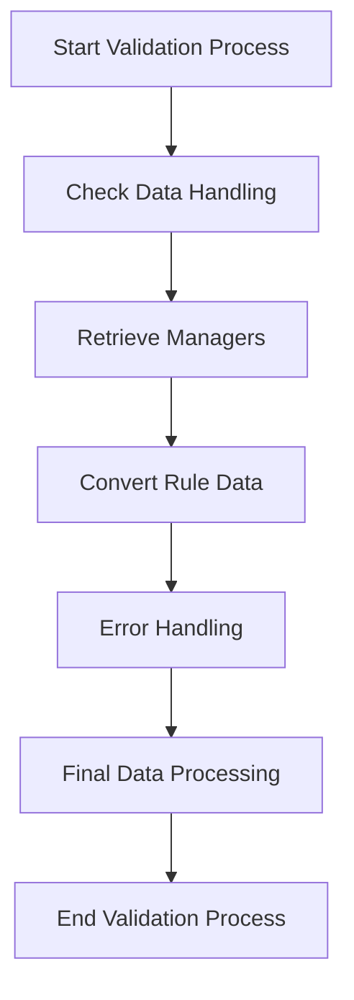

The validation process ensures that the rules and data provided are correct and meet the required criteria. This document will cover:

1. Initial Data Handling
2. Retrieving Necessary Managers
3. Converting Rule Data
4. Error Handling
5. Final Data Processing

Technical document: <SwmLink doc-title="Validation Process Overview">[Validation Process Overview](/.swm/validation-process-overview.3fju0l7o.sw.md)</SwmLink>

# [Initial Data Handling](https://app.swimm.io/repos/Z2l0aHViJTNBJTNBQnJvYWRsZWFmQ29tbWVyY2UtZGVtby1uZXclM0ElM0FTd2ltbS1EZW1v/docs/3fju0l7o#validate-function)

The validation process begins by checking if the provided data can be handled. This step ensures that the data format and type are appropriate for further processing. If the data cannot be handled, the process stops and an error message is returned. This step is crucial for preventing invalid data from proceeding through the validation process.

# [Retrieving Necessary Managers](https://app.swimm.io/repos/Z2l0aHViJTNBJTNBQnJvYWRsZWFmQ29tbWVyY2UtZGVtby1uZXclM0ElM0FTd2ltbS1EZW1v/docs/3fju0l7o#get-field-manager)

In this step, the system retrieves the necessary managers required for validation. This includes the Field Manager and the Dynamic Entity DAO. These managers are responsible for handling the data fields and entities involved in the validation process. By retrieving these managers, the system ensures that it has the necessary tools to process and validate the data accurately.

# [Converting Rule Data](https://app.swimm.io/repos/Z2l0aHViJTNBJTNBQnJvYWRsZWFmQ29tbWVyY2UtZGVtby1uZXclM0ElM0FTd2ltbS1EZW1v/docs/3fju0l7o#convertsimplematchrulejsontomvel)

The rule data provided in JSON format is converted into a specific format known as MVEL (MVFLEX Expression Language). This conversion is essential for interpreting and executing the rules within the system. The conversion process involves translating the JSON data into an MVEL expression that can be used to evaluate the rules. This step ensures that the rules are in a format that the system can understand and process.

# [Error Handling](https://app.swimm.io/repos/Z2l0aHViJTNBJTNBQnJvYWRsZWFmQ29tbWVyY2UtZGVtby1uZXclM0ElM0FTd2ltbS1EZW1v/docs/3fju0l7o#validate-function)

During the validation process, if any errors are encountered, they are handled appropriately. This includes checking for invalid rules and returning error messages if necessary. For example, if the rule JSON cannot be serialized or if there is an issue with the MVEL translation, an error message is generated and returned. This step ensures that any issues are promptly identified and communicated, preventing invalid data from being processed further.

# [Final Data Processing](https://app.swimm.io/repos/Z2l0aHViJTNBJTNBQnJvYWRsZWFmQ29tbWVyY2UtZGVtby1uZXclM0ElM0FTd2ltbS1EZW1v/docs/3fju0l7o#validate-function)

If the data passes all the previous validation steps, it proceeds to the final processing stage. In this stage, the data is processed to ensure it meets all the required conditions. This includes applying the validated rules and ensuring that the data conforms to the expected format and criteria. Once the data has been successfully processed, it is considered valid and can be used within the system.

&nbsp;

*This is an auto-generated document by Swimm AI 🌊 and has not yet been verified by a human*

<SwmMeta version="3.0.0" repo-id="Z2l0aHViJTNBJTNBQnJvYWRsZWFmQ29tbWVyY2UtZGVtby1uZXclM0ElM0FTd2ltbS1EZW1v" repo-name="BroadleafCommerce-demo-new" doc-type="product-flows">Powered by [Swimm](/)</SwmMeta>
