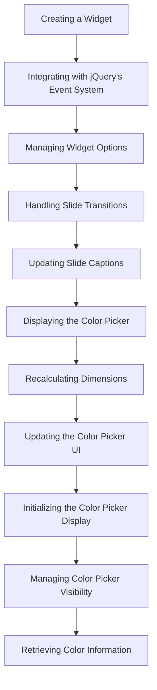

This document will cover the Widget Flow Overview, which includes:

 1. Creating a Widget
 2. Integrating with jQuery's Event System
 3. Managing Widget Options
 4. Handling Slide Transitions
 5. Updating Slide Captions
 6. Displaying the Color Picker
 7. Recalculating Dimensions
 8. Updating the Color Picker UI
 9. Initializing the Color Picker Display
10. Managing Color Picker Visibility
11. Retrieving Color Information

Technical document: <SwmLink doc-title="Widget Flow Overview">[Widget Flow Overview](/.swm/widget-flow-overview.laub7hj0.sw.md)</SwmLink>

# [Creating a Widget](https://app.swimm.io/repos/Z2l0aHViJTNBJTNBQnJvYWRsZWFmQ29tbWVyY2UtZGVtby1uZXclM0ElM0FTd2ltbS1EZW1v/docs/laub7hj0#widget)

The widget creation process begins with setting up the widget's prototype and managing its lifecycle. This ensures that the widget behaves consistently and can be easily extended. The widget function is essential for defining and extending stateful jQuery plugins, providing a structured way to handle method calls and manage the widget's lifecycle.

# [Integrating with jQuery's Event System](https://app.swimm.io/repos/Z2l0aHViJTNBJTNBQnJvYWRsZWFmQ29tbWVyY2UtZGVtby1uZXclM0ElM0FTd2ltbS1EZW1v/docs/laub7hj0#bridge)

The bridge function integrates the widget with jQuery's event system, allowing for method calls and initialization on selected elements. This ensures that method calls are properly routed to the widget instance and handles the creation of new widget instances when necessary.

# [Managing Widget Options](https://app.swimm.io/repos/Z2l0aHViJTNBJTNBQnJvYWRsZWFmQ29tbWVyY2UtZGVtby1uZXclM0ElM0FTd2ltbS1EZW1v/docs/laub7hj0#option)

The option function manages the widget's options, enabling dynamic customization. It allows for the retrieval and updating of option values, supporting nested keys and ensuring that changes to options are properly propagated to the widget instance.

# [Handling Slide Transitions](https://app.swimm.io/repos/Z2l0aHViJTNBJTNBQnJvYWRsZWFmQ29tbWVyY2UtZGVtby1uZXclM0ElM0FTd2ltbS1EZW1v/docs/laub7hj0#shift)

The shift function handles transitions between slides in a slider plugin. It manages the active slide index, updates the slide's z-index, and performs animations based on the specified direction and animation type. This ensures smooth transitions and updates the caption for the new active slide.

# [Updating Slide Captions](https://app.swimm.io/repos/Z2l0aHViJTNBJTNBQnJvYWRsZWFmQ29tbWVyY2UtZGVtby1uZXclM0ElM0FTd2ltbS1EZW1v/docs/laub7hj0#set-caption)

The setCaption function updates the caption for the current slide in the slider plugin. It retrieves the caption HTML from the specified location and applies animations for showing or hiding the caption based on the plugin's options. This enhances the visual presentation of the slider by providing contextual information for each slide.

# [Displaying the Color Picker](https://app.swimm.io/repos/Z2l0aHViJTNBJTNBQnJvYWRsZWFmQ29tbWVyY2UtZGVtby1uZXclM0ElM0FTd2ltbS1EZW1v/docs/laub7hj0#show)

The show function displays the Spectrum color picker. It triggers the beforeShow event, checks for any conditions that might prevent the picker from being shown, and sets up event listeners for interactions. This ensures that the color picker is properly initialized and visible to the user.

# [Recalculating Dimensions](https://app.swimm.io/repos/Z2l0aHViJTNBJTNBQnJvYWRsZWFmQ29tbWVyY2UtZGVtby1uZXclM0ElM0FTd2ltbS1EZW1v/docs/laub7hj0#reflow)

The reflow function recalculates the dimensions and positions of elements within the Spectrum color picker. It ensures that the picker is correctly positioned and updates the helper locations and palette if necessary. This is crucial for maintaining the visual integrity of the color picker during interactions.

# [Updating the Color Picker UI](https://app.swimm.io/repos/Z2l0aHViJTNBJTNBQnJvYWRsZWFmQ29tbWVyY2UtZGVtby1uZXclM0ElM0FTd2ltbS1EZW1v/docs/laub7hj0#update-ui)

The updateUI function updates the visual elements of the Spectrum color picker based on the current color selection. It adjusts the background colors, text input values, and palette display to reflect the selected color. This ensures that the user interface remains consistent with the user's color choices.

# [Initializing the Color Picker Display](https://app.swimm.io/repos/Z2l0aHViJTNBJTNBQnJvYWRsZWFmQ29tbWVyY2UtZGVtby1uZXclM0ElM0FTd2ltbS1EZW1v/docs/laub7hj0#draw-initial)

The drawInitial function initializes the display of the initial color selection in the Spectrum color picker. It updates the palette with the initial and current colors, providing a visual reference for the user. This enhances the user experience by showing the starting point of the color selection process.

# [Managing Color Picker Visibility](https://app.swimm.io/repos/Z2l0aHViJTNBJTNBQnJvYWRsZWFmQ29tbWVyY2UtZGVtby1uZXclM0ElM0FTd2ltbS1EZW1v/docs/laub7hj0#handling-visibility)

The hide function manages the visibility of the color picker. It first checks if hiding is necessary by evaluating the visible and flat variables. If hiding is required, it updates the visible state, removes event listeners, and updates the DOM elements to reflect the hidden state. Finally, it triggers the hide callback and event.

# [Retrieving Color Information](https://app.swimm.io/repos/Z2l0aHViJTNBJTNBQnJvYWRsZWFmQ29tbWVyY2UtZGVtby1uZXclM0ElM0FTd2ltbS1EZW1v/docs/laub7hj0#retrieving-color-information)

The get function retrieves the current color information. It checks if the color can be empty and returns null if it is. Otherwise, it uses the tinycolor.fromRatio function to convert the current color values (hue, saturation, value, and alpha) into a color object.

&nbsp;

*This is an auto-generated document by Swimm AI 🌊 and has not yet been verified by a human*

<SwmMeta version="3.0.0" repo-id="Z2l0aHViJTNBJTNBQnJvYWRsZWFmQ29tbWVyY2UtZGVtby1uZXclM0ElM0FTd2ltbS1EZW1v" repo-name="BroadleafCommerce-demo-new" doc-type="product-flows">Powered by [Swimm](/)</SwmMeta>
