This document provides an overview of the widget flow, detailing its key components and their interactions. The widget flow is essential for creating and managing stateful <SwmToken path="admin/broadleaf-open-admin-platform/src/main/resources/open_admin_style/js/admin/lib/plugins/jquery.ui.widget.js" pos="2:3:3" line-data=" * jQuery UI Widget 1.10.1+amd">`jQuery`</SwmToken> plugins, ensuring consistent behavior and easy inheritance.

The widget flow starts with the creation of a widget using the <SwmToken path="admin/broadleaf-open-admin-platform/src/main/resources/open_admin_style/js/admin/lib/plugins/jquery.ui.widget.js" pos="35:1:1" line-data="$.widget = function( name, base, prototype ) {">`widget`</SwmToken> function, which sets up the widget's prototype and manages its lifecycle. Next, the <SwmToken path="admin/broadleaf-open-admin-platform/src/main/resources/open_admin_style/js/admin/lib/plugins/jquery.ui.widget.js" pos="174:3:3" line-data="$.widget.bridge = function( name, object ) {">`bridge`</SwmToken> function integrates the widget with jQuery's event system, allowing for method calls and initialization on selected elements. The <SwmToken path="admin/broadleaf-open-admin-platform/src/main/resources/open_admin_style/js/admin/lib/plugins/jquery.ui.widget.js" pos="304:1:1" line-data="	option: function( key, value ) {">`option`</SwmToken> function manages the widget's options, enabling dynamic customization. The <SwmToken path="admin/broadleaf-open-admin-platform/src/main/resources/open_admin_style/js/admin/lib/plugins/jquery.ui.widget.js" pos="319:7:7" line-data="			key = parts.shift();">`shift`</SwmToken> function handles transitions between slides in a slider plugin, while the <SwmToken path="admin/broadleaf-open-admin-platform/src/main/resources/open_admin_style/js/admin/lib/plugins/jquery.foundation.orbit.js" pos="377:1:1" line-data="    setCaption: function () {">`setCaption`</SwmToken> function updates slide captions. The <SwmToken path="admin/broadleaf-open-admin-platform/src/main/resources/open_admin_style/js/admin/lib/plugins/jquery.foundation.orbit.js" pos="387:17:17" line-data="        //if caption text is blank, don&#39;t show captions">`show`</SwmToken> function displays the color picker, and the <SwmToken path="admin/broadleaf-open-admin-platform/src/main/resources/open_admin_style/js/admin/lib/plugins/spectrum.js" pos="617:1:1" line-data="                reflow();">`reflow`</SwmToken> function recalculates its dimensions. The <SwmToken path="admin/broadleaf-open-admin-platform/src/main/resources/open_admin_style/js/admin/lib/plugins/spectrum.js" pos="745:3:3" line-data="        function updateUI() {">`updateUI`</SwmToken> function updates the color picker's visual elements, and the <SwmToken path="admin/broadleaf-open-admin-platform/src/main/resources/open_admin_style/js/admin/lib/plugins/spectrum.js" pos="558:3:3" line-data="        function drawInitial() {">`drawInitial`</SwmToken> function initializes the display of the initial color selection. Finally, the <SwmToken path="admin/broadleaf-open-admin-platform/src/main/resources/open_admin_style/js/admin/lib/plugins/spectrum.js" pos="670:3:3" line-data="        function hide() {">`hide`</SwmToken> function manages the visibility of the color picker, and the <SwmToken path="admin/broadleaf-open-admin-platform/src/main/resources/open_admin_style/js/admin/lib/plugins/jquery.foundation.orbit.js" pos="396:22:22" line-data="        captionHTML = $(&#39;#&#39; + captionLocation).html(); //get HTML from the matching HTML entity">`get`</SwmToken> function retrieves the current color information.

Here is a high level diagram of the flow, showing only the most important functions:

```mermaid
graph TD;
      subgraph admin/broadleaf-open-admin-platform/src/main/resources/open_admin_style/js/admin/lib/plugins
b2fd5ab343d7f9a6fe6e0bf8163fcf8ab348d439aa07f3205c6a0514edd092b5(widget):::mainFlowStyle --> 79db99c409192b041ef1a5706b6a9e166b69882cd4af7fd165acc49aeebfe166(bridge):::mainFlowStyle
end

subgraph admin/broadleaf-open-admin-platform/src/main/resources/open_admin_style/js/admin/lib/plugins
79db99c409192b041ef1a5706b6a9e166b69882cd4af7fd165acc49aeebfe166(bridge):::mainFlowStyle --> e80d0197a74c74d4a8b2902e4c070d49ab1e4498d4f4b4c478ae4e3e05e3e067(option):::mainFlowStyle
end

subgraph admin/broadleaf-open-admin-platform/src/main/resources/open_admin_style/js/admin/lib/plugins
e80d0197a74c74d4a8b2902e4c070d49ab1e4498d4f4b4c478ae4e3e05e3e067(option):::mainFlowStyle --> 9266c80e3a5f8e82107fbd57c14b8c9b9b1f578e500c561910f2741db69ca4d6(shift):::mainFlowStyle
end

subgraph admin/broadleaf-open-admin-platform/src/main/resources/open_admin_style/js/admin/lib/plugins
9266c80e3a5f8e82107fbd57c14b8c9b9b1f578e500c561910f2741db69ca4d6(shift):::mainFlowStyle --> b89f7751f4b494ec038be9f431c7d242ad277e816d044eb007c12d167c3f0df9(setCaption):::mainFlowStyle
end

subgraph admin/broadleaf-open-admin-platform/src/main/resources/open_admin_style/js/admin/lib/plugins
b89f7751f4b494ec038be9f431c7d242ad277e816d044eb007c12d167c3f0df9(setCaption):::mainFlowStyle --> 216f584e095c79b2f2bf2751a84cd65c133c366ca5f256881cdaf0962fbc3705(show)
end

subgraph admin/broadleaf-open-admin-platform/src/main/resources/open_admin_style/js/admin/lib/plugins
b89f7751f4b494ec038be9f431c7d242ad277e816d044eb007c12d167c3f0df9(setCaption):::mainFlowStyle --> 42f880ffa026ff2617b076a69d65140f284e4f392dbb43f228a7f8925d5adc81(hide):::mainFlowStyle
end

subgraph admin/broadleaf-open-admin-platform/src/main/resources/open_admin_style/js/admin/lib/plugins
42f880ffa026ff2617b076a69d65140f284e4f392dbb43f228a7f8925d5adc81(hide):::mainFlowStyle --> 4782214a4853ae0053415c09aaf4b30c49f89c7691bdcff8fb7c34483acc0b72(get):::mainFlowStyle
end

subgraph admin/broadleaf-open-admin-platform/src/main/resources/open_admin_style/js/admin/lib/plugins
4782214a4853ae0053415c09aaf4b30c49f89c7691bdcff8fb7c34483acc0b72(get):::mainFlowStyle --> 9dd54369d35ba3c2d308aa882cbba8c26d4c0a2253527ece4ba4b2c945c25f69(fromRatio):::mainFlowStyle
end

subgraph admin/broadleaf-open-admin-platform/src/main/resources/open_admin_style/js/admin/lib/plugins
9dd54369d35ba3c2d308aa882cbba8c26d4c0a2253527ece4ba4b2c945c25f69(fromRatio):::mainFlowStyle --> 827e5ef1bd81f67cc86f5000890fd55ec710fd9ed024b8598215def426a85f2b(tinycolor):::mainFlowStyle
end

subgraph admin/broadleaf-open-admin-platform/src/main/resources/open_admin_style/js/admin/lib/plugins
827e5ef1bd81f67cc86f5000890fd55ec710fd9ed024b8598215def426a85f2b(tinycolor):::mainFlowStyle --> 86cb475a2ae6f437037ebea47f9307e445f05c0d6a5cb44fc3c1d2102b26e4cb(inputToRGB):::mainFlowStyle
end

subgraph admin/broadleaf-open-admin-platform/src/main/resources/open_admin_style/js/admin/lib/plugins
86cb475a2ae6f437037ebea47f9307e445f05c0d6a5cb44fc3c1d2102b26e4cb(inputToRGB):::mainFlowStyle --> 1ad3ad67dbecde35f47534f36b66d13d646c73382a0a3f6b9b5e9480760f38a9(stringInputToObject):::mainFlowStyle
end


      classDef mainFlowStyle color:#000000,fill:#7CB9F4
classDef rootsStyle color:#000000,fill:#00FFF4
classDef Style1 color:#000000,fill:#00FFAA
classDef Style2 color:#000000,fill:#FFFF00
classDef Style3 color:#000000,fill:#AA7CB9

%% Swimm:
%% graph TD;
%%       subgraph <SwmPath>[admin/broadleaf-open-admin-platform/src/main/resources/open_admin_style/js/admin/lib/plugins/](admin/broadleaf-open-admin-platform/src/main/resources/open_admin_style/js/admin/lib/plugins/)</SwmPath>
%% b2fd5ab343d7f9a6fe6e0bf8163fcf8ab348d439aa07f3205c6a0514edd092b5(widget):::mainFlowStyle --> 79db99c409192b041ef1a5706b6a9e166b69882cd4af7fd165acc49aeebfe166(bridge):::mainFlowStyle
%% end
%% 
%% subgraph <SwmPath>[admin/broadleaf-open-admin-platform/src/main/resources/open_admin_style/js/admin/lib/plugins/](admin/broadleaf-open-admin-platform/src/main/resources/open_admin_style/js/admin/lib/plugins/)</SwmPath>
%% 79db99c409192b041ef1a5706b6a9e166b69882cd4af7fd165acc49aeebfe166(bridge):::mainFlowStyle --> e80d0197a74c74d4a8b2902e4c070d49ab1e4498d4f4b4c478ae4e3e05e3e067(option):::mainFlowStyle
%% end
%% 
%% subgraph <SwmPath>[admin/broadleaf-open-admin-platform/src/main/resources/open_admin_style/js/admin/lib/plugins/](admin/broadleaf-open-admin-platform/src/main/resources/open_admin_style/js/admin/lib/plugins/)</SwmPath>
%% e80d0197a74c74d4a8b2902e4c070d49ab1e4498d4f4b4c478ae4e3e05e3e067(option):::mainFlowStyle --> 9266c80e3a5f8e82107fbd57c14b8c9b9b1f578e500c561910f2741db69ca4d6(shift):::mainFlowStyle
%% end
%% 
%% subgraph <SwmPath>[admin/broadleaf-open-admin-platform/src/main/resources/open_admin_style/js/admin/lib/plugins/](admin/broadleaf-open-admin-platform/src/main/resources/open_admin_style/js/admin/lib/plugins/)</SwmPath>
%% 9266c80e3a5f8e82107fbd57c14b8c9b9b1f578e500c561910f2741db69ca4d6(shift):::mainFlowStyle --> b89f7751f4b494ec038be9f431c7d242ad277e816d044eb007c12d167c3f0df9(setCaption):::mainFlowStyle
%% end
%% 
%% subgraph <SwmPath>[admin/broadleaf-open-admin-platform/src/main/resources/open_admin_style/js/admin/lib/plugins/](admin/broadleaf-open-admin-platform/src/main/resources/open_admin_style/js/admin/lib/plugins/)</SwmPath>
%% b89f7751f4b494ec038be9f431c7d242ad277e816d044eb007c12d167c3f0df9(setCaption):::mainFlowStyle --> 216f584e095c79b2f2bf2751a84cd65c133c366ca5f256881cdaf0962fbc3705(show)
%% end
%% 
%% subgraph <SwmPath>[admin/broadleaf-open-admin-platform/src/main/resources/open_admin_style/js/admin/lib/plugins/](admin/broadleaf-open-admin-platform/src/main/resources/open_admin_style/js/admin/lib/plugins/)</SwmPath>
%% b89f7751f4b494ec038be9f431c7d242ad277e816d044eb007c12d167c3f0df9(setCaption):::mainFlowStyle --> 42f880ffa026ff2617b076a69d65140f284e4f392dbb43f228a7f8925d5adc81(hide):::mainFlowStyle
%% end
%% 
%% subgraph <SwmPath>[admin/broadleaf-open-admin-platform/src/main/resources/open_admin_style/js/admin/lib/plugins/](admin/broadleaf-open-admin-platform/src/main/resources/open_admin_style/js/admin/lib/plugins/)</SwmPath>
%% 42f880ffa026ff2617b076a69d65140f284e4f392dbb43f228a7f8925d5adc81(hide):::mainFlowStyle --> 4782214a4853ae0053415c09aaf4b30c49f89c7691bdcff8fb7c34483acc0b72(get):::mainFlowStyle
%% end
%% 
%% subgraph <SwmPath>[admin/broadleaf-open-admin-platform/src/main/resources/open_admin_style/js/admin/lib/plugins/](admin/broadleaf-open-admin-platform/src/main/resources/open_admin_style/js/admin/lib/plugins/)</SwmPath>
%% 4782214a4853ae0053415c09aaf4b30c49f89c7691bdcff8fb7c34483acc0b72(get):::mainFlowStyle --> 9dd54369d35ba3c2d308aa882cbba8c26d4c0a2253527ece4ba4b2c945c25f69(fromRatio):::mainFlowStyle
%% end
%% 
%% subgraph <SwmPath>[admin/broadleaf-open-admin-platform/src/main/resources/open_admin_style/js/admin/lib/plugins/](admin/broadleaf-open-admin-platform/src/main/resources/open_admin_style/js/admin/lib/plugins/)</SwmPath>
%% 9dd54369d35ba3c2d308aa882cbba8c26d4c0a2253527ece4ba4b2c945c25f69(fromRatio):::mainFlowStyle --> 827e5ef1bd81f67cc86f5000890fd55ec710fd9ed024b8598215def426a85f2b(tinycolor):::mainFlowStyle
%% end
%% 
%% subgraph <SwmPath>[admin/broadleaf-open-admin-platform/src/main/resources/open_admin_style/js/admin/lib/plugins/](admin/broadleaf-open-admin-platform/src/main/resources/open_admin_style/js/admin/lib/plugins/)</SwmPath>
%% 827e5ef1bd81f67cc86f5000890fd55ec710fd9ed024b8598215def426a85f2b(tinycolor):::mainFlowStyle --> 86cb475a2ae6f437037ebea47f9307e445f05c0d6a5cb44fc3c1d2102b26e4cb(inputToRGB):::mainFlowStyle
%% end
%% 
%% subgraph <SwmPath>[admin/broadleaf-open-admin-platform/src/main/resources/open_admin_style/js/admin/lib/plugins/](admin/broadleaf-open-admin-platform/src/main/resources/open_admin_style/js/admin/lib/plugins/)</SwmPath>
%% 86cb475a2ae6f437037ebea47f9307e445f05c0d6a5cb44fc3c1d2102b26e4cb(inputToRGB):::mainFlowStyle --> 1ad3ad67dbecde35f47534f36b66d13d646c73382a0a3f6b9b5e9480760f38a9(stringInputToObject):::mainFlowStyle
%% end
%% 
%% 
%%       classDef mainFlowStyle color:#000000,fill:#7CB9F4
%% classDef rootsStyle color:#000000,fill:#00FFF4
%% classDef Style1 color:#000000,fill:#00FFAA
%% classDef Style2 color:#000000,fill:#FFFF00
%% classDef Style3 color:#000000,fill:#AA7CB9
```



# Flow drill down

First, we'll zoom into this section of the flow:

```mermaid
graph TD;
      subgraph admin/broadleaf-open-admin-platform/src/main/resources/open_admin_style/js/admin/lib/plugins
b2fd5ab343d7f9a6fe6e0bf8163fcf8ab348d439aa07f3205c6a0514edd092b5(widget):::mainFlowStyle --> 79db99c409192b041ef1a5706b6a9e166b69882cd4af7fd165acc49aeebfe166(bridge):::mainFlowStyle
end

subgraph admin/broadleaf-open-admin-platform/src/main/resources/open_admin_style/js/admin/lib/plugins
79db99c409192b041ef1a5706b6a9e166b69882cd4af7fd165acc49aeebfe166(bridge):::mainFlowStyle --> e80d0197a74c74d4a8b2902e4c070d49ab1e4498d4f4b4c478ae4e3e05e3e067(option):::mainFlowStyle
end

subgraph admin/broadleaf-open-admin-platform/src/main/resources/open_admin_style/js/admin/lib/plugins
e80d0197a74c74d4a8b2902e4c070d49ab1e4498d4f4b4c478ae4e3e05e3e067(option):::mainFlowStyle --> 9266c80e3a5f8e82107fbd57c14b8c9b9b1f578e500c561910f2741db69ca4d6(shift):::mainFlowStyle
end

subgraph admin/broadleaf-open-admin-platform/src/main/resources/open_admin_style/js/admin/lib/plugins
9266c80e3a5f8e82107fbd57c14b8c9b9b1f578e500c561910f2741db69ca4d6(shift):::mainFlowStyle --> b89f7751f4b494ec038be9f431c7d242ad277e816d044eb007c12d167c3f0df9(setCaption):::mainFlowStyle
end

subgraph admin/broadleaf-open-admin-platform/src/main/resources/open_admin_style/js/admin/lib/plugins
b89f7751f4b494ec038be9f431c7d242ad277e816d044eb007c12d167c3f0df9(setCaption):::mainFlowStyle --> 216f584e095c79b2f2bf2751a84cd65c133c366ca5f256881cdaf0962fbc3705(show)
end

subgraph admin/broadleaf-open-admin-platform/src/main/resources/open_admin_style/js/admin/lib/plugins
b89f7751f4b494ec038be9f431c7d242ad277e816d044eb007c12d167c3f0df9(setCaption):::mainFlowStyle --> 42f880ffa026ff2617b076a69d65140f284e4f392dbb43f228a7f8925d5adc81(hide):::mainFlowStyle
end

subgraph admin/broadleaf-open-admin-platform/src/main/resources/open_admin_style/js/admin/lib/plugins
42f880ffa026ff2617b076a69d65140f284e4f392dbb43f228a7f8925d5adc81(hide):::mainFlowStyle --> qdvz4(...)
end

subgraph admin/broadleaf-open-admin-platform/src/main/resources/open_admin_style/js/admin/lib/plugins
216f584e095c79b2f2bf2751a84cd65c133c366ca5f256881cdaf0962fbc3705(show) --> c2075116c18ea5b28bdccc5f48fd1e869761de9ba9bd384813190b87b4046f61(reflow)
end

subgraph admin/broadleaf-open-admin-platform/src/main/resources/open_admin_style/js/admin/lib/plugins
216f584e095c79b2f2bf2751a84cd65c133c366ca5f256881cdaf0962fbc3705(show) --> eeefc90edb35bd32ed31ecb4a4b5b3a0b232df48d153e328de117a1fc73ad18f(updateUI)
end

subgraph admin/broadleaf-open-admin-platform/src/main/resources/open_admin_style/js/admin/lib/plugins
216f584e095c79b2f2bf2751a84cd65c133c366ca5f256881cdaf0962fbc3705(show) --> 850048a47c94d9e565a96caec25af865c5959f4fe0c8d708a7f164bb7c0ee679(drawInitial)
end


      classDef mainFlowStyle color:#000000,fill:#7CB9F4
classDef rootsStyle color:#000000,fill:#00FFF4
classDef Style1 color:#000000,fill:#00FFAA
classDef Style2 color:#000000,fill:#FFFF00
classDef Style3 color:#000000,fill:#AA7CB9

%% Swimm:
%% graph TD;
%%       subgraph <SwmPath>[admin/broadleaf-open-admin-platform/src/main/resources/open_admin_style/js/admin/lib/plugins/](admin/broadleaf-open-admin-platform/src/main/resources/open_admin_style/js/admin/lib/plugins/)</SwmPath>
%% b2fd5ab343d7f9a6fe6e0bf8163fcf8ab348d439aa07f3205c6a0514edd092b5(widget):::mainFlowStyle --> 79db99c409192b041ef1a5706b6a9e166b69882cd4af7fd165acc49aeebfe166(bridge):::mainFlowStyle
%% end
%% 
%% subgraph <SwmPath>[admin/broadleaf-open-admin-platform/src/main/resources/open_admin_style/js/admin/lib/plugins/](admin/broadleaf-open-admin-platform/src/main/resources/open_admin_style/js/admin/lib/plugins/)</SwmPath>
%% 79db99c409192b041ef1a5706b6a9e166b69882cd4af7fd165acc49aeebfe166(bridge):::mainFlowStyle --> e80d0197a74c74d4a8b2902e4c070d49ab1e4498d4f4b4c478ae4e3e05e3e067(option):::mainFlowStyle
%% end
%% 
%% subgraph <SwmPath>[admin/broadleaf-open-admin-platform/src/main/resources/open_admin_style/js/admin/lib/plugins/](admin/broadleaf-open-admin-platform/src/main/resources/open_admin_style/js/admin/lib/plugins/)</SwmPath>
%% e80d0197a74c74d4a8b2902e4c070d49ab1e4498d4f4b4c478ae4e3e05e3e067(option):::mainFlowStyle --> 9266c80e3a5f8e82107fbd57c14b8c9b9b1f578e500c561910f2741db69ca4d6(shift):::mainFlowStyle
%% end
%% 
%% subgraph <SwmPath>[admin/broadleaf-open-admin-platform/src/main/resources/open_admin_style/js/admin/lib/plugins/](admin/broadleaf-open-admin-platform/src/main/resources/open_admin_style/js/admin/lib/plugins/)</SwmPath>
%% 9266c80e3a5f8e82107fbd57c14b8c9b9b1f578e500c561910f2741db69ca4d6(shift):::mainFlowStyle --> b89f7751f4b494ec038be9f431c7d242ad277e816d044eb007c12d167c3f0df9(setCaption):::mainFlowStyle
%% end
%% 
%% subgraph <SwmPath>[admin/broadleaf-open-admin-platform/src/main/resources/open_admin_style/js/admin/lib/plugins/](admin/broadleaf-open-admin-platform/src/main/resources/open_admin_style/js/admin/lib/plugins/)</SwmPath>
%% b89f7751f4b494ec038be9f431c7d242ad277e816d044eb007c12d167c3f0df9(setCaption):::mainFlowStyle --> 216f584e095c79b2f2bf2751a84cd65c133c366ca5f256881cdaf0962fbc3705(show)
%% end
%% 
%% subgraph <SwmPath>[admin/broadleaf-open-admin-platform/src/main/resources/open_admin_style/js/admin/lib/plugins/](admin/broadleaf-open-admin-platform/src/main/resources/open_admin_style/js/admin/lib/plugins/)</SwmPath>
%% b89f7751f4b494ec038be9f431c7d242ad277e816d044eb007c12d167c3f0df9(setCaption):::mainFlowStyle --> 42f880ffa026ff2617b076a69d65140f284e4f392dbb43f228a7f8925d5adc81(hide):::mainFlowStyle
%% end
%% 
%% subgraph <SwmPath>[admin/broadleaf-open-admin-platform/src/main/resources/open_admin_style/js/admin/lib/plugins/](admin/broadleaf-open-admin-platform/src/main/resources/open_admin_style/js/admin/lib/plugins/)</SwmPath>
%% 42f880ffa026ff2617b076a69d65140f284e4f392dbb43f228a7f8925d5adc81(hide):::mainFlowStyle --> qdvz4(...)
%% end
%% 
%% subgraph <SwmPath>[admin/broadleaf-open-admin-platform/src/main/resources/open_admin_style/js/admin/lib/plugins/](admin/broadleaf-open-admin-platform/src/main/resources/open_admin_style/js/admin/lib/plugins/)</SwmPath>
%% 216f584e095c79b2f2bf2751a84cd65c133c366ca5f256881cdaf0962fbc3705(show) --> c2075116c18ea5b28bdccc5f48fd1e869761de9ba9bd384813190b87b4046f61(reflow)
%% end
%% 
%% subgraph <SwmPath>[admin/broadleaf-open-admin-platform/src/main/resources/open_admin_style/js/admin/lib/plugins/](admin/broadleaf-open-admin-platform/src/main/resources/open_admin_style/js/admin/lib/plugins/)</SwmPath>
%% 216f584e095c79b2f2bf2751a84cd65c133c366ca5f256881cdaf0962fbc3705(show) --> eeefc90edb35bd32ed31ecb4a4b5b3a0b232df48d153e328de117a1fc73ad18f(updateUI)
%% end
%% 
%% subgraph <SwmPath>[admin/broadleaf-open-admin-platform/src/main/resources/open_admin_style/js/admin/lib/plugins/](admin/broadleaf-open-admin-platform/src/main/resources/open_admin_style/js/admin/lib/plugins/)</SwmPath>
%% 216f584e095c79b2f2bf2751a84cd65c133c366ca5f256881cdaf0962fbc3705(show) --> 850048a47c94d9e565a96caec25af865c5959f4fe0c8d708a7f164bb7c0ee679(drawInitial)
%% end
%% 
%% 
%%       classDef mainFlowStyle color:#000000,fill:#7CB9F4
%% classDef rootsStyle color:#000000,fill:#00FFF4
%% classDef Style1 color:#000000,fill:#00FFAA
%% classDef Style2 color:#000000,fill:#FFFF00
%% classDef Style3 color:#000000,fill:#AA7CB9
```



<SwmSnippet path="/admin/broadleaf-open-admin-platform/src/main/resources/open_admin_style/js/admin/lib/plugins/jquery.ui.widget.js" line="35">

---

## Widget

The <SwmToken path="admin/broadleaf-open-admin-platform/src/main/resources/open_admin_style/js/admin/lib/plugins/jquery.ui.widget.js" pos="35:1:1" line-data="$.widget = function( name, base, prototype ) {">`widget`</SwmToken> function is a core part of the <SwmToken path="admin/broadleaf-open-admin-platform/src/main/resources/open_admin_style/js/admin/lib/plugins/jquery.ui.widget.js" pos="2:3:3" line-data=" * jQuery UI Widget 1.10.1+amd">`jQuery`</SwmToken> UI library, allowing for the creation of stateful <SwmToken path="admin/broadleaf-open-admin-platform/src/main/resources/open_admin_style/js/admin/lib/plugins/jquery.ui.widget.js" pos="2:3:3" line-data=" * jQuery UI Widget 1.10.1+amd">`jQuery`</SwmToken> plugins. It provides a structured way to define and extend widgets, ensuring consistent behavior and easy inheritance. This function sets up the widget's prototype, handles method calls, and manages the widget's lifecycle.

```javascript
$.widget = function( name, base, prototype ) {
	var fullName, existingConstructor, constructor, basePrototype,
		// proxiedPrototype allows the provided prototype to remain unmodified
		// so that it can be used as a mixin for multiple widgets (#8876)
		proxiedPrototype = {},
		namespace = name.split( "." )[ 0 ];

	name = name.split( "." )[ 1 ];
	fullName = namespace + "-" + name;

	if ( !prototype ) {
		prototype = base;
		base = $.Widget;
	}

	// create selector for plugin
	$.expr[ ":" ][ fullName.toLowerCase() ] = function( elem ) {
		return !!$.data( elem, fullName );
	};

	$[ namespace ] = $[ namespace ] || {};
```

---

</SwmSnippet>

<SwmSnippet path="/admin/broadleaf-open-admin-platform/src/main/resources/open_admin_style/js/admin/lib/plugins/jquery.ui.widget.js" line="174">

---

## Bridge

The <SwmToken path="admin/broadleaf-open-admin-platform/src/main/resources/open_admin_style/js/admin/lib/plugins/jquery.ui.widget.js" pos="174:3:3" line-data="$.widget.bridge = function( name, object ) {">`bridge`</SwmToken> function facilitates the integration of the widget with jQuery's event system. It allows for the invocation of widget methods and the initialization of widgets on selected elements. This function ensures that method calls are properly routed to the widget instance and handles the creation of new widget instances when necessary.

```javascript
$.widget.bridge = function( name, object ) {
	var fullName = object.prototype.widgetFullName || name;
	$.fn[ name ] = function( options ) {
		var isMethodCall = typeof options === "string",
			args = slice.call( arguments, 1 ),
			returnValue = this;

		// allow multiple hashes to be passed on init
		options = !isMethodCall && args.length ?
			$.widget.extend.apply( null, [ options ].concat(args) ) :
			options;

		if ( isMethodCall ) {
			this.each(function() {
				var methodValue,
					instance = $.data( this, fullName );
				if ( !instance ) {
					return $.error( "cannot call methods on " + name + " prior to initialization; " +
						"attempted to call method '" + options + "'" );
				}
				if ( !$.isFunction( instance[options] ) || options.charAt( 0 ) === "_" ) {
```

---

</SwmSnippet>

<SwmSnippet path="/admin/broadleaf-open-admin-platform/src/main/resources/open_admin_style/js/admin/lib/plugins/jquery.ui.widget.js" line="304">

---

## Option

The <SwmToken path="admin/broadleaf-open-admin-platform/src/main/resources/open_admin_style/js/admin/lib/plugins/jquery.ui.widget.js" pos="304:1:1" line-data="	option: function( key, value ) {">`option`</SwmToken> function manages the widget's options, allowing for the retrieval and updating of option values. It supports nested keys and ensures that changes to options are properly propagated to the widget instance. This function is essential for customizing widget behavior and appearance dynamically.

```javascript
	option: function( key, value ) {
		var options = key,
			parts,
			curOption,
			i;

		if ( arguments.length === 0 ) {
			// don't return a reference to the internal hash
			return $.widget.extend( {}, this.options );
		}

		if ( typeof key === "string" ) {
			// handle nested keys, e.g., "foo.bar" => { foo: { bar: ___ } }
			options = {};
			parts = key.split( "." );
			key = parts.shift();
			if ( parts.length ) {
				curOption = options[ key ] = $.widget.extend( {}, this.options[ key ] );
				for ( i = 0; i < parts.length - 1; i++ ) {
					curOption[ parts[ i ] ] = curOption[ parts[ i ] ] || {};
					curOption = curOption[ parts[ i ] ];
```

---

</SwmSnippet>

<SwmSnippet path="/admin/broadleaf-open-admin-platform/src/main/resources/open_admin_style/js/admin/lib/plugins/jquery.foundation.orbit.js" line="508">

---

## Shift

The <SwmToken path="admin/broadleaf-open-admin-platform/src/main/resources/open_admin_style/js/admin/lib/plugins/jquery.foundation.orbit.js" pos="508:1:1" line-data="    shift: function (direction) {">`shift`</SwmToken> function handles the transition between slides in the Orbit slider plugin. It manages the active slide index, updates the slide's <SwmToken path="admin/broadleaf-open-admin-platform/src/main/resources/open_admin_style/js/admin/lib/plugins/jquery.foundation.orbit.js" pos="265:10:12" line-data="      //Set initial front photo z-index and fades it in">`z-index`</SwmToken>, and performs animations based on the specified direction and animation type. This function ensures smooth transitions and updates the caption for the new active slide.

```javascript
    shift: function (direction) {
      var slideDirection = direction;

      //remember previous activeSlide
      this.prevActiveSlide = this.activeSlide;

      //exit function if bullet clicked is same as the current image
      if (this.prevActiveSlide == slideDirection) { return false; }

      if (this.$slides.length == "1") { return false; }
      if (!this.locked) {
        this.lock();
        //deduce the proper activeImage
        if (direction == "next") {
          this.activeSlide++;
          if (this.activeSlide == this.numberSlides) {
              this.activeSlide = 0;
          }
        } else if (direction == "prev") {
          this.activeSlide--
          if (this.activeSlide < 0) {
```

---

</SwmSnippet>

<SwmSnippet path="/admin/broadleaf-open-admin-platform/src/main/resources/open_admin_style/js/admin/lib/plugins/jquery.foundation.orbit.js" line="377">

---

## Set Caption

The <SwmToken path="admin/broadleaf-open-admin-platform/src/main/resources/open_admin_style/js/admin/lib/plugins/jquery.foundation.orbit.js" pos="377:1:1" line-data="    setCaption: function () {">`setCaption`</SwmToken> function updates the caption for the current slide in the Orbit slider plugin. It retrieves the caption HTML from the specified location and applies animations for showing or hiding the caption based on the plugin's options. This function enhances the visual presentation of the slider by providing contextual information for each slide.

```javascript
    setCaption: function () {
      var captionLocation = this.currentSlide().attr('data-caption'),
          captionHTML;

      if (!this.options.captions) {
        return false;
      }

      //Set HTML for the caption if it exists
      if (captionLocation) {
        //if caption text is blank, don't show captions
        if ($.trim($(captionLocation).text()).length < 1){
          return false;
        }
        
        // if location selector starts with '#', remove it so we don't see id="#selector"
        if (captionLocation.charAt(0) == '#') {
            captionLocation = captionLocation.substring(1, captionLocation.length);
        }
        captionHTML = $('#' + captionLocation).html(); //get HTML from the matching HTML entity
        this.$caption
```

---

</SwmSnippet>

<SwmSnippet path="/admin/broadleaf-open-admin-platform/src/main/resources/open_admin_style/js/admin/lib/plugins/spectrum.js" line="613">

---

## Show

The <SwmToken path="admin/broadleaf-open-admin-platform/src/main/resources/open_admin_style/js/admin/lib/plugins/spectrum.js" pos="613:3:3" line-data="        function show() {">`show`</SwmToken> function displays the Spectrum color picker. It triggers the <SwmToken path="admin/broadleaf-open-admin-platform/src/main/resources/open_admin_style/js/admin/lib/plugins/spectrum.js" pos="614:11:11" line-data="            var event = $.Event(&#39;beforeShow.spectrum&#39;);">`beforeShow`</SwmToken> event, checks for any conditions that might prevent the picker from being shown, and sets up event listeners for interactions. This function ensures that the color picker is properly initialized and visible to the user.

```javascript
        function show() {
            var event = $.Event('beforeShow.spectrum');

            if (visible) {
                reflow();
                return;
            }

            boundElement.trigger(event, [ get() ]);

            if (callbacks.beforeShow(get()) === false || event.isDefaultPrevented()) {
                return;
            }

            hideAll();
            visible = true;

            $(doc).on("keydown.spectrum", onkeydown);
            $(doc).on("click.spectrum", clickout);
            $(window).on("resize.spectrum", resize);
            replacer.addClass("sp-active");
```

---

</SwmSnippet>

<SwmSnippet path="/admin/broadleaf-open-admin-platform/src/main/resources/open_admin_style/js/admin/lib/plugins/spectrum.js" line="887">

---

## Reflow

The <SwmToken path="admin/broadleaf-open-admin-platform/src/main/resources/open_admin_style/js/admin/lib/plugins/spectrum.js" pos="887:3:3" line-data="        function reflow() {">`reflow`</SwmToken> function recalculates the dimensions and positions of elements within the Spectrum color picker. It ensures that the picker is correctly positioned and updates the helper locations and palette if necessary. This function is crucial for maintaining the visual integrity of the color picker during interactions.

```javascript
        function reflow() {
            if (!visible) {
                return; // Calculations would be useless and wouldn't be reliable anyways
            }
            dragWidth = dragger.width();
            dragHeight = dragger.height();
            dragHelperHeight = dragHelper.height();
            slideWidth = slider.width();
            slideHeight = slider.height();
            slideHelperHeight = slideHelper.height();
            alphaWidth = alphaSlider.width();
            alphaSlideHelperWidth = alphaSlideHelper.width();

            if (!flat) {
                container.css("position", "absolute");
                if (opts.offset) {
                    container.offset(opts.offset);
                } else {
                    container.offset(getOffset(container, offsetElement));
                }
            }
```

---

</SwmSnippet>

<SwmSnippet path="/admin/broadleaf-open-admin-platform/src/main/resources/open_admin_style/js/admin/lib/plugins/spectrum.js" line="745">

---

## Update UI

The <SwmToken path="admin/broadleaf-open-admin-platform/src/main/resources/open_admin_style/js/admin/lib/plugins/spectrum.js" pos="745:3:3" line-data="        function updateUI() {">`updateUI`</SwmToken> function updates the visual elements of the Spectrum color picker based on the current color selection. It adjusts the background colors, text input values, and palette display to reflect the selected color. This function ensures that the user interface remains consistent with the user's color choices.

```javascript
        function updateUI() {

            textInput.removeClass("sp-validation-error");

            updateHelperLocations();

            // Update dragger background color (gradients take care of saturation and value).
            var flatColor = tinycolor.fromRatio({ h: currentHue, s: 1, v: 1 });
            dragger.css("background-color", flatColor.toHexString());

            // Get a format that alpha will be included in (hex and names ignore alpha)
            var format = currentPreferredFormat;
            if (currentAlpha < 1 && !(currentAlpha === 0 && format === "name")) {
                if (format === "hex" || format === "hex3" || format === "hex6" || format === "name") {
                    format = "rgb";
                }
            }

            var realColor = get({ format: format }),
                displayColor = '';

```

---

</SwmSnippet>

<SwmSnippet path="/admin/broadleaf-open-admin-platform/src/main/resources/open_admin_style/js/admin/lib/plugins/spectrum.js" line="558">

---

## Draw Initial

The <SwmToken path="admin/broadleaf-open-admin-platform/src/main/resources/open_admin_style/js/admin/lib/plugins/spectrum.js" pos="558:3:3" line-data="        function drawInitial() {">`drawInitial`</SwmToken> function initializes the display of the initial color selection in the Spectrum color picker. It updates the palette with the initial and current colors, providing a visual reference for the user. This function enhances the user experience by showing the starting point of the color selection process.

```javascript
        function drawInitial() {
            if (opts.showInitial) {
                var initial = colorOnShow;
                var current = get();
                initialColorContainer.html(paletteTemplate([initial, current], current, "sp-palette-row-initial", opts));
            }
        }
```

---

</SwmSnippet>

Now, lets zoom into this section of the flow:

```mermaid
graph TD;
      subgraph admin/broadleaf-open-admin-platform/src/main/resources/open_admin_style/js/admin/lib/plugins/spectrum.js
42f880ffa026ff2617b076a69d65140f284e4f392dbb43f228a7f8925d5adc81(hide):::mainFlowStyle --> 4782214a4853ae0053415c09aaf4b30c49f89c7691bdcff8fb7c34483acc0b72(get):::mainFlowStyle
end

subgraph admin/broadleaf-open-admin-platform/src/main/resources/open_admin_style/js/admin/lib/plugins/spectrum.js
4782214a4853ae0053415c09aaf4b30c49f89c7691bdcff8fb7c34483acc0b72(get):::mainFlowStyle --> 9dd54369d35ba3c2d308aa882cbba8c26d4c0a2253527ece4ba4b2c945c25f69(fromRatio):::mainFlowStyle
end

subgraph admin/broadleaf-open-admin-platform/src/main/resources/open_admin_style/js/admin/lib/plugins/spectrum.js
9dd54369d35ba3c2d308aa882cbba8c26d4c0a2253527ece4ba4b2c945c25f69(fromRatio):::mainFlowStyle --> 827e5ef1bd81f67cc86f5000890fd55ec710fd9ed024b8598215def426a85f2b(tinycolor):::mainFlowStyle
end

subgraph admin/broadleaf-open-admin-platform/src/main/resources/open_admin_style/js/admin/lib/plugins/spectrum.js
827e5ef1bd81f67cc86f5000890fd55ec710fd9ed024b8598215def426a85f2b(tinycolor):::mainFlowStyle --> 86cb475a2ae6f437037ebea47f9307e445f05c0d6a5cb44fc3c1d2102b26e4cb(inputToRGB):::mainFlowStyle
end

subgraph admin/broadleaf-open-admin-platform/src/main/resources/open_admin_style/js/admin/lib/plugins/spectrum.js
86cb475a2ae6f437037ebea47f9307e445f05c0d6a5cb44fc3c1d2102b26e4cb(inputToRGB):::mainFlowStyle --> 1ad3ad67dbecde35f47534f36b66d13d646c73382a0a3f6b9b5e9480760f38a9(stringInputToObject):::mainFlowStyle
end


      classDef mainFlowStyle color:#000000,fill:#7CB9F4
classDef rootsStyle color:#000000,fill:#00FFF4
classDef Style1 color:#000000,fill:#00FFAA
classDef Style2 color:#000000,fill:#FFFF00
classDef Style3 color:#000000,fill:#AA7CB9

%% Swimm:
%% graph TD;
%%       subgraph <SwmPath>[admin/broadleaf-open-admin-platform/src/main/resources/open_admin_style/js/admin/lib/plugins/spectrum.js](admin/broadleaf-open-admin-platform/src/main/resources/open_admin_style/js/admin/lib/plugins/spectrum.js)</SwmPath>
%% 42f880ffa026ff2617b076a69d65140f284e4f392dbb43f228a7f8925d5adc81(hide):::mainFlowStyle --> 4782214a4853ae0053415c09aaf4b30c49f89c7691bdcff8fb7c34483acc0b72(get):::mainFlowStyle
%% end
%% 
%% subgraph <SwmPath>[admin/broadleaf-open-admin-platform/src/main/resources/open_admin_style/js/admin/lib/plugins/spectrum.js](admin/broadleaf-open-admin-platform/src/main/resources/open_admin_style/js/admin/lib/plugins/spectrum.js)</SwmPath>
%% 4782214a4853ae0053415c09aaf4b30c49f89c7691bdcff8fb7c34483acc0b72(get):::mainFlowStyle --> 9dd54369d35ba3c2d308aa882cbba8c26d4c0a2253527ece4ba4b2c945c25f69(fromRatio):::mainFlowStyle
%% end
%% 
%% subgraph <SwmPath>[admin/broadleaf-open-admin-platform/src/main/resources/open_admin_style/js/admin/lib/plugins/spectrum.js](admin/broadleaf-open-admin-platform/src/main/resources/open_admin_style/js/admin/lib/plugins/spectrum.js)</SwmPath>
%% 9dd54369d35ba3c2d308aa882cbba8c26d4c0a2253527ece4ba4b2c945c25f69(fromRatio):::mainFlowStyle --> 827e5ef1bd81f67cc86f5000890fd55ec710fd9ed024b8598215def426a85f2b(tinycolor):::mainFlowStyle
%% end
%% 
%% subgraph <SwmPath>[admin/broadleaf-open-admin-platform/src/main/resources/open_admin_style/js/admin/lib/plugins/spectrum.js](admin/broadleaf-open-admin-platform/src/main/resources/open_admin_style/js/admin/lib/plugins/spectrum.js)</SwmPath>
%% 827e5ef1bd81f67cc86f5000890fd55ec710fd9ed024b8598215def426a85f2b(tinycolor):::mainFlowStyle --> 86cb475a2ae6f437037ebea47f9307e445f05c0d6a5cb44fc3c1d2102b26e4cb(inputToRGB):::mainFlowStyle
%% end
%% 
%% subgraph <SwmPath>[admin/broadleaf-open-admin-platform/src/main/resources/open_admin_style/js/admin/lib/plugins/spectrum.js](admin/broadleaf-open-admin-platform/src/main/resources/open_admin_style/js/admin/lib/plugins/spectrum.js)</SwmPath>
%% 86cb475a2ae6f437037ebea47f9307e445f05c0d6a5cb44fc3c1d2102b26e4cb(inputToRGB):::mainFlowStyle --> 1ad3ad67dbecde35f47534f36b66d13d646c73382a0a3f6b9b5e9480760f38a9(stringInputToObject):::mainFlowStyle
%% end
%% 
%% 
%%       classDef mainFlowStyle color:#000000,fill:#7CB9F4
%% classDef rootsStyle color:#000000,fill:#00FFF4
%% classDef Style1 color:#000000,fill:#00FFAA
%% classDef Style2 color:#000000,fill:#FFFF00
%% classDef Style3 color:#000000,fill:#AA7CB9
```



<SwmSnippet path="/admin/broadleaf-open-admin-platform/src/main/resources/open_admin_style/js/admin/lib/plugins/spectrum.js" line="670">

---

## Handling Visibility

The <SwmToken path="admin/broadleaf-open-admin-platform/src/main/resources/open_admin_style/js/admin/lib/plugins/spectrum.js" pos="670:3:3" line-data="        function hide() {">`hide`</SwmToken> function manages the visibility of the color picker. It first checks if hiding is necessary by evaluating the <SwmToken path="admin/broadleaf-open-admin-platform/src/main/resources/open_admin_style/js/admin/lib/plugins/spectrum.js" pos="672:5:5" line-data="            if (!visible || flat) { return; }">`visible`</SwmToken> and <SwmToken path="admin/broadleaf-open-admin-platform/src/main/resources/open_admin_style/js/admin/lib/plugins/spectrum.js" pos="672:9:9" line-data="            if (!visible || flat) { return; }">`flat`</SwmToken> variables. If hiding is required, it updates the <SwmToken path="admin/broadleaf-open-admin-platform/src/main/resources/open_admin_style/js/admin/lib/plugins/spectrum.js" pos="672:5:5" line-data="            if (!visible || flat) { return; }">`visible`</SwmToken> state, removes event listeners, and updates the DOM elements to reflect the hidden state. Finally, it triggers the <SwmToken path="admin/broadleaf-open-admin-platform/src/main/resources/open_admin_style/js/admin/lib/plugins/spectrum.js" pos="670:3:3" line-data="        function hide() {">`hide`</SwmToken> callback and event.

```javascript
        function hide() {
            // Return if hiding is unnecessary
            if (!visible || flat) { return; }
            visible = false;

            $(doc).off("keydown.spectrum", onkeydown);
            $(doc).off("click.spectrum", clickout);
            $(window).off("resize.spectrum", resize);

            replacer.removeClass("sp-active");
            container.addClass("sp-hidden");

            callbacks.hide(get());
            boundElement.trigger('hide.spectrum', [ get() ]);
        }
```

---

</SwmSnippet>

<SwmSnippet path="/admin/broadleaf-open-admin-platform/src/main/resources/open_admin_style/js/admin/lib/plugins/spectrum.js" line="719">

---

## Retrieving Color Information

The <SwmToken path="admin/broadleaf-open-admin-platform/src/main/resources/open_admin_style/js/admin/lib/plugins/spectrum.js" pos="719:3:3" line-data="        function get(opts) {">`get`</SwmToken> function retrieves the current color information. It checks if the color can be empty and returns <SwmToken path="admin/broadleaf-open-admin-platform/src/main/resources/open_admin_style/js/admin/lib/plugins/spectrum.js" pos="723:3:3" line-data="                return null;">`null`</SwmToken> if it is. Otherwise, it uses the <SwmToken path="admin/broadleaf-open-admin-platform/src/main/resources/open_admin_style/js/admin/lib/plugins/spectrum.js" pos="726:3:5" line-data="            return tinycolor.fromRatio({">`tinycolor.fromRatio`</SwmToken> function to convert the current color values (hue, saturation, value, and alpha) into a color object.

```javascript
        function get(opts) {
            opts = opts || { };

            if (allowEmpty && isEmpty) {
                return null;
            }

            return tinycolor.fromRatio({
                h: currentHue,
                s: currentSaturation,
                v: currentValue,
                a: Math.round(currentAlpha * 1000) / 1000
            }, { format: opts.format || currentPreferredFormat });
```

---

</SwmSnippet>

<SwmSnippet path="/admin/broadleaf-open-admin-platform/src/main/resources/open_admin_style/js/admin/lib/plugins/spectrum.js" line="1479">

---

## Converting from Ratio

The <SwmToken path="admin/broadleaf-open-admin-platform/src/main/resources/open_admin_style/js/admin/lib/plugins/spectrum.js" pos="1481:3:3" line-data="    tinycolor.fromRatio = function(color, opts) {">`fromRatio`</SwmToken> function in the <SwmToken path="admin/broadleaf-open-admin-platform/src/main/resources/open_admin_style/js/admin/lib/plugins/spectrum.js" pos="1481:1:1" line-data="    tinycolor.fromRatio = function(color, opts) {">`tinycolor`</SwmToken> library converts color values given as ratios into a standard color object. It handles both object and string inputs, ensuring that ratios are correctly interpreted as percentages.

```javascript
    // If input is an object, force 1 into "1.0" to handle ratios properly
    // String input requires "1.0" as input, so 1 will be treated as 1
    tinycolor.fromRatio = function(color, opts) {
        if (typeof color == "object") {
            var newColor = {};
            for (var i in color) {
                if (color.hasOwnProperty(i)) {
                    if (i === "a") {
                        newColor[i] = color[i];
                    }
                    else {
                        newColor[i] = convertToPercentage(color[i]);
                    }
                }
            }
            color = newColor;
        }

        return tinycolor(color, opts);
    };
```

---

</SwmSnippet>

<SwmSnippet path="/admin/broadleaf-open-admin-platform/src/main/resources/open_admin_style/js/admin/lib/plugins/spectrum.js" line="1245">

---

## Creating Tinycolor Object

The <SwmToken path="admin/broadleaf-open-admin-platform/src/main/resources/open_admin_style/js/admin/lib/plugins/spectrum.js" pos="1245:3:3" line-data="    var tinycolor = function(color, opts) {">`tinycolor`</SwmToken> function initializes a new color object. It processes the input color, converts it to RGB using the <SwmToken path="admin/broadleaf-open-admin-platform/src/main/resources/open_admin_style/js/admin/lib/plugins/spectrum.js" pos="1259:7:7" line-data="        var rgb = inputToRGB(color);">`inputToRGB`</SwmToken> function, and sets various properties like the original input, RGB values, alpha, format, and gradient type.

```javascript
    var tinycolor = function(color, opts) {

        color = (color) ? color : '';
        opts = opts || { };

        // If input is already a tinycolor, return itself
        if (color instanceof tinycolor) {
           return color;
        }
        // If we are called as a function, call using new instead
        if (!(this instanceof tinycolor)) {
            return new tinycolor(color, opts);
        }

        var rgb = inputToRGB(color);
        this._originalInput = color;
        this._r = rgb.r;
        this._g = rgb.g;
        this._b = rgb.b;
        this._a = rgb.a;
        this._roundA = mathRound(1000 * this._a) / 1000;
```

---

</SwmSnippet>

<SwmSnippet path="/admin/broadleaf-open-admin-platform/src/main/resources/open_admin_style/js/admin/lib/plugins/spectrum.js" line="1500">

---

## Converting Input to RGB

The <SwmToken path="admin/broadleaf-open-admin-platform/src/main/resources/open_admin_style/js/admin/lib/plugins/spectrum.js" pos="1515:3:3" line-data="    function inputToRGB(color) {">`inputToRGB`</SwmToken> function converts various color input formats (e.g., hex, RGB, HSL, HSV) into an RGB object. It handles both string and object inputs, normalizes the values, and ensures the alpha value is within bounds.

```javascript
    // Given a string or object, convert that input to RGB
    // Possible string inputs:
    //
    //     "red"
    //     "#f00" or "f00"
    //     "#ff0000" or "ff0000"
    //     "#ff000000" or "ff000000"
    //     "rgb 255 0 0" or "rgb (255, 0, 0)"
    //     "rgb 1.0 0 0" or "rgb (1, 0, 0)"
    //     "rgba (255, 0, 0, 1)" or "rgba 255, 0, 0, 1"
    //     "rgba (1.0, 0, 0, 1)" or "rgba 1.0, 0, 0, 1"
    //     "hsl(0, 100%, 50%)" or "hsl 0 100% 50%"
    //     "hsla(0, 100%, 50%, 1)" or "hsla 0 100% 50%, 1"
    //     "hsv(0, 100%, 100%)" or "hsv 0 100% 100%"
    //
    function inputToRGB(color) {

        var rgb = { r: 0, g: 0, b: 0 };
        var a = 1;
        var ok = false;
        var format = false;
```

---

</SwmSnippet>

<SwmSnippet path="/admin/broadleaf-open-admin-platform/src/main/resources/open_admin_style/js/admin/lib/plugins/spectrum.js" line="2265">

---

## Parsing String Input

The <SwmToken path="admin/broadleaf-open-admin-platform/src/main/resources/open_admin_style/js/admin/lib/plugins/spectrum.js" pos="2265:4:4" line-data="    // `stringInputToObject`">`stringInputToObject`</SwmToken> function parses color strings into objects. It supports multiple color formats (e.g., RGB, HSL, HSV, hex) and returns an object with the corresponding color values. This function is essential for converting user input into a format that can be processed by the color picker.

```javascript
    // `stringInputToObject`
    // Permissive string parsing.  Take in a number of formats, and output an object
    // based on detected format.  Returns `{ r, g, b }` or `{ h, s, l }` or `{ h, s, v}`
    function stringInputToObject(color) {

        color = color.replace(trimLeft,'').replace(trimRight, '').toLowerCase();
        var named = false;
        if (names[color]) {
            color = names[color];
            named = true;
        }
        else if (color == 'transparent') {
            return { r: 0, g: 0, b: 0, a: 0, format: "name" };
        }

        // Try to match string input using regular expressions.
        // Keep most of the number bounding out of this function - don't worry about [0,1] or [0,100] or [0,360]
        // Just return an object and let the conversion functions handle that.
        // This way the result will be the same whether the tinycolor is initialized with string or object.
        var match;
        if ((match = matchers.rgb.exec(color))) {
```

---

</SwmSnippet>

# Where is this flow used?

This flow is used multiple times in the codebase as represented in the following diagram:

(Note - these are only some of the entry points of this flow)

```mermaid
graph TD;
      subgraph admin/broadleaf-open-admin-platform/src/main/resources/open_admin_style/js/admin/lib/plugins
e997f81d94d4a53644514a7118d00e80bbce7392aa28b06946f3df995ea758cd(saveEntityJson):::rootsStyle --> 55bafa5850efc85bdc6ab9c10857022ff90be229ee38058ddd57bfe592a2c69f(done)
end

subgraph admin/broadleaf-open-admin-platform/src/main/resources/open_admin_style/js/admin/lib/plugins
55bafa5850efc85bdc6ab9c10857022ff90be229ee38058ddd57bfe592a2c69f(done) --> e95e51a3896765633cf8a4693efe9b66920758f2c005dd5cb2c58792aaaf04f7(_adjustMaxNumberOfFiles)
end

subgraph admin/broadleaf-open-admin-platform/src/main/resources/open_admin_style/js/admin/lib/plugins
e95e51a3896765633cf8a4693efe9b66920758f2c005dd5cb2c58792aaaf04f7(_adjustMaxNumberOfFiles) --> 4c32395fa567c25656e2e97c6c78545ee195fb0de1259533cd324bcb76bec9c7(_disableFileInputButton)
end

subgraph admin/broadleaf-open-admin-platform/src/main/resources/open_admin_style/js/admin/lib/plugins
4c32395fa567c25656e2e97c6c78545ee195fb0de1259533cd324bcb76bec9c7(_disableFileInputButton) --> b2fd5ab343d7f9a6fe6e0bf8163fcf8ab348d439aa07f3205c6a0514edd092b5(widget):::mainFlowStyle
end

subgraph admin/broadleaf-open-admin-platform/src/main/resources/open_admin_style/js/admin/lib/plugins
e8c203fdc3cad2fcc8119d97c9064b9d8523030a77cc2eb6cced5c87d66ed9c6(stop):::rootsStyle --> 55bafa5850efc85bdc6ab9c10857022ff90be229ee38058ddd57bfe592a2c69f(done)
end

subgraph admin/broadleaf-open-admin-platform/src/main/java/org/broadleafcommerce/openadmin/web/controller
0e0337c2ff0421fd275a2cc3e35e55fdc45d95cec534147c79afd075bb1f36d7(deleteTranslation):::rootsStyle --> adafb773c60df713f054f9eb61e84364f377bd3077262f876b76738a8724f9ea(removeEntity)
end

subgraph admin/broadleaf-open-admin-platform/src/main/resources/open_admin_style/js/admin/lib/plugins
adafb773c60df713f054f9eb61e84364f377bd3077262f876b76738a8724f9ea(removeEntity) --> 55bafa5850efc85bdc6ab9c10857022ff90be229ee38058ddd57bfe592a2c69f(done)
end

subgraph admin/broadleaf-open-admin-platform/src/main/resources/open_admin_style/js/admin/lib/plugins
e366ddfa0a0fa25513b6b38e9c70224eefd6a2cf2ef0e3c9206d326aa1613877(start):::rootsStyle --> 55bafa5850efc85bdc6ab9c10857022ff90be229ee38058ddd57bfe592a2c69f(done)
end

subgraph admin/broadleaf-open-admin-platform/src/main/resources/open_admin_style/js/admin/lib/plugins
dddb3aecb191c3543a0620f70ef1aceca17cc3ea602e2b5bf5a2ace2b5a82c95(addEmptyCollectionItem):::rootsStyle --> 55bafa5850efc85bdc6ab9c10857022ff90be229ee38058ddd57bfe592a2c69f(done)
end


      classDef mainFlowStyle color:#000000,fill:#7CB9F4
classDef rootsStyle color:#000000,fill:#00FFF4
classDef Style1 color:#000000,fill:#00FFAA
classDef Style2 color:#000000,fill:#FFFF00
classDef Style3 color:#000000,fill:#AA7CB9

%% Swimm:
%% graph TD;
%%       subgraph <SwmPath>[admin/broadleaf-open-admin-platform/src/main/resources/open_admin_style/js/admin/lib/plugins/](admin/broadleaf-open-admin-platform/src/main/resources/open_admin_style/js/admin/lib/plugins/)</SwmPath>
%% e997f81d94d4a53644514a7118d00e80bbce7392aa28b06946f3df995ea758cd(saveEntityJson):::rootsStyle --> 55bafa5850efc85bdc6ab9c10857022ff90be229ee38058ddd57bfe592a2c69f(done)
%% end
%% 
%% subgraph <SwmPath>[admin/broadleaf-open-admin-platform/src/main/resources/open_admin_style/js/admin/lib/plugins/](admin/broadleaf-open-admin-platform/src/main/resources/open_admin_style/js/admin/lib/plugins/)</SwmPath>
%% 55bafa5850efc85bdc6ab9c10857022ff90be229ee38058ddd57bfe592a2c69f(done) --> e95e51a3896765633cf8a4693efe9b66920758f2c005dd5cb2c58792aaaf04f7(_adjustMaxNumberOfFiles)
%% end
%% 
%% subgraph <SwmPath>[admin/broadleaf-open-admin-platform/src/main/resources/open_admin_style/js/admin/lib/plugins/](admin/broadleaf-open-admin-platform/src/main/resources/open_admin_style/js/admin/lib/plugins/)</SwmPath>
%% e95e51a3896765633cf8a4693efe9b66920758f2c005dd5cb2c58792aaaf04f7(_adjustMaxNumberOfFiles) --> 4c32395fa567c25656e2e97c6c78545ee195fb0de1259533cd324bcb76bec9c7(_disableFileInputButton)
%% end
%% 
%% subgraph <SwmPath>[admin/broadleaf-open-admin-platform/src/main/resources/open_admin_style/js/admin/lib/plugins/](admin/broadleaf-open-admin-platform/src/main/resources/open_admin_style/js/admin/lib/plugins/)</SwmPath>
%% 4c32395fa567c25656e2e97c6c78545ee195fb0de1259533cd324bcb76bec9c7(_disableFileInputButton) --> b2fd5ab343d7f9a6fe6e0bf8163fcf8ab348d439aa07f3205c6a0514edd092b5(widget):::mainFlowStyle
%% end
%% 
%% subgraph <SwmPath>[admin/broadleaf-open-admin-platform/src/main/resources/open_admin_style/js/admin/lib/plugins/](admin/broadleaf-open-admin-platform/src/main/resources/open_admin_style/js/admin/lib/plugins/)</SwmPath>
%% e8c203fdc3cad2fcc8119d97c9064b9d8523030a77cc2eb6cced5c87d66ed9c6(stop):::rootsStyle --> 55bafa5850efc85bdc6ab9c10857022ff90be229ee38058ddd57bfe592a2c69f(done)
%% end
%% 
%% subgraph <SwmPath>[admin/broadleaf-open-admin-platform/src/main/java/org/broadleafcommerce/openadmin/web/controller/](admin/broadleaf-open-admin-platform/src/main/java/org/broadleafcommerce/openadmin/web/controller/)</SwmPath>
%% 0e0337c2ff0421fd275a2cc3e35e55fdc45d95cec534147c79afd075bb1f36d7(deleteTranslation):::rootsStyle --> adafb773c60df713f054f9eb61e84364f377bd3077262f876b76738a8724f9ea(removeEntity)
%% end
%% 
%% subgraph <SwmPath>[admin/broadleaf-open-admin-platform/src/main/resources/open_admin_style/js/admin/lib/plugins/](admin/broadleaf-open-admin-platform/src/main/resources/open_admin_style/js/admin/lib/plugins/)</SwmPath>
%% adafb773c60df713f054f9eb61e84364f377bd3077262f876b76738a8724f9ea(removeEntity) --> 55bafa5850efc85bdc6ab9c10857022ff90be229ee38058ddd57bfe592a2c69f(done)
%% end
%% 
%% subgraph <SwmPath>[admin/broadleaf-open-admin-platform/src/main/resources/open_admin_style/js/admin/lib/plugins/](admin/broadleaf-open-admin-platform/src/main/resources/open_admin_style/js/admin/lib/plugins/)</SwmPath>
%% e366ddfa0a0fa25513b6b38e9c70224eefd6a2cf2ef0e3c9206d326aa1613877(start):::rootsStyle --> 55bafa5850efc85bdc6ab9c10857022ff90be229ee38058ddd57bfe592a2c69f(done)
%% end
%% 
%% subgraph <SwmPath>[admin/broadleaf-open-admin-platform/src/main/resources/open_admin_style/js/admin/lib/plugins/](admin/broadleaf-open-admin-platform/src/main/resources/open_admin_style/js/admin/lib/plugins/)</SwmPath>
%% dddb3aecb191c3543a0620f70ef1aceca17cc3ea602e2b5bf5a2ace2b5a82c95(addEmptyCollectionItem):::rootsStyle --> 55bafa5850efc85bdc6ab9c10857022ff90be229ee38058ddd57bfe592a2c69f(done)
%% end
%% 
%% 
%%       classDef mainFlowStyle color:#000000,fill:#7CB9F4
%% classDef rootsStyle color:#000000,fill:#00FFF4
%% classDef Style1 color:#000000,fill:#00FFAA
%% classDef Style2 color:#000000,fill:#FFFF00
%% classDef Style3 color:#000000,fill:#AA7CB9
```



&nbsp;

*This is an auto-generated document by Swimm AI 🌊 and has not yet been verified by a human*

<SwmMeta version="3.0.0" repo-id="Z2l0aHViJTNBJTNBQnJvYWRsZWFmQ29tbWVyY2UtZGVtby1uZXclM0ElM0FTd2ltbS1EZW1v" repo-name="BroadleafCommerce-demo-new" doc-type="flows"><sup>Powered by [Swimm](/)</sup></SwmMeta>
